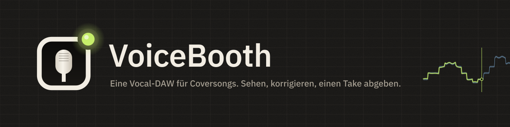
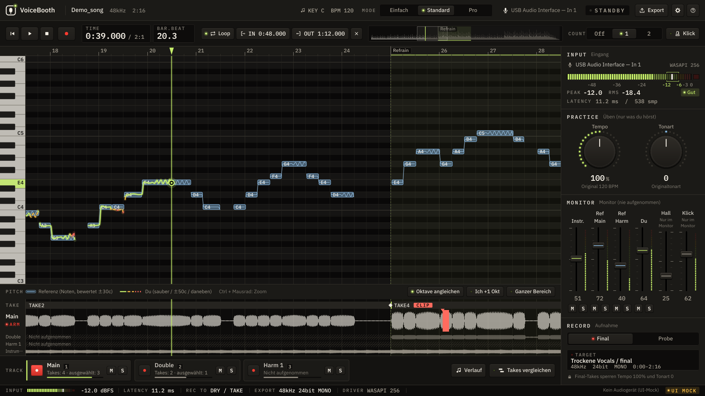

  

  <a href="README.md">日本語</a> ·
  <a href="README.en.md">English</a> ·
  <a href="README.ko.md">한국어</a> ·
  <a href="README.zh-Hans.md">简体中文</a> ·
  <a href="README.zh-Hant.md">繁體中文</a> ·
  <a href="README.es.md">Español</a> ·
  <a href="README.pt-BR.md">Português (Brasil)</a> ·
  <a href="README.id.md">Bahasa Indonesia</a> ·
  <a href="README.vi.md">Tiếng Việt</a> ·
  <a href="README.tr.md">Türkçe</a> ·
  <b>Deutsch</b> ·
  <a href="README.fr.md">Français</a>

  
  
  
  

# VoiceBooth

**Eine kleine Vocal-DAW, gemacht nur für die Aufnahme von Coversongs.**
Sing zu einem Instrumental, sieh deine Tonhöhe auf dem Bildschirm, nimm nur die Stellen neu auf, die du korrigieren willst, und exportiere eine WAV, die die Person, die mischt, direkt in ihre DAW ziehen kann. Mehr macht sie nicht. Sie ist keine Allzweck-DAW.

## Download (kostenlos)

  
  

| Computer | Datei (zum Speichern klicken) | Größe |
|---|---|---|
| Windows 10 / 11 (64 Bit) | [VoiceBooth-0.2.0-win-x64-setup.exe](https://github.com/kajisho5/voicebooth/releases/download/v0.2.0-beta.2/VoiceBooth-0.2.0-win-x64-setup.exe) | etwa 13 MB |
| Mac (macOS 11 oder neuer, Apple Silicon / Intel) | [VoiceBooth-0.2.0-mac-universal.dmg](https://github.com/kajisho5/voicebooth/releases/download/v0.2.0-beta.2/VoiceBooth-0.2.0-mac-universal.dmg) | etwa 40 MB |

Die aktuelle Version ist **0.2.0 Beta 2**. Änderungen und ältere Versionen findest du auf der [Release-Seite](https://github.com/kajisho5/voicebooth/releases). Es gibt keine Version für Smartphone oder Tablet.

### Zum ersten Mal? Drei Schritte

1. **Klicke oben auf einen Button, um die Datei zu speichern**, und doppelklicke dann die gespeicherte Datei zum Installieren
2. **Falls eine Warnung erscheint** (die Beta ist noch nicht codesigniert, daher erscheint sie nur beim ersten Öffnen)
   - **Windows**: Wenn „Der Computer wurde durch Windows geschützt“ erscheint, klicke auf „Weitere Informationen“ → „Trotzdem ausführen“
   - **Mac**: Zieh VoiceBooth aus dem DMG in deinen Programme-Ordner und öffne es einmal → wenn macOS meldet, dass es nicht geöffnet werden kann, geh zu Systemeinstellungen → Datenschutz & Sicherheit → klicke unter Sicherheit auf „Dennoch öffnen“ (der Button erscheint etwa eine Stunde lang, nachdem du versucht hast, die App zu öffnen) → gib dein Passwort ein ([Anleitung von Apple](https://support.apple.com/de-de/guide/mac-help/mh40616/mac))
3. **Nach dem Start** Sprache und Modus wählen. Wenn „Trennungsmodell herunterladen“ erscheint, auf Laden drücken (etwa 210 MB, nur beim ersten Mal; für Tonhöhe und Harmonie der Vorlage und zum Start nur mit dem Original)

> Dieser Screenshot ist ein Entwicklungs-Mock-up aus Beispieldaten. Die Darstellung mit echten Songs wird noch verbessert und kann anders aussehen.

> [!NOTE]
> **Das ist eine Beta.** Die Hauptfunktionen sind da, wurden aber noch nicht auf dem eigenen Windows-PC und Mac des Autors geprüft. Bitte melde Fehler oder alles, was schwer zu verstehen ist, unter [Issues](https://github.com/kajisho5/voicebooth/issues).

## Zuerst lesen

| | |
|---|---|
| Betriebssystem | **Windows und Mac** (Mac: Apple Silicon und Intel). **Es gibt keine Version für Smartphone oder Tablet** |
| Grafikkarte | **Nicht nötig.** Läuft nur mit der CPU. Schwer ist nur die Gesangstrennung: Sie dauert etwa das Vierfache der Songlänge (gemessen auf einer 4-Kern-CPU: etwa 2 Minuten für einen 30-Sekunden-Song, rund 15 Minuten für einen 4-Minuten-Song; langsamere CPUs brauchen länger; die App zeigt eine geschätzte Dauer) |
| Ladbares Audio | **Nur Audiodateien auf deinem Computer** (wav / flac / aiff / ogg / mp3 / m4a). Songs aus Spotify, Apple Music, YouTube Music oder anderen Streamingdiensten lassen sich nicht direkt laden |
| Größe | Der Installer hat unter Windows etwa 13 MB und auf dem Mac etwa 40 MB. Fehlen das Trennungs- und das Tonhöhenmodell (etwa 210 MB), fragt die App beim Start und lädt sie **nur, wenn du auf Laden drückst** (oder wähle Später). Sonst greift die App nur aufs Netz zu, um die Modellliste und neue Versionen zu prüfen (höchstens einmal am Tag; in den Einstellungen abschaltbar) |
| Rechenintensives | Die Trennung läuft, wenn du eine Referenz hinzufügst oder „Nur mit dem Original starten“ wählst (im Hintergrund; Wiedergabe und Aufnahme gehen weiter). Wird die Referenzstimme per Subtraktion gewonnen, läuft danach auch eine Trennung, um Lead und Harmonien aufzuteilen. Das bloße Öffnen der App startet sie nie. Die Songtext-Anzeige ist **standardmäßig aus** (in den Einstellungen einschalten) |
| Harmonien | Du kannst Harmoniespuren aufnehmen. Wird die Referenz getrennt, werden Lead und Harmonien aufgeteilt und **eine Harmonie-Referenz (Linie und Stimme)** wird ebenfalls angezeigt (Harmoniespuren werden mit ihr verglichen). Auch eine per Original − Karaoke gewonnene Referenz wird aufgeteilt, indem danach der Lead aus dem Original geholt wird (dauert etwas) |
| Getrenntes Audio | Getrennter Gesang und getrennte Begleitung sind **für dein persönliches Üben**. VoiceBooth ändert nichts an den Rechten am Originalsong. Verbreite oder veröffentliche sie (auch als Instrumental für Cover) nur, soweit die ursprünglichen Rechteinhaber es erlauben |
| Preis | **Kostenlos.** Kein Abo, keine In-App-Käufe. Du kannst die Entwicklung über [GitHub Sponsors](https://github.com/sponsors/kajisho5) unterstützen (freiwillig; ändert keine Funktionen) |
| Sprachen | 日本語 / English / 한국어 / 简体中文 / 繁體中文 / Español / Português (Brasil) / Bahasa Indonesia / Tiếng Việt / Türkçe / Deutsch / Français |

## Was sie kann

| | Details |
|---|---|
| Song öffnen | Die Formate oben, auch per Drag & Drop. Der Songanfang liegt unter Windows und auf dem Mac gleich |
| Original + Karaoke | Nutze den Originalsong (mit Gesang) als Referenz und sing über das Karaoke / Instrumental. Unterschiede wie die Länge des Intros werden automatisch ausgerichtet. Das Karaoke wird vom Original abgezogen, um den Gesang zu gewinnen, der zur Referenz-Tonhöhenlinie wird |
| Nur das Original | Trennt das Original, um ein Instrumental zu erstellen, und zeigt auch die Referenzlinie (braucht das Trennungsmodell) |
| Tonhöhe in Farbe | Deine Tonhöhe wird als Linie darübergelegt: Limettengrün, wenn du triffst, dann Bernstein und Rot, je weiter du abweichst. Auch eine Oktave versetzt gesungen lässt sich in der Anzeige ausrichten |
| Üben | Tempo 50–150 %, Tonart ±6. Übe langsam, aber der Abgabe-Take wird immer in Originaltempo und -tonart aufgenommen |
| Referenz anhören | Hör den aus dem Original extrahierten Referenzgesang, mit dem Instrumental oder solo (Übungstempo/-tonart gelten). Wird die Referenz getrennt, lassen sich Lead und Harmonien einzeln anhören |
| Stimmumfang und Tonartvorschlag | Miss deinen Stimmumfang (tiefster und höchster Ton) mit dem Mikrofon und erhalte eine Tonart, in die der tiefste und höchste Ton der Referenz passen. Ein Klick übernimmt sie; passt nichts, zeigt sie, wie viele Halbtöne überstehen |
| Aufnahme | Aufnahme am Stück, rückwirkende Aufnahme (zu spät gedrücktes REC schneidet nie das erste Wort ab), Neuaufnahme eines Bereichs (8 ms Crossfade an jeder Kante; 0–20 ms in Pro), Latenzmessung und -ausgleich |
| Klick und Einzähler | Ein Klick im Takt des Songs (höher auf Schlag 1; folgt dem Übungstempo). Zählt vor REC 1–2 Takte ein; bei der Neuaufnahme eines Bereichs wird vor dem Bereich eingezählt. Nur im Kopfhörer, nie in Aufnahme oder Export |
| Main / Double / Harmonie | Nimm Doubles und Harmonien in gleicher Länge auf und spiel sie zusammen ab |
| Takes vergleichen | Listet deine Takes, die neuesten zuerst, und lässt dich jeden an seiner Stelle im Song für einen Bereich (oder einen Comp-Abschnitt) anhören; den gewählten übernimmst du (ab Standard; Strg / ⌘+Z macht es rückgängig) |
| Einsatz-Timing | Zeigt im Vergleich zur Referenz, wie viele ms du zu früh oder zu spät einsetzt (ab Standard). Pro zeigt außerdem, wie lange du sauber triffst, und das Vibrato |
| Export | WAV in voller Länge ab Songanfang und ein Abgabepaket (eine WAV pro Spur, ein Kontrollmix, Notizen, ZIP) |
| Songtext (standardmäßig aus) | .txt / .lrc laden, per Tippen synchronisieren |
| Skins | Färbe die ganze App um (10 eingebaut). Teile sie als `.vbskin`-Dateien |

### Noch nicht verfügbar

Das ist noch nicht in der Beta (und wird in der App nicht angezeigt).

- Anderes als Gesang trennen (Gitarre, Schlagzeug usw.)

### Was die Person bekommt, die mischt

Die Dateien werden so geschrieben, dass sie sofort zum Instrumental passen, sobald sie in eine DAW gelegt werden (Ziel ±1 ms).

- Volle Länge vom allerersten Moment des Songs (0 s) bis zum Ende. Nicht aufgenommene Stellen sind Stille
- 24-Bit-Mono-WAV in der Samplerate des Songs selbst (nie stillschweigend in 48 kHz umgewandelt)
- Keine Normalisierung und keine automatischen Fades. Monitor-Hall und Referenzspuren werden nie beigemischt
- Übungs-Takes bleiben aus dem Abgabeordner heraus

### Drei Modi

Die Engine ist dieselbe; nur das, was du siehst, ändert sich. Ein in einem Modus erstelltes Projekt öffnet sich in jedem anderen.

| Einfach | Standard | Pro |
|---|---|---|
| Main in einem Durchgang aufnehmen und abgeben | Doubles, eine Harmonie, Punch-in, Einsatz-Timing, Abgabepaket | Zwei Harmonien, Trefferquote und Vibrato-Analyse, Crossfade-Länge an den Punch-in-Kanten |

| Modus Einfach | Modus Pro (Harmonie) |
|---|---|
|  |  |

## Logo und Design

  <picture>
    <source media="(prefers-color-scheme: dark)" srcset="brand/out/logo/logo-mark-dark.png">
    
  </picture>
  <b>Das Zeichen: ein Kabinenfenster, eine Mikrofonkapsel und eine Tally-Lampe.</b> 
  Ein Mikrofon, gesehen durch das Fenster einer Aufnahmekabine, mit der leuchtenden Lampe in der Ecke. Die Tally ist standardmäßig limettengrün; in der App wird sie nur während der Aufnahme rot.

 

**Das Konzept ist eine Aufnahmekabine bei Nacht.** Warmes, dunkles Graphit, beleuchtet von Geräte-LEDs und einer Tally-Lampe. Zustände werden durch aufleuchtende LEDs statt durch farbige Rahmen gezeigt, und der Bildschirm wird nie rot, außer während der Aufnahme.

| Farbe | Verwendet für |
|---|---|
| Signal (Limettengrün) | Deine Tonhöhe, wenn sie sitzt, der Playhead, leuchtende LEDs |
| Reference (Eisblau) | Das Toleranzband der Referenz |
| Amber / Coral | Leicht daneben / weit daneben, Warnungen |
| Tally (Rot) | Nur Aufnahme |

- **Schrift**: IBM Plex Sans JP, mit IBM Plex Mono für Zeiten, dB und andere Zahlen (feste Breite, damit Ziffern nie springen)
- **Bedienelemente**: Tastenkappen-Buttons mit LEDs, Drehregler mit LED-Kranz, vertikale Mischpult-Fader, segmentierte LED-Meter
- **Bewegung**: Tasten, die beim Drücken federn, Fader mit Rasterung bei 0 dB, eine Tally, die nur während der Aufnahme rot leuchtet. Audio hat immer Vorrang, und die Systemeinstellung „Bewegung reduzieren“ wird beachtet

**Skins.** Tausche alle Farben auf einmal (Schriften, Layout und Bewegung bleiben gleich). Es gibt 10 eingebaute Skins, darunter Studio Day / Sweet für helle Räume, High Contrast für Lesbarkeit und Color Safe für Unterschiede im Farbsehen. Unter Einstellungen → Skin → Neu wählst du eine Vorlage und änderst die Farben einzeln oder gruppenweise (oder leihst dir eine Gruppe aus einer anderen Vorlage) und speicherst. Schwer lesbare Kombinationen werden beim Bearbeiten markiert (Speichern wird nie blockiert). Teile Skins als `.vbskin`-Dateien.

| App-Symbol | Brand-Kit |
|---|---|
|  |  |

Regeln zur Logo-Nutzung (Schutzraum, Mindestgröße, Versionen für hellen Hintergrund) und alle Dateien findest du in [`brand/`](brand/README.md) (auf Japanisch).

## Systemanforderungen (vorläufig)

| | Minimum | Empfohlen |
|---|---|---|
| Windows | Windows 10 64-Bit (Version 1607 oder neuer) | Windows 11 |
| Mac | macOS 11 Big Sur oder neuer (Universal-Build für Apple Silicon und Intel) | Neuestes macOS auf Apple Silicon |
| CPU | 64-Bit, 4 Kerne | 6 Kerne oder mehr (Apple M1 oder neuer, aktueller Intel Core i5 / AMD Ryzen 5 oder besser) |
| Arbeitsspeicher | 8 GB | 16 GB |
| Freier Speicherplatz | 2 GB | 10 GB oder mehr (SSD) |
| Bildschirm | 1280×800 | 1920×1080 oder größer |
| Audio | Eingebauter Ein-/Ausgang funktioniert | Ein Audio-Interface und kabelgebundene Kopfhörer (ASIO unter Windows gibt geringere Latenz) |
| Internet | Nur für den ersten Download des Trennungsmodells (alles außer der Trennung funktioniert offline) | — |

- Schwer ist nur die Gesangstrennung. Auf älteren CPUs und Intel-Macs dauert sie länger (wird noch gemessen und bestätigt)
- Bluetooth-Ohrhörer und -Kopfhörer haben zu viel Latenz für Aufnahmen
- Windows on Arm wurde nicht getestet
- Diese Werte sind Arbeitsschätzungen während der Entwicklung. Die Begründung steht in Abschnitt 11.6.1 von [`docs/DESIGN.md`](docs/DESIGN.md) (auf Japanisch)

## Entwicklung unterstützen

VoiceBooth ist kostenlos. Wenn sie dir gefällt, kannst du die Entwicklung über [GitHub Sponsors](https://github.com/sponsors/kajisho5) unterstützen. Sponsoring schaltet keine Funktionen frei; alle bekommen dieselbe App.

  

## Lizenz

Der Quellcode steht unter der **GNU Affero General Public License v3.0 oder neuer (AGPL-3.0-or-later)** ([`LICENSE`](LICENSE)). VoiceBooth nutzt JUCE 8 unter der AGPLv3, daher ist die ganze App AGPL.

- Du darfst sie frei nutzen, verändern, weitergeben und verkaufen. Wenn du sie verbreitest (auch wenn du andere eine veränderte Version über ein Netzwerk nutzen lässt), veröffentliche den Quellcode unter derselben Lizenz
- **Name und Logo**: Bitte nutze den Namen oder das Logo „VoiceBooth“ nicht für eine veränderte Version, die als eigenes Produkt verbreitet wird (nimm deinen eigenen Namen und dein eigenes Logo). Unveränderte Weitergabe sowie die Nutzung in Vorstellungen oder Rezensionen ist in Ordnung
- Audio, das du aufnimmst und exportierst, gehört dir. Die AGPL gilt nicht für dein Werk

| Enthalten / genutzt | Lizenz |
|---|---|
| JUCE 8 | Dual AGPLv3 / kommerziell (hier unter AGPLv3 genutzt) |
| minimp3 (`third_party/minimp3`) | CC0 |
| IBM Plex Sans JP / IBM Plex Mono (`resources/fonts`) | SIL Open Font License 1.1 |
| ONNX Runtime 1.22.0 (nur im separaten Prozess für die Gesangstrennung; das offizielle vorkompilierte Paket wird beim Build geladen) | MIT |
| Monocypher 4.0.3 (prüft die Ed25519-Signatur der Modellliste; wird beim Build geladen) | Dual CC0 / BSD-2-Clause |
| Rubber Band Library 4 (Übungstempo / -tonart; wird beim Build geladen) | Dual GPL v2 oder neuer / kommerziell (hier unter GPL genutzt) |
| Steinberg ASIO SDK 2.3.4 (nur Windows-Builds; das offizielle Paket wird beim Build geladen) | Dual GPLv3 / kommerziell (hier unter GPLv3 genutzt). Das SDK selbst liegt nicht in diesem Repository. ASIO ist eine Marke der Steinberg Media Technologies GmbH |
| Modelle (getrennt von der App, nur auf Knopfdruck geladen): Trennung BS-RoFormer ft1 und Lead-Gesang BS-RoFormer karaoke (beide von anvuew), Tonhöhe RMVPE (RVC) | Die beiden Trennungsmodelle stehen unter GPL-3.0 (geänderte Fassung: in ONNX-Teile aufgeteilt und auf int8 quantisiert; Konvertierungsschritte und Originalgewichte in tools/separation); RMVPE steht unter MIT. Es werden nur Modelle verteilt, deren Gewichtslizenzen geprüft wurden |

## Mitmachen

Build, Tests und Projektaufbau stehen in [`docs/DEVELOPMENT.md`](docs/DEVELOPMENT.md), die Spezifikation ist [`docs/DESIGN.md`](docs/DESIGN.md) (beide auf Japanisch).
