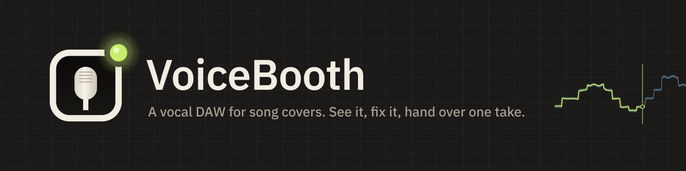
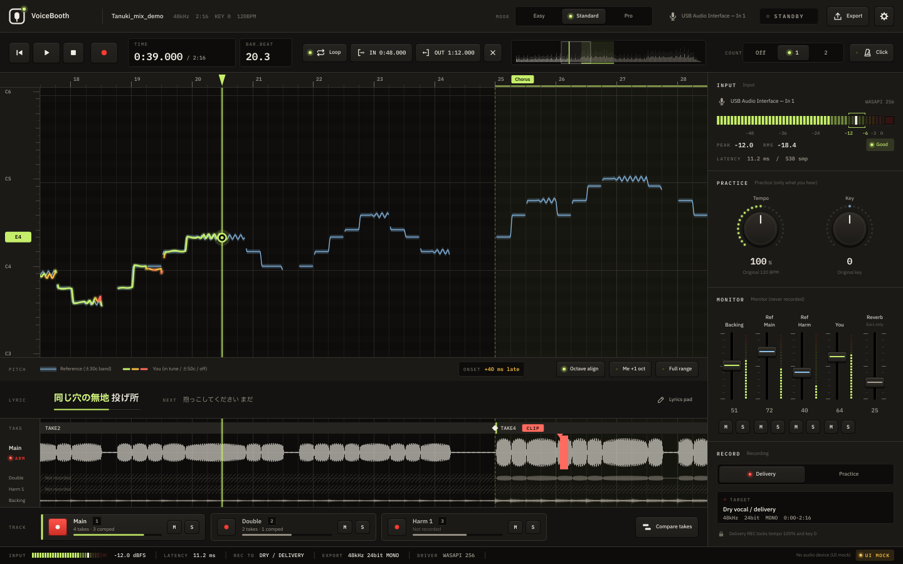

  

  <a href="README.md">日本語</a> ·
  <b>English</b> ·
  <a href="README.ko.md">한국어</a> ·
  <a href="README.zh-Hans.md">简体中文</a> ·
  <a href="README.zh-Hant.md">繁體中文</a> ·
  <a href="README.es.md">Español</a> ·
  <a href="README.pt-BR.md">Português (Brasil)</a> ·
  <a href="README.id.md">Bahasa Indonesia</a> ·
  <a href="README.vi.md">Tiếng Việt</a> ·
  <a href="README.tr.md">Türkçe</a> ·
  <a href="README.de.md">Deutsch</a> ·
  <a href="README.fr.md">Français</a>

  
  
  
  

# VoiceBooth

**A small vocal DAW made only for recording song covers.**
Sing along to an instrumental, see your pitch on screen, re-record just the parts you want to fix, and export a WAV your mix engineer can drop straight into their DAW. That is all it does. It is not a general-purpose DAW.

## Download (free)

  
  

| Computer | File (click to save) | Size |
|---|---|---|
| Windows 10 / 11 (64-bit) | [VoiceBooth-0.2.0-win-x64-setup.exe](https://github.com/kajisho5/voicebooth/releases/download/v0.2.0-beta.2/VoiceBooth-0.2.0-win-x64-setup.exe) | about 13 MB |
| Mac (macOS 11 or later, Apple silicon / Intel) | [VoiceBooth-0.2.0-mac-universal.dmg](https://github.com/kajisho5/voicebooth/releases/download/v0.2.0-beta.2/VoiceBooth-0.2.0-mac-universal.dmg) | about 40 MB |

The current version is **0.2.0 beta 2**. Changes and older versions are on the [releases page](https://github.com/kajisho5/voicebooth/releases). There is no phone or tablet version.

### First time? Three steps

1. **Click a button above to save the file**, then double-click the saved file to install
2. **If you see a warning** (the beta is not code-signed yet, so it only appears the first time you open it)
   - **Windows**: if you see "Windows protected your PC", click "More info" → "Run anyway"
   - **Mac**: move VoiceBooth from the DMG into your Applications folder and open it once → if macOS says it cannot be opened, go to System Settings → Privacy & Security → under Security, click "Open Anyway" (the button appears for about an hour after you try to open the app) → enter your password ([Apple's instructions](https://support.apple.com/guide/mac-help/mh40616/mac))
3. **When it starts**, pick your language and a mode. When "Download the separation model" appears, press Download (about 210 MB, first time only; used for the guide pitch, harmonies and starting from the original only)

> This screenshot is a development mock-up drawn from sample data. The display with real songs is still being improved and may look different.

> [!NOTE]
> **This is a beta.** The main features are in place, but they have not yet been checked on the author's own Windows PC and Mac. Please report bugs, or anything that is hard to understand, in [Issues](https://github.com/kajisho5/voicebooth/issues).

## Read this first

| | |
|---|---|
| OS | **Both Windows and Mac** (Mac: Apple silicon and Intel). **There is no phone or tablet version** |
| Graphics card | **Not needed.** It runs on the CPU alone. Only vocal separation is heavy: it takes roughly 4 times the song's length (measured on a 4-core CPU: about 2 minutes for a 30-second song, around 15 minutes for a 4-minute song; slower CPUs take longer; the app shows an estimated time) |
| Audio you can load | **Only audio files on your computer** (wav / flac / aiff / ogg / mp3 / m4a). You cannot load songs directly from Spotify, Apple Music, YouTube Music or other streaming services |
| Size | The installer is about 13 MB on Windows and about 40 MB on Mac. If the separation and pitch models (about 210 MB) are missing, the app asks at startup and downloads them **only when you press Download** (you can also choose Later). The only other network access is checking the model list and checking for a new version (at most once a day; you can turn it off in Settings) |
| Heavy processing | Separation runs when you add a guide or choose "Start from the original only" (it runs in the background; you can keep playing and recording). When the guide vocal is taken out by subtraction, separation also runs afterwards to split the lead and harmonies. Just opening the app never starts it. Lyrics display is **off by default** (turn it on in Settings) |
| Harmonies | You can record harmony tracks. When the guide is separated, the lead vocal and harmonies are split and **a harmony guide (line and voice)** is shown too (a harmony track is compared against it). A guide taken as original − karaoke is split too, by extracting the lead from the original afterwards (takes a little while) |
| Separated audio | Separated vocals and accompaniment are **for your personal practice**. VoiceBooth does not change the rights to the original song. Only distribute or publish them (including sharing them as an instrumental for covers) as far as the original rights holders allow |
| Price | **Free.** No subscription, no in-app purchases. You can support development through [GitHub Sponsors](https://github.com/sponsors/kajisho5) (optional; it does not change any features) |
| Languages | 日本語 / English / 한국어 / 简体中文 / 繁體中文 / Español / Português (Brasil) / Bahasa Indonesia / Tiếng Việt / Türkçe / Deutsch / Français |

## What it does

| | Details |
|---|---|
| Open a song | The formats above, also by drag and drop. The start of the song lines up the same on Windows and Mac |
| Original + karaoke | Use the original song (with vocals) as the guide and sing over the karaoke / instrumental. Differences such as intro length are aligned automatically. The karaoke is subtracted from the original to extract the vocal, which becomes the reference pitch line |
| Original only | Separate the original to make an instrumental, and show the guide line too (needs the separation model) |
| Pitch in color | Your pitch is drawn as a line on top: lime when you are on pitch, amber then red as you drift. Singing an octave off can still be lined up on the display |
| Practice | Tempo 50–150 %, key ±6. Practice slowly, but the delivery take is always recorded at the original tempo and key |
| Hear the guide | Listen to the guide vocal extracted from the original, with the backing or solo (practice tempo/key apply). When the guide is separated, the lead and harmonies can be heard on their own |
| Range and suggested key | Measure your range (lowest and highest notes) with the mic and get a key that fits the guide's lowest and highest notes. One click applies it; if nothing fits, it says how many semitones stick out |
| Recording | Full-pass recording, retroactive recording (pressing REC late never cuts off the first word), re-recording a range (8 ms crossfade at each edge; 0–20 ms in Pro), latency measurement and compensation |
| Click and count-in | A click on the song's beat (higher on beat 1; follows the practice tempo). Counts 1–2 bars before REC; re-recording a range counts in before the range. Headphones only, never recorded or exported |
| Main / Double / Harmony | Record doubles and harmonies to the same length and play them back together |
| Take comparison | List your takes newest first, hear each one in place in the song for a range (or one comp segment), and use the one you pick (Standard and up; Ctrl / ⌘+Z undoes it) |
| Entry timing | Compared with the guide, shows how many ms early or late your entry is (Standard and up). Pro also shows how much of the time you are on pitch, and vibrato |
| Export | Full-length WAV from the start of the song, and a delivery pack (a WAV per track, a check mix, notes, zip) |
| Lyrics (off by default) | Load .txt / .lrc, sync by tapping |
| Skins | Recolour the whole app (10 built-in). Share them as `.vbskin` files |

### Not yet available

These are not in the beta yet (and are not shown in the app).

- Separating anything other than vocals (guitar, drums and so on)

### What your mix engineer gets

Files are written so they line up with the instrumental the moment they are placed in a DAW (target ±1 ms).

- Full length from the very start of the song (0 s) to the end. Parts you did not record are silence
- 24-bit mono WAV at the song's own sample rate (never silently converted to 48 kHz)
- No normalizing and no automatic fades. Monitor reverb and guide tracks are never mixed in
- Practice takes are kept out of the delivery folder

### Three modes

The engine is the same; only what you see changes. A project made in one mode opens in any other.

| Easy | Standard | Pro |
|---|---|---|
| Record Main in one pass and hand it over | Doubles, one harmony, punch-in, take comparison, entry timing, delivery pack | Two harmonies, on-pitch percentage and vibrato analysis, crossfade length at punch-in edges |

| Easy mode | Pro mode (harmony) |
|---|---|
|  |  |

## How to use it

1. **Install** the installer from [Releases](https://github.com/kajisho5/voicebooth/releases) (see Download at the top of this page). On first launch, pick your language and a mode (easy / standard / pro); you can change both later in Settings.
2. **Open a song**: drop the **off-vocal (karaoke)** track on the upper box of the start screen and, optionally, the **original with vocals** on the lower box. With the original, the timing is aligned automatically and the **guide pitch** appears on the piano roll. With only the original, use "Start from the original only" to separate it (the first time, you are asked before the models are downloaded). Reopening the same song continues where you left off. If the separation models (about 210 MB) are missing, the app offers them at startup (the first time, after you choose a mode). If you choose Later, you can install them any time from "Get the separation model…" on the start screen or the "Separation models" row in Settings.
3. **Set up input**: the first time, input setup opens — device → level → latency measurement. **Use headphones.**
4. **Practise**: **Space** plays / stops. Guide notes are blue bars; your voice is a line (lime when in tune, amber → red when off). Change **tempo / key** in PRACTICE (delivery takes go back to the original tempo and key). Drag on a lane (or `[` `]`) for IN / OUT, **L** to loop, drag the edges to adjust. **Ctrl / ⌘ + wheel** zooms.
5. **Record**: arm a track card (Main / Double / Harm), press **R** to record and **R** or Space to stop. With a range, only that range is re-recorded (punch-in). **Ctrl / ⌘ + Z** undoes a take; **Esc** → "Discard" during recording throws it away. Use "Compare takes" to pick the best one.
6. **Export**: "Export" at the top right → choose tracks → full-length WAV from the start of the song (24-bit mono, original sample rate). Standard and above can make a **delivery pack** (WAVs, check mix, notes, zip).

If the guide line looks off, right-click the pitch lane for "10 ms earlier / later" or "Align here", and use "Hear original" to check by ear.

## Logo and design

  <picture>
    <source media="(prefers-color-scheme: dark)" srcset="brand/out/logo/logo-mark-dark.png">
    
  </picture>
  <b>The mark: a booth window, a microphone capsule and a tally lamp.</b> 
  A mic seen through the window of a recording booth, with the lamp lit in the corner. The tally is lime by default; inside the app it turns red only while recording.

 

**The concept is a recording booth at night.** Warm, dark graphite, lit by equipment LEDs and a tally lamp. States are shown by LEDs lighting up rather than by colored borders, and the screen never turns red except while recording.

| Color | Used for |
|---|---|
| Signal (lime) | Your pitch when it is on, the playhead, lit LEDs |
| Reference (ice blue) | The guide tolerance band |
| Amber / Coral | Slightly off / far off, warnings |
| Tally (red) | Recording only |

- **Type**: IBM Plex Sans JP, with IBM Plex Mono for times, dB and other numbers (fixed width, so digits never jump)
- **Controls**: keycap buttons with LEDs, LED-ring knobs, vertical console faders, segmented LED meters
- **Motion**: keys that spring when pressed, faders with a detent at 0 dB, a tally that glows red only while recording. Audio always comes first, and the OS "reduce motion" setting is respected

**Skins.** Swap all the colours at once (fonts, layout and motion stay the same). There are 10 built-in skins, including Studio Day / Sweet for bright rooms, High Contrast for legibility and Color Safe for colour-vision differences. In Settings → Skin → New, pick a template and change colours one by one or group by group (or borrow a group from another template), then save. Hard-to-read combinations are flagged as you edit (saving is never blocked). Share skins as `.vbskin` files.

| App icon | Brand kit |
|---|---|
|  |  |

Logo usage rules (clear space, minimum size, light-background versions) and every asset are in [`brand/`](brand/README.md) (Japanese).

## System requirements (provisional)

| | Minimum | Recommended |
|---|---|---|
| Windows | Windows 10 64-bit (version 1607 or later) | Windows 11 |
| Mac | macOS 11 Big Sur or later (universal build for Apple silicon and Intel) | Latest macOS on Apple silicon |
| CPU | 64-bit, 4 cores | 6 cores or more (Apple M1 or later, a recent Intel Core i5 / AMD Ryzen 5 class or better) |
| Memory | 8 GB | 16 GB |
| Free disk space | 2 GB | 10 GB or more (SSD) |
| Display | 1280×800 | 1920×1080 or larger |
| Audio | Built-in input/output works | An audio interface and wired headphones (ASIO on Windows gives lower latency) |
| Internet | For the first download of the separation model, and for the update check (looks at GitHub releases at most once a day and sends nothing else; can be turned off in Settings). Everything except separation works offline | — |

- Only vocal separation is heavy. It takes longer on older CPUs and Intel Macs (to be measured and confirmed)
- Bluetooth earphones and headphones have too much latency for recording
- Windows on Arm has not been tested
- These figures are working estimates during development. The reasoning is in [`docs/DESIGN.md`](docs/DESIGN.md) section 11.6.1 (Japanese)

## Support development

VoiceBooth is free. If you like it, you can support development through [GitHub Sponsors](https://github.com/sponsors/kajisho5). Sponsoring does not unlock any features; everyone gets the same app.

  

## License

The source code is licensed under the **GNU Affero General Public License v3.0 or later (AGPL-3.0-or-later)** ([`LICENSE`](LICENSE)). VoiceBooth uses JUCE 8 under AGPLv3, so the whole app is AGPL.

- You are free to use, modify, share and sell it. When you distribute it (including letting people use a modified version over a network), publish the source under the same license
- **Name and logo**: please do not use the "VoiceBooth" name or logo for a modified version distributed as a separate product (use your own name and logo). Redistributing it unchanged, and using them in introductions or reviews, is fine
- Audio you record and export is yours. The AGPL does not apply to your work

| Included / used | License |
|---|---|
| JUCE 8 | Dual AGPLv3 / commercial (used here under AGPLv3) |
| minimp3 (`third_party/minimp3`) | CC0 |
| IBM Plex Sans JP / IBM Plex Mono (`resources/fonts`) | SIL Open Font License 1.1 |
| ONNX Runtime 1.22.0 (only in the separate vocal-separation process; the official prebuilt package is fetched at build time) | MIT |
| Monocypher 4.0.3 (verifies the Ed25519 signature of the model list; fetched at build time) | Dual CC0 / BSD-2-Clause |
| Rubber Band Library 4 (practice tempo / key; fetched at build time) | Dual GPL v2 or later / commercial (used here under GPL) |
| Steinberg ASIO SDK 2.3.4 (Windows builds only; the official package is fetched at build time) | Dual GPLv3 / commercial (used here under GPLv3). The SDK itself is not kept in this repository. ASIO is a trademark of Steinberg Media Technologies GmbH |
| Models (separate from the app, downloaded only when you press the button): separation BS-RoFormer ft1 and lead-vocal BS-RoFormer karaoke (both by anvuew), pitch RMVPE (RVC) | The two separation models are GPL-3.0 (modified: split into ONNX parts and quantized to int8; conversion steps and the original weights are listed in tools/separation); RMVPE is MIT. Only models whose weight licenses have been checked are distributed |

## Contributing

Build, test and project layout are in [`docs/DEVELOPMENT.md`](docs/DEVELOPMENT.md), and the specification is [`docs/DESIGN.md`](docs/DESIGN.md) (both in Japanese).
