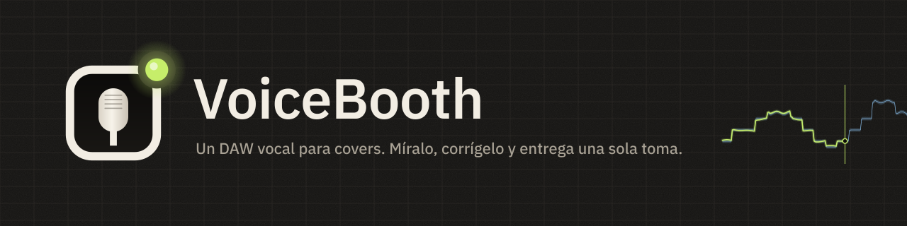
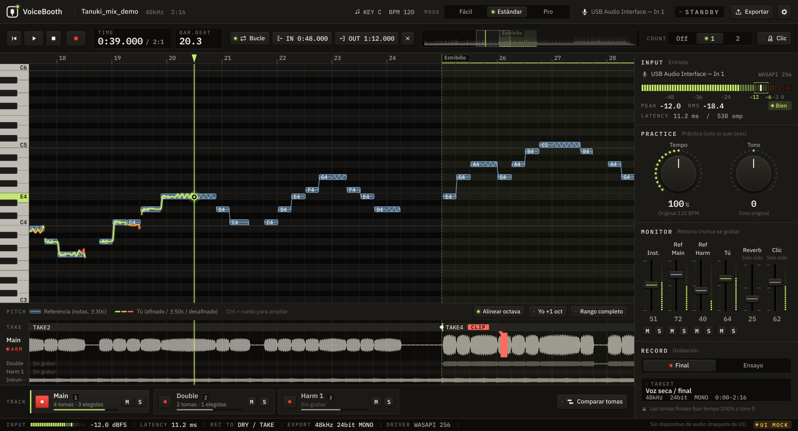

  

  <a href="README.md">日本語</a> ·
  <a href="README.en.md">English</a> ·
  <a href="README.ko.md">한국어</a> ·
  <a href="README.zh-Hans.md">简体中文</a> ·
  <a href="README.zh-Hant.md">繁體中文</a> ·
  <b>Español</b> ·
  <a href="README.pt-BR.md">Português (Brasil)</a> ·
  <a href="README.id.md">Bahasa Indonesia</a> ·
  <a href="README.vi.md">Tiếng Việt</a> ·
  <a href="README.tr.md">Türkçe</a> ·
  <a href="README.de.md">Deutsch</a> ·
  <a href="README.fr.md">Français</a>

  
  
  
  

# VoiceBooth

**Un pequeño DAW vocal hecho solo para grabar covers.**
Canta sobre una pista instrumental, mira tu afinación en pantalla, vuelve a grabar solo las partes que quieras corregir y exporta un WAV que quien haga la mezcla pueda soltar directamente en su DAW. Eso es todo lo que hace. No es un DAW de uso general.

## Descarga (gratis)

  
  

| Ordenador | Archivo (haz clic para guardar) | Tamaño |
|---|---|---|
| Windows 10 / 11 (64 bits) | [VoiceBooth-0.2.0-win-x64-setup.exe](https://github.com/kajisho5/voicebooth/releases/download/v0.2.0-beta.7/VoiceBooth-0.2.0-win-x64-setup.exe) | unos 13 MB |
| Mac (macOS 11 o posterior, Apple silicon / Intel) | [VoiceBooth-0.2.0-mac-universal.dmg](https://github.com/kajisho5/voicebooth/releases/download/v0.2.0-beta.7/VoiceBooth-0.2.0-mac-universal.dmg) | unos 40 MB |

La versión actual es **0.2.0 beta 7**. Los cambios y las versiones anteriores están en la [página de versiones](https://github.com/kajisho5/voicebooth/releases). No hay versión para móvil ni tableta.

### ¿Primera vez? Tres pasos

1. **Pulsa un botón de arriba para guardar el archivo** y haz doble clic en el archivo guardado para instalarlo
2. **Si aparece una advertencia** (la beta aún no tiene firma de código, así que solo aparece la primera vez que la abres)
   - **Windows**: si ves "Windows protegió su PC", haz clic en "Más información" → "Ejecutar de todas formas"
   - **Mac**: mueve VoiceBooth del DMG a tu carpeta Aplicaciones y ábrelo una vez → si macOS dice que no se puede abrir, ve a Ajustes del Sistema → Privacidad y seguridad → en Seguridad, haz clic en "Abrir igualmente" (el botón aparece durante aproximadamente una hora después de intentar abrir la app) → introduce tu contraseña ([instrucciones de Apple](https://support.apple.com/es-es/guide/mac-help/mh40616/mac))
3. **Al iniciarse**, elige el idioma y un modo. Cuando aparezca "Descargar el modelo de separación", pulsa Descargar (unos 210 MB, solo la primera vez; se usa para el tono y las armonías de la guía y para empezar solo con el original)

> Esta captura es una maqueta de desarrollo dibujada con datos de ejemplo. La visualización con canciones reales aún se está mejorando y puede verse distinta.

> [!NOTE]
> **Esto es una beta.** Las funciones principales ya están, pero todavía no se han probado en el PC con Windows ni en el Mac del autor. Por favor, informa de errores, o de cualquier cosa que cueste entender, en [Issues](https://github.com/kajisho5/voicebooth/issues).

## Lee esto primero

| | |
|---|---|
| Sistema | **Windows y Mac** (Mac: Apple silicon e Intel). **No hay versión para móvil ni tableta** |
| Tarjeta gráfica | **No hace falta.** Funciona solo con la CPU. Lo único pesado es la separación de voz: tarda aproximadamente 4 veces la duración de la canción (medido en una CPU de 4 núcleos: unos 2 minutos para una canción de 30 segundos y unos 15 minutos para una de 4 minutos; con CPU más lentas tarda más; la app muestra un tiempo estimado) |
| Audio que puedes cargar | **Solo archivos de audio de tu equipo** (wav / flac / aiff / ogg / mp3 / m4a). No puedes cargar canciones directamente desde Spotify, Apple Music, YouTube Music ni otros servicios de streaming |
| Tamaño | El instalador ocupa unos 13 MB en Windows y unos 40 MB en Mac. Si faltan los modelos de separación y de tono (unos 210 MB), la app pregunta al iniciar y los descarga **solo cuando pulsas Descargar** (también puedes elegir Más tarde). Solo se conecta además para consultar la lista de modelos y buscar una versión nueva (como mucho una vez al día; puedes desactivarlo en Ajustes) |
| Procesos pesados | La separación se ejecuta cuando añades una guía o eliges «Empezar solo con la original» (en segundo plano; puedes seguir reproduciendo y grabando). Si la voz guía se obtiene por resta, después también se separa para dividir la voz principal y las armonías. Abrir la app no la inicia nunca. La letra está **desactivada por defecto** (actívala en Ajustes) |
| Armonías | Puedes grabar pistas de armonía. Al separar la guía, se dividen la voz principal y las armonías y también se muestra **una guía de armonías (línea y voz)** (las pistas de armonía se comparan con ella). Una guía obtenida como original − karaoke también se divide, extrayendo después la voz principal del original (tarda un poco) |
| Audio separado | La voz y el acompañamiento separados son **para tu práctica personal**. VoiceBooth no cambia los derechos de la canción original. Distribúyelos o publícalos (incluido compartirlos como instrumental para covers) solo en la medida en que lo permitan los titulares de los derechos originales |
| Precio | **Gratis.** Sin suscripción ni compras dentro de la app. Puedes apoyar el desarrollo a través de [GitHub Sponsors](https://github.com/sponsors/kajisho5) (opcional; no cambia ninguna función). Si distribuyes una versión modificada, también debes publicar su código fuente (ver «Licencia» más abajo) |
| Idiomas | 日本語 / English / 한국어 / 简体中文 / 繁體中文 / Español / Português (Brasil) / Bahasa Indonesia / Tiếng Việt / Türkçe / Deutsch / Français |

## Qué hace

| | Detalles |
|---|---|
| Abrir una canción | Los formatos de arriba, también arrastrando y soltando. El inicio de la canción queda igual en Windows y en Mac |
| Original + karaoke | Usa la canción original (con voz) como referencia y canta sobre el karaoke / instrumental. Diferencias como la duración de la intro se alinean automáticamente. El karaoke se resta de la original para extraer la voz, que se convierte en la línea de tono de referencia |
| Solo la original | Separa la original para crear un instrumental y mostrar también la línea de referencia (necesita el modelo de separación) |
| Afinación en color | Tu tono se dibuja como una línea encima: verde lima cuando estás afinado, ámbar y luego rojo cuando te desvías. Aunque cantes una octava por encima o por debajo, se puede alinear en pantalla |
| Práctica | Tempo 50–150 %, tono ±6. Practica despacio, pero la toma de entrega siempre se graba con el tempo y el tono originales |
| Escuchar la guía | Escucha la voz guía extraída de la original, con el instrumental o en solo (se aplican el tempo y el tono de práctica). Al separar la guía, la principal y las armonías se pueden escuchar por separado |
| Tesitura y tono sugerido | Mide tu tesitura (nota más grave y más aguda) con el micrófono y obtén un tono en el que quepan la nota más grave y la más aguda de la guía. Se aplica con un clic; si no cabe, indica cuántos semitonos se sale |
| Grabación | Grabación de principio a fin, grabación retroactiva (pulsar REC tarde nunca corta la primera palabra), regrabación de un rango (fundido de 8 ms en cada borde; 0–20 ms en Pro), medición y compensación de latencia |
| Clic y cuenta previa | Clic al pulso de la canción (más agudo en el tiempo 1; sigue el tempo de práctica). Cuenta 1–2 compases antes de REC; al regrabar un rango, cuenta antes del rango. Solo en los auriculares: nunca se graba ni se exporta |
| Main / Double / Armonía | Graba dobles y armonías con la misma duración y reprodúcelas juntas |
| Comparar tomas | Lista tus tomas de la más reciente a la más antigua, escucha cada una en su sitio dentro de la canción para un rango (o un segmento del comp) y usa la que elijas (Estándar o superior; Ctrl / ⌘+Z lo deshace) |
| Entrada a tiempo | Comparado con la referencia, muestra cuántos ms entras antes o después (Estándar en adelante). Pro también muestra cuánto tiempo estás afinado y el vibrato |
| Exportar | WAV de duración completa desde el inicio de la canción, y un paquete de entrega (un WAV por pista, una mezcla de referencia, notas, zip) |
| Letra (desactivada por defecto) | Carga .txt / .lrc y sincroniza marcando a mano |
| Skins | Cambia los colores de toda la app (10 incluidos). Compártelos como archivos `.vbskin` |

### Aún no disponible

Esto todavía no está en la beta (y no aparece en la app).

- Separar algo que no sea la voz (guitarra, batería, etc.)

### Lo que recibe quien hace la mezcla

Los archivos se escriben para que cuadren con el instrumental en cuanto se colocan en un DAW (objetivo ±1 ms).

- Duración completa desde el principio de la canción (0 s) hasta el final. Las partes que no grabaste son silencio
- WAV mono de 24 bits a la frecuencia de muestreo de la propia canción (nunca se convierte a 48 kHz sin avisar)
- Sin normalización ni fundidos automáticos. La reverb de retorno y las pistas guía nunca se mezclan
- Las tomas de práctica se quedan fuera de la carpeta de entrega

### Tres modos

El motor es el mismo; solo cambia lo que ves. Un proyecto hecho en un modo se abre en cualquier otro.

| Fácil | Estándar | Pro |
|---|---|---|
| Graba Main de una vez y entrégalo | Dobles, una armonía, punch-in, comparar tomas, entrada a tiempo, paquete de entrega | Dos armonías, porcentaje de afinación y análisis de vibrato, duración del fundido en los bordes del punch-in |

| Modo Fácil | Modo Pro (armonía) |
|---|---|
|  |  |

## Logo y diseño

  <picture>
    <source media="(prefers-color-scheme: dark)" srcset="brand/out/logo/logo-mark-dark.png">
    
  </picture>
  <b>El símbolo: la ventana de una cabina, la cápsula de un micrófono y un piloto de grabación.</b> 
  Un micro visto a través de la ventana de una cabina de grabación, con el piloto encendido en la esquina. El piloto es verde lima por defecto; dentro de la app solo se pone rojo mientras grabas.

 

**El concepto es una cabina de grabación de noche.** Grafito cálido y oscuro, iluminado por los LED del equipo y un piloto de grabación. Los estados se indican con LED que se encienden en lugar de bordes de colores, y la pantalla nunca se pone roja salvo mientras grabas.

| Color | Se usa para |
|---|---|
| Signal (verde lima) | Tu tono cuando está afinado, el cursor de reproducción, LED encendidos |
| Reference (azul hielo) | La banda de tolerancia de la guía |
| Amber / Coral | Algo desafinado / muy desafinado, avisos |
| Tally (rojo) | Solo la grabación |

- **Tipografía**: IBM Plex Sans JP, con IBM Plex Mono para tiempos, dB y otros números (ancho fijo, para que los dígitos nunca salten)
- **Controles**: botones tipo tecla con LED, potenciómetros con anillo LED, faders verticales de consola, medidores LED segmentados
- **Movimiento**: teclas que rebotan al pulsarlas, faders con un tope en 0 dB, un piloto que brilla en rojo solo mientras grabas. El audio siempre va primero y se respeta el ajuste "reducir movimiento" del sistema

**Skins.** Cambia todos los colores a la vez (las fuentes, el diseño y el movimiento no cambian). Hay 10 skins incluidos, entre ellos Studio Day / Sweet para salas luminosas, High Contrast para la legibilidad y Color Safe para las diferencias en la visión del color. En Ajustes → Skin → Nuevo, elige una plantilla y cambia los colores uno a uno o por grupos (o toma un grupo de otra plantilla) y guarda. Las combinaciones difíciles de leer se señalan mientras editas (nunca se impide guardar). Comparte los skins como archivos `.vbskin`.

| Icono de la app | Kit de marca |
|---|---|
|  |  |

Las normas de uso del logo (espacio libre, tamaño mínimo, versiones para fondo claro) y todos los recursos están en [`brand/`](brand/README.md) (en japonés).

## Requisitos del sistema (provisionales)

| | Mínimo | Recomendado |
|---|---|---|
| Windows | Windows 10 de 64 bits (versión 1607 o posterior) | Windows 11 |
| Mac | macOS 11 Big Sur o posterior (compilación universal para Apple silicon e Intel) | El macOS más reciente en Apple silicon |
| CPU | 64 bits, 4 núcleos | 6 núcleos o más (Apple M1 o posterior, un Intel Core i5 / AMD Ryzen 5 reciente o superior) |
| Memoria | 8 GB | 16 GB |
| Espacio libre en disco | 2 GB | 10 GB o más (SSD) |
| Pantalla | 1280×800 | 1920×1080 o mayor |
| Audio | La entrada/salida integrada funciona | Una interfaz de audio y auriculares con cable (ASIO en Windows da menos latencia) |
| Internet | Para la primera descarga del modelo de separación y para buscar actualizaciones (consulta las versiones de GitHub como mucho una vez al día y no envía nada más; se puede desactivar en Ajustes). Todo salvo la separación funciona sin conexión | — |

- Lo único pesado es la separación de voz. Tarda más en CPU antiguas y en Mac con Intel (pendiente de medir y confirmar)
- Los auriculares y cascos Bluetooth tienen demasiada latencia para grabar
- Windows on Arm no se ha probado
- Estas cifras son estimaciones de trabajo durante el desarrollo. El razonamiento está en la sección 11.6.1 de [`docs/DESIGN.md`](docs/DESIGN.md) (en japonés)

## Apoya el desarrollo

VoiceBooth es gratis. Si te gusta, puedes apoyar el desarrollo a través de [GitHub Sponsors](https://github.com/sponsors/kajisho5). Patrocinar no desbloquea ninguna función; todo el mundo recibe la misma app.

  

## Licencia

El código fuente está bajo la **GNU Affero General Public License v3.0 o posterior (AGPL-3.0-or-later)** ([`LICENSE`](LICENSE)). VoiceBooth usa JUCE 8 bajo AGPLv3, así que toda la app es AGPL.

- Eres libre de usarlo, modificarlo, compartirlo y venderlo. Cuando lo distribuyas (incluido dejar que otras personas usen una versión modificada a través de una red), publica el código fuente bajo la misma licencia
- **Nombre y logo**: no uses el nombre ni el logo de "VoiceBooth" para una versión modificada que se distribuya como un producto distinto (usa tu propio nombre y logo). Redistribuirlo sin cambios, y usarlos en presentaciones o reseñas, está bien
- El audio que grabas y exportas es tuyo. La AGPL no se aplica a tu trabajo

| Incluido / usado | Licencia |
|---|---|
| JUCE 8 | Doble AGPLv3 / comercial (aquí se usa bajo AGPLv3) |
| minimp3 (`third_party/minimp3`) | CC0 |
| IBM Plex Sans JP / IBM Plex Mono (`resources/fonts`) | SIL Open Font License 1.1 |
| ONNX Runtime 1.22.0 (solo en el proceso aparte de separación de voz; el paquete oficial precompilado se descarga al compilar) | MIT |
| Monocypher 4.0.3 (verifica la firma Ed25519 de la lista de modelos; se descarga al compilar) | Doble CC0 / BSD-2-Clause |
| Rubber Band Library 4 (tempo / tono de práctica; se descarga al compilar) | Doble GPL v2 o posterior / comercial (aquí se usa bajo GPL) |
| Steinberg ASIO SDK 2.3.4 (solo en las compilaciones para Windows; el paquete oficial se descarga al compilar) | Doble GPLv3 / comercial (aquí se usa bajo GPLv3). El SDK en sí no se guarda en este repositorio. ASIO es una marca comercial de Steinberg Media Technologies GmbH |
| Modelos (aparte de la app, se descargan solo cuando pulsas el botón): separación BS-RoFormer ft1 y voz principal BS-RoFormer karaoke (ambos de anvuew), tono RMVPE (RVC) | Los dos de separación son GPL-3.0 (versión modificada: dividida en partes ONNX y cuantizada a int8; los pasos de conversión y los pesos originales están en tools/separation); RMVPE es MIT. Solo se distribuyen modelos cuyas licencias de pesos se han comprobado |

## Contribuir

La compilación, las pruebas y la estructura del proyecto están en [`docs/DEVELOPMENT.md`](docs/DEVELOPMENT.md), y la especificación es [`docs/DESIGN.md`](docs/DESIGN.md) (ambos en japonés).
