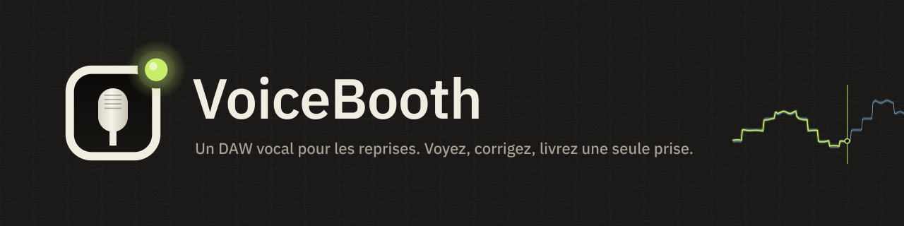
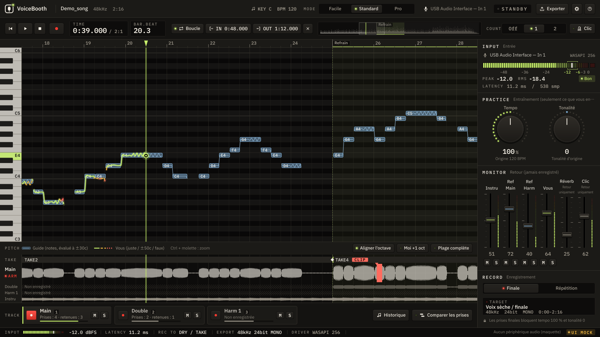

  

  <a href="README.md">日本語</a> ·
  <a href="README.en.md">English</a> ·
  <a href="README.ko.md">한국어</a> ·
  <a href="README.zh-Hans.md">简体中文</a> ·
  <a href="README.zh-Hant.md">繁體中文</a> ·
  <a href="README.es.md">Español</a> ·
  <a href="README.pt-BR.md">Português (Brasil)</a> ·
  <a href="README.id.md">Bahasa Indonesia</a> ·
  <a href="README.vi.md">Tiếng Việt</a> ·
  <a href="README.tr.md">Türkçe</a> ·
  <a href="README.de.md">Deutsch</a> ·
  <b>Français</b>

  
  
  
  

# VoiceBooth

**Un petit DAW vocal conçu uniquement pour enregistrer des reprises.**
Chantez sur un instrumental, voyez votre justesse à l'écran, réenregistrez seulement les passages à corriger et exportez un WAV que la personne qui mixe peut glisser directement dans son DAW. C'est tout ce qu'il fait. Ce n'est pas un DAW généraliste.

## Téléchargement (gratuit)

  
  

| Ordinateur | Fichier (cliquez pour enregistrer) | Taille |
|---|---|---|
| Windows 10 / 11 (64 bits) | [VoiceBooth-0.2.0-win-x64-setup.exe](https://github.com/kajisho5/voicebooth/releases/download/v0.2.0-beta.5/VoiceBooth-0.2.0-win-x64-setup.exe) | environ 13 Mo |
| Mac (macOS 11 ou ultérieur, Apple silicon / Intel) | [VoiceBooth-0.2.0-mac-universal.dmg](https://github.com/kajisho5/voicebooth/releases/download/v0.2.0-beta.5/VoiceBooth-0.2.0-mac-universal.dmg) | environ 40 Mo |

La version actuelle est **0.2.0 bêta 5**. Les nouveautés et les anciennes versions sont sur la [page des versions](https://github.com/kajisho5/voicebooth/releases). Il n'y a pas de version pour téléphone ou tablette.

### Première fois ? Trois étapes

1. **Cliquez sur un bouton ci-dessus pour enregistrer le fichier**, puis double-cliquez sur le fichier enregistré pour l'installer
2. **Si un avertissement apparaît** (la bêta n'est pas encore signée, il n'apparaît qu'à la première ouverture)
   - **Windows** : si « Windows a protégé votre ordinateur » s'affiche, cliquez sur « Informations complémentaires » → « Exécuter quand même »
   - **Mac** : glissez VoiceBooth du DMG vers votre dossier Applications et ouvrez-le une fois → si macOS indique qu'il ne peut pas être ouvert, allez dans Réglages Système → Confidentialité et sécurité → dans la section Sécurité, cliquez sur « Ouvrir quand même » (le bouton apparaît pendant environ une heure après votre tentative d'ouverture) → saisissez votre mot de passe ([instructions d'Apple](https://support.apple.com/fr-fr/guide/mac-help/mh40616/mac))
3. **Au démarrage**, choisissez la langue et un mode. Quand « Télécharger le modèle de séparation » apparaît, appuyez sur Télécharger (environ 210 Mo, la première fois seulement ; sert à la hauteur et à l'harmonie du guide et à démarrer avec l'original seul)

> Cette capture est une maquette de développement dessinée à partir de données d'exemple. L'affichage avec de vrais titres est encore en cours d'amélioration et peut être différent.

> [!NOTE]
> **Ceci est une bêta.** Les fonctions principales sont en place, mais elles n'ont pas encore été vérifiées sur le PC Windows et le Mac de l'auteur. Merci de signaler les bugs, ou tout ce qui est difficile à comprendre, dans les [Issues](https://github.com/kajisho5/voicebooth/issues).

## À lire d'abord

| | |
|---|---|
| Système | **Windows et Mac** (Mac : Apple silicon et Intel). **Pas de version pour téléphone ni tablette** |
| Carte graphique | **Inutile.** Il fonctionne avec le processeur seul. Seule la séparation vocale est lourde : elle prend environ 4 fois la durée du titre (mesuré sur un processeur 4 cœurs : environ 2 minutes pour un titre de 30 secondes, une quinzaine de minutes pour un titre de 4 minutes ; plus long sur un processeur plus lent ; l'app affiche une durée estimée) |
| Audio chargeable | **Uniquement les fichiers audio de votre ordinateur** (wav / flac / aiff / ogg / mp3 / m4a). Impossible de charger directement des titres de Spotify, Apple Music, YouTube Music ou d'autres services de streaming |
| Taille | L'installeur fait environ 13 Mo sous Windows et environ 40 Mo sur Mac. Si les modèles de séparation et de hauteur (environ 210 Mo) manquent, l'app le propose au démarrage et ne les télécharge **que lorsque vous appuyez sur Télécharger** (vous pouvez aussi choisir Plus tard). Les seuls autres accès réseau sont la vérification de la liste des modèles et la recherche d'une nouvelle version (au plus une fois par jour ; désactivable dans Réglages) |
| Traitements lourds | La séparation s'exécute quand vous ajoutez un guide ou choisissez « Partir de l'original seul » (en arrière-plan ; lecture et enregistrement restent possibles). Quand la voix guide est obtenue par soustraction, une séparation suit aussi pour distinguer voix principale et harmonies. Ouvrir l'app ne la lance jamais. L'affichage des paroles est **désactivé par défaut** (à activer dans Réglages) |
| Harmonies | Vous pouvez enregistrer des pistes d'harmonie. Quand le guide est séparé, la voix principale et les harmonies sont distinguées et **un guide d'harmonies (ligne et voix)** est aussi affiché (les pistes d'harmonie sont comparées à lui). Un guide obtenu par original − karaoké est aussi divisé, en extrayant ensuite la voix principale de l'original (prend un peu de temps) |
| Audio séparé | La voix et l'accompagnement séparés sont **destinés à votre entraînement personnel**. VoiceBooth ne change rien aux droits du titre original. Ne les diffusez ou publiez (y compris en les partageant comme instrumental pour des reprises) que dans la mesure autorisée par les ayants droit d'origine |
| Prix | **Gratuit.** Pas d'abonnement, pas d'achats intégrés. Vous pouvez soutenir le développement via [GitHub Sponsors](https://github.com/sponsors/kajisho5) (facultatif ; cela ne change aucune fonctionnalité) |
| Langues | 日本語 / English / 한국어 / 简体中文 / 繁體中文 / Español / Português (Brasil) / Bahasa Indonesia / Tiếng Việt / Türkçe / Deutsch / Français |

## Ce qu'il fait

| | Détails |
|---|---|
| Ouvrir un titre | Les formats ci-dessus, aussi par glisser-déposer. Le début du titre est calé de la même façon sous Windows et sur Mac |
| Original + karaoké | Utilisez le titre original (avec voix) comme guide et chantez sur le karaoké / l'instrumental. Les différences comme la durée de l'intro sont alignées automatiquement. Le karaoké est soustrait de l'original pour extraire la voix, qui devient la ligne de hauteur du guide |
| Original seul | Sépare l'original pour créer un instrumental et afficher aussi la ligne guide (nécessite le modèle de séparation) |
| Justesse en couleur | Votre hauteur est tracée en ligne par-dessus : vert citron quand c'est juste, puis ambre et rouge à mesure que vous vous écartez. Chanter à l'octave peut quand même être aligné à l'affichage |
| Entraînement | Tempo 50–150 %, tonalité ±6. Entraînez-vous lentement, mais la prise livrée est toujours enregistrée au tempo et à la tonalité d'origine |
| Écouter le guide | Écoutez la voix guide extraite de l'original, avec l'instrumental ou en solo (tempo et tonalité d'entraînement appliqués). Quand le guide est séparé, la voix principale et les harmonies s'écoutent séparément |
| Tessiture et tonalité suggérée | Mesurez votre tessiture (notes la plus grave et la plus aiguë) au micro et obtenez une tonalité où tiennent les notes la plus grave et la plus aiguë du guide. Un clic l'applique ; si rien ne convient, il indique de combien de demi-tons ça dépasse |
| Enregistrement | Enregistrement d'une traite, enregistrement rétroactif (appuyer sur REC en retard ne coupe jamais le premier mot), réenregistrement d'une plage (fondu de 8 ms à chaque bord ; 0–20 ms en Pro), mesure et compensation de la latence |
| Clic et décompte | Un clic sur le tempo du morceau (plus aigu sur le temps 1 ; suit le tempo d'entraînement). Compte 1 à 2 mesures avant REC ; le réenregistrement d'une plage décompte avant la plage. Uniquement au casque, jamais enregistré ni exporté |
| Main / Double / Harmonie | Enregistrez doublages et harmonies sur la même durée et écoutez-les ensemble |
| Comparaison des prises | Liste tes prises de la plus récente à la plus ancienne, écoute chacune à sa place dans le morceau sur une plage (ou un segment du comp) et utilise celle que tu choisis (Standard et au-delà ; Ctrl / ⌘+Z annule) |
| Calage des attaques | Par rapport au guide, indique de combien de ms vous entrez en avance ou en retard (Standard et au-delà). Pro affiche aussi la part du temps où vous êtes juste, et le vibrato |
| Export | WAV pleine longueur depuis le début du titre, et un pack de livraison (un WAV par piste, un mix de contrôle, des notes, un zip) |
| Paroles (désactivées par défaut) | Chargez un .txt / .lrc, calez au tap |
| Thèmes | Changez les couleurs de toute l'app (10 intégrés). Partagez-les en fichiers `.vbskin` |

### Pas encore disponible

Ces éléments ne sont pas encore dans la bêta (et ne sont pas affichés dans l'app).

- Séparation d'autre chose que la voix (guitare, batterie, etc.)

### Ce que reçoit la personne qui mixe

Les fichiers sont écrits pour être calés sur l'instrumental dès qu'ils sont posés dans un DAW (objectif ±1 ms).

- Pleine longueur, du tout début du titre (0 s) jusqu'à la fin. Les passages non enregistrés sont du silence
- WAV mono 24 bits à la fréquence d'échantillonnage du titre lui-même (jamais converti en 48 kHz sans le dire)
- Pas de normalisation ni de fondus automatiques. La réverb de retour et les pistes guide ne sont jamais mélangées
- Les prises d'entraînement restent hors du dossier de livraison

### Trois modes

Le moteur est le même ; seul ce que vous voyez change. Un projet créé dans un mode s'ouvre dans tous les autres.

| Facile | Standard | Pro |
|---|---|---|
| Enregistrer Main d'une traite et le livrer | Doublages, une harmonie, punch-in, calage des attaques, pack de livraison | Deux harmonies, pourcentage de justesse et analyse du vibrato, durée du fondu aux bords du punch-in |

| Mode Facile | Mode Pro (harmonie) |
|---|---|
|  |  |

## Logo et design

  <picture>
    <source media="(prefers-color-scheme: dark)" srcset="brand/out/logo/logo-mark-dark.png">
    
  </picture>
  <b>Le symbole : une fenêtre de cabine, une capsule de micro et un voyant tally.</b> 
  Un micro vu à travers la fenêtre d'une cabine d'enregistrement, avec le voyant allumé dans le coin. Le tally est vert citron par défaut ; dans l'app, il ne devient rouge que pendant l'enregistrement.

 

**Le concept : une cabine d'enregistrement la nuit.** Un graphite sombre et chaud, éclairé par les LED du matériel et un voyant tally. Les états sont indiqués par des LED qui s'allument plutôt que par des bordures colorées, et l'écran ne devient jamais rouge sauf pendant l'enregistrement.

| Couleur | Utilisée pour |
|---|---|
| Signal (vert citron) | Votre hauteur quand elle est juste, la tête de lecture, les LED allumées |
| Reference (bleu glacier) | La bande de tolérance du guide |
| Amber / Coral | Un peu faux / très faux, avertissements |
| Tally (rouge) | Uniquement l'enregistrement |

- **Typographie** : IBM Plex Sans JP, avec IBM Plex Mono pour les durées, les dB et les autres nombres (chasse fixe, les chiffres ne sautent jamais)
- **Commandes** : boutons façon touches avec LED, potentiomètres à couronne de LED, faders verticaux de console, vumètres à LED segmentés
- **Animations** : touches qui rebondissent à l'appui, faders avec cran à 0 dB, un tally qui ne s'allume en rouge que pendant l'enregistrement. L'audio passe toujours en premier, et le réglage « réduire les animations » du système est respecté

**Thèmes.** Changez toutes les couleurs d'un coup (polices, mise en page et animations restent identiques). Il y a 10 thèmes intégrés, dont Studio Day / Sweet pour les pièces lumineuses, High Contrast pour la lisibilité et Color Safe pour les différences de vision des couleurs. Dans Réglages → Thème → Nouveau, choisissez un modèle et modifiez les couleurs une par une ou par groupe (ou empruntez un groupe à un autre modèle), puis enregistrez. Les combinaisons peu lisibles sont signalées pendant l'édition (l'enregistrement n'est jamais bloqué). Partagez les thèmes en fichiers `.vbskin`.

| Icône de l'app | Kit de marque |
|---|---|
|  |  |

Les règles d'utilisation du logo (zone de protection, taille minimale, versions pour fond clair) et tous les fichiers sont dans [`brand/`](brand/README.md) (en japonais).

## Configuration requise (provisoire)

| | Minimum | Recommandé |
|---|---|---|
| Windows | Windows 10 64 bits (version 1607 ou ultérieure) | Windows 11 |
| Mac | macOS 11 Big Sur ou ultérieur (build universel pour Apple silicon et Intel) | Le dernier macOS sur Apple silicon |
| Processeur | 64 bits, 4 cœurs | 6 cœurs ou plus (Apple M1 ou ultérieur, un Intel Core i5 / AMD Ryzen 5 récent ou mieux) |
| Mémoire | 8 Go | 16 Go |
| Espace disque libre | 2 Go | 10 Go ou plus (SSD) |
| Écran | 1280×800 | 1920×1080 ou plus |
| Audio | L'entrée/sortie intégrée fonctionne | Une interface audio et un casque filaire (ASIO sous Windows réduit la latence) |
| Internet | Uniquement pour le premier téléchargement du modèle de séparation (tout le reste fonctionne hors ligne) | — |

- Seule la séparation vocale est lourde. Elle prend plus de temps sur les processeurs anciens et les Mac Intel (à mesurer et confirmer)
- Les écouteurs et casques Bluetooth ont trop de latence pour enregistrer
- Windows on Arm n'a pas été testé
- Ces chiffres sont des estimations de travail pendant le développement. Le raisonnement est dans la section 11.6.1 de [`docs/DESIGN.md`](docs/DESIGN.md) (en japonais)

## Soutenir le développement

VoiceBooth est gratuit. S'il vous plaît, vous pouvez soutenir le développement via [GitHub Sponsors](https://github.com/sponsors/kajisho5). Le soutien ne débloque aucune fonctionnalité ; tout le monde a la même app.

  

## Licence

Le code source est sous licence **GNU Affero General Public License v3.0 ou ultérieure (AGPL-3.0-or-later)** ([`LICENSE`](LICENSE)). VoiceBooth utilise JUCE 8 sous AGPLv3, l'app entière est donc sous AGPL.

- Vous êtes libre de l'utiliser, de le modifier, de le partager et de le vendre. Quand vous le distribuez (y compris en laissant d'autres personnes utiliser une version modifiée via un réseau), publiez le code source sous la même licence
- **Nom et logo** : n'utilisez pas le nom ni le logo « VoiceBooth » pour une version modifiée distribuée comme un produit distinct (utilisez votre propre nom et logo). Le redistribuer sans modification, et les utiliser dans des présentations ou des tests, ne pose pas de problème
- L'audio que vous enregistrez et exportez vous appartient. L'AGPL ne s'applique pas à votre travail

| Inclus / utilisé | Licence |
|---|---|
| JUCE 8 | Double AGPLv3 / commerciale (utilisé ici sous AGPLv3) |
| minimp3 (`third_party/minimp3`) | CC0 |
| IBM Plex Sans JP / IBM Plex Mono (`resources/fonts`) | SIL Open Font License 1.1 |
| ONNX Runtime 1.22.0 (uniquement dans le processus séparé de séparation vocale ; le paquet précompilé officiel est récupéré à la compilation) | MIT |
| Monocypher 4.0.3 (vérifie la signature Ed25519 de la liste de modèles ; récupéré à la compilation) | Double CC0 / BSD-2-Clause |
| Rubber Band Library 4 (tempo / tonalité d'entraînement ; récupéré à la compilation) | Double GPL v2 ou ultérieure / commerciale (utilisé ici sous GPL) |
| Steinberg ASIO SDK 2.3.4 (builds Windows uniquement ; le paquet officiel est récupéré à la compilation) | Double GPLv3 / commerciale (utilisé ici sous GPLv3). Le SDK lui-même n'est pas conservé dans ce dépôt. ASIO est une marque de Steinberg Media Technologies GmbH |
| Modèles (séparés de l'app, téléchargés uniquement quand vous appuyez sur le bouton) : séparation BS-RoFormer ft1 et voix principale BS-RoFormer karaoke (tous deux d'anvuew), hauteur RMVPE (RVC) | Les deux modèles de séparation sont sous GPL-3.0 (version modifiée : découpée en parties ONNX et quantifiée en int8 ; étapes de conversion et poids d'origine dans tools/separation) ; RMVPE est sous MIT. Seuls les modèles dont les licences des poids ont été vérifiées sont distribués |

## Contribuer

La compilation, les tests et l'organisation du projet sont dans [`docs/DEVELOPMENT.md`](docs/DEVELOPMENT.md), et la spécification est [`docs/DESIGN.md`](docs/DESIGN.md) (tous deux en japonais).
