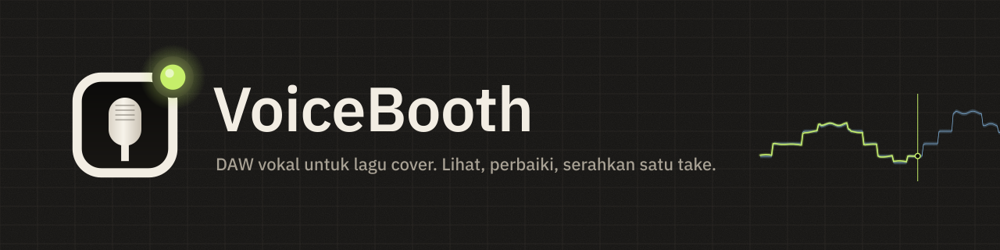
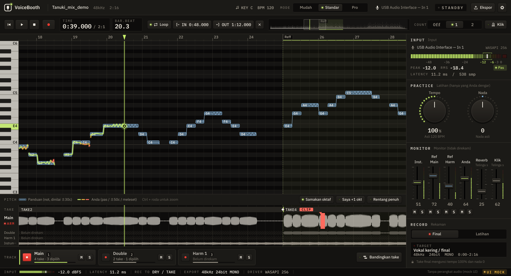

  

  <a href="README.md">日本語</a> ·
  <a href="README.en.md">English</a> ·
  <a href="README.ko.md">한국어</a> ·
  <a href="README.zh-Hans.md">简体中文</a> ·
  <a href="README.zh-Hant.md">繁體中文</a> ·
  <a href="README.es.md">Español</a> ·
  <a href="README.pt-BR.md">Português (Brasil)</a> ·
  <b>Bahasa Indonesia</b> ·
  <a href="README.vi.md">Tiếng Việt</a> ·
  <a href="README.tr.md">Türkçe</a> ·
  <a href="README.de.md">Deutsch</a> ·
  <a href="README.fr.md">Français</a>

  
  
  
  

# VoiceBooth

**DAW vokal kecil yang dibuat khusus untuk merekam lagu cover.**
Bernyanyilah mengikuti instrumental, lihat pitch Anda di layar, rekam ulang hanya bagian yang ingin diperbaiki, lalu ekspor WAV yang bisa langsung dimasukkan mixing engineer ke DAW-nya. Hanya itu yang dilakukannya. Ini bukan DAW serbaguna.

## Unduh (gratis)

  
  

| Komputer | File (klik untuk menyimpan) | Ukuran |
|---|---|---|
| Windows 10 / 11 (64-bit) | [VoiceBooth-0.2.0-win-x64-setup.exe](https://github.com/kajisho5/voicebooth/releases/download/v0.2.0-beta.2/VoiceBooth-0.2.0-win-x64-setup.exe) | sekitar 13 MB |
| Mac (macOS 11 atau lebih baru, Apple silicon / Intel) | [VoiceBooth-0.2.0-mac-universal.dmg](https://github.com/kajisho5/voicebooth/releases/download/v0.2.0-beta.2/VoiceBooth-0.2.0-mac-universal.dmg) | sekitar 40 MB |

Versi saat ini **0.2.0 beta 2**. Perubahan dan versi lama ada di [halaman rilis](https://github.com/kajisho5/voicebooth/releases). Tidak ada versi ponsel atau tablet.

### Pertama kali? Tiga langkah

1. **Klik tombol di atas untuk menyimpan file**, lalu klik dua kali file yang disimpan untuk memasang
2. **Jika muncul peringatan** (versi beta belum ditandatangani kode, jadi hanya muncul saat pertama kali dibuka)
   - **Windows**: jika muncul "Windows melindungi PC Anda", klik "Info selengkapnya" → "Jalankan saja"
   - **Mac**: pindahkan VoiceBooth dari DMG ke folder Aplikasi lalu buka sekali → jika macOS bilang tidak bisa dibuka, buka Pengaturan Sistem → Privasi & Keamanan → di bagian Keamanan, klik "Tetap Buka" (tombol muncul sekitar satu jam setelah Anda mencoba membuka aplikasi) → masukkan kata sandi ([petunjuk Apple](https://support.apple.com/id-id/guide/mac-help/mh40616/mac))
3. **Saat aplikasi terbuka**, pilih bahasa dan mode. Saat muncul "Unduh model pemisahan", tekan Unduh (sekitar 210 MB, hanya pertama kali; dipakai untuk nada dan harmoni panduan serta memulai hanya dari lagu asli)

> Tangkapan layar ini adalah mock-up pengembangan yang digambar dari data contoh. Tampilan dengan lagu sungguhan masih terus diperbaiki dan bisa terlihat berbeda.

> [!NOTE]
> **Ini versi beta.** Fitur utamanya sudah ada, tetapi belum diperiksa di PC Windows dan Mac milik pembuatnya sendiri. Laporkan bug, atau apa pun yang sulit dipahami, di [Issues](https://github.com/kajisho5/voicebooth/issues).

## Baca ini dulu

| | |
|---|---|
| OS | **Windows dan Mac** (Mac: Apple silicon dan Intel). **Tidak ada versi ponsel atau tablet** |
| Kartu grafis | **Tidak perlu.** Berjalan hanya dengan CPU. Yang berat hanya pemisahan vokal: lagu 30 detik butuh sekitar 2 menit di CPU 4 core (aplikasi menampilkan perkiraan waktunya) |
| Audio yang bisa dimuat | **Hanya file audio di komputer Anda** (wav / flac / aiff / ogg / mp3 / m4a). Lagu dari Spotify, Apple Music, YouTube Music, atau layanan streaming lain tidak bisa dimuat langsung |
| Ukuran | Installer sekitar 13 MB di Windows dan sekitar 40 MB di Mac. Jika model pemisahan dan nada (sekitar 210 MB) belum ada, aplikasi menawarkannya saat dibuka dan mengunduhnya **hanya saat Anda menekan Unduh** (bisa juga pilih Nanti). Selain memeriksa daftar model, tidak ada yang diunduh diam-diam |
| Proses berat | Pemisahan berjalan **hanya saat Anda menekan tombolnya**. Tampilan lirik **mati secara default** (nyalakan di Pengaturan) |
| Harmoni | Anda bisa merekam trek harmoni. Saat panduan dipisahkan, vokal utama dan harmoni dipisah dan **panduan harmoni (garis dan suara)** juga ditampilkan (trek harmoni dibandingkan dengannya). Panduan yang diambil dari lagu asli − karaoke juga dipisah, dengan mengambil vokal utama dari lagu asli setelahnya (butuh sedikit waktu) |
| Audio hasil pemisahan | Vokal dan iringan hasil pemisahan **untuk latihan pribadi Anda**. VoiceBooth tidak mengubah hak atas lagu aslinya. Sebarkan atau publikasikan (termasuk membagikannya sebagai instrumental untuk cover) hanya sejauh diizinkan pemegang hak aslinya |
| Harga | **Gratis.** Tanpa langganan, tanpa pembelian dalam aplikasi. Anda bisa mendukung pengembangan lewat [GitHub Sponsors](https://github.com/sponsors/kajisho5) (opsional; tidak mengubah fitur apa pun) |
| Bahasa | 日本語 / English / 한국어 / 简体中文 / 繁體中文 / Español / Português (Brasil) / Bahasa Indonesia / Tiếng Việt / Türkçe / Deutsch / Français |

## Apa yang bisa dilakukan

| | Detail |
|---|---|
| Membuka lagu | Format di atas, juga lewat seret dan jatuhkan. Awal lagu tetap sama di Windows dan Mac |
| Lagu asli + karaoke | Pakai lagu asli (dengan vokal) sebagai panduan dan bernyanyi di atas karaoke / instrumental. Perbedaan seperti panjang intro diselaraskan otomatis. Karaoke dikurangkan dari lagu asli untuk mengambil vokalnya, yang menjadi garis pitch panduan |
| Hanya lagu asli | Memisahkan lagu asli untuk membuat instrumental, sekaligus menampilkan garis panduan (perlu model pemisahan) |
| Pitch berwarna | Pitch Anda digambar sebagai garis di atasnya: hijau limau saat pas, lalu kuning amber dan merah saat meleset. Bernyanyi satu oktaf berbeda pun tetap bisa diselaraskan di layar |
| Latihan | Tempo 50–150 %, nada ±6. Berlatihlah pelan-pelan, tetapi take untuk diserahkan selalu direkam dengan tempo dan nada asli |
| Dengar panduan | Dengarkan vokal panduan yang diambil dari lagu asli, bersama instrumental atau solo (tempo/nada latihan ikut berlaku). Saat panduan dipisahkan, vokal utama dan harmoni bisa didengar terpisah |
| Rentang dan nada saran | Ukur rentang vokal Anda (nada terendah dan tertinggi) dengan mik dan dapatkan nada dasar yang memuat nada terendah dan tertinggi panduan. Satu klik untuk menerapkannya; jika tidak ada yang muat, ditampilkan berapa semitone yang keluar |
| Rekaman | Rekam dari awal sampai akhir, rekaman retroaktif (terlambat menekan REC tidak pernah memotong kata pertama), rekam ulang satu rentang (crossfade 8 ms di tiap ujung; 0–20 ms di Pro), pengukuran dan kompensasi latensi |
| Klik dan hitungan awal | Klik mengikuti ketukan lagu (lebih tinggi di ketukan 1; mengikuti tempo latihan). Menghitung 1–2 bar sebelum REC; rekam ulang rentang menghitung sebelum rentang. Hanya di headphone, tidak pernah ikut terekam atau diekspor |
| Main / Double / Harmoni | Rekam double dan harmoni dengan panjang yang sama dan putar bersama |
| Bandingkan take | Menampilkan take dari yang terbaru, memutar tiap take di tempatnya dalam lagu untuk satu rentang (atau satu segmen comp), lalu memakai yang kamu pilih (Standar ke atas; Ctrl / ⌘+Z membatalkan) |
| Ketepatan masuk | Dibandingkan dengan panduan, menampilkan berapa ms Anda masuk lebih awal atau terlambat (Standar ke atas). Pro juga menampilkan seberapa lama Anda pas pitch, serta vibrato |
| Ekspor | WAV durasi penuh dari awal lagu, dan paket kirim (satu WAV per trek, mix untuk dicek, catatan, zip) |
| Lirik (mati secara default) | Muat .txt / .lrc, sinkronkan dengan mengetuk |
| Skin | Ganti warna seluruh aplikasi (10 bawaan). Bagikan sebagai file `.vbskin` |

### Belum tersedia

Fitur berikut belum ada di beta (dan tidak ditampilkan di aplikasi).

- Memisahkan selain vokal (gitar, drum, dan sebagainya)

### Yang diterima mixing engineer Anda

File ditulis agar langsung pas dengan instrumental begitu diletakkan di DAW (target ±1 ms).

- Durasi penuh dari detik pertama lagu (0 dtk) sampai akhir. Bagian yang tidak Anda rekam berupa hening
- WAV mono 24-bit dengan sample rate lagu itu sendiri (tidak pernah diam-diam dikonversi ke 48 kHz)
- Tanpa normalisasi dan tanpa fade otomatis. Reverb monitor dan trek panduan tidak pernah ikut tercampur
- Take latihan tidak dimasukkan ke folder kiriman

### Tiga mode

Mesinnya sama; yang berubah hanya yang Anda lihat. Proyek yang dibuat di satu mode bisa dibuka di mode lain.

| Mudah | Standar | Pro |
|---|---|---|
| Rekam Main sekali jalan lalu serahkan | Double, satu harmoni, punch-in, ketepatan masuk, paket kirim | Dua harmoni, persentase pas pitch dan analisis vibrato, panjang crossfade di ujung punch-in |

| Mode Mudah | Mode Pro (harmoni) |
|---|---|
|  |  |

## Logo dan desain

  <picture>
    <source media="(prefers-color-scheme: dark)" srcset="brand/out/logo/logo-mark-dark.png">
    
  </picture>
  <b>Tandanya: jendela booth, kapsul mikrofon, dan lampu tally.</b> 
  Mikrofon yang terlihat dari jendela booth rekaman, dengan lampu menyala di sudutnya. Tally berwarna hijau limau secara default; di dalam aplikasi ia menjadi merah hanya saat merekam.

 

**Konsepnya adalah booth rekaman di malam hari.** Grafit gelap yang hangat, diterangi LED peralatan dan lampu tally. Status ditunjukkan dengan LED yang menyala, bukan bingkai berwarna, dan layar tidak pernah menjadi merah kecuali saat merekam.

| Warna | Dipakai untuk |
|---|---|
| Signal (hijau limau) | Pitch Anda saat pas, playhead, LED yang menyala |
| Reference (biru es) | Pita toleransi panduan |
| Amber / Coral | Agak meleset / jauh meleset, peringatan |
| Tally (merah) | Hanya saat merekam |

- **Huruf**: IBM Plex Sans JP, dengan IBM Plex Mono untuk waktu, dB, dan angka lain (lebar tetap, jadi digit tidak pernah melompat)
- **Kontrol**: tombol keycap dengan LED, knob bercincin LED, fader konsol vertikal, meter LED bersegmen
- **Gerak**: tombol yang memantul saat ditekan, fader dengan titik tahan di 0 dB, tally yang menyala merah hanya saat merekam. Audio selalu diutamakan, dan pengaturan "kurangi gerakan" di OS dihormati

**Skin.** Ganti semua warna sekaligus (font, tata letak, dan gerak tetap sama). Ada 10 skin bawaan, termasuk Studio Day / Sweet untuk ruangan terang, High Contrast untuk keterbacaan, dan Color Safe untuk perbedaan penglihatan warna. Di Pengaturan → Skin → Baru, pilih template lalu ubah warna satu per satu atau per grup (atau pinjam satu grup dari template lain), lalu simpan. Kombinasi yang sulit dibaca ditandai saat Anda mengedit (menyimpan tidak pernah diblokir). Bagikan skin sebagai file `.vbskin`.

| Ikon aplikasi | Brand kit |
|---|---|
|  |  |

Aturan pemakaian logo (ruang kosong, ukuran minimum, versi untuk latar terang) dan semua asetnya ada di [`brand/`](brand/README.md) (bahasa Jepang).

## Kebutuhan sistem (sementara)

| | Minimum | Disarankan |
|---|---|---|
| Windows | Windows 10 64-bit (versi 1607 atau lebih baru) | Windows 11 |
| Mac | macOS 11 Big Sur atau lebih baru (build universal untuk Apple silicon dan Intel) | macOS terbaru di Apple silicon |
| CPU | 64-bit, 4 core | 6 core atau lebih (Apple M1 atau lebih baru, Intel Core i5 / AMD Ryzen 5 terbaru atau lebih tinggi) |
| Memori | 8 GB | 16 GB |
| Ruang disk kosong | 2 GB | 10 GB atau lebih (SSD) |
| Layar | 1280×800 | 1920×1080 atau lebih besar |
| Audio | Input/output bawaan bisa dipakai | Audio interface dan headphone berkabel (ASIO di Windows memberi latensi lebih rendah) |
| Internet | Hanya untuk unduhan pertama model pemisahan (semua selain pemisahan bisa offline) | — |

- Yang berat hanya pemisahan vokal. Lebih lama di CPU lama dan Mac Intel (masih akan diukur dan dipastikan)
- Earphone dan headphone Bluetooth latensinya terlalu tinggi untuk merekam
- Windows on Arm belum diuji
- Angka-angka ini perkiraan kerja selama pengembangan. Alasannya ada di bagian 11.6.1 [`docs/DESIGN.md`](docs/DESIGN.md) (bahasa Jepang)

## Dukung pengembangan

VoiceBooth gratis. Jika Anda menyukainya, Anda bisa mendukung pengembangan lewat [GitHub Sponsors](https://github.com/sponsors/kajisho5). Menjadi sponsor tidak membuka fitur apa pun; semua orang mendapat aplikasi yang sama.

  

## Lisensi

Kode sumbernya berlisensi **GNU Affero General Public License v3.0 atau lebih baru (AGPL-3.0-or-later)** ([`LICENSE`](LICENSE)). VoiceBooth memakai JUCE 8 di bawah AGPLv3, jadi seluruh aplikasinya AGPL.

- Anda bebas memakai, mengubah, membagikan, dan menjualnya. Saat mendistribusikannya (termasuk membiarkan orang lain memakai versi yang diubah lewat jaringan), publikasikan kode sumbernya dengan lisensi yang sama
- **Nama dan logo**: jangan memakai nama atau logo "VoiceBooth" untuk versi yang diubah dan didistribusikan sebagai produk lain (pakai nama dan logo Anda sendiri). Mendistribusikan ulang tanpa perubahan, serta memakainya dalam perkenalan atau ulasan, boleh
- Audio yang Anda rekam dan ekspor adalah milik Anda. AGPL tidak berlaku untuk karya Anda

| Disertakan / dipakai | Lisensi |
|---|---|
| JUCE 8 | Ganda AGPLv3 / komersial (di sini dipakai di bawah AGPLv3) |
| minimp3 (`third_party/minimp3`) | CC0 |
| IBM Plex Sans JP / IBM Plex Mono (`resources/fonts`) | SIL Open Font License 1.1 |
| ONNX Runtime 1.22.0 (hanya di proses pemisahan vokal yang terpisah; paket prebuilt resmi diambil saat build) | MIT |
| Monocypher 4.0.3 (memverifikasi tanda tangan Ed25519 daftar model; diambil saat build) | Ganda CC0 / BSD-2-Clause |
| Rubber Band Library 4 (tempo / nada latihan; diambil saat build) | Ganda GPL v2 atau lebih baru / komersial (di sini dipakai di bawah GPL) |
| Steinberg ASIO SDK 2.3.4 (hanya build Windows; paket resmi diambil saat build) | Ganda GPLv3 / komersial (di sini dipakai di bawah GPLv3). SDK-nya sendiri tidak disimpan di repositori ini. ASIO adalah merek dagang Steinberg Media Technologies GmbH |
| Model (terpisah dari aplikasi, diunduh hanya saat Anda menekan tombol): pemisahan BS-RoFormer ft1 dan vokal utama BS-RoFormer karaoke (keduanya dari anvuew), nada RMVPE (RVC) | Kedua model pemisahan berlisensi GPL-3.0 (versi yang diubah: dipecah menjadi bagian ONNX dan dikuantisasi ke int8; langkah konversi dan bobot aslinya ada di tools/separation); RMVPE berlisensi MIT. Hanya model yang lisensi bobotnya sudah diperiksa yang didistribusikan |

## Berkontribusi

Build, pengujian, dan struktur proyek ada di [`docs/DEVELOPMENT.md`](docs/DEVELOPMENT.md), dan spesifikasinya adalah [`docs/DESIGN.md`](docs/DESIGN.md) (keduanya dalam bahasa Jepang).
