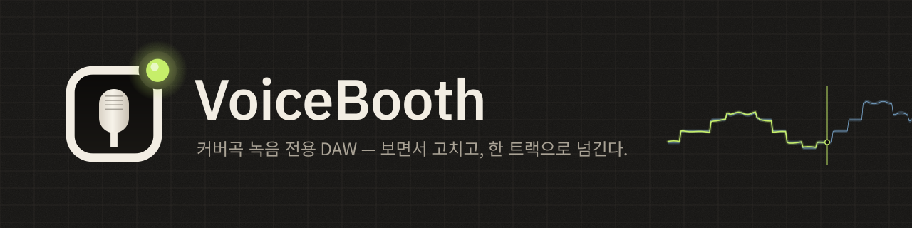
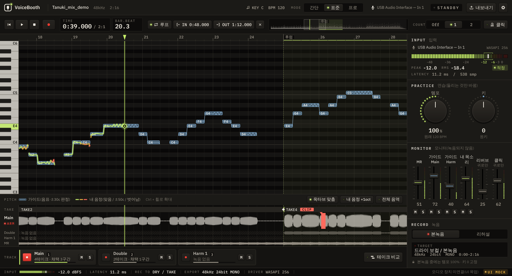
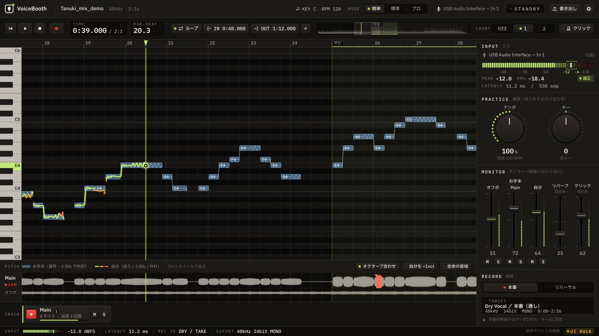
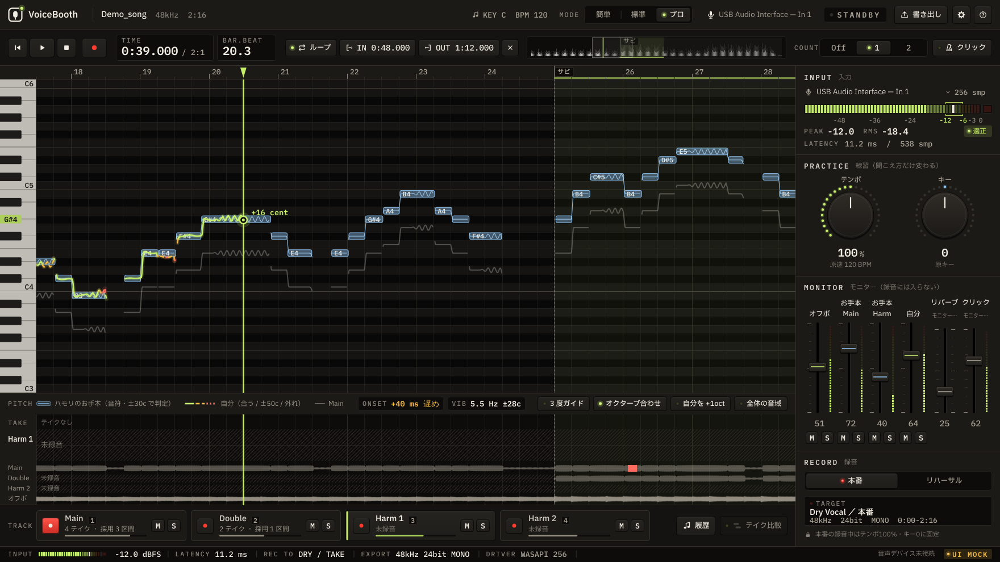
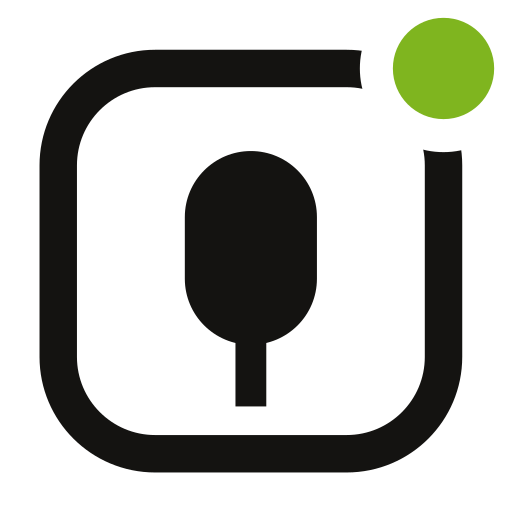
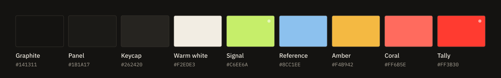
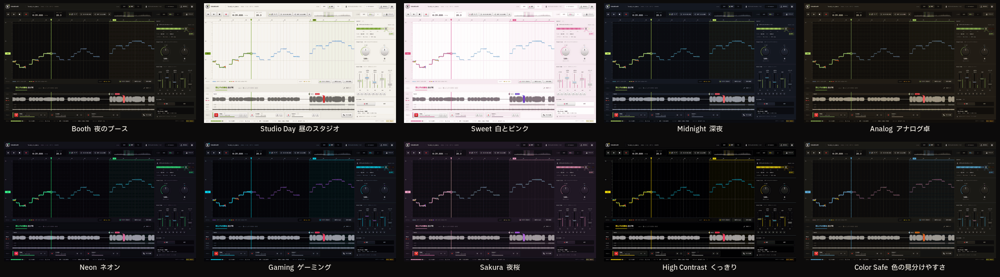
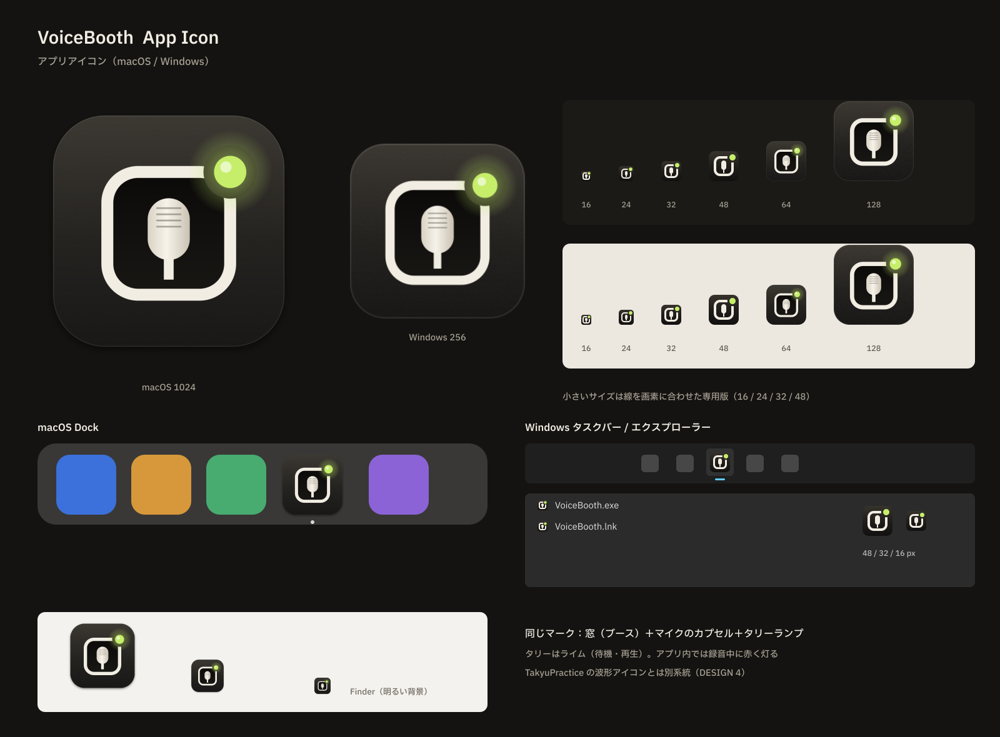
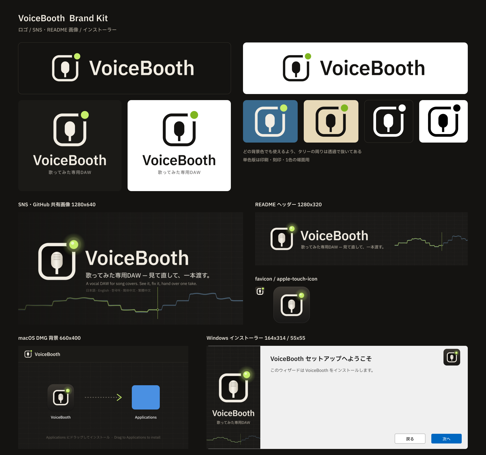

  

  <a href="README.md">日本語</a> ·
  <a href="README.en.md">English</a> ·
  <b>한국어</b> ·
  <a href="README.zh-Hans.md">简体中文</a> ·
  <a href="README.zh-Hant.md">繁體中文</a> ·
  <a href="README.es.md">Español</a>

  
  
  

# VoiceBooth

**커버곡 녹음만을 위한 작은 보컬 DAW입니다.**
MR에 맞춰 노래하면서 음정을 화면으로 보고 고치고, 고치고 싶은 부분만 다시 녹음해서, 믹스 엔지니어에게 그대로 넘길 수 있는 WAV를 내보냅니다. 그 일에 필요한 기능만 넣었습니다. 만능 DAW가 아닙니다.

> [!NOTE]
> **베타 버전입니다.** 주요 기능은 갖췄지만, 제작자의 Windows / Mac에서 직접 확인하는 것은 이제부터입니다. 버그나 '이 부분이 이해하기 어렵다'는 의견은 [Issues](https://github.com/kajisho5/voicebooth/issues)에 남겨 주세요.

## 먼저 읽어 주세요

| | |
|---|---|
| 지원 OS | **Windows와 Mac 모두**(Mac은 Apple 실리콘 / Intel 모두 지원). **스마트폰·태블릿 버전은 없습니다** |
| 그래픽카드 | **필요 없습니다.** CPU만으로 동작합니다. 무거운 것은 보컬 분리뿐이며, 4코어 CPU에서 30초 길이의 곡에 약 2분 걸렸습니다(화면에 예상 시간이 표시됩니다) |
| 넣을 수 있는 음원 | **내 컴퓨터에 있는 오디오 파일만**(wav / flac / aiff / ogg / mp3 / m4a). Spotify·Apple Music·YouTube Music 같은 스트리밍 서비스에서 바로 가져올 수는 없습니다 |
| 크기 | 설치 파일은 Windows 약 13 MB, Mac 약 42 MB. 분리 모델(약 223 MB)은 **사용할 때 버튼을 눌렀을 때만** 다운로드합니다. 멋대로 받아 오지 않습니다 |
| 무거운 처리 | 분리는 **버튼을 눌렀을 때만** 동작합니다. 가사 표시는 **기본값이 꺼짐**입니다(설정에서 켤 수 있습니다) |
| 하모니 | 하모니 트랙을 녹음할 수는 있습니다. **믹스에서 하모니만 뽑아 가이드로 쓰는 기능은 없습니다**(분리는 '보컬 전체'와 '반주' 두 가지) |
| 분리한 음원의 취급 | 분리한 보컬·반주는 **개인 연습용**입니다. VoiceBooth는 원곡의 권리를 바꾸지 않습니다. 배포·공개(커버곡용 MR로 배포하는 것 포함)는 원곡의 권리자가 허락한 범위 안에서만 해 주세요 |
| 요금 | **무료입니다.** 구독도 결제도 없습니다. 후원은 [GitHub Sponsors](https://github.com/sponsors/kajisho5)에서(선택 사항. 기능은 달라지지 않습니다) |
| 언어 | 日本語 / English / 한국어 / 简体中文 / 繁體中文 / Español |

## 할 수 있는 것

| | 내용 |
|---|---|
| 곡 열기 | 위의 형식. 드래그 앤 드롭으로도 열 수 있음. 곡의 시작 위치가 Windows와 Mac에서 같음 |
| 원곡＋MR | 보컬이 있는 원곡을 가이드로, MR(반주) 위에서 노래. 전주 길이 차이 등은 자동으로 시간을 맞춤. 원곡에서 MR을 빼서 보컬을 뽑아내고, 가이드 음정 선으로 만듦 |
| 원곡만 | 원곡을 분리해서 MR을 만들고, 가이드 선도 표시(분리 모델이 필요) |
| 음정을 색으로 | 내 목소리의 음정을 선으로 겹쳐 표시. 맞으면 라임색, 벗어나면 주황→빨강. 한 옥타브 다르게 불러도 맞춰서 표시할 수 있음 |
| 연습 | 템포 50~150 %, 키 ±6. 느리게 연습해도 납품 녹음은 원래 템포·키로 |
| 가이드 듣기 | 원곡에서 추출한 가이드 보컬을 반주와 함께, 또는 솔로로 들을 수 있다(연습용 템포·키도 적용). 메인과 하모니는 나눌 수 없어 하나 |
| 음역과 추천 키 | 마이크로 음역(가장 낮은 음·높은 음)을 재면 가이드의 최저음·최고음이 들어오는 키를 보여 준다. 누르면 그 키로. 들어오지 않으면 위아래로 몇 반음 벗어나는지도 표시 |
| 녹음 | 통째 녹음, 소급 녹음(REC를 늦게 눌러도 첫 소절이 잘리지 않음), 구간 재녹음(이음새는 8 ms 크로스페이드. 프로에서는 0~20 ms), 지연 측정과 보정 |
| 클릭·카운트인 | 곡의 템포로 클릭(1박은 높은 소리. 연습 템포에도 맞음). REC 전에 1~2마디를 셈. 구간 재녹음은 구간 앞을 셈. 귀로만 들리며 녹음·내보내기에는 들어가지 않음 |
| Main / Double / Harmony | 더블과 하모니를 같은 길이로 녹음해서 함께 재생 |
| 들어가는 타이밍 | 가이드와 비교해서 들어가는 타이밍이 몇 ms 빠른지·늦은지 표시(표준 이상). 프로에서는 음정이 맞은 비율·비브라토도 |
| 내보내기 | 곡의 처음부터 전체 길이 WAV, 납품 팩(트랙별 WAV·확인용 믹스·메모·zip) |
| 가사(기본값 꺼짐) | .txt / .lrc 불러오기, 탭으로 맞추기 |
| 스킨 | 색을 한꺼번에 바꾸기(내장 10종). `.vbskin` 파일로 다른 사람과 공유 |

### 아직 할 수 없는 것

지금의 베타에는 다음 기능이 들어 있지 않습니다(화면에도 표시하지 않습니다).

- 하모니의 가이드 선(하모니 트랙을 골라도 메인의 가이드 선을 표시합니다)
- 테이크 비교 듣기, 기타·드럼 등 보컬 외의 분리

> [!IMPORTANT]
> 분리 모델은 **배포를 준비 중**입니다(서명한 목록의 공개 대기). 그때까지도 원곡＋MR 조합으로 가이드 선 표시·녹음·내보내기는 사용할 수 있습니다.

### 넘기는 파일의 약속

믹스 엔지니어가 DAW에 놓는 순간 MR과 시작이 맞도록 내보냅니다(목표 ±1 ms).

- 곡의 처음(0초)부터 끝까지 전체 길이. 녹음하지 않은 부분은 무음
- 24bit 모노 WAV. 샘플레이트는 원곡 그대로(멋대로 48 kHz로 바꾸지 않음)
- 노멀라이즈·자동 페이드 없음. 모니터용 리버브나 가이드는 섞지 않음
- 연습으로 녹음한 것은 납품 폴더에 넣지 않음

### 세 가지 모드

엔진은 같고, 보이는 것만 바뀝니다. 어느 모드에서 만든 프로젝트든 다른 모드에서 열 수 있습니다.

| 간단 | 표준 | 프로 |
|---|---|---|
| Main을 통째로 녹음해서 넘기기만 | 더블·하모니 1개·구간 재녹음·들어가는 타이밍·납품 팩 | 하모니 2개, 음정이 맞은 비율·비브라토 분석, 이음새 크로스페이드 길이 |

| 간단 모드 | 프로 모드(하모니) |
|---|---|
|  |  |

## 로고와 디자인

  <picture>
    <source media="(prefers-color-scheme: dark)" srcset="brand/out/logo/logo-mark-dark.png">
    
  </picture>
  <b>마크: 녹음 부스의 창, 마이크 캡슐, 탈리 램프.</b> 
  부스 창 너머에 마이크가 있고, 오른쪽 위 램프가 켜져 있는 모습입니다. 탈리는 평소 라임색이고, 앱 안에서는 녹음 중에만 빨갛게 켜집니다.

 

**콘셉트는 "밤의 녹음 부스".** 따뜻한 느낌의 어두운 그래파이트에 장비의 LED와 탈리 램프가 켜집니다. 상태는 테두리 색이 아니라 LED 점등으로 보여 주고, 녹음 중이 아니면 화면을 빨갛게 하지 않습니다.

| 색 | 쓰는 곳 |
|---|---|
| Signal(라임) | 내 음정이 맞을 때·재생 헤드·켜진 LED |
| Reference(아이스 블루) | 가이드의 허용 범위 띠 |
| Amber / Coral | 조금 벗어남 / 많이 벗어남·경고 |
| Tally(빨강) | 녹음 중에만 |

- **서체**: IBM Plex Sans JP. 시간·dB 같은 숫자는 IBM Plex Mono(고정폭이라 자릿수가 흔들리지 않음). 한글은 OS 기본 글꼴로 표시
- **부품**: 키캡＋LED 버튼, LED 링 노브, 세로 콘솔 페이더, 세그먼트 LED 미터
- **움직임**: 스프링처럼 눌리는 키, 0 dB에서 손맛이 있는 페이더, 녹음 중에만 빨갛게 켜지는 탈리. 소리를 최우선으로 하고, OS의 "동작 줄이기" 설정도 따릅니다

**스킨.** 색만 한꺼번에 바꿀 수 있습니다(글꼴·배치·움직임은 그대로). 내장 스킨은 10종으로, 밝은 방에 맞춘 Studio Day / Sweet, 가독성을 우선한 High Contrast, 색 구별이 어려운 분을 배려한 Color Safe도 있습니다. 설정의 '스킨' → '새로 만들기'에서 템플릿을 고르고, 색마다·그룹마다(다른 템플릿에서 가져오기도 가능) 바꿔 저장할 수 있습니다. 보기 어려운 조합은 편집하는 동안 알려 줍니다(저장은 막지 않습니다). `.vbskin` 파일로 다른 사람과 공유할 수 있습니다.

| 앱 아이콘 | 브랜드 키트 |
|---|---|
|  |  |

로고 사용 규칙(여백·최소 크기·밝은 배경용)과 모든 소재는 [`brand/`](brand/README.md)에 있습니다(일본어).

## 동작 환경(잠정)

| | 최소 | 권장 |
|---|---|---|
| Windows | Windows 10 64bit(버전 1607 이상) | Windows 11 |
| Mac | macOS 11 Big Sur 이상(Apple 실리콘 / Intel 모두 지원하는 유니버설 버전) | 최신 macOS, Apple 실리콘 |
| CPU | 64bit·4코어 | 6코어 이상(Apple M1 이상, 최근 몇 년의 Intel Core i5 / AMD Ryzen 5 급 이상) |
| 메모리 | 8 GB | 16 GB |
| 여유 공간 | 2 GB | 10 GB 이상(SSD) |
| 화면 | 1280×800 | 1440×900 이상 |
| 오디오 | 내장 입출력으로도 동작 | 오디오 인터페이스＋유선 헤드폰(Windows는 ASIO 지원이면 지연이 적음) |
| 인터넷 | 처음 분리 모델을 다운로드할 때만(연결이 없어도 분리 외에는 사용 가능) | — |

- 무거운 것은 보컬 분리뿐입니다. 오래된 CPU나 Intel Mac에서는 분리에 시간이 걸립니다(실측해서 확정 예정)
- 블루투스 이어폰·헤드폰은 지연이 커서 녹음에는 맞지 않습니다
- Arm용 Windows는 확인하지 않았습니다
- 수치는 개발 중의 기준입니다. 근거는 [`docs/DESIGN.md`](docs/DESIGN.md) 11.6.1(일본어)

## 다운로드

[Releases](https://github.com/kajisho5/voicebooth/releases)에서 Windows는 `VoiceBooth-<버전>-win-x64-setup.exe`, Mac은 `VoiceBooth-<버전>-mac-universal.dmg`를 받아 주세요.

베타 버전은 아직 **코드 서명을 하지 않았습니다**. 처음 열 때만 OS의 경고가 나옵니다.

- **Windows**: 'Windows의 PC 보호'가 나오면 '추가 정보' → '실행'
- **Mac**: DMG 안의 VoiceBooth를 응용 프로그램 폴더로 옮기고 한 번 열기 → '열 수 없음'이라고 나오면 시스템 설정 → '개인정보 보호 및 보안' → 보안 항목의 '그래도 열기'(열려고 한 뒤 약 1시간 동안만 나타납니다) → 암호 입력([Apple 설명](https://support.apple.com/ko-kr/guide/mac-help/mh40616/mac))

## 개발 후원

VoiceBooth는 무료입니다. 마음에 드셨다면 [GitHub Sponsors](https://github.com/sponsors/kajisho5)로 후원해 주시면 개발을 이어갈 수 있습니다. 후원 여부에 따라 쓸 수 있는 기능은 달라지지 않습니다.

## 라이선스

소스 코드는 **GNU Affero General Public License v3.0 이상(AGPL-3.0-or-later)** 입니다([`LICENSE`](LICENSE)). JUCE 8을 AGPLv3로 사용하기 때문에 앱 전체를 AGPL로 했습니다.

- 사용·수정·배포·판매는 자유입니다. 배포할 때(수정판을 네트워크로 쓰게 할 때도)는 소스도 같은 라이선스로 공개해 주세요
- **이름과 로고**: 수정판을 별도 제품으로 배포할 때는 "VoiceBooth"라는 이름과 로고를 쓰지 말아 주세요(다른 이름·로고로). 그대로 재배포하거나 소개·리뷰에 쓰는 것은 괜찮습니다
- 녹음하고 내보낸 오디오 파일은 여러분의 것입니다. AGPL은 만든 작품에는 적용되지 않습니다

| 포함·사용하는 것 | 라이선스 |
|---|---|
| JUCE 8 | AGPLv3 / 상용 듀얼(여기서는 AGPLv3) |
| minimp3(`third_party/minimp3`) | CC0 |
| IBM Plex Sans JP / IBM Plex Mono(`resources/fonts`) | SIL Open Font License 1.1 |
| ONNX Runtime 1.22.0(보컬 분리용 별도 프로세스에서만. 빌드할 때 공식 빌드본을 가져옴) | MIT |
| Monocypher 4.0.3(모델 목록의 Ed25519 서명 확인. 빌드할 때 가져옴) | CC0 / BSD-2-Clause 듀얼 |
| Rubber Band Library 4(연습용 템포 / 키. 빌드할 때 가져옴) | GPL v2 이상 / 상용 듀얼(여기서는 GPL) |
| Steinberg ASIO SDK 2.3.4(Windows 빌드만. 빌드할 때 공식 배포본을 가져옴) | GPLv3 / 상용 듀얼(여기서는 GPLv3). SDK 자체는 저장소에 넣지 않음. ASIO는 Steinberg Media Technologies GmbH의 상표 |
| 모델(앱과 별도로, 버튼을 눌렀을 때만 다운로드): 분리 Mel-Band RoFormer(Kimberley Jensen) | MIT. 가중치 라이선스를 확인한 것만 배포 |

## 개발 참여

빌드·테스트·구성은 [`docs/DEVELOPMENT.md`](docs/DEVELOPMENT.md), 사양은 [`docs/DESIGN.md`](docs/DESIGN.md)(둘 다 일본어).
