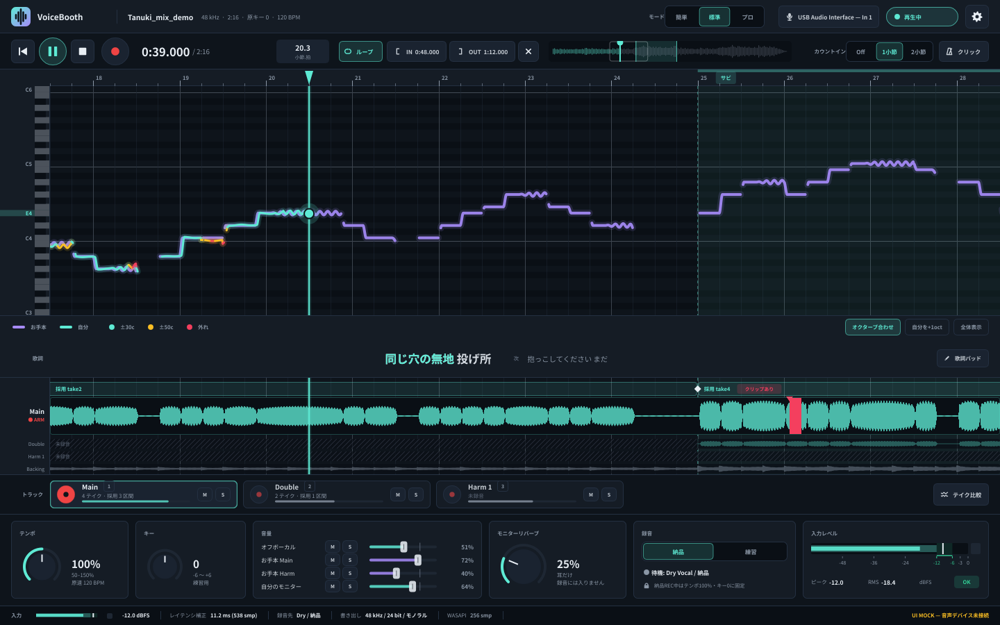

# VoiceBooth

歌ってみた専用の超小型ボーカルDAW。万能DAWではない。

> 見て直して、一本渡す。

仕様は [`docs/DESIGN.md`](docs/DESIGN.md) が唯一の正。

## 現在の状態：Phase A（見た目だけ）

- A1 設計書配置 / A2 JUCE アプリ起動 / A3 メイン画面（ダミーデータ）まで
- **音声デバイスは開かない**（`VOICEBOOTH_UI_MOCK=ON`、`juce_audio_*` をリンクしない構成）
- 再生・録音ボタンは見た目のトグルのみ。音は出ない



画面の状態一覧は [`docs/UI_STATES.md`](docs/UI_STATES.md)。

## ビルド

必要なもの: CMake 3.22+、C++17 コンパイラ、Git（JUCE 8.0.15 を初回 configure 時に自動取得）

### Windows（Visual Studio 2022）

```powershell
cmake -S . -B build -G "Visual Studio 17 2022" -A x64
cmake --build build --config Release
.\build\VoiceBooth_artefacts\Release\VoiceBooth.exe
```

### macOS（Xcode / Command Line Tools）

```bash
cmake -S . -B build -G Xcode
cmake --build build --config Release
open build/VoiceBooth_artefacts/Release/VoiceBooth.app
```

### Linux（開発確認用。配布対象外）

```bash
sudo apt-get install -y libx11-dev libxrandr-dev libxinerama-dev libxcursor-dev libxext-dev \
                        libfreetype-dev libfontconfig1-dev ninja-build
cmake -S . -B build -G Ninja -DCMAKE_BUILD_TYPE=Release
cmake --build build
./build/VoiceBooth_artefacts/Release/VoiceBooth
```

JUCE を手元のチェックアウトから使う場合: `-DVOICEBOOTH_JUCE_DIR=/path/to/JUCE`

## 構成

```text
docs/DESIGN.md        仕様（唯一の正）
docs/UI_STATES.md     画面状態一覧
app/Main.cpp          アプリ / ウィンドウ（既定 1440x900）
app/ui/               見た目専用。ダミーデータで描画
  DummySession.*      固定ダミー（DESIGN 20）。結線時に差し替える
  Theme.*             色トークン（DESIGN 4.9）とフォント
app/audio/            音声エンジンのインターフェースのみ（中身は Phase B）
app/project/          データモデル（形のみ）+ project.example.json
app/export/           ExportService スタブ
resources/fonts/      Noto Sans JP（SIL OFL 1.1）
```

## ライセンス上の注意（未決事項に関係）

- **JUCE 8** は AGPLv3 と商用 JUCE ライセンスのデュアルライセンス。配布形態（有料/無料、ソース公開の有無）に応じてどちらで使うか決める必要がある（DESIGN 19 未決）
- **Noto Sans JP** は SIL Open Font License 1.1（`resources/fonts/OFL.txt`）。アプリへの同梱・再配布可
- Utawave（AGPL）のソースはコピーしない（DESIGN 0）
- ASIO SDK はリポジトリに入れない
