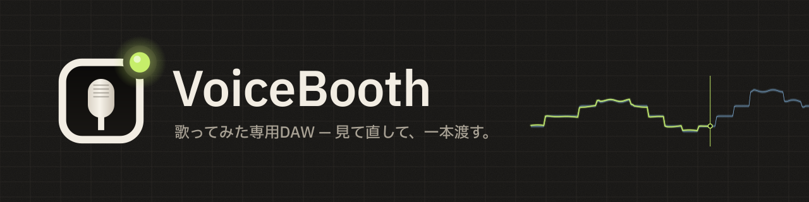
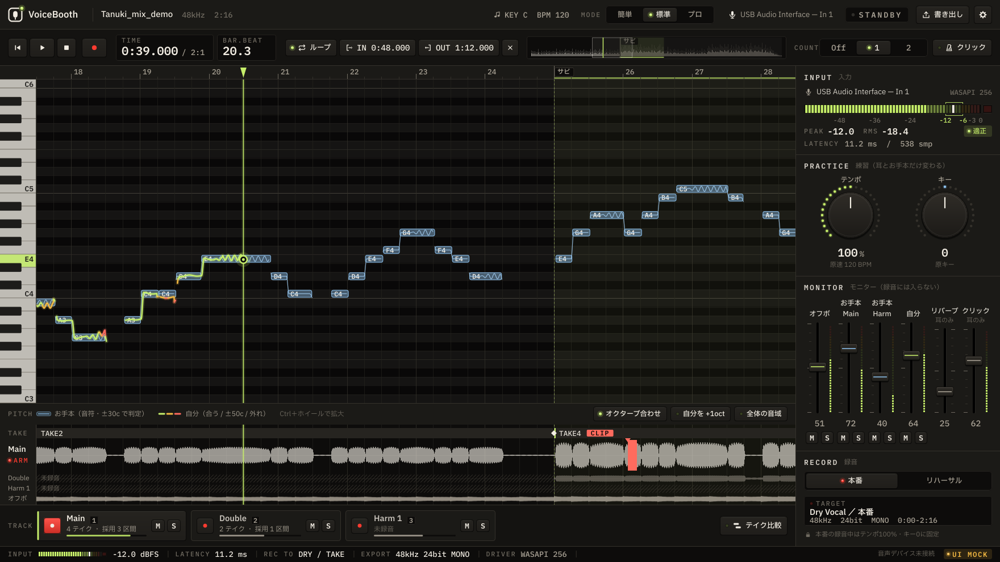

# VoiceBooth

歌ってみた専用の超小型ボーカルDAW。万能DAWではない。

> 見て直して、一本渡す。

仕様は [`docs/DESIGN.md`](docs/DESIGN.md) が唯一の正。

## 現在の状態：Phase B2（オフボ再生）— 手動確認待ち

- Phase A（A1–A7）：メイン画面・操作の見た目（再生ヘッド・REC・範囲・ショートカット）・モード出し分け・起動 / 入力セットアップ / 書き出し / 設定
- **B1**：曲ファイル（wav / flac / aiff / ogg / mp3 / m4a。mp3 は同梱の minimp3、m4a は Win・Mac の OS 標準デコーダ。曲の頭の位置は OS で変わらない）を開くと、形式・長さ・SR・ch を読み、実波形を描く。起動画面のクリック / ドロップ、メイン画面へのドロップ、`--open=<path>`
- **日本語 / English / 한국어 / 简体中文 / 繁體中文**。初回起動で言語を選び、以後は記憶（設定から変更可。DESIGN 10.1）
- **B2**：開いた曲（オフボ）を既定の出力デバイスで再生・シーク・ループ。オフボのフェーダーと M が効く。入力（マイク）はまだ開かない（B3 以降）
- `-DVOICEBOOTH_UI_MOCK=ON` でビルドすると音声デバイスを一切開かない（画面確認・スクリーンショット用）

| 曲を読み込んだところ | 開いた曲の画面（実波形） |
|---|---|
|  |  |



| 録音中 | 書き出し | 設定（繁體中文） |
|---|---|---|
|  |  |  |

| English | 한국어 | 简体中文 |
|---|---|---|
|  |  |  |

見た目は v2 "Booth"（夜の録音ブース：暖色グラファイト＋LED＋タリー）。機能の参考にした 既存の練習アプリ とは配色・書体・部品・配置を変えている（DESIGN 4 / 4.9）。

起動オプション（`--lang=en` `--mode=pro` `--screen=export` など）は [`docs/UI_STATES.md`](docs/UI_STATES.md)。

部品ギャラリー（全部品を状態ごとに表示。開発用）: `VoiceBooth --gallery`


画面の状態一覧は [`docs/UI_STATES.md`](docs/UI_STATES.md)。

## 動作環境（暫定）

| | 最低 | 推奨 |
|---|---|---|
| Windows | Windows 10 64bit（バージョン 1607 以降） | Windows 11 |
| Mac | macOS 11 Big Sur 以降（Apple シリコン / Intel 両対応のユニバーサル版） | 最新の macOS、Apple シリコン |
| CPU | 64bit・4 コア | 6 コア以上（Apple M1 以降、ここ数年の Intel Core i5 / AMD Ryzen 5 クラス以上） |
| メモリ | 8 GB | 16 GB |
| 空き容量 | 2 GB | 10 GB 以上（SSD） |
| 画面 | 1280×800 | 1440×900 以上 |
| 音声 | 内蔵の入出力でも動く | オーディオインターフェース＋有線ヘッドホン（Windows は ASIO 対応だと遅延が少ない） |
| ネット | 初回の分離モデルのダウンロードだけ（つながらなくても分離以外は使える） | — |

- 重いのはボーカル分離だけです。古い CPU や Intel Mac では分離に時間がかかります（実測して確定します）
- Bluetooth のイヤホン・ヘッドホンは遅延が大きく、録音には向きません
- Arm 版 Windows は未確認です
- 数値は開発中の目安です。根拠は [`docs/DESIGN.md`](docs/DESIGN.md) 11.6.1

## ビルド

必要なもの: CMake 3.22+、C++17 コンパイラ、Git（JUCE 8.0.15 を初回 configure 時に自動取得）

### Windows（Visual Studio 2022）

```powershell
cmake -S . -B build -G "Visual Studio 17 2022" -A x64
cmake --build build --config Release
.\build\VoiceBooth_artefacts\Release\VoiceBooth.exe
```

### macOS（Xcode / Command Line Tools）

```bash
cmake -S . -B build -G Xcode
cmake --build build --config Release
open build/VoiceBooth_artefacts/Release/VoiceBooth.app
```

### Linux（開発確認用。配布対象外）

```bash
sudo apt-get install -y libx11-dev libxrandr-dev libxinerama-dev libxcursor-dev libxext-dev \
                        libfreetype-dev libfontconfig1-dev ninja-build
cmake -S . -B build -G Ninja -DCMAKE_BUILD_TYPE=Release
cmake --build build
./build/VoiceBooth_artefacts/Release/VoiceBooth
```

JUCE を手元のチェックアウトから使う場合: `-DVOICEBOOTH_JUCE_DIR=/path/to/JUCE`

### テスト

```bash
ctest --test-dir build -C Release --output-on-failure
```

波形の概形（ピーク・RMS、ビン境界・全チャンネル・粗い段と総当たりの一致）と、曲の読み込み（WAV / FLAC の長さがサンプル単位で一致、日本語と空白を含むパス、壊れた / 空のファイル、中止、非同期の通知、mp3 / m4a を OS の読み手で開けるか・長さと頭のずれ）を確かめる。CI（Win / Mac）でも実行。テスト用音声は `tests/data/make_fixtures.sh` で作る自作の合成音。

## 構成

```text
docs/DESIGN.md        仕様（唯一の正）
docs/UI_STATES.md     画面状態一覧
app/Main.cpp          アプリ / ウィンドウ（既定 1440x900、最小 1280x800）/ 起動オプション / 設定保存
app/i18n/             多言語対応 tr("key")（5 言語）
app/ui/UiSession.*    画面の状態と変更通知（Phase B で音声エンジンにつなぐ）
app/audio/            曲の読み込み（SongLoader / mp3・m4a の読み手）と波形の概形（WaveformOverview）
third_party/minimp3/  mp3 デコーダ（CC0。出典とコミットは README）
tests/                VoiceBoothTests（ctest）
app/ui/screens/       起動画面 / 入力セットアップ / 書き出し / 設定
app/ui/Theme.*        色トークン・書体・描画の基本（キーキャップ / 表示窓 / LED）
app/ui/parts/         部品：KeyButton / SegmentedKeys / Encoder / ConsoleFader / LedMeter / Readout / TallyLamp / Icons
app/ui/Gallery.*      部品ギャラリー
app/ui/*.cpp          画面：TopBar / TransportBar / PitchLane / LyricsLane / WaveLane / TrackTabs / Rack / StatusBar
app/ui/DummySession.* 固定ダミー（DESIGN 20）。結線時に差し替える
app/audio/            音声エンジンのインターフェースのみ（中身は Phase B）
app/project/          データモデル（形のみ）+ project.example.json
app/export/           ExportService スタブ
resources/fonts/      IBM Plex Sans JP / IBM Plex Mono（SIL OFL 1.1）
resources/i18n/       翻訳表 ja / en / ko / zh-Hans / zh-Hant
tools/check_i18n.py   翻訳表と直書きの検査（CI でも実行）
```

## 多言語対応

画面の文字は必ず `tr("key")` で引き、`resources/i18n/` の全言語（ja / en / ko / zh-Hans / zh-Hant）にキーを足す。

```bash
python3 tools/check_i18n.py
```

言語を足す時は `app/i18n/I18n.cpp` の `available()` に 1 行、JSON を 1 枚、`CMakeLists.txt` の埋め込みに 1 行（DESIGN 10.1）。
韓国語・中国語は OS の標準フォントで表示する（Linux で確認する場合は `fonts-noto-cjk` を入れる）。

## ブランド素材

アプリアイコン・ロゴ・SNS 画像・インストーラー画像は [`brand/`](brand/README.md)（`python3 brand/build_brand.py` で再生成）。

## 開発の支援

VoiceBooth は無料です。気に入ったら [GitHub Sponsors](https://github.com/sponsors/kajisho5) で支援していただけると開発が続けられます。支援の有無で使える機能は変わりません。

## ライセンス

VoiceBooth のソースコードは **GNU Affero General Public License v3.0 以降（AGPL-3.0-or-later）** で公開しています（[`LICENSE`](LICENSE)）。
JUCE 8 を AGPLv3 で使っているため、アプリ全体を AGPL にしています（DESIGN 19）。

- 使う・改造する・配る・売るのは自由。配る時（改造版をネット越しに使わせる時も）はソースも同じライセンスで公開する
- **名前とロゴ**：「VoiceBooth」の名前とロゴ（`brand/`）は、改造版を別の製品として配る時には使わないでください（別の名前・ロゴにする）。元のままの再配布や、紹介・レビューでの使用は構いません
- 録音・書き出した音声ファイルは利用者のもの。AGPL は作った作品には及ばない

同梱・利用しているもの：

| もの | ライセンス |
|---|---|
| JUCE 8 | AGPLv3 / 商用のデュアル（ここでは AGPLv3） |
| minimp3（`third_party/minimp3`） | CC0 |
| IBM Plex Sans JP / IBM Plex Mono（`resources/fonts`） | SIL Open Font License 1.1（改変したら "Plex" 以外の名前にする） |
| 予定：Rubber Band（テンポ / キー、B11） | GPL v2 以降 / 商用のデュアル（ここでは GPL） |
| 予定：ASIO SDK（Windows） | GPLv3 / 商用のデュアル（2025-10-15 から）。SDK 自体はリポジトリに入れない |
| 予定：分離・ピッチ・歌詞のモデル | 重みのライセンスを確かめたものだけ（DESIGN 19.1）。アプリとは別に配る |

- 既存の録音ソフト のソースはコピーしない（DESIGN 0。ライセンスの問題ではなく、独自に作る方針）
