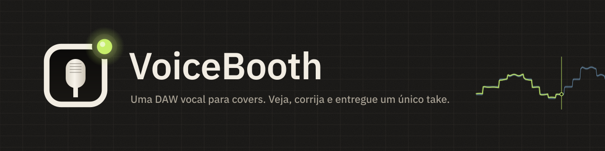
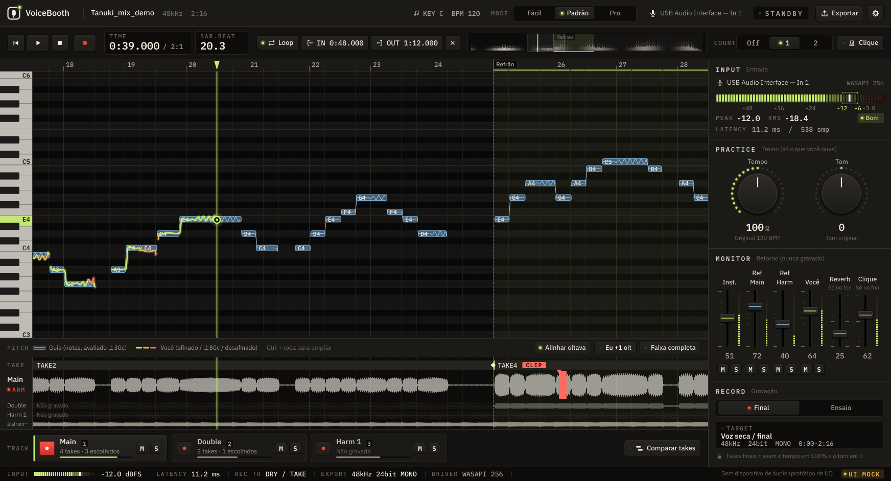

  

  <a href="README.md">日本語</a> ·
  <a href="README.en.md">English</a> ·
  <a href="README.ko.md">한국어</a> ·
  <a href="README.zh-Hans.md">简体中文</a> ·
  <a href="README.zh-Hant.md">繁體中文</a> ·
  <a href="README.es.md">Español</a> ·
  <b>Português (Brasil)</b> ·
  <a href="README.id.md">Bahasa Indonesia</a> ·
  <a href="README.vi.md">Tiếng Việt</a> ·
  <a href="README.tr.md">Türkçe</a> ·
  <a href="README.de.md">Deutsch</a> ·
  <a href="README.fr.md">Français</a>

  
  
  
  

# VoiceBooth

**Uma pequena DAW vocal feita só para gravar covers.**
Cante sobre um instrumental, veja sua afinação na tela, regrave só as partes que quiser corrigir e exporte um WAV que quem for mixar possa jogar direto na DAW. É só isso que ela faz. Não é uma DAW de uso geral.

## Download (grátis)

  
  

| Computador | Arquivo (clique para salvar) | Tamanho |
|---|---|---|
| Windows 10 / 11 (64 bits) | [VoiceBooth-0.2.0-win-x64-setup.exe](https://github.com/kajisho5/voicebooth/releases/download/v0.2.0-beta.3/VoiceBooth-0.2.0-win-x64-setup.exe) | cerca de 13 MB |
| Mac (macOS 11 ou posterior, Apple silicon / Intel) | [VoiceBooth-0.2.0-mac-universal.dmg](https://github.com/kajisho5/voicebooth/releases/download/v0.2.0-beta.3/VoiceBooth-0.2.0-mac-universal.dmg) | cerca de 40 MB |

A versão atual é **0.2.0 beta 3**. As mudanças e versões anteriores estão na [página de versões](https://github.com/kajisho5/voicebooth/releases). Não há versão para celular ou tablet.

### Primeira vez? Três passos

1. **Clique num botão acima para salvar o arquivo** e dê dois cliques no arquivo salvo para instalar
2. **Se aparecer um aviso** (a beta ainda não tem assinatura de código, então ele só aparece na primeira vez que você abre)
   - **Windows**: se aparecer "O Windows protegeu o computador", clique em "Mais informações" → "Executar assim mesmo"
   - **Mac**: mova o VoiceBooth do DMG para a pasta Aplicativos e abra uma vez → se o macOS disser que não pode abrir, vá em Ajustes do Sistema → Privacidade e Segurança → em Segurança, clique em "Abrir Mesmo Assim" (o botão aparece por cerca de uma hora depois que você tenta abrir o app) → digite sua senha ([instruções da Apple](https://support.apple.com/pt-br/guide/mac-help/mh40616/mac))
3. **Quando abrir**, escolha o idioma e um modo. Quando aparecer "Baixar o modelo de separação", clique em Baixar (cerca de 210 MB, só na primeira vez; usado para a afinação e as harmonias do guia e para começar só com o original)

> Esta captura é um protótipo de desenvolvimento desenhado com dados de exemplo. A exibição com músicas reais ainda está sendo melhorada e pode ficar diferente.

> [!NOTE]
> **Esta é uma versão beta.** As funções principais já estão prontas, mas ainda não foram testadas no PC com Windows nem no Mac do autor. Por favor, relate bugs, ou qualquer coisa difícil de entender, em [Issues](https://github.com/kajisho5/voicebooth/issues).

## Leia isto primeiro

| | |
|---|---|
| Sistema | **Windows e Mac** (Mac: Apple silicon e Intel). **Não há versão para celular nem tablet** |
| Placa de vídeo | **Não é necessária.** Roda só com a CPU. A única coisa pesada é a separação de voz: leva cerca de 4 vezes a duração da música (medido numa CPU de 4 núcleos: cerca de 2 minutos para uma música de 30 segundos, uns 15 minutos para uma de 4 minutos; CPUs mais lentas levam mais; o app mostra um tempo estimado) |
| Áudio que você pode carregar | **Só arquivos de áudio do seu computador** (wav / flac / aiff / ogg / mp3 / m4a). Não dá para carregar músicas direto do Spotify, Apple Music, YouTube Music ou outros serviços de streaming |
| Tamanho | O instalador tem cerca de 13 MB no Windows e cerca de 40 MB no Mac. Se os modelos de separação e de afinação (cerca de 210 MB) não estiverem instalados, o app pergunta ao abrir e os baixa **só quando você aperta Baixar** (dá para escolher Depois). Além disso, o app só se conecta para consultar a lista de modelos e procurar uma versão nova (no máximo uma vez por dia; dá para desligar em Ajustes) |
| Processamento pesado | A separação roda quando você adiciona uma guia ou escolhe "Começar só com a original" (em segundo plano; você pode continuar tocando e gravando). Quando a voz guia é obtida por subtração, a separação também roda depois para dividir a voz principal e as harmonias. Só abrir o app nunca a inicia. A letra fica **desligada por padrão** (ative em Ajustes) |
| Harmonias | Você pode gravar faixas de harmonia. Quando a guia é separada, a voz principal e as harmonias são divididas e **uma guia de harmonias (linha e voz)** também aparece (as faixas de harmonia são comparadas com ela). Uma guia obtida como original − karaokê também é dividida, extraindo depois a voz principal da original (leva um tempinho) |
| Áudio separado | A voz e o acompanhamento separados são **para o seu treino pessoal**. O VoiceBooth não muda os direitos da música original. Distribua ou publique (inclusive compartilhar como instrumental para covers) só até onde os detentores dos direitos originais permitirem |
| Preço | **Grátis.** Sem assinatura, sem compras no app. Você pode apoiar o desenvolvimento pelo [GitHub Sponsors](https://github.com/sponsors/kajisho5) (opcional; não muda nenhum recurso) |
| Idiomas | 日本語 / English / 한국어 / 简体中文 / 繁體中文 / Español / Português (Brasil) / Bahasa Indonesia / Tiếng Việt / Türkçe / Deutsch / Français |

## O que ele faz

| | Detalhes |
|---|---|
| Abrir uma música | Os formatos acima, também arrastando e soltando. O início da música fica igual no Windows e no Mac |
| Original + karaokê | Use a música original (com voz) como referência e cante sobre o karaokê / instrumental. Diferenças como a duração da introdução são alinhadas automaticamente. O karaokê é subtraído da original para extrair a voz, que vira a linha de afinação de referência |
| Só a original | Separa a original para criar um instrumental e mostrar também a linha de referência (precisa do modelo de separação) |
| Afinação em cores | Sua afinação é desenhada como uma linha por cima: verde-limão quando está afinado, âmbar e depois vermelho conforme você desvia. Mesmo cantando uma oitava acima ou abaixo, dá para alinhar na tela |
| Treino | Tempo 50–150 %, tom ±6. Treine devagar, mas o take de entrega sempre é gravado no tempo e no tom originais |
| Ouvir a guia | Ouça a voz guia extraída da original, junto com o instrumental ou em solo (o tempo e o tom de treino se aplicam). Quando a guia é separada, a voz principal e as harmonias podem ser ouvidas separadamente |
| Extensão e tom sugerido | Meça sua extensão vocal (nota mais grave e mais aguda) com o microfone e receba um tom em que caibam a nota mais grave e a mais aguda da guia. Um clique aplica; se nada couber, ele diz quantos semitons ficam de fora |
| Gravação | Gravação do início ao fim, gravação retroativa (apertar REC atrasado nunca corta a primeira palavra), regravação de um trecho (crossfade de 8 ms em cada ponta; 0–20 ms no Pro), medição e compensação de latência |
| Clique e contagem | Um clique no andamento da música (mais agudo no tempo 1; segue o andamento de treino). Conta 1–2 compassos antes do REC; regravar um trecho conta antes do trecho. Só no fone, nunca entra na gravação nem na exportação |
| Main / Double / Harmonia | Grave dobras e harmonias com a mesma duração e toque tudo junto |
| Comparar takes | Lista seus takes do mais novo ao mais antigo, ouve cada um no lugar dentro da música para um trecho (ou um segmento do comp) e usa o que você escolher (Padrão ou acima; Ctrl / ⌘+Z desfaz) |
| Tempo de entrada | Comparado com a referência, mostra quantos ms você entra adiantado ou atrasado (do Padrão para cima). O Pro também mostra quanto tempo você fica afinado e o vibrato |
| Exportar | WAV de duração completa desde o início da música, e um pacote de entrega (um WAV por faixa, uma mix de conferência, notas, zip) |
| Letra (desligada por padrão) | Carregue .txt / .lrc e sincronize tocando no ritmo |
| Skins | Mude as cores do app inteiro (10 incluídas). Compartilhe como arquivos `.vbskin` |

### Ainda não disponível

Isto ainda não está na beta (e não aparece no app).

- Separar outras coisas além da voz (violão, bateria etc.)

### O que quem mixa recebe

Os arquivos são gravados para ficarem alinhados com o instrumental assim que forem colocados numa DAW (alvo ±1 ms).

- Duração completa, do comecinho da música (0 s) até o fim. As partes que você não gravou ficam em silêncio
- WAV mono de 24 bits na taxa de amostragem da própria música (nunca é convertido para 48 kHz sem avisar)
- Sem normalização e sem fades automáticos. O reverb de retorno e as faixas guia nunca são misturados
- Os takes de treino ficam fora da pasta de entrega

### Três modos

O motor é o mesmo; só muda o que você vê. Um projeto feito em um modo abre em qualquer outro.

| Fácil | Padrão | Pro |
|---|---|---|
| Grave o Main de uma vez e entregue | Dobras, uma harmonia, punch-in, tempo de entrada, pacote de entrega | Duas harmonias, porcentagem de afinação e análise de vibrato, duração do crossfade nas pontas do punch-in |

| Modo Fácil | Modo Pro (harmonia) |
|---|---|
|  |  |

## Logo e design

  <picture>
    <source media="(prefers-color-scheme: dark)" srcset="brand/out/logo/logo-mark-dark.png">
    
  </picture>
  <b>O símbolo: a janela de uma cabine, a cápsula de um microfone e uma luz de gravação.</b> 
  Um microfone visto pela janela de uma cabine de gravação, com a luz acesa no canto. A luz é verde-limão por padrão; dentro do app ela só fica vermelha durante a gravação.

 

**O conceito é uma cabine de gravação à noite.** Grafite escuro e quente, iluminado pelos LEDs dos equipamentos e por uma luz de gravação. Os estados aparecem com LEDs acendendo em vez de bordas coloridas, e a tela nunca fica vermelha a não ser durante a gravação.

| Cor | Usada para |
|---|---|
| Signal (verde-limão) | Sua afinação quando está certa, o cursor de reprodução, LEDs acesos |
| Reference (azul-gelo) | A faixa de tolerância da guia |
| Amber / Coral | Um pouco desafinado / muito desafinado, avisos |
| Tally (vermelho) | Só a gravação |

- **Tipografia**: IBM Plex Sans JP, com IBM Plex Mono para tempos, dB e outros números (largura fixa, para os dígitos nunca pularem)
- **Controles**: botões tipo tecla com LED, knobs com anel de LED, faders verticais de console, medidores de LED segmentados
- **Movimento**: teclas que voltam com mola ao apertar, faders com trava em 0 dB, uma luz que brilha em vermelho só durante a gravação. O áudio sempre vem primeiro, e o ajuste "reduzir movimento" do sistema é respeitado

**Skins.** Troque todas as cores de uma vez (fontes, layout e movimento continuam iguais). Há 10 skins incluídas, entre elas Studio Day / Sweet para ambientes claros, High Contrast para legibilidade e Color Safe para diferenças na visão de cores. Em Ajustes → Skin → Nova, escolha um modelo e mude as cores uma a uma ou por grupo (ou pegue um grupo de outro modelo) e salve. Combinações difíceis de ler são sinalizadas enquanto você edita (salvar nunca é bloqueado). Compartilhe as skins como arquivos `.vbskin`.

| Ícone do app | Kit de marca |
|---|---|
|  |  |

As regras de uso do logo (área de proteção, tamanho mínimo, versões para fundo claro) e todos os arquivos estão em [`brand/`](brand/README.md) (em japonês).

## Requisitos do sistema (provisórios)

| | Mínimo | Recomendado |
|---|---|---|
| Windows | Windows 10 64 bits (versão 1607 ou posterior) | Windows 11 |
| Mac | macOS 11 Big Sur ou posterior (build universal para Apple silicon e Intel) | O macOS mais recente em Apple silicon |
| CPU | 64 bits, 4 núcleos | 6 núcleos ou mais (Apple M1 ou posterior, um Intel Core i5 / AMD Ryzen 5 recente ou superior) |
| Memória | 8 GB | 16 GB |
| Espaço livre em disco | 2 GB | 10 GB ou mais (SSD) |
| Tela | 1280×800 | 1920×1080 ou maior |
| Áudio | A entrada/saída embutida funciona | Uma interface de áudio e fones com fio (ASIO no Windows dá menos latência) |
| Internet | Só para o primeiro download do modelo de separação (tudo, exceto a separação, funciona offline) | — |

- A única coisa pesada é a separação de voz. Ela demora mais em CPUs antigas e em Macs com Intel (ainda a medir e confirmar)
- Fones e headsets Bluetooth têm latência demais para gravar
- O Windows on Arm não foi testado
- Estes números são estimativas de trabalho durante o desenvolvimento. O raciocínio está na seção 11.6.1 de [`docs/DESIGN.md`](docs/DESIGN.md) (em japonês)

## Apoie o desenvolvimento

O VoiceBooth é grátis. Se você gostar, pode apoiar o desenvolvimento pelo [GitHub Sponsors](https://github.com/sponsors/kajisho5). Apoiar não desbloqueia nenhum recurso; todo mundo recebe o mesmo app.

  

## Licença

O código-fonte está sob a **GNU Affero General Public License v3.0 ou posterior (AGPL-3.0-or-later)** ([`LICENSE`](LICENSE)). O VoiceBooth usa o JUCE 8 sob a AGPLv3, então o app inteiro é AGPL.

- Você pode usar, modificar, compartilhar e vender à vontade. Ao distribuir (inclusive deixar outras pessoas usarem uma versão modificada pela rede), publique o código-fonte sob a mesma licença
- **Nome e logo**: não use o nome nem o logo "VoiceBooth" para uma versão modificada distribuída como outro produto (use seu próprio nome e logo). Redistribuir sem mudanças, e usá-los em apresentações ou resenhas, tudo bem
- O áudio que você grava e exporta é seu. A AGPL não se aplica ao seu trabalho

| Incluído / usado | Licença |
|---|---|
| JUCE 8 | Dupla AGPLv3 / comercial (aqui usado sob AGPLv3) |
| minimp3 (`third_party/minimp3`) | CC0 |
| IBM Plex Sans JP / IBM Plex Mono (`resources/fonts`) | SIL Open Font License 1.1 |
| ONNX Runtime 1.22.0 (só no processo separado de separação de voz; o pacote oficial pré-compilado é baixado na compilação) | MIT |
| Monocypher 4.0.3 (verifica a assinatura Ed25519 da lista de modelos; baixado na compilação) | Dupla CC0 / BSD-2-Clause |
| Rubber Band Library 4 (tempo / tom de treino; baixado na compilação) | Dupla GPL v2 ou posterior / comercial (aqui usado sob GPL) |
| Steinberg ASIO SDK 2.3.4 (só nas builds para Windows; o pacote oficial é baixado na compilação) | Dupla GPLv3 / comercial (aqui usado sob GPLv3). O SDK em si não fica neste repositório. ASIO é marca registrada da Steinberg Media Technologies GmbH |
| Modelos (separados do app, baixados só quando você aperta o botão): separação BS-RoFormer ft1 e voz principal BS-RoFormer karaoke (ambos de anvuew), afinação RMVPE (RVC) | Os dois de separação são GPL-3.0 (versão modificada: dividida em partes ONNX e quantizada para int8; passos de conversão e pesos originais em tools/separation); RMVPE é MIT. Só são distribuídos modelos cujas licenças dos pesos foram verificadas |

## Contribuir

Compilação, testes e estrutura do projeto estão em [`docs/DEVELOPMENT.md`](docs/DEVELOPMENT.md), e a especificação é o [`docs/DESIGN.md`](docs/DESIGN.md) (ambos em japonês).
