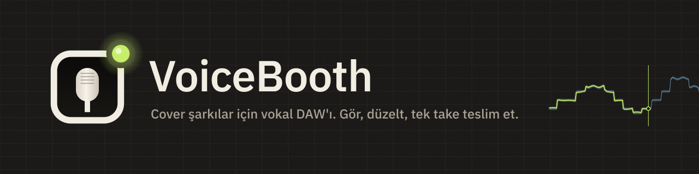

  

  <a href="README.md">日本語</a> ·
  <a href="README.en.md">English</a> ·
  <a href="README.ko.md">한국어</a> ·
  <a href="README.zh-Hans.md">简体中文</a> ·
  <a href="README.zh-Hant.md">繁體中文</a> ·
  <a href="README.es.md">Español</a> ·
  <a href="README.pt-BR.md">Português (Brasil)</a> ·
  <a href="README.id.md">Bahasa Indonesia</a> ·
  <a href="README.vi.md">Tiếng Việt</a> ·
  <b>Türkçe</b> ·
  <a href="README.de.md">Deutsch</a> ·
  <a href="README.fr.md">Français</a>

  
  
  
  

# VoiceBooth

**Yalnızca cover kaydı için yapılmış küçük bir vokal DAW'ı.**
Bir altyapı eşliğinde şarkı söyleyin, perdenizi ekranda görün, yalnızca düzeltmek istediğiniz yerleri yeniden kaydedin ve miks yapan kişinin doğrudan kendi DAW'ına bırakabileceği bir WAV dışa aktarın. Yaptığı bu kadar. Genel amaçlı bir DAW değildir.

## İndirme (ücretsiz)

  
  

| Bilgisayar | Dosya (kaydetmek için tıklayın) | Boyut |
|---|---|---|
| Windows 10 / 11 (64 bit) | [VoiceBooth-0.2.0-win-x64-setup.exe](https://github.com/kajisho5/voicebooth/releases/download/v0.2.0-beta.2/VoiceBooth-0.2.0-win-x64-setup.exe) | yaklaşık 13 MB |
| Mac (macOS 11 ve sonrası, Apple silicon / Intel) | [VoiceBooth-0.2.0-mac-universal.dmg](https://github.com/kajisho5/voicebooth/releases/download/v0.2.0-beta.2/VoiceBooth-0.2.0-mac-universal.dmg) | yaklaşık 40 MB |

Güncel sürüm **0.2.0 beta 2**. Değişiklikler ve eski sürümler [sürümler sayfasında](https://github.com/kajisho5/voicebooth/releases). Telefon veya tablet sürümü yoktur.

### İlk kez mi? Üç adım

1. **Dosyayı kaydetmek için yukarıdaki düğmeye tıklayın**, sonra kaydedilen dosyaya çift tıklayıp kurun
2. **Bir uyarı çıkarsa** (beta henüz kod imzalı değil, bu yüzden yalnızca ilk açılışta çıkar)
   - **Windows**: "Windows bilgisayarınızı korudu" görürseniz "Ek bilgi" → "Yine de çalıştır"a tıklayın
   - **Mac**: VoiceBooth'u DMG'den Uygulamalar klasörüne taşıyın ve bir kez açın → macOS açılamayacağını söylerse Sistem Ayarları → Gizlilik ve Güvenlik → Güvenlik bölümünde "Yine de Aç"a tıklayın (düğme, uygulamayı açmayı denedikten sonra yaklaşık bir saat görünür) → parolanızı girin ([Apple'ın açıklaması](https://support.apple.com/tr-tr/guide/mac-help/mh40616/mac))
3. **Uygulama açılınca** dili ve bir modu seçin. "Ayırma modelini indir" çıkınca İndir'e basın (yaklaşık 210 MB, yalnızca ilk sefer; rehberin perdesi ve armonisi ile yalnızca orijinalden başlamak için kullanılır)

> Bu ekran görüntüsü, örnek verilerden çizilmiş bir geliştirme maketidir. Gerçek şarkılarla görünüm hâlâ iyileştiriliyor ve farklı görünebilir.

> [!NOTE]
> **Bu bir beta sürümüdür.** Ana özellikler hazır, ancak henüz geliştiricinin kendi Windows PC'sinde ve Mac'inde denenmedi. Hataları veya anlaşılması zor her şeyi lütfen [Issues](https://github.com/kajisho5/voicebooth/issues) üzerinden bildirin.

## Önce bunu okuyun

| | |
|---|---|
| İşletim sistemi | **Hem Windows hem Mac** (Mac: Apple silicon ve Intel). **Telefon veya tablet sürümü yoktur** |
| Ekran kartı | **Gerekmez.** Yalnızca CPU ile çalışır. Tek ağır iş vokal ayırmadır: 30 saniyelik bir şarkı 4 çekirdekli bir CPU'da yaklaşık 2 dakika sürdü (uygulama tahmini süreyi gösterir) |
| Yüklenebilen ses | **Yalnızca bilgisayarınızdaki ses dosyaları** (wav / flac / aiff / ogg / mp3 / m4a). Spotify, Apple Music, YouTube Music veya diğer akış hizmetlerindeki şarkılar doğrudan yüklenemez |
| Boyut | Kurulum dosyası Windows'ta yaklaşık 13 MB, Mac'te yaklaşık 40 MB. Ayırma ve perde modelleri (yaklaşık 210 MB) yoksa uygulama açılışta sorar ve onları **yalnızca İndir'e bastığınızda** indirir (Sonra'yı da seçebilirsiniz). Model listesini kontrol etmek dışında arka planda gizlice hiçbir şey indirilmez |
| Ağır işlemler | Ayırma **yalnızca düğmeye bastığınızda** çalışır. Şarkı sözü gösterimi **varsayılan olarak kapalıdır** (Ayarlar'dan açın) |
| Armoniler | Armoni kanalları kaydedebilirsiniz. Referans ayrıldığında ana vokal ve armoniler ayrılır ve **bir armoni referansı (çizgi ve ses)** da gösterilir (armoni kanalları onunla karşılaştırılır). Orijinal − karaoke ile alınan referans da, ardından orijinalden ana vokal çıkarılarak ayrılır (biraz sürer) |
| Ayrılan ses | Ayrılan vokal ve eşlik **kişisel pratiğiniz içindir**. VoiceBooth orijinal şarkının haklarını değiştirmez. Yalnızca orijinal hak sahiplerinin izin verdiği ölçüde dağıtın veya yayınlayın (cover için altyapı olarak paylaşmak dahil) |
| Fiyat | **Ücretsiz.** Abonelik yok, uygulama içi satın alma yok. Geliştirmeyi [GitHub Sponsors](https://github.com/sponsors/kajisho5) üzerinden destekleyebilirsiniz (isteğe bağlı; hiçbir özelliği değiştirmez) |
| Diller | 日本語 / English / 한국어 / 简体中文 / 繁體中文 / Español / Português (Brasil) / Bahasa Indonesia / Tiếng Việt / Türkçe / Deutsch / Français |

## Neler yapar

| | Ayrıntılar |
|---|---|
| Şarkı açma | Yukarıdaki biçimler, sürükle bırak ile de. Şarkının başlangıcı Windows'ta ve Mac'te aynı hizalanır |
| Orijinal + karaoke | Orijinal şarkıyı (vokalli) referans olarak kullanıp karaoke / altyapı üzerinde söyleyin. Giriş uzunluğu gibi farklar otomatik hizalanır. Karaoke orijinalden çıkarılarak vokal elde edilir ve bu, referans perde çizgisi olur |
| Yalnızca orijinal | Orijinali ayırarak bir altyapı oluşturur ve referans çizgisini de gösterir (ayırma modeli gerekir) |
| Renkli perde | Perdeniz üstte bir çizgi olarak çizilir: doğruyken limon yeşili, kaydıkça kehribar ve sonra kırmızı. Bir oktav farklı söyleseniz bile ekranda hizalanabilir |
| Pratik | Tempo %50–150, ton ±6. Yavaş çalışabilirsiniz, ancak teslim edilecek take her zaman orijinal tempo ve tonda kaydedilir |
| Referansı dinleme | Orijinalden çıkarılan referans vokali altyapıyla birlikte veya tek başına dinleyin (pratik tempo/tonu uygulanır). Referans ayrıldığında ana vokal ve armoniler ayrı ayrı dinlenebilir |
| Ses aralığı ve önerilen ton | Ses aralığınızı (en pes ve en tiz notalar) mikrofonla ölçün ve referansın en pes ve en tiz notalarını sığdıran bir ton alın. Tek tıkla uygulanır; hiçbiri uymazsa kaç yarım ses taştığını söyler |
| Kayıt | Baştan sona kayıt, geriye dönük kayıt (REC'e geç basmak ilk kelimeyi asla kesmez), bir aralığı yeniden kayıt (her iki uçta 8 ms crossfade; Pro'da 0–20 ms), gecikme ölçümü ve telafisi |
| Klik ve ön sayım | Şarkının temposunda klik (1. vuruşta daha ince; çalışma temposunu da izler). REC'ten önce 1–2 ölçü sayar; bir aralığı yeniden kaydederken aralıktan önce sayar. Yalnızca kulaklıkta duyulur, kayda ve dışa aktarıma girmez |
| Main / Double / Armoni | Double'ları ve armonileri aynı uzunlukta kaydedin ve birlikte çalın |
| Take karşılaştırma | Take'leri en yeniden başlayarak listeler, her birini bir aralık (veya comp'un bir bölümü) için şarkının içinde yerinde dinletir ve seçtiğinizi kullanır (Standart ve üstü; Ctrl / ⌘+Z geri alır) |
| Giriş zamanlaması | Referansla karşılaştırıp girişinizin kaç ms erken veya geç olduğunu gösterir (Standart ve üstü). Pro ayrıca ne kadar süre doğru perdede olduğunuzu ve vibratoyu gösterir |
| Dışa aktarma | Şarkının başından itibaren tam uzunlukta WAV ve teslim paketi (kanal başına bir WAV, kontrol miksi, notlar, zip) |
| Şarkı sözü (varsayılan olarak kapalı) | .txt / .lrc yükleyin, dokunarak eşleyin |
| Temalar | Tüm uygulamanın renklerini değiştirin (10 yerleşik). `.vbskin` dosyası olarak paylaşın |

### Henüz yok

Bunlar henüz betada yok (ve uygulamada gösterilmez).

- Vokal dışındakileri ayırma (gitar, davul vb.)

### Miks yapan kişiye ne gider

Dosyalar, bir DAW'a yerleştirildikleri anda altyapıyla hizalı olacak şekilde yazılır (hedef ±1 ms).

- Şarkının en başından (0 sn) sonuna kadar tam uzunluk. Kaydetmediğiniz yerler sessizdir
- Şarkının kendi örnekleme hızında 24-bit mono WAV (asla habersizce 48 kHz'e dönüştürülmez)
- Normalize yok, otomatik fade yok. Monitör reverb'ü ve referans kanalları asla karıştırılmaz
- Pratik take'leri teslim klasörünün dışında tutulur

### Üç mod

Motor aynıdır; yalnızca gördükleriniz değişir. Bir modda yapılan proje diğer her modda açılır.

| Kolay | Standart | Pro |
|---|---|---|
| Main'i tek seferde kaydedip teslim edin | Double, bir armoni, punch-in, giriş zamanlaması, teslim paketi | İki armoni, doğru perde yüzdesi ve vibrato analizi, punch-in uçlarında crossfade uzunluğu |

| Kolay mod | Pro mod (armoni) |
|---|---|
|  |  |

## Logo ve tasarım

  <picture>
    <source media="(prefers-color-scheme: dark)" srcset="brand/out/logo/logo-mark-dark.png">
    
  </picture>
  <b>Simge: bir kabin penceresi, bir mikrofon kapsülü ve bir tally lambası.</b> 
  Kayıt kabininin penceresinden görünen bir mikrofon ve köşede yanan lamba. Tally varsayılan olarak limon yeşilidir; uygulamanın içinde yalnızca kayıt sırasında kırmızıya döner.

 

**Konsept, gece bir kayıt kabinidir.** Sıcak, koyu grafit; cihaz LED'leri ve bir tally lambasıyla aydınlanır. Durumlar renkli kenarlıklarla değil, yanan LED'lerle gösterilir ve ekran kayıt dışında asla kırmızıya dönmez.

| Renk | Kullanıldığı yer |
|---|---|
| Signal (limon yeşili) | Doğruyken perdeniz, çalma imleci, yanan LED'ler |
| Reference (buz mavisi) | Referansın tolerans bandı |
| Amber / Coral | Biraz kaymış / çok kaymış, uyarılar |
| Tally (kırmızı) | Yalnızca kayıt |

- **Yazı tipi**: IBM Plex Sans JP; zaman, dB ve diğer sayılar için IBM Plex Mono (sabit genişlik, rakamlar asla zıplamaz). Türkçe arayüz işletim sisteminin standart yazı tipiyle gösterilir (IBM Plex Sans JP'de ğ, ş, İ yok)
- **Kontroller**: LED'li tuş başlığı düğmeler, LED halkalı düğmeler, dikey konsol fader'ları, bölümlü LED ölçerler
- **Hareket**: basınca yaylanan tuşlar, 0 dB'de tırnaklı fader'lar, yalnızca kayıt sırasında kırmızı parlayan tally. Ses her zaman önce gelir ve işletim sisteminin "hareketi azalt" ayarına uyulur

**Temalar.** Tüm renkleri tek seferde değiştirin (yazı tipleri, yerleşim ve hareket aynı kalır). Aydınlık odalar için Studio Day / Sweet, okunabilirlik için High Contrast ve renk görme farklılıkları için Color Safe dahil 10 yerleşik tema vardır. Ayarlar → Tema → Yeni'de bir şablon seçin, renkleri tek tek veya grup halinde değiştirin (ya da başka bir şablondan bir grup alın) ve kaydedin. Okunması zor kombinasyonlar düzenlerken işaretlenir (kaydetme asla engellenmez). Temaları `.vbskin` dosyası olarak paylaşın.

| Uygulama simgesi | Marka kiti |
|---|---|
|  |  |

Logo kullanım kuralları (boşluk alanı, en küçük boyut, açık zemin sürümleri) ve tüm dosyalar [`brand/`](brand/README.md) içindedir (Japonca).

## Sistem gereksinimleri (geçici)

| | En az | Önerilen |
|---|---|---|
| Windows | Windows 10 64-bit (sürüm 1607 veya sonrası) | Windows 11 |
| Mac | macOS 11 Big Sur veya sonrası (Apple silicon ve Intel için universal derleme) | Apple silicon üzerinde en son macOS |
| CPU | 64-bit, 4 çekirdek | 6 çekirdek veya fazlası (Apple M1 veya sonrası, yeni bir Intel Core i5 / AMD Ryzen 5 sınıfı veya üstü) |
| Bellek | 8 GB | 16 GB |
| Boş disk alanı | 2 GB | 10 GB veya fazlası (SSD) |
| Ekran | 1280×800 | 1920×1080 veya daha büyük |
| Ses | Dahili giriş/çıkış çalışır | Bir ses arabirimi ve kablolu kulaklık (Windows'ta ASIO daha düşük gecikme sağlar) |
| İnternet | Yalnızca ayırma modelinin ilk indirilmesi için (ayırma dışındaki her şey çevrimdışı çalışır) | — |

- Tek ağır iş vokal ayırmadır. Eski CPU'larda ve Intel Mac'lerde daha uzun sürer (ölçülüp doğrulanacak)
- Bluetooth kulaklıkların gecikmesi kayıt için fazla yüksektir
- Windows on Arm test edilmedi
- Bu rakamlar geliştirme sırasındaki çalışma tahminleridir. Gerekçesi [`docs/DESIGN.md`](docs/DESIGN.md) bölüm 11.6.1'dedir (Japonca)

## Geliştirmeyi destekleyin

VoiceBooth ücretsizdir. Beğendiyseniz geliştirmeyi [GitHub Sponsors](https://github.com/sponsors/kajisho5) üzerinden destekleyebilirsiniz. Sponsorluk hiçbir özelliğin kilidini açmaz; herkes aynı uygulamayı alır.

  

## Lisans

Kaynak kodu **GNU Affero General Public License v3.0 veya sonrası (AGPL-3.0-or-later)** altında lisanslanmıştır ([`LICENSE`](LICENSE)). VoiceBooth, JUCE 8'i AGPLv3 altında kullandığı için uygulamanın tamamı AGPL'dir.

- Kullanmakta, değiştirmekte, paylaşmakta ve satmakta özgürsünüz. Dağıttığınızda (değiştirilmiş bir sürümü başkalarının ağ üzerinden kullanmasına izin vermek dahil) kaynak kodunu aynı lisansla yayınlayın
- **Ad ve logo**: ayrı bir ürün olarak dağıtılan değiştirilmiş bir sürüm için "VoiceBooth" adını veya logosunu kullanmayın (kendi adınızı ve logonuzu kullanın). Değiştirmeden yeniden dağıtmak ve tanıtımlarda veya incelemelerde kullanmak sorun değildir
- Kaydettiğiniz ve dışa aktardığınız ses sizindir. AGPL sizin eserinize uygulanmaz

| Dahil edilen / kullanılan | Lisans |
|---|---|
| JUCE 8 | AGPLv3 / ticari çift lisans (burada AGPLv3 altında kullanılır) |
| minimp3 (`third_party/minimp3`) | CC0 |
| IBM Plex Sans JP / IBM Plex Mono (`resources/fonts`) | SIL Open Font License 1.1 |
| ONNX Runtime 1.22.0 (yalnızca ayrı vokal ayırma sürecinde; resmî hazır paket derleme sırasında indirilir) | MIT |
| Monocypher 4.0.3 (model listesinin Ed25519 imzasını doğrular; derleme sırasında indirilir) | CC0 / BSD-2-Clause çift lisans |
| Rubber Band Library 4 (pratik tempo / ton; derleme sırasında indirilir) | GPL v2 veya sonrası / ticari çift lisans (burada GPL altında kullanılır) |
| Steinberg ASIO SDK 2.3.4 (yalnızca Windows derlemeleri; resmî paket derleme sırasında indirilir) | GPLv3 / ticari çift lisans (burada GPLv3 altında kullanılır). SDK'nın kendisi bu depoda tutulmaz. ASIO, Steinberg Media Technologies GmbH'nin ticari markasıdır |
| Modeller (uygulamadan ayrı, yalnızca düğmeye bastığınızda indirilir): ayırma BS-RoFormer ft1 ve ana vokal BS-RoFormer karaoke (ikisi de anvuew), perde RMVPE (RVC) | İki ayırma modeli GPL-3.0'dır (değiştirilmiş sürüm: ONNX parçalarına bölünüp int8'e nicelenmiştir; dönüştürme adımları ve özgün ağırlıklar tools/separation içinde); RMVPE MIT'dir. Yalnızca ağırlık lisansları kontrol edilmiş modeller dağıtılır |

## Katkıda bulunma

Derleme, testler ve proje yapısı [`docs/DEVELOPMENT.md`](docs/DEVELOPMENT.md) içinde, belirtim ise [`docs/DESIGN.md`](docs/DESIGN.md) içindedir (ikisi de Japonca).
