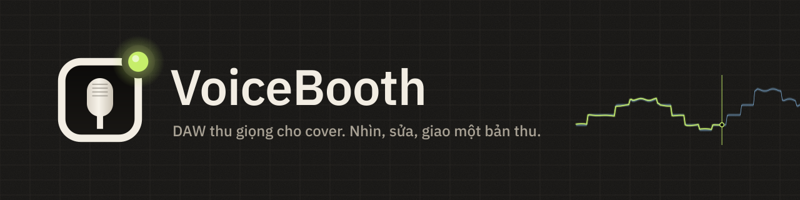
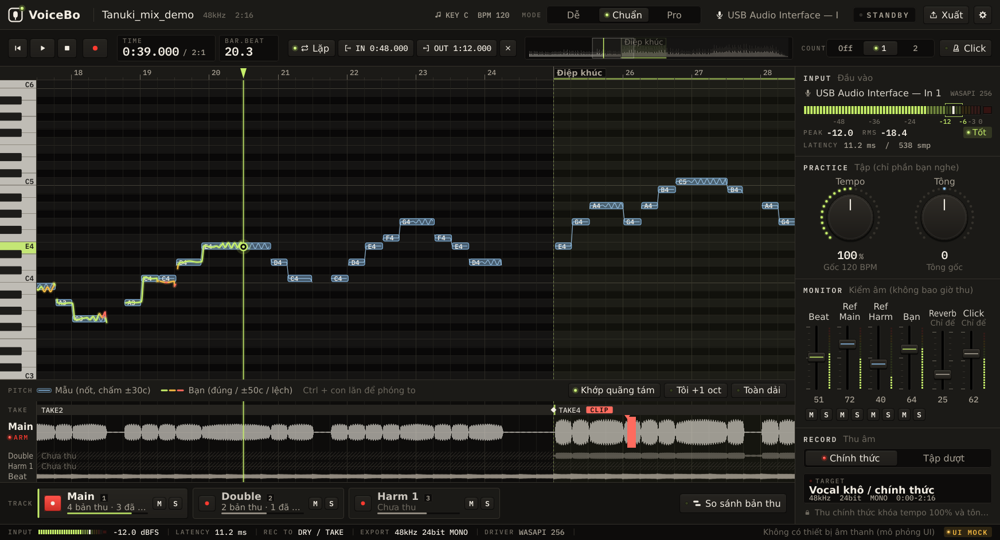

  

  <a href="README.md">日本語</a> ·
  <a href="README.en.md">English</a> ·
  <a href="README.ko.md">한국어</a> ·
  <a href="README.zh-Hans.md">简体中文</a> ·
  <a href="README.zh-Hant.md">繁體中文</a> ·
  <a href="README.es.md">Español</a> ·
  <a href="README.pt-BR.md">Português (Brasil)</a> ·
  <a href="README.id.md">Bahasa Indonesia</a> ·
  <b>Tiếng Việt</b> ·
  <a href="README.tr.md">Türkçe</a> ·
  <a href="README.de.md">Deutsch</a> ·
  <a href="README.fr.md">Français</a>

  
  
  
  

# VoiceBooth

**Một DAW thu giọng nhỏ gọn, chỉ dành cho việc thu cover.**
Hát theo beat, xem cao độ của bạn trên màn hình, chỉ thu lại những đoạn muốn sửa, rồi xuất file WAV mà người mix có thể thả thẳng vào DAW của họ. Nó chỉ làm đúng chừng đó. Đây không phải DAW đa năng.

## Tải về (miễn phí)

  
  

| Máy tính | Tệp (bấm để lưu) | Dung lượng |
|---|---|---|
| Windows 10 / 11 (64-bit) | [VoiceBooth-0.2.0-win-x64-setup.exe](https://github.com/kajisho5/voicebooth/releases/download/v0.2.0-beta.7/VoiceBooth-0.2.0-win-x64-setup.exe) | khoảng 13 MB |
| Mac (macOS 11 trở lên, Apple silicon / Intel) | [VoiceBooth-0.2.0-mac-universal.dmg](https://github.com/kajisho5/voicebooth/releases/download/v0.2.0-beta.7/VoiceBooth-0.2.0-mac-universal.dmg) | khoảng 40 MB |

Phiên bản hiện tại là **0.2.0 beta 7**. Thay đổi và các bản cũ có ở [trang phát hành](https://github.com/kajisho5/voicebooth/releases). Không có bản cho điện thoại hay máy tính bảng.

### Lần đầu dùng? Ba bước

1. **Bấm nút ở trên để lưu tệp**, rồi bấm đúp vào tệp đã lưu để cài
2. **Nếu thấy cảnh báo** (bản beta chưa được ký mã nên chỉ hiện ở lần mở đầu tiên)
   - **Windows**: nếu thấy "Windows đã bảo vệ PC của bạn", bấm "Thông tin thêm" → "Vẫn chạy"
   - **Mac**: chuyển VoiceBooth từ DMG vào thư mục Ứng dụng rồi mở một lần → nếu macOS báo không thể mở, vào Cài đặt hệ thống → Quyền riêng tư & Bảo mật → ở mục Bảo mật, bấm "Vẫn mở" (nút này hiện trong khoảng một giờ sau khi bạn thử mở ứng dụng) → nhập mật khẩu ([hướng dẫn của Apple](https://support.apple.com/vi-vn/guide/mac-help/mh40616/mac))
3. **Khi ứng dụng mở**, chọn ngôn ngữ và chế độ. Khi hiện "Tải mô hình tách giọng", hãy bấm Tải về (khoảng 210 MB, chỉ lần đầu; dùng cho cao độ và bè của bản mẫu và để bắt đầu chỉ với bản gốc)

> Ảnh chụp màn hình này là bản mô phỏng trong quá trình phát triển, vẽ từ dữ liệu mẫu. Phần hiển thị với bài hát thật vẫn đang được cải thiện và có thể trông khác đi.

> [!NOTE]
> **Đây là bản beta.** Các tính năng chính đã có, nhưng chưa được kiểm tra trên máy Windows và máy Mac của chính tác giả. Hãy báo lỗi, hoặc bất cứ điều gì khó hiểu, tại [Issues](https://github.com/kajisho5/voicebooth/issues).

## Đọc trước

| | |
|---|---|
| Hệ điều hành | **Cả Windows và Mac** (Mac: Apple silicon và Intel). **Không có bản cho điện thoại hay máy tính bảng** |
| Card đồ họa | **Không cần.** Chạy chỉ bằng CPU. Chỉ có tách giọng là nặng: mất khoảng 4 lần độ dài bài hát (đo trên CPU 4 nhân: khoảng 2 phút cho bài 30 giây, khoảng 15 phút cho bài 4 phút; CPU chậm hơn sẽ lâu hơn; ứng dụng hiển thị thời gian ước tính) |
| Âm thanh có thể mở | **Chỉ file âm thanh trên máy của bạn** (wav / flac / aiff / ogg / mp3 / m4a). Không thể mở trực tiếp bài hát từ Spotify, Apple Music, YouTube Music hay dịch vụ streaming khác |
| Dung lượng | Bộ cài khoảng 13 MB trên Windows và khoảng 40 MB trên Mac. Nếu chưa có mô hình tách giọng và cao độ (khoảng 210 MB), ứng dụng sẽ hỏi khi khởi động và chỉ tải về **khi bạn bấm Tải về** (cũng có thể chọn Để sau). Ngoài ra ứng dụng chỉ kết nối mạng để kiểm tra danh sách mô hình và phiên bản mới (tối đa mỗi ngày một lần; có thể tắt trong Cài đặt) |
| Xử lý nặng | Tách giọng chạy khi bạn thêm giọng mẫu hoặc chọn "Bắt đầu chỉ với bản gốc" (chạy nền; bạn vẫn phát và thu được). Khi giọng mẫu được lấy bằng phép trừ, tách giọng cũng chạy tiếp để chia giọng chính và bè. Chỉ mở ứng dụng thì không bao giờ bắt đầu. Hiển thị lời bài hát **tắt theo mặc định** (bật trong Cài đặt) |
| Bè | Bạn có thể thu các track bè. Khi tách giọng mẫu, giọng chính và bè được chia riêng và **giọng mẫu bè (đường và giọng)** cũng được hiển thị (track bè được so với nó). Giọng mẫu lấy bằng bản gốc − karaoke cũng được chia, bằng cách tách giọng chính từ bản gốc sau đó (mất một chút thời gian) |
| Âm thanh đã tách | Giọng hát và nhạc đệm đã tách là **để bạn tự luyện tập**. VoiceBooth không thay đổi quyền đối với bài hát gốc. Chỉ phân phối hoặc đăng tải (kể cả chia sẻ làm beat để cover) trong phạm vi chủ sở hữu quyền gốc cho phép |
| Giá | **Miễn phí.** Không thuê bao, không mua trong ứng dụng. Bạn có thể ủng hộ phát triển qua [GitHub Sponsors](https://github.com/sponsors/kajisho5) (tùy chọn; không thay đổi tính năng nào). Nếu bạn phân phối bản đã chỉnh sửa, bạn cũng phải công bố mã nguồn (xem "Giấy phép" bên dưới) |
| Ngôn ngữ | 日本語 / English / 한국어 / 简体中文 / 繁體中文 / Español / Português (Brasil) / Bahasa Indonesia / Tiếng Việt / Türkçe / Deutsch / Français |

## Ứng dụng làm được gì

| | Chi tiết |
|---|---|
| Mở bài hát | Các định dạng ở trên, cũng có thể kéo thả. Điểm bắt đầu bài hát giống nhau trên Windows và Mac |
| Bản gốc + karaoke | Dùng bài gốc (có giọng hát) làm mẫu và hát trên bản karaoke / beat. Những khác biệt như độ dài đoạn dạo đầu được căn tự động. Bản karaoke được trừ khỏi bản gốc để lấy ra giọng hát, dùng làm đường cao độ mẫu |
| Chỉ có bản gốc | Tách bản gốc để tạo beat, đồng thời hiển thị đường mẫu (cần mô hình tách giọng) |
| Cao độ có màu | Cao độ của bạn được vẽ thành một đường phía trên: xanh chanh khi đúng, chuyển sang hổ phách rồi đỏ khi lệch dần. Hát lệch một quãng tám vẫn có thể căn khớp trên màn hình |
| Luyện tập | Tempo 50–150 %, tông ±6. Tập chậm cũng được, nhưng bản thu để bàn giao luôn được thu ở tempo và tông gốc |
| Nghe giọng mẫu | Nghe giọng mẫu tách từ bản gốc, cùng với beat hoặc nghe riêng (áp dụng tempo/tông luyện tập). Khi tách giọng mẫu, có thể nghe riêng giọng chính và bè |
| Âm vực và tông gợi ý | Đo âm vực của bạn (nốt thấp nhất và cao nhất) bằng micro và nhận tông giúp nốt thấp nhất và cao nhất của bản mẫu nằm gọn trong đó. Một cú bấm là áp dụng; nếu không tông nào vừa, ứng dụng cho biết vượt bao nhiêu nửa cung |
| Thu âm | Thu một mạch, thu hồi tố (bấm REC muộn cũng không bao giờ mất chữ đầu), thu lại một vùng (crossfade 8 ms ở mỗi đầu; 0–20 ms ở Pro), đo và bù độ trễ |
| Click và đếm vào | Click theo nhịp bài hát (phách 1 cao hơn; theo cả tempo luyện tập). Đếm 1–2 ô nhịp trước khi REC; thu lại một đoạn thì đếm trước đoạn đó. Chỉ nghe trong tai nghe, không bao giờ vào bản thu hay bản xuất |
| Main / Double / Bè | Thu double và bè cùng độ dài rồi phát cùng nhau |
| So sánh bản thu | Liệt kê các bản thu từ mới nhất, nghe từng bản ngay tại chỗ trong bài cho một đoạn (hoặc một phân đoạn của comp) và dùng bản bạn chọn (Tiêu chuẩn trở lên; Ctrl / ⌘+Z để hoàn tác) |
| Thời điểm vào | So với bản mẫu, hiển thị bạn vào sớm hay trễ bao nhiêu ms (từ Chuẩn trở lên). Pro còn hiển thị tỷ lệ thời gian hát đúng cao độ và vibrato |
| Xuất | WAV đủ độ dài từ đầu bài, và gói bàn giao (mỗi track một WAV, bản mix để kiểm tra, ghi chú, zip) |
| Lời bài hát (tắt theo mặc định) | Mở .txt / .lrc, khớp thời gian bằng cách gõ |
| Giao diện | Đổi màu toàn bộ ứng dụng (10 giao diện có sẵn). Chia sẻ dưới dạng file `.vbskin` |

### Chưa có

Những tính năng sau chưa có trong bản beta (và không hiển thị trong ứng dụng).

- Tách những thứ khác ngoài giọng hát (guitar, trống, v.v.)

### Người mix sẽ nhận được gì

File được ghi sao cho khớp với beat ngay khi đặt vào DAW (mục tiêu ±1 ms).

- Đủ độ dài từ đầu bài (0 giây) đến cuối. Những đoạn bạn không thu là khoảng lặng
- WAV mono 24-bit với tần số lấy mẫu của chính bài hát (không bao giờ tự ý chuyển sang 48 kHz)
- Không chuẩn hóa, không fade tự động. Reverb kiểm âm và các track mẫu không bao giờ bị trộn vào
- Các bản thu luyện tập không nằm trong thư mục bàn giao

### Ba chế độ

Bộ máy là một; chỉ khác ở những gì bạn nhìn thấy. Dự án tạo ở chế độ này mở được ở mọi chế độ khác.

| Dễ | Chuẩn | Pro |
|---|---|---|
| Thu Main một lần rồi bàn giao | Double, một bè, punch-in, thời điểm vào, gói bàn giao | Hai bè, tỷ lệ đúng cao độ và phân tích vibrato, độ dài crossfade ở hai đầu punch-in |

| Chế độ Dễ | Chế độ Pro (bè) |
|---|---|
|  |  |

## Logo và thiết kế

  <picture>
    <source media="(prefers-color-scheme: dark)" srcset="brand/out/logo/logo-mark-dark.png">
    
  </picture>
  <b>Biểu tượng: ô cửa phòng thu, đầu micro và đèn tally.</b> 
  Chiếc micro nhìn qua ô cửa của phòng thu, với ngọn đèn sáng ở góc. Đèn tally màu xanh chanh theo mặc định; trong ứng dụng, nó chỉ chuyển đỏ khi đang thu.

 

**Ý tưởng là một phòng thu về đêm.** Màu than chì tối và ấm, được chiếu sáng bởi đèn LED của thiết bị và đèn tally. Trạng thái được thể hiện bằng LED sáng lên thay vì viền màu, và màn hình không bao giờ chuyển đỏ trừ khi đang thu.

| Màu | Dùng cho |
|---|---|
| Signal (xanh chanh) | Cao độ của bạn khi đúng, đầu phát, LED đang sáng |
| Reference (xanh băng) | Dải dung sai của mẫu |
| Amber / Coral | Hơi lệch / lệch nhiều, cảnh báo |
| Tally (đỏ) | Chỉ khi đang thu |

- **Kiểu chữ**: IBM Plex Sans JP, dùng IBM Plex Mono cho thời gian, dB và các con số khác (độ rộng cố định nên chữ số không nhảy). Tiếng Việt hiển thị bằng phông chữ chuẩn của hệ điều hành (IBM Plex Sans JP không có đủ dấu tiếng Việt)
- **Điều khiển**: nút kiểu phím bấm có LED, núm xoay có vòng LED, fader dọc kiểu bàn mixer, đồng hồ LED phân đoạn
- **Chuyển động**: phím nảy lên khi bấm, fader có nấc ở 0 dB, đèn tally phát sáng đỏ chỉ khi đang thu. Âm thanh luôn được ưu tiên, và thiết lập "giảm chuyển động" của hệ điều hành được tôn trọng

**Giao diện (skin).** Đổi toàn bộ màu cùng lúc (phông chữ, bố cục và chuyển động giữ nguyên). Có 10 giao diện có sẵn, trong đó có Studio Day / Sweet cho phòng sáng, High Contrast để dễ đọc và Color Safe cho người có khác biệt về thị giác màu. Trong Cài đặt → Giao diện → Tạo mới, chọn một mẫu rồi đổi từng màu hoặc từng nhóm (hoặc mượn một nhóm từ mẫu khác), rồi lưu. Những tổ hợp khó đọc được đánh dấu ngay khi bạn chỉnh (không bao giờ chặn việc lưu). Chia sẻ giao diện dưới dạng file `.vbskin`.

| Biểu tượng ứng dụng | Bộ nhận diện thương hiệu |
|---|---|
|  |  |

Quy tắc sử dụng logo (khoảng trống, kích thước tối thiểu, phiên bản cho nền sáng) và toàn bộ tài nguyên nằm trong [`brand/`](brand/README.md) (tiếng Nhật).

## Yêu cầu hệ thống (tạm thời)

| | Tối thiểu | Khuyến nghị |
|---|---|---|
| Windows | Windows 10 64-bit (phiên bản 1607 trở lên) | Windows 11 |
| Mac | macOS 11 Big Sur trở lên (bản universal cho Apple silicon và Intel) | macOS mới nhất trên Apple silicon |
| CPU | 64-bit, 4 nhân | 6 nhân trở lên (Apple M1 trở lên, Intel Core i5 / AMD Ryzen 5 đời mới hoặc cao hơn) |
| Bộ nhớ | 8 GB | 16 GB |
| Dung lượng trống | 2 GB | 10 GB trở lên (SSD) |
| Màn hình | 1280×800 | 1920×1080 trở lên |
| Âm thanh | Dùng được đầu vào/ra có sẵn | Sound card và tai nghe có dây (ASIO trên Windows cho độ trễ thấp hơn) |
| Internet | Chỉ để tải mô hình tách giọng lần đầu (mọi thứ trừ tách giọng đều chạy offline) | — |

- Chỉ có tách giọng là nặng. Trên CPU cũ và Mac Intel sẽ lâu hơn (sẽ đo và xác nhận)
- Tai nghe Bluetooth có độ trễ quá lớn để thu âm
- Chưa thử trên Windows on Arm
- Những con số này là ước tính trong quá trình phát triển. Lý do nằm ở mục 11.6.1 của [`docs/DESIGN.md`](docs/DESIGN.md) (tiếng Nhật)

## Ủng hộ phát triển

VoiceBooth miễn phí. Nếu bạn thích, có thể ủng hộ phát triển qua [GitHub Sponsors](https://github.com/sponsors/kajisho5). Ủng hộ không mở khóa tính năng nào; ai cũng nhận được cùng một ứng dụng.

  

## Giấy phép

Mã nguồn được cấp phép theo **GNU Affero General Public License v3.0 trở lên (AGPL-3.0-or-later)** ([`LICENSE`](LICENSE)). VoiceBooth dùng JUCE 8 theo AGPLv3, nên toàn bộ ứng dụng là AGPL.

- Bạn được tự do dùng, sửa đổi, chia sẻ và bán. Khi phân phối (kể cả để người khác dùng bản đã sửa qua mạng), hãy công bố mã nguồn theo cùng giấy phép
- **Tên và logo**: đừng dùng tên hay logo "VoiceBooth" cho bản đã sửa đổi được phân phối như một sản phẩm khác (hãy dùng tên và logo của riêng bạn). Phân phối lại nguyên bản, hoặc dùng chúng khi giới thiệu hay đánh giá, thì không sao
- Âm thanh bạn thu và xuất là của bạn. AGPL không áp dụng cho tác phẩm của bạn

| Đi kèm / sử dụng | Giấy phép |
|---|---|
| JUCE 8 | Kép AGPLv3 / thương mại (ở đây dùng theo AGPLv3) |
| minimp3 (`third_party/minimp3`) | CC0 |
| IBM Plex Sans JP / IBM Plex Mono (`resources/fonts`) | SIL Open Font License 1.1 |
| ONNX Runtime 1.22.0 (chỉ trong tiến trình tách giọng riêng; gói dựng sẵn chính thức được tải khi build) | MIT |
| Monocypher 4.0.3 (xác minh chữ ký Ed25519 của danh sách mô hình; tải khi build) | Kép CC0 / BSD-2-Clause |
| Rubber Band Library 4 (tempo / tông luyện tập; tải khi build) | Kép GPL v2 trở lên / thương mại (ở đây dùng theo GPL) |
| Steinberg ASIO SDK 2.3.4 (chỉ bản build Windows; gói chính thức được tải khi build) | Kép GPLv3 / thương mại (ở đây dùng theo GPLv3). Bản thân SDK không được lưu trong kho này. ASIO là nhãn hiệu của Steinberg Media Technologies GmbH |
| Mô hình (tách biệt khỏi ứng dụng, chỉ tải khi bạn bấm nút): tách giọng BS-RoFormer ft1 và giọng chính BS-RoFormer karaoke (đều của anvuew), cao độ RMVPE (RVC) | Hai mô hình tách giọng theo GPL-3.0 (bản đã sửa: chia thành các phần ONNX và lượng tử hóa int8; các bước chuyển đổi và trọng số gốc ở tools/separation); RMVPE theo MIT. Chỉ phân phối những mô hình đã kiểm tra giấy phép trọng số |

## Đóng góp

Cách build, kiểm thử và cấu trúc dự án có trong [`docs/DEVELOPMENT.md`](docs/DEVELOPMENT.md), còn đặc tả là [`docs/DESIGN.md`](docs/DESIGN.md) (cả hai bằng tiếng Nhật).
