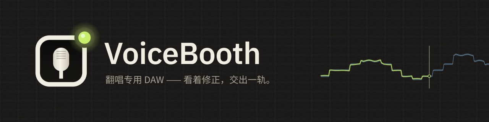
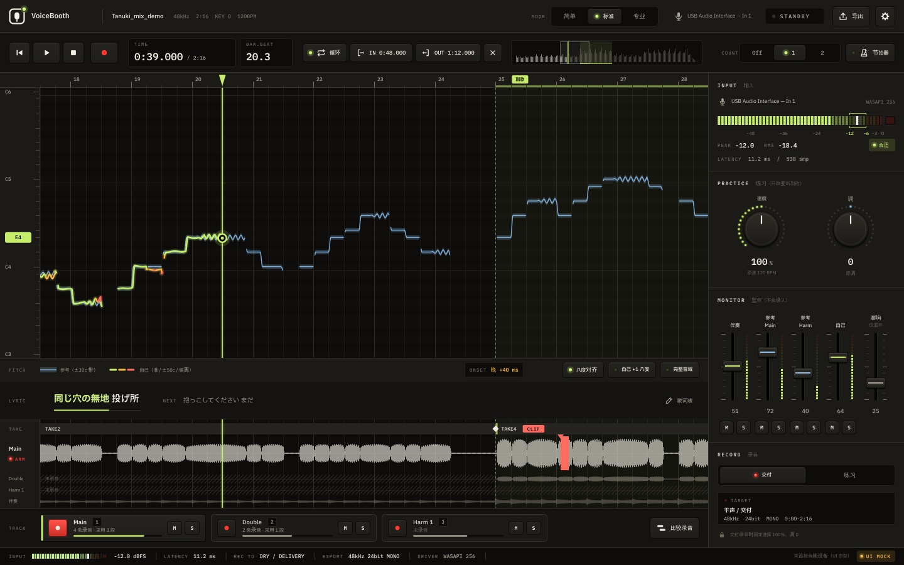

  

  <a href="README.md">日本語</a> ·
  <a href="README.en.md">English</a> ·
  <a href="README.ko.md">한국어</a> ·
  <b>简体中文</b> ·
  <a href="README.zh-Hant.md">繁體中文</a> ·
  <a href="README.es.md">Español</a> ·
  <a href="README.pt-BR.md">Português (Brasil)</a> ·
  <a href="README.id.md">Bahasa Indonesia</a> ·
  <a href="README.vi.md">Tiếng Việt</a> ·
  <a href="README.tr.md">Türkçe</a> ·
  <a href="README.de.md">Deutsch</a> ·
  <a href="README.fr.md">Français</a>

  
  
  

# VoiceBooth

**专为翻唱录音打造的小型人声 DAW。**
跟着伴奏唱，在屏幕上看着音高修正，只重录想改的部分，然后导出混音师可以直接使用的 WAV。只做这些事，不是万能 DAW。

## 下载（免费）

  
  

| 电脑 | 文件（点击保存） | 大小 |
|---|---|---|
| Windows 10 / 11（64 位） | [VoiceBooth-0.2.0-win-x64-setup.exe](https://github.com/kajisho5/voicebooth/releases/download/v0.2.0-beta.2/VoiceBooth-0.2.0-win-x64-setup.exe) | 约 13 MB |
| Mac（macOS 11 及以上，Apple 芯片 / Intel） | [VoiceBooth-0.2.0-mac-universal.dmg](https://github.com/kajisho5/voicebooth/releases/download/v0.2.0-beta.2/VoiceBooth-0.2.0-mac-universal.dmg) | 约 40 MB |

当前版本为 **0.2.0 beta 2**。更新内容和旧版本见[发布页面](https://github.com/kajisho5/voicebooth/releases)。没有手机、平板版本。

### 第一次使用（3 步）

1. **点击上面的按钮保存文件**，然后双击保存的文件进行安装
2. **如果出现警告**（测试版还没有代码签名，只在第一次打开时出现）
   - **Windows**：出现“Windows 已保护你的电脑”时，点击“更多信息”→“仍要运行”
   - **Mac**：把 DMG 里的 VoiceBooth 拖进“应用程序”文件夹并打开一次 → 如果提示无法打开，前往系统设置 →“隐私与安全性”→ 在“安全性”部分点击“仍要打开”（尝试打开后约 1 小时内才会出现）→ 输入密码（[Apple 的说明](https://support.apple.com/zh-cn/guide/mac-help/mh40616/mac)）
3. **启动后**选择语言和模式。接着出现「下载分离模型」时，请按［下载］（约 210 MB，仅第一次。用于示范音高、和声和只用原曲开始）

> 此截图是用示例数据绘制的开发中样稿。实际歌曲的显示仍在改进中，看起来可能有所不同。

> [!NOTE]
> **这是测试版（Beta）。** 主要功能已经齐全，但还没有在作者自己的 Windows / Mac 上确认过。遇到问题，或觉得“这里不好懂”，欢迎到 [Issues](https://github.com/kajisho5/voicebooth/issues) 反馈。

## 请先阅读

| | |
|---|---|
| 支持的系统 | **Windows 和 Mac 都支持**（Mac 同时支持 Apple 芯片 / Intel）。**没有手机、平板版本** |
| 显卡 | **不需要。** 只用 CPU 即可运行。只有人声分离比较吃资源，在 4 核 CPU 上处理一首 30 秒的歌约需 2 分钟（界面会显示预计时间） |
| 可导入的音源 | **仅限电脑上的音频文件**（wav / flac / aiff / ogg / mp3 / m4a）。无法直接从 Spotify、Apple Music、YouTube Music 等订阅服务导入 |
| 大小 | 安装包 Windows 约 13 MB，Mac 约 40 MB。若尚未安装分离与音高模型（约 210 MB），启动时会询问，**只有按下［下载］才会下载**（也可以选择「稍后」）。除了检查模型列表，不会擅自下载 |
| 耗资源的处理 | 分离**只在按下按钮时**运行。歌词显示**默认关闭**（可在设置中打开） |
| 和声 | 可以录制和声轨。分离参考时会把主唱与和声分开，并显示**和声参考（线和人声）**（选择和声轨时与和声线比较）。用“原曲 − 伴奏”取得的参考也会随后从原曲提取主唱并分开（需要一点时间） |
| 分离出的音频 | 分离出的人声和伴奏**仅供个人练习**。VoiceBooth 不会改变原曲的权利归属。分发、公开（包括作为翻唱伴奏分发）请只在原曲权利人允许的范围内进行 |
| 费用 | **免费。** 没有订阅，也没有内购。可通过 [GitHub Sponsors](https://github.com/sponsors/kajisho5) 支持开发（自愿，功能不会因此改变） |
| 语言 | 日本語 / English / 한국어 / 简体中文 / 繁體中文 / Español / Português (Brasil) / Bahasa Indonesia / Tiếng Việt / Türkçe / Deutsch / Français |

## 功能

| | 说明 |
|---|---|
| 打开歌曲 | 上述格式，也可拖放打开。歌曲开头的位置在 Windows 和 Mac 上一致 |
| 原曲＋伴奏 | 以带人声的原曲作为参考，在伴奏（卡拉 OK）上演唱。前奏长度等差异会自动对齐时间。从原曲中减去伴奏提取人声，生成参考音高线 |
| 只有原曲 | 分离原曲生成伴奏，同时显示参考线（需要分离模型） |
| 用颜色看音高 | 你的音高以线条叠加显示，唱准时为青柠色，偏离时变为琥珀色→红色。即使差一个八度演唱，也能对齐显示 |
| 练习 | 速度 50～150 %，调 ±6。可以放慢练习，但交付录音始终以原速、原调录制 |
| 听范唱 | 可与伴奏一起或单独收听从原曲提取的范唱人声（练习用的速度、调也会生效）。分离时主唱与和声可分别收听 |
| 音域与推荐调 | 用麦克风测出音域（最低音、最高音）后，给出能容纳范唱最低音和最高音的调，一键应用；无法容纳时会显示上下各超出几个半音 |
| 录音 | 整首录音、回溯录音（晚按 REC 开头也不会被截掉）、分段重录（衔接处 8 ms 交叉淡化，专业模式下可设 0～20 ms）、延迟测量与补偿 |
| 节拍器・预备拍 | 按歌曲的速度打拍（第 1 拍音较高，也跟随练习速度）。按 REC 前先数 1～2 小节，重录区间时在区间前数拍。只在耳机里响，不会进入录音或导出 |
| Main / Double / Harmony | 以相同长度录制叠唱与和声，并一起播放 |
| 比较录音 | 按从新到旧列出录音（Take），替换到范围（或一个采用区段）里在歌曲中试听比较，并采用选中的录音（标准以上。可用 Ctrl / ⌘+Z 撤销） |
| 进入时机 | 与参考对比，显示进入早了或晚了多少 ms（标准及以上）。专业模式还会显示音准比例和颤音 |
| 导出 | 从歌曲开头开始的完整长度 WAV、交付包（每轨 WAV、确认用混音、备注、zip） |
| 歌词（默认关闭） | 读取 .txt / .lrc、点按对齐 |
| 皮肤 | 一次更换全部配色（内置 10 种）。可用 `.vbskin` 文件与他人分享 |

### 暂不支持

当前测试版还没有以下功能（界面上也不会显示）。

- 分离人声以外的声部（吉他、鼓等）

### 交付文件的约定

导出的文件放进 DAW 的那一刻，就与伴奏的开头对齐（目标 ±1 ms）。

- 从歌曲开头（0 秒）到结尾的完整长度，没有录音的部分为静音
- 24bit 单声道 WAV，采样率与原曲相同（不会擅自改为 48 kHz）
- 不做标准化，不加自动淡入淡出；监听用的混响和参考人声不会混入
- 练习录音不会放进交付文件夹

### 三种模式

引擎相同，只是显示的内容不同。在任何模式下创建的项目都能在其他模式中打开。

| 简单 | 标准 | 专业 |
|---|---|---|
| 整首录 Main 后直接交付 | 叠唱、一条和声、分段重录、比较录音、进入时机、交付包 | 两条和声、音准比例与颤音分析、衔接处交叉淡化的长度 |

| 简单模式 | 专业模式（和声） |
|---|---|
|  |  |

## 标志与设计

  <picture>
    <source media="(prefers-color-scheme: dark)" srcset="brand/out/logo/logo-mark-dark.png">
    
  </picture>
  <b>标志：录音棚的窗户、麦克风振膜、指示灯。</b> 
  隔着录音棚的窗户可以看到麦克风，右上角的指示灯亮着。指示灯平时是青柠色，在应用里只有录音时才会变红。

 

**概念是“夜晚的录音棚”。** 带暖意的深色石墨底色上，亮着设备的 LED 和指示灯。状态用 LED 的亮灭而不是边框颜色来表示；除录音时以外，画面不会变红。

| 颜色 | 用途 |
|---|---|
| Signal（青柠） | 唱准时的音高线、播放头、点亮的 LED |
| Reference（冰蓝） | 参考的容差带 |
| Amber / Coral | 稍有偏离 / 偏离较大、警告 |
| Tally（红） | 仅限录音时 |

- **字体**：IBM Plex Sans JP；时间、dB 等数字使用 IBM Plex Mono（等宽，数字不会跳动）。中文使用系统字体显示
- **控件**：带 LED 的键帽按钮、LED 环旋钮、竖向调音台推子、分段 LED 电平表
- **动效**：像弹簧一样按下的按键、在 0 dB 有手感的推子、只在录音时亮红的指示灯。始终以声音为先，并遵循系统的“减少动态效果”设置

**皮肤。** 可以一次更换全部配色（字体、布局和动效不变）。内置 10 种，包括适合明亮房间的 Studio Day / Sweet、清晰优先的 High Contrast，以及照顾色觉差异的 Color Safe。在设置的“皮肤”→“新建”中选择模板，逐色或按组修改（也可以从其他模板借用一组颜色）后保存。难以辨认的组合会在编辑时提示（不会阻止保存）。可用 `.vbskin` 文件与他人分享。

| 应用图标 | 品牌套件 |
|---|---|
|  |  |

标志的使用规范（留白、最小尺寸、浅色背景版本）和全部素材见 [`brand/`](brand/README.md)（日语）。

## 系统要求（暂定）

| | 最低 | 推荐 |
|---|---|---|
| Windows | Windows 10 64 位（1607 版本及以上） | Windows 11 |
| Mac | macOS 11 Big Sur 及以上（同时支持 Apple 芯片与 Intel 的通用版） | 最新 macOS、Apple 芯片 |
| CPU | 64 位、4 核 | 6 核及以上（Apple M1 及以上、近几年的 Intel Core i5 / AMD Ryzen 5 级别及以上） |
| 内存 | 8 GB | 16 GB |
| 可用空间 | 2 GB | 10 GB 以上（SSD） |
| 屏幕 | 1280×800 | 1920×1080 及以上 |
| 音频 | 内置输入输出也可运行 | 声卡（音频接口）＋有线耳机（Windows 支持 ASIO 时延迟更低） |
| 网络 | 首次下载分离模型时，以及检查新版本时（每天最多查看一次 GitHub 发布页，不发送其他任何信息；可在设置中关闭）。无网络时除分离外都能使用 | — |

- 只有人声分离比较吃资源。在较旧的 CPU 或 Intel Mac 上分离需要更多时间（将实测后确定）
- 蓝牙耳机延迟较大，不适合录音
- 尚未在 Arm 版 Windows 上测试
- 数值为开发阶段的参考。依据见 [`docs/DESIGN.md`](docs/DESIGN.md) 11.6.1（日语）

## 支持开发

VoiceBooth 是免费的。如果你喜欢，可以通过 [GitHub Sponsors](https://github.com/sponsors/kajisho5) 支持开发。是否赞助不会影响可用的功能。

## 许可证

源代码采用 **GNU Affero General Public License v3.0 或更高版本（AGPL-3.0-or-later）**（[`LICENSE`](LICENSE)）。由于以 AGPLv3 使用 JUCE 8，整个应用采用 AGPL。

- 可以自由使用、修改、分发和出售。分发时（包括通过网络让他人使用修改版），请以相同许可证公开源代码
- **名称与标志**：以修改版作为另一款产品分发时，请不要使用“VoiceBooth”的名称和标志（请换成别的名称和标志）。原样再分发，或在介绍、评测中使用都没有问题
- 你录制和导出的音频文件归你所有，AGPL 不适用于你的作品

| 包含 / 使用的组件 | 许可证 |
|---|---|
| JUCE 8 | AGPLv3 / 商业双许可（此处使用 AGPLv3） |
| minimp3（`third_party/minimp3`） | CC0 |
| IBM Plex Sans JP / IBM Plex Mono（`resources/fonts`） | SIL Open Font License 1.1 |
| ONNX Runtime 1.22.0（仅用于独立的人声分离进程。构建时获取官方预编译包） | MIT |
| Monocypher 4.0.3（校验模型清单的 Ed25519 签名。构建时获取） | CC0 / BSD-2-Clause 双许可 |
| Rubber Band Library 4（练习用速度 / 调。构建时获取） | GPL v2 及以上 / 商业双许可（此处使用 GPL） |
| Steinberg ASIO SDK 2.3.4（仅 Windows 构建。构建时获取官方发布包） | GPLv3 / 商业双许可（此处使用 GPLv3）。SDK 本身不放进本仓库。ASIO 是 Steinberg Media Technologies GmbH 的商标 |
| 模型（与应用分开，只在按下按钮时下载）：分离 BS-RoFormer ft1、主唱 BS-RoFormer karaoke（均为 anvuew）、音高 RMVPE（RVC） | 两个分离模型为 GPL-3.0（拆分为 ONNX 并量化为 int8 的修改版，转换步骤和原始权重见 tools/separation），RMVPE 为 MIT。只分发已确认权重许可证的模型 |

## 参与开发

构建、测试和项目结构见 [`docs/DEVELOPMENT.md`](docs/DEVELOPMENT.md)，规格见 [`docs/DESIGN.md`](docs/DESIGN.md)（均为日语）。
