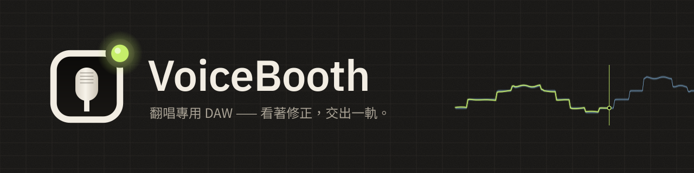
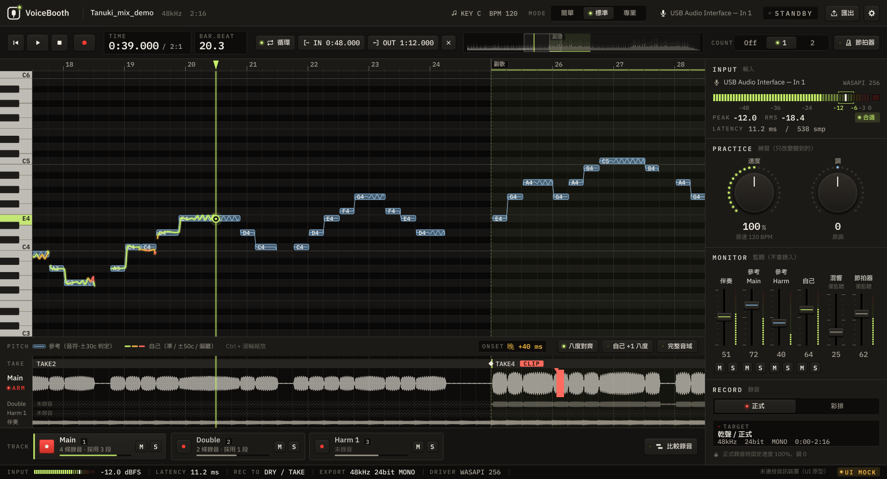

  

  <a href="README.md">日本語</a> ·
  <a href="README.en.md">English</a> ·
  <a href="README.ko.md">한국어</a> ·
  <a href="README.zh-Hans.md">简体中文</a> ·
  <b>繁體中文</b>

  
  
  

# VoiceBooth

**專為翻唱錄音打造的小型人聲 DAW。**
跟著伴奏唱，在螢幕上看著音高修正，只重錄想改的部分，再匯出混音師可以直接使用的 WAV。只做這些事，不是萬能 DAW。

> [!NOTE]
> **這是測試版（Beta）。** 主要功能已經齊全，但還沒有在作者自己的 Windows / Mac 上確認過。遇到問題，或覺得「這裡不好懂」，歡迎到 [Issues](https://github.com/kajisho5/voicebooth/issues) 回報。

## 請先閱讀

| | |
|---|---|
| 支援的系統 | **Windows 和 Mac 都支援**（Mac 同時支援 Apple 晶片 / Intel）。**沒有手機、平板版本** |
| 顯示卡 | **不需要。** 只用 CPU 就能執行。只有人聲分離比較吃資源，在 4 核心 CPU 上處理一首 30 秒的歌約需 2 分鐘（畫面會顯示預估時間） |
| 可匯入的音源 | **僅限電腦上的音訊檔案**（wav / flac / aiff / ogg / mp3 / m4a）。無法直接從 Spotify、Apple Music、YouTube Music 等訂閱服務匯入 |
| 大小 | 安裝檔 Windows 約 13 MB，Mac 約 42 MB。分離模型（約 223 MB）和歌詞模型（約 465 MB）**只在使用時按下按鈕才會下載**，不會擅自下載 |
| 吃資源的處理 | 分離和歌詞自動對齊**只在按下按鈕時**執行。歌詞顯示**預設關閉**（可在設定中開啟） |
| 和聲 | 可以錄製和聲軌。**沒有從混音中單獨擷取和聲作為參考的功能**（分離只分為「全部人聲」和「伴奏」兩部分） |
| 分離出的音訊 | 分離出的人聲和伴奏**僅供個人練習**。VoiceBooth 不會改變原曲的權利歸屬。散布、公開（包括作為翻唱伴奏散布）請只在原曲權利人允許的範圍內進行 |
| 費用 | **免費。** 沒有訂閱，也沒有內購。可透過 [GitHub Sponsors](https://github.com/sponsors/kajisho5) 支持開發（自由選擇，功能不會因此改變） |
| 語言 | 日本語 / English / 한국어 / 简体中文 / 繁體中文 |

## 功能

| | 說明 |
|---|---|
| 開啟歌曲 | 上述格式，也可拖放開啟。歌曲開頭的位置在 Windows 和 Mac 上一致 |
| 原曲＋伴奏 | 以帶人聲的原曲作為參考，在伴奏（卡拉 OK）上演唱。前奏長度等差異會自動對齊時間。從原曲中減去伴奏擷取人聲，產生參考音高線 |
| 只有原曲 | 分離原曲產生伴奏，同時顯示參考線（需要分離模型） |
| 用顏色看音高 | 你的音高以線條疊加顯示，唱準時為萊姆綠，偏離時變為琥珀色→紅色。即使差一個八度演唱，也能對齊顯示 |
| 練習 | 速度 50～150 %，調 ±6。可以放慢練習，但交付錄音一律以原速、原調錄製 |
| 錄音 | 整首錄音、回溯錄音（晚按 REC 開頭也不會被切掉）、分段重錄（銜接處 8 ms 交叉淡化，專業模式下可設 0～20 ms）、延遲測量與補償 |
| Main / Double / Harmony | 以相同長度錄製疊唱與和聲，並一起播放 |
| 進入時機 | 與參考比較，顯示進入早了或晚了多少 ms（標準以上）。專業模式還會顯示音準比例和顫音 |
| 匯出 | 從歌曲開頭開始的完整長度 WAV、交付包（每軌 WAV、確認用混音、備註、zip） |
| 歌詞（預設關閉） | 讀取 .txt / .lrc、點按對齊、根據參考人聲自動對齊（需要歌詞模型） |
| 外觀 | 一次更換全部配色（內建 10 種）。可用 `.vbskin` 檔案與他人分享 |

### 尚未支援

目前的測試版還沒有以下功能（畫面上也不會顯示）。

- 單獨試聽參考人聲或伴奏（目前只能播放自己錄製的音軌和伴奏）
- 和聲的參考線（即使選擇和聲軌，也會顯示主旋律的參考線）
- **建議適合自己音域的調**（測量音域，找出能容納歌曲最高音和最低音的調。預計在下一個版本加入）
- 節拍器和預備拍的聲音、試聽比較各次錄音（Take）、分離人聲以外的聲部（吉他、鼓等）

> [!IMPORTANT]
> 分離和歌詞自動對齊的模型**正在準備散布**（等待簽章的模型清單公開）。在此之前，仍可以用原曲＋伴奏的組合顯示參考線、錄音和匯出。

### 交付檔案的約定

匯出的檔案放進 DAW 的那一刻，就與伴奏的開頭對齊（目標 ±1 ms）。

- 從歌曲開頭（0 秒）到結尾的完整長度，沒有錄音的部分為靜音
- 24bit 單聲道 WAV，取樣率與原曲相同（不會擅自改為 48 kHz）
- 不做正規化，不加自動淡入淡出；監聽用的殘響和參考人聲不會混入
- 練習錄音不會放進交付資料夾

### 三種模式

引擎相同，只是顯示的內容不同。在任何模式下建立的專案都能在其他模式中開啟。

| 簡單 | 標準 | 專業 |
|---|---|---|
| 整首錄 Main 後直接交付 | 疊唱、一條和聲、分段重錄、進入時機、交付包 | 兩條和聲、音準比例與顫音分析、銜接處交叉淡化的長度 |

| 簡單模式 | 專業模式（和聲） |
|---|---|
|  |  |

## 標誌與設計

  <picture>
    <source media="(prefers-color-scheme: dark)" srcset="brand/out/logo/logo-mark-dark.png">
    
  </picture>
  <b>標誌：錄音室的窗戶、麥克風振膜、指示燈。</b> 
  隔著錄音室的窗戶可以看到麥克風，右上角的指示燈亮著。指示燈平時是萊姆綠，在應用程式裡只有錄音時才會變紅。

 

**概念是「夜晚的錄音室」。** 帶暖意的深色石墨底色上，亮著設備的 LED 和指示燈。狀態用 LED 的亮滅而不是邊框顏色來表示；除了錄音時以外，畫面不會變紅。

| 顏色 | 用途 |
|---|---|
| Signal（萊姆綠） | 唱準時的音高線、播放頭、點亮的 LED |
| Reference（冰藍） | 參考的容許帶 |
| Amber / Coral | 稍有偏離 / 偏離較大、警告 |
| Tally（紅） | 僅限錄音時 |

- **字型**：IBM Plex Sans JP；時間、dB 等數字使用 IBM Plex Mono（等寬，數字不會跳動）。中文使用系統字型顯示
- **元件**：附 LED 的鍵帽按鈕、LED 環旋鈕、直立式混音台推桿、分段 LED 音量表
- **動態**：像彈簧一樣按下的按鍵、在 0 dB 有手感的推桿、只在錄音時亮紅的指示燈。始終以聲音為優先，並遵循系統的「減少動態效果」設定

**外觀。** 可以一次更換全部配色（字型、版面和動態不變）。內建 10 種，包括適合明亮房間的 Studio Day / Sweet、清晰優先的 High Contrast，以及照顧色覺差異的 Color Safe。在設定的「外觀」→「新增」中選擇範本，逐色或按組修改（也可以從其他範本借用一組顏色）後儲存。難以辨認的組合會在編輯時提示（不會阻止儲存）。可用 `.vbskin` 檔案與他人分享。

| 應用程式圖示 | 品牌套件 |
|---|---|
|  |  |

標誌的使用規範（留白、最小尺寸、淺色背景版本）和全部素材見 [`brand/`](brand/README.md)（日文）。

## 系統需求（暫定）

| | 最低 | 建議 |
|---|---|---|
| Windows | Windows 10 64 位元（1607 版以上） | Windows 11 |
| Mac | macOS 11 Big Sur 以上（同時支援 Apple 晶片與 Intel 的通用版） | 最新 macOS、Apple 晶片 |
| CPU | 64 位元、4 核心 | 6 核心以上（Apple M1 以上、近幾年的 Intel Core i5 / AMD Ryzen 5 等級以上） |
| 記憶體 | 8 GB | 16 GB |
| 可用空間 | 2 GB | 10 GB 以上（SSD） |
| 螢幕 | 1280×800 | 1440×900 以上 |
| 音訊 | 內建輸入輸出也能運作 | 錄音介面＋有線耳機（Windows 支援 ASIO 時延遲較低） |
| 網路 | 只有第一次下載分離模型時需要（沒有網路時，除了分離以外都能使用） | — |

- 只有人聲分離比較吃資源。在較舊的 CPU 或 Intel Mac 上分離需要更多時間（將實測後確定）
- 藍牙耳機延遲較大，不適合錄音
- 尚未在 Arm 版 Windows 上測試
- 數值為開發階段的參考。依據見 [`docs/DESIGN.md`](docs/DESIGN.md) 11.6.1（日文）

## 下載

請從 [Releases](https://github.com/kajisho5/voicebooth/releases) 下載：Windows 用 `VoiceBooth-<版本>-win-x64-setup.exe`，Mac 用 `VoiceBooth-<版本>-mac-universal.dmg`。

測試版還**沒有進行程式碼簽章**，因此第一次開啟時系統會顯示警告。

- **Windows**：出現「Windows 已保護您的電腦」時，點選「其他資訊」→「仍要執行」
- **Mac**：把 DMG 裡的 VoiceBooth 拖進「應用程式」檔案夾並開啟一次 → 如果提示無法打開，前往系統設定 →「隱私權與安全性」→ 在「安全性」部分點選「強制打開」（嘗試開啟後約 1 小時內才會出現）→ 輸入密碼（[Apple 的說明](https://support.apple.com/zh-tw/guide/mac-help/mh40616/mac)）

## 支持開發

VoiceBooth 是免費的。如果你喜歡，可以透過 [GitHub Sponsors](https://github.com/sponsors/kajisho5) 支持開發。是否贊助不會影響可用的功能。

## 授權

原始碼採用 **GNU Affero General Public License v3.0 或更新版本（AGPL-3.0-or-later）**（[`LICENSE`](LICENSE)）。由於以 AGPLv3 使用 JUCE 8，整個應用程式採用 AGPL。

- 可以自由使用、修改、散布和販售。散布時（包括透過網路讓他人使用修改版），請以相同授權公開原始碼
- **名稱與標誌**：以修改版作為另一款產品散布時，請不要使用「VoiceBooth」的名稱和標誌（請換成別的名稱和標誌）。原樣再散布，或在介紹、評測中使用都沒有問題
- 你錄製和匯出的音訊檔案屬於你，AGPL 不適用於你的作品

| 包含 / 使用的元件 | 授權 |
|---|---|
| JUCE 8 | AGPLv3 / 商業雙授權（此處使用 AGPLv3） |
| minimp3（`third_party/minimp3`） | CC0 |
| IBM Plex Sans JP / IBM Plex Mono（`resources/fonts`） | SIL Open Font License 1.1 |
| ONNX Runtime 1.22.0（僅用於獨立的人聲分離程序。建置時取得官方預編譯包） | MIT |
| Monocypher 4.0.3（驗證模型清單的 Ed25519 簽章。建置時取得） | CC0 / BSD-2-Clause 雙授權 |
| whisper.cpp v1.9.4（僅用於獨立的歌詞自動對齊程序。建置時取得） | MIT |
| Rubber Band Library 4（練習用速度 / 調。建置時取得） | GPL v2 以上 / 商業雙授權（此處使用 GPL） |
| Steinberg ASIO SDK 2.3.4（僅 Windows 建置。建置時取得官方發佈包） | GPLv3 / 商業雙授權（此處使用 GPLv3）。SDK 本身不放進本儲存庫。ASIO 是 Steinberg Media Technologies GmbH 的商標 |
| 模型（與應用程式分開，只在按下按鈕時下載）：分離 Mel-Band RoFormer（Kimberley Jensen）、歌詞 Whisper small（OpenAI） | 皆為 MIT。只散布已確認權重授權的模型 |

## 參與開發

建置、測試和專案結構見 [`docs/DEVELOPMENT.md`](docs/DEVELOPMENT.md)，規格見 [`docs/DESIGN.md`](docs/DESIGN.md)（皆為日文）。
