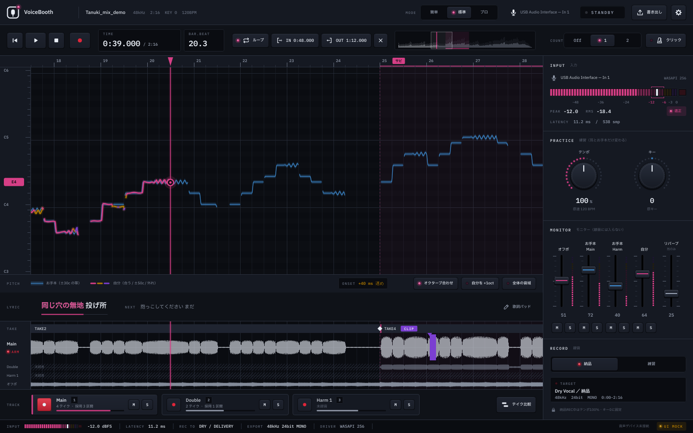
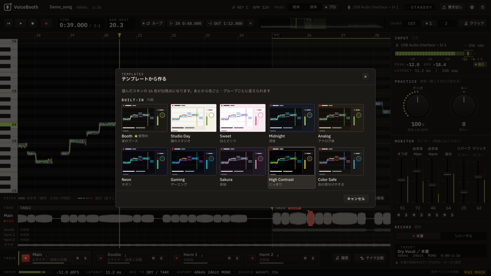
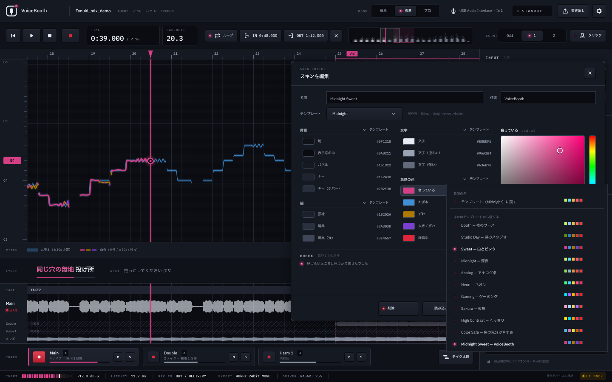

# 歌ってみた専用DAW — 設計書兼 Claude Code 指示書

バージョン: draft-2026-09-30  
対象読者: Claude Code（実装担当）および設計レビュー  
原則: **先に見た目（静的DAW画面）を完成させ、その後に結線する。勝手にフルDAW化しない。**

---

## 0. Claude への最優先指示

1. このファイルを唯一の仕様とする。矛盾する「便利そうな追加」はするな。
2. 最初のマイルストーンは **見た目だけ動くメイン画面モック**。音声エンジン・分離・録音はまだ接続しない。
3. モックが承認されるまで、JUCEのオーディオコールバックやモデル推論を書き始めるな。
4. Win / macOS 両対応。OS差分は音声I/Oと署名だけに閉じ込める。
5. ほかのソフトのソースをコピーするな。機能は自分で設計して作る。
6. 実装言語・フレームワークは「11. 技術選定」に従う。勝手に Electron 全振りや Python GUI 本体にしない。
7. コミット単位は「画面パーツ → 画面統合 → 結線1本」を守る。

推奨リポジトリ構成（見た目フェーズ）:

```text
docs/DESIGN.md          … 本ファイル
docs/UI_STATES.md       … 画面状態一覧（モック後に追記してよい）
app/                    … 本体
  ui/                   … 見た目専用。ダミーデータで描画
  audio/                … 空のインターフェースのみ（結線フェーズまで中身スタブ）
  project/              … データモデル（JSONの形だけ先に置く）
  export/               … スタブ
```

作業順は **16. 実装フェーズ** を絶対順守。

---

## 1. プロダクト定義

### 1.1 一言

見て直しながら歌い、区間を録り直し、タイムコードの合った Dry WAV を渡す。  
歌ってみた専用の超小型ボーカルDAW。万能DAWではない。

### 1.2 キャッチ（仮）

見て直して、一本渡す。

### 1.3 名称

**正式名称: VoiceBooth**（2026-10-01 決定。旧コードネーム案 TakeBooth は廃止）

- 表記: 画面・ドキュメントは `VoiceBooth`、識別子・ファイル名は小文字 `voicebooth`
- 肩書き: 歌ってみた専用DAW
- 使わない: 既存のソフトと紛らわしい名前

ウィンドウタイトル: `VoiceBooth — {曲名}`  
書き出し接頭辞: `voicebooth_`

### 1.4 誰向け

- オフボーカルに合わせて歌ってみたを録り、ミックス担当へ渡す人
- 音程を画面で見ながら直したい人
- 本格的な DAW を開きたくないが、渡すファイルは DAW に載せたい人
- Windows または Mac、オーディオインターフェース利用を想定（オンボードマイクも動く）

### 1.5 やること

- 曲（オフボ or ミックス音源）読み込み
- 任意の音源分離キャッシュ（Off / Main / Harmony）
- リアルタイムピッチ（お手本と自分）
- 合っているかの色表示
- 波形表示
- テンポ変更・キー変更（練習用）
- 範囲リピート
- マイクレベル調整
- レイテンシ校正
- 同じ画面で録音
- 遡及録音（再生開始から裏録り。REC押し遅れで頭が欠けない）
- 区間パンチイン
- フル尺1ファイル書き出し（常に曲頭からのタイムコード）
- Main / Double / Harmony
- 簡単・標準・プロ
- 納品パック
- Win + Mac

### 1.6 やらない（v1）

- 本格 EQ / コンプ / オートメーション
- 自動ハモリ音声の完成生成（ガイド線は可、生成音声は不可）
- 動画編集・テロップ
- 無限VSTホスト（将来枠は残すが v1 は禁止）
- MIDI ピアノロール / 内蔵シンセ（v1禁止）
- SNS投稿
- クラウド必須アカウント
- リアルタイム音源分離

### 1.7 位置づけ

録音に特化した軽い DAW としての基本（オフボを置いて歌う、パンチイン、ループ、遡及録音、キー変更、歌詞、モニターリバーブ、プロジェクト 1 フォルダ、WAV 書き出し）を押さえ、
その上に、お手本の音程を重ねて見る・音程をその場で判定する・音源分離・遅くして練習して原速の Dry を出す・納品パック、を載せる。
大きな DAW の小型版は作らない。

---

## 2. モード

エンジンは共通。見えるものと触れるものだけ変える。  
どのモードで作ったプロジェクトも全モードで開く。見えないトラックは消さない。

| 機能 | 簡単 | 標準（デフォルト） | プロ |
|---|---|---|---|
| ピッチ重ね | ○ | ○ | ○ |
| 歌詞（既定は出さない。設定で出す。2026-10-02 ユーザー決定） | ○ | ○ | ○ |
| テンポ / キー | ○ | ○ | ○ |
| REC | ○ | ○ | ○ |
| レベル調整 | ○ | ○ | ○ |
| 波形 | 最小 | ○ | ○ |
| 区間録り直し | 通しのみ | ○ | ○ |
| ダブル | × | ○ | ○ |
| ハモリ | × | 1本 | 2本 + L/Rダブル |
| 入りタイミング | × | ○ | ○ |
| テイク比較 | × | 簡易 | 詳細 |
| 解析（ビブラート等） | × | × | ○ |
| 納品zip / take map | 通常WAV | WAV+基本 | フルパック |
| ASIO/バッファ数値 | 自動 | 表示 | 編集 |

初回だけ「まず歌う / 録って渡す / 細かくやる」。以後は設定から変更。起動のたびに聞かない。
その前に初回だけ表示言語を選ぶ（OS の言語を初期値、プルダウン）。言語・モードは設定ファイルに保存し、以後の起動で復元する。

---

## 3. 画面一覧

1. 起動 / プロジェクト選択 / 曲読み込み
2. 入力セットアップ（レベル + レイテンシ）※デバイス変更時も
3. **メイン（練習兼録音）** ← 日常の99%
4. テイク比較（メイン上のスライドパネル）
   - 練習の履歴（Phase C「履歴」。2026-10-08 実装・持ち主の OK 待ち）：トラック列の「履歴」キー（テイク比較の左。標準・プロ）で開くパネル。
     録ったテイクを全部のトラックから新しい順に：録った日時・トラック・本番 / リハーサル（練習の速さ・キーなら「80% -2」のように）・曲の位置・
     入り（ONSET）・許容範囲内の割合（PITCH）。数値は原速・原キーで解析の済んだテイクだけ（練習の速さ・キーはお手本と時間が合わない）。
     上に、いまのトラックの PITCH を古い順に点と線で描き（80% に目安の点線）、「最初 45% → 最近 72%（6 テイク）」と添える。
     行を押すと、そのテイクのトラックを選んでテイクの頭へ移り、パネルを閉じる。録音中・テイクが 1 つも無いときは押せない。
     いまは「この曲のプロジェクトの中」の履歴だけ（別の曲・日をまたいだ全体のまとめは、まだ無い）
5. 書き出しダイアログ
6. 設定

画面を深くしない。録音専用の別画面は作らない。

---

## 4. メイン画面レイアウト（最初にこれを作れ）

**見た目は独自に作る**（2026-10-01 決定）。ほかのアプリに似せず、配色・書体・部品の形・レイアウトのすべてを VoiceBooth のものにする。

| 観点 | VoiceBooth |
|---|---|
| 地色 | 暖色グラファイト（4.9） |
| 色 | ライム信号色＋アイスブルー |
| お手本ピッチ | 許容幅の帯（リボン）＋細い中心線 |
| 書体 | IBM Plex Sans JP ＋ 数値は IBM Plex Mono |
| ボタン | キーキャップ＋点灯 LED |
| ノブ | LED リングのエンコーダー |
| フェーダー | 縦のコンソールフェーダー |
| メーター | セグメント LED ＋目標帯 |
| 配置 | 左にキャンバス、右に「ラック」 |
| ロゴ | ブース（窓＋カプセル＋タリー） |

骨格はモードで変えない。密度だけ変える。

```text
┌──────────────────────────────────────────────────────────────────────┐
│ TOP BAR  ロゴ  曲名/情報  モード  入力デバイス  タリー  設定           │
├──────────────────────────────────────────────────────────────────────┤
│ TRANSPORT ⏮ ▶ ■ ●REC │ TIME/BAR.BEAT/TEMPO/KEY │ ループ IN OUT │ シーク │
├───────────────────────────────────────────────┬──────────────────────┤
│ PITCH LANE（主役）                            │ RACK                 │
│  C5 ┤  ═お手本(許容帯)═   ─自分(状態色)─      │  INPUT    LEDメーター │
│  C4 ┤     playhead│                           │  PRACTICE テンポ/キー │
│  オクターブ合わせ  +1oct  全体表示            │  MONITOR  縦フェーダー│
├───────────────────────────────────────────────┤  RECORD   納品/練習   │
│ LYRICS   現在フレーズ強調                     │                      │
├───────────────────────────────────────────────┤                      │
│ WAVE LANE 現在大・他細・採用区間・クリップ赤  │                      │
├───────────────────────────────────────────────┤                      │
│ TRACKS [Main][Double][Harm1][Harm2] アーム/M/S │                      │
├───────────────────────────────────────────────┴──────────────────────┤
│ STATUS  入力  レイテンシ  録音先  書き出し形式  ドライバ  UI MOCK      │
└──────────────────────────────────────────────────────────────────────┘
```

### 4.1 ヘッダー

- アプリ名（コードネーム）
- 曲名 / ファイル名
- モード（クリックで切替）
- 入力デバイス名（無ければ警告色）
- 準備中 / 再生 / 録音
- 設定歯車

### 4.2 輸送バー

- 再生 / 停止 / 先頭
- 範囲開始 / 範囲終了 / 範囲解除
- ループ ON/OFF
- 現在時間 / 総時間
- シーク（薄い概形波形可）
- カウントイン Off / 1小節 / 2小節
- クリック ON/OFF（独立トラックにしない）

実装（2026-10-02）：クリックは曲のテンポ（BPM・拍子・1 小節目）で、目盛りと同じ拍に鳴る（1 拍目は高く大きい音）。テンポが分からない間は入らず、理由を知らせる。
音量はモニターの「クリック」フェーダー（耳だけ。録音・書き出しには入らない）。カウントインは止まった所からの REC の時だけ：
数え始めは歌い始める所の小節の 1 拍目から COUNT 小節前（`song::countInStart`）。通しは曲を止めたままクリックだけで数えてから曲と録音を始め、
範囲の録り直し（6.4）は範囲の前の COUNT 小節を曲を鳴らしながら数える（Off は 2 秒の助走で数えない）。詳しくは UI_STATES「クリック・カウントイン・モニターのメーター」

ショートカット:

- Space 再生停止
- R REC
- L ループ
- `[` `]` 範囲
- 1–4 トラック
- Esc REC中なら確認して破棄候補
- （曲の情報）T タップテンポ・M 区間の頭を足す
- 1 文字のキー（R・L・`[`・`]`・T・M・1〜4）は、設定の「キーボードのショートカット」で別の文字のキーに変えたり、
  なし（押しても何も起きない）にしたりできる（#28。2026-10-04 に持ち主の OK）。同じキーを 2 つの操作に付けると、前の操作はなしになり、画面で知らせる。
  付けられるのは英字・数字・記号の 1 文字だけ。Space（再生）・Esc・Enter・矢印・Ctrl / ⌘ との組み合わせは変えない。
  アプリの設定に `shortcuts`（操作名=文字コード、なしは 0）で保存し、ツールチップに添えるキーも変えたものを表示する

### 4.3 ピッチレーン（主役）

- 縦軸デフォルト C3–C6。全体表示トグルで拡張
- 横軸は時間。再生ヘッドは縦線
- ピアノロール（2026-10-03）：左に鍵盤（白鍵・黒鍵、C に音名）、背景は半音ごとの段（黒鍵の段は暗く、C と E/F の境は線を強く）。
  お手本の音符の棒は段いっぱいの高さで鍵盤の段に揃える。0.3 秒未満の隙間は前の音を伸ばしてつなぐ（レガートの細切れを防ぐ）。
  細い線（実際の音程）は棒の中だけはっきり、外は薄く。いま歌っている音の鍵は緑、再生ヘッドのお手本の鍵は青で光る
- 横のズーム：Ctrl / Cmd ＋ホイール（トラックパッドはピンチ）でマウスの位置を中心に 2 秒〜曲全体。ホイールだけで横に送る。
  開いた時は頭から 15 秒（音符の棒と音名が読める幅）
- お手本: アイスブルーの**許容帯**（幅 = ±ピッチ許容 cent）＋細い中心線。自分の線が帯に入っていれば合っている
- 現在トラックの自分: 状態色
  - ±許容（既定 30 cent、設定 20/30/50）ライム
  - 許容超〜±50 アンバー
  - 50超 コーラル赤
  - 信頼度低（子音・無音）: 線を消すか透明度20%。嘘でつなぐな
  - 色だけに頼らない（#28。2026-10-04 に持ち主の OK）：合う＝実線、許容超〜±50＝長い破線、50 超＝短い破線（少し太く）。
    0.1 秒より短く外れる・戻る所（ビブラートなど）は形を変えない（細切れの破線は線が途切れて見える。色は 1 点ずつのまま）。
    今の音の点には、ずれていれば直す向きの印（低い＝点の上に ▲、高い＝点の下に ▼）を添える。凡例の見本も色と形の両方
- ハモリ録り時、Main を薄い白で残す
- 3度ガイドは点線（標準オプション、プロ詳細）
  - 2026-10-05 決定・実装（#30）：曲のキー（曲の情報のキー）の音階の上で 3 度上・下（音階の音を 2 つ先。長調は長音階、短調は自然的短音階。
    長 3 度か短 3 度かは音によって変わる）。メインのお手本の音符から作り、点線の音符で描く（お手本の音符の下）。練習のキーはあとから足す
  - ハモリのトラックで、下の欄の「3 度ガイド」キー（押すたびに 3 度上 → 3 度下 → なし）。標準・プロだけ。プロは音名も（詳細）。プロジェクトに保存。
    既定は「なし」（新しい曲では見えない。必要なときだけキーで出す。2026-10-06 持ち主の決定）
  - 音階にない音（臨時記号）は近い音階の音（同じ近さなら下）に寄せてから数える。キーが分からなければ「曲の情報でキーを設定してください」と表示
- 苦手な小節のループ（Phase C「苦手小節ループ」。2026-10-08 実装・持ち主の OK 待ち）：下の欄の「苦手をループ」キー。標準・プロで、
  いまのトラックに解析の済んだテイクがあるときだけ表示する
  - いちばん新しいテイク（解析の札と同じ）をお手本（ハモリのトラックはハモリのお手本）と小節ごとに比べ、続いた 2 小節ずつ（1 小節ずつずらす）の
    許容範囲内の割合を出す（数え方は解析の PITCH と同じ。許容幅・オクターブ合わせに従う）。両方に声のある点が 0.5 秒分（50 点）未満の所と、
    80% 以上の所は外す。低い順（10% 刻みで比べ、同じ刻みなら歌った長さの長い順、それも同じなら前から。刻まないと、半分が休みの 2 小節が全部外れた 2 小節より先になる）に、
    重ならない所だけ並べる（`analysis::weakSpans`）
  - 押すと 1 番目を範囲（IN / OUT）にしてループを点け、その頭へ移る（再生中ならそのまま鳴る）。「◯〜◯ 小節目をループします（許容範囲内 ◯%・苦手 1/3）」と知らせる。
    ループしている範囲が苦手な所なら、押すたびに次の所へ（最後の次は最初）。キーの文字は「苦手 1/3」になり LED が点く
  - テンポが分からない・苦手な所がない（どの 2 小節も 80% 以上）・録音中は押せない（理由はツールチップ）。簡単モードは範囲の録り直しがないので出さない
- 「オクターブを合わせて表示」
- 「自分の声を1オクターブ上げて重ねる」
- 現在音の大きいドット
- プロのみ横に `+12 cent`

ズームはピッチと波形で共有。

### 4.4 歌詞

中央下。自動認識結果。現在フレーズ強調。  
失敗しても空で進める。貼り付け編集可（歌詞パッド兼用）。
歌詞ファイルの読み込み・時刻合わせは 7.5.3。

### 4.5 波形レーン（標準以上。簡単は細くても可）

- 現在トラックを大きく
- 他は薄く小さく
- 採用区間ハイライト
- クリップ赤
- 未録音は斜線
- ドラッグで範囲選択
- 全トラックを同じ高さで並べてフルDAW化しない
- 縦の目盛り（2026-10-01 決定）：選択中の大きい行は線形（抑揚・子音・クリップが読める）、細い行は dB（下限 -40 dB。線形だと潰れる）、輸送バーの曲全体はピーク＋ RMS の線形（サビの位置＝起伏が読める）

### 4.6 トラック

同時に武装（録音対象）は1つ。

- Backing（オフボ。読み込んだカラオケ、無ければ原曲から分離した Off。時間の基準。7.1.1）
- Guide（原曲から分離した声。お手本ピッチの元、モニター専用。書き出さない）
- Original（原曲そのもの。聞き比べ・時間合わせの確認用。モニター専用。書き出さない）
- Main
- Double
- Harmony 1
- Harmony 2（プロ）

各ボーカル: ミュート / ソロ / モニター音量 / アーム / テイク数

### 4.7 下部コントロール

- テンポ 50–150%、1%刻み、ノブ+数値
- キー -6〜+6
- 音量: OffVocal / Main / Harmony / 自分のモニター
- ミュート / ソロ
- モニターリバーブ量（録音バスには絶対に入らない）
- REC中インジケータ `録音中: Dry Vocal / 納品`

納品REC中ロック:

- テンポ 100%
- キー 0
- 変更しようとすると「練習録音に切替えるか」確認

### 4.8 入力メーター（常時）

- ピーク / RMS
- クリップ
- 目標帯 -12〜-6 dBFS

### 4.9 見た目トークン（v2 "Booth"、2026-10-01 改訂）

コンセプト: 夜の録音ブース。暖色の暗いグラファイトに、機材の LED とタリーランプが灯る。

```text
bg0:        #141311   … 地
bg-deep:    #0D0C0B   … レーン・表示窓の内側
panel:      #1B1A17   … ラック・バー
raised:     #262420   … キーキャップ
raised-hi:  #302D28   … キーキャップ（ホバー）
grid:       #24221E   … 罫線
line:       #34312B   … 境界
line-hi:    #4A463E
text:       #F2EDE3   … 暖かい白
text-dim:   #A9A295
text-mute:  #878278   … 小さい字・目盛り。地・表示窓・パネルの上で 4.5:1 以上（#28。もとは #6F6A60）
signal:     #C6EE6A   … ライム。自分ピッチ（合っている）、再生ヘッド、点灯 LED、選択
ref:        #8CC1EE   … アイスブルー。お手本の許容帯
warn:       #F4B942   … アンバー
bad:        #FF6B5E   … コーラル
rec:        #FF3B30   … タリー赤（録音のみ）
```

- フォント: IBM Plex Sans JP（Regular / Medium / SemiBold）、数値・時間・dB は IBM Plex Mono（等幅で桁が揺れない）
- 文字の大きさ（2026-10-03）：1920x1080 の画面（拡大 100 %）を基準にする
  - JUCE のフォントの高さは字の上下の幅（IBM Plex Sans JP は 1.5 em、Plex Mono は 1.3 em）
  - 各部品の数値は 1440x900 の頃のままで、そのままだと字の実寸が 7〜8 px になる
  - そのため `sans` / `mono` で換算する
    - 12 以下は 1.6 倍、大きい見出しは 1.15 倍まで
    - 日本語の本文は 11 px を下回らない
  - 換算の効きは起動時の作業領域の高さで決める
    - 800 以下：効かせない
    - 1000 以上：満額
    - 小さい画面・拡大 125 % 以上では OS がすでに大きく描くため
  - 説明を読むダイアログ（設定）は、デジタル庁デザインシステムの目安で実寸を決める（`sansExact`）
    - 本文 16 px、補足 14 px（https://design.digital.go.jp/dads/foundations/typography/ ）
- 英字の小見出し（INPUT / PRACTICE 等）は Plex Mono・大文字・字間広め＋日本語ラベル
- 角丸は小さめ（キーキャップ 4px、表示窓 3px、ラックは角丸なし＋細線区切り）
- 状態は「枠の色替え」ではなく LED の点灯で示す
- デモ動画のような巨大白文字説明は製品UIに出さない
- RECの赤以外で画面全体を赤くしない（クリップ時は端またはメーターのみ）
- Retina / Win 125% でも線がにじまないこと（ピッチはベクトルか十分な解像度）

モック段階ではダミーのピッチ曲線・波形・歌詞をハードコードしてよい。見た目の承認が先。

### 4.10 動き（2026-10-01 決定：すべて「こだわり」案）

触れるサンプル（部品ラボ）の A 基本 / B なめらか / C こだわり から、**全部品 C** を採用。共通の考え方は「ブースの機材らしく、LED が灯り、つまみに手応えがある」。

| 部品 | 動き |
|---|---|
| ダウンロードの進み具合 | LED の列が埋まる。先頭の 1 つが明滅、タリーで状態（琥珀＝取得中、青＝照合中、緑＝完了、赤＝失敗）。完了で全体が一度光る、失敗で小さく揺れる。数値と残り時間はなめらかに追う |
| ダウンロードの失敗と再開 | 届いた LED は点いたまま（少し暗く）、切れた所の粒が琥珀で明滅し「◯秒後に続きから再開（1 / 3 回目）」。壊れた区間だけ赤く明滅して、取り直すと琥珀→ライムに戻る。次の起動では「前回の続きがあります」（11.7） |
| シークバー（曲の全体表示） | 再生済みの波形がライムに点く。区間の頭（サビなど）に近づくと吸い付き、区間名が出る。ヘッドに淡い光。ホバーで行き先の線と時刻 |
| フェーダー | つまみを掴んだ所から相対で動く（飛ばない）。0 dB でカチッと止まる（少しの間だけ吸い付く）。Shift で微調整、ダブルクリックで 0 dB にばねで戻る。0 dB の時はつまみの線が光る。横に縦メーター |
| ツマミ（エンコーダー） | LED の輪。速く回すと大きく、ゆっくりだと細かく。既定値（テンポ 100%＝「原速」、キー 0）で吸い付く。ダブルクリックで既定値へ。表示の数値はなめらかに追う |
| 入力メーター | LED の粒。上がる時は即、下がる時はゆっくり。最大値の線を 1.5 秒保持、RMS を内側に。目標帯 -12〜-6 dB に枠、入っていれば「適正」。クリップはクリックするまで点いたまま |
| キー（ボタン） | ばねで押し込まれ、LED は消える時に余韻を残す。REC 中は LED がゆっくり呼吸する |
| 切り替え（セグメント） | キーキャップごとばねで滑り、少し行き過ぎて戻る。止まってから LED が点く |
| 新しいバージョンの知らせ | ばねで滑り込み、LED が 2 回点滅して点灯のまま。ホバーで少し浮く |

守ること（動きより優先）：

- 音が最優先。動きのためにオーディオスレッドへ何も足さない。描画が重くて音が切れるなら動きを削る
- 画面の更新は必要な部品だけ（全体を毎フレーム描き直さない）。止まっている時は描かない
- OS の「視差効果を減らす」/「アニメーションを表示しない」が有効なら、ばね・明滅・揺れを止めて最終状態だけ出す
- 値の真実は常に数値（吸い付き・ばねは見た目と操作の手応えで、保存する値を丸めない。吸い付きで決まった値は既定値そのもの）

#### 4.10.1 ほかの場所の動き（部品ラボ 2、2026-10-01 採用）

部品ラボ 2 の 46 か所を、下の調整つきで採用する（判断は Claude に一任された）。ID はラボのもの。

| 場所 | 採用する動き | 調整・理由 |
|---|---|---|
| 再生ヘッド（PH） | なめらかに進み、右から 7 割の位置で画面が先回りしてスクロール。REC 中は赤く、短い尾 | ページ送りはしない（目で追い直さなくてよい） |
| REC の入りと止め（RC） | タリーが約 60 ms で温まって点く。キャンバスの縁の赤がゆっくり呼吸。止めると NEW TAKE がレーンに収まる | 呼吸は弱く（歌っている人の視界の端で目立ちすぎない） |
| カウントイン（CI）・拍 LED（BT） | 拍ごとに LED、1 拍目だけ強く。数え終わりでそのまま REC | 表示は音のクリックと同じ時刻から作る（ずらさない） |
| 遡及録音（RT） | 押し遅れた REC で、フレーズの頭まで遡って赤く塗られる | 6.3 の挙動そのものを見せる |
| 時間表示（TM） | 等幅で桁が揺れない。再生中はミリ秒を暗く。1 秒以上飛んだ時だけ桁が回る | ドラッグ中は回さず直に出す（読めなくなるため） |
| 自分の線（PN）・許容帯（PB）・現在音（PD） | ペン先が光る。太さは声の大きさ。色はずれに応じてなめらかに変わる。帯に入っている間は帯がわずかに明るく、外れた所の縁がアンバー。ドットの大きさは声量、ビブラートは短い残像 | 帯の明るさの変化は小さく（点滅させない）。残像はプロのみ |
| オクターブ合わせ（PO）・音域（PR）・ハモリ（HM）・鍵盤（PK） | 線や軸が滑って移る。ハモリは帯が形を変え、Main は薄い白で残る。いま歌っている音の鍵が光る | 移る時間は 150 ms 前後（待たせない） |
| ズーム・スクロール（PZ） | ズームは補間して寄る。ピッチと波形は同じ動き | 独自の慣性は付けない（位置合わせの邪魔）。トラックパッドの慣性は OS のものをそのまま使う |
| 録音中の波形（WR）・読み込みの描き出し（WL） | 先端が明るく伸びる、クリップだけ赤。曲の読み込みでは本物の進み具合に合わせて全体の波形が左から描かれる | WL は B1 の概形をそのまま使う（見せかけの進捗にしない） |
| 範囲（WS）・パンチイン（WP）・トラック切替（WT） | 端をつまんで動かせ、拍や区間の頭に吸い付く（Alt / Option で吸い付かない）。新テイクは上に重なり、採用で沈む、破棄で消える。大きい行と細い行が入れ替わる | クロスフェードの印は実寸（拡大した時だけ見える） |
| 歌詞（LY） | 歌っている所まで左から色が塗られ、次の行を暗く先に出す（「NEXT」。次の行の 1.5 秒前から少しずつ明るくして、歌い終える前に目を移せるように。2026-10-02）。行送りは上へ滑る | — |
| M / S（MS）・アーム（AR）・納品 REC のロック（LK） | ソロで他が暗くなる。M の LED はアンバー。アームは REC 中だけ赤く呼吸。ロック中に回すと錠前が小さく揺れ、画面の中で切り替えを尋ねる | 別ウィンドウのダイアログは出さない |
| ダイアログ（DG）・トースト（TS） | 少し浮きながら出る。背景は暗くするだけ（ぼかさない）。トーストは右下、4 秒、マウスを乗せている間は待つ | 録音中もトーストを出す（2026-10-05 に持ち主が決定。前は「録音中は出さず、止めてから出す」） |
| 長押しで確定（HO） | 「テイクを破棄」は 1 秒押し続けると確定（輪が満ちる）。早く離すと何もしない | キーボードでは Enter の長押し |
| ドラッグ＆ドロップ（DD） | 開ける曲ならライムの枠「ここに離すと開きます」、開けない形式はアンバー「この形式は開けません」 | アプリではドラッグ中にファイル名が分かるので、離す前から正しく判定する（ブラウザの見本より正確） |
| 解析（AN）・書き出し（EX）・入力セットアップ（WZ） | 行・ファイルごとに LED が灯ってチェック。SKIP は最初から暗く理由つき。レベルが目標帯に入ると「OK」、レイテンシ測定はパルスが行って戻る | 進み具合は本物の値だけ |
| 起動（BO） | ロゴのタリーが一度灯ってから中身が出る | 全体で 0.5 秒以内。曲を指定して起動した時は省く |
| モード切替（MD）・言語切替（LG） | パネルが滑って増減。文字はクロスフェード | 150〜200 ms |
| デバイスが抜けた（DV）・クリップ（CL） | ステータスバーがアンバーで 2 回点滅して点灯のまま、メーターは「切断」。戻ったら緑で一度光る。クリップはメーターとキャンバスの右端だけ赤く | 画面全体は赤くしない（4.9） |
| ツールチップ（TT）・フォーカス（FC）・カーソル（CU） | 少し待って出し、ショートカットを併記。フォーカスの枠はキーボード操作の時だけ。フェーダー・ツマミは上下、範囲の端は左右、波形はつかむ手 | — |
| Dock / タスクバー（DK） | REC 中はアイコンに赤い点（Mac は Dock のバッジ、Windows はタスクバーのオーバーレイ） | 別のアプリを見ていても録音中と分かる |

実装の注意：光（グロー）は毎回ぼかさず、作っておいた画像を重ねる（描画を軽く）。画面外・最小化中は動きを止める。

#### 4.10.2 実装メモ（2026-10-01）

いまある部品・場所だけに入れた（新しい機能は足していない。音の処理には触れていない）。数値は部品ラボの「C こだわり」に合わせた。

- `app/ui/Motion.h`：計算だけ（JUCE にも画面にも依存しない）。ばね（`Spring`。4 ms 刻みで積分するのでフレームの速さに左右されにくい）、`approach`、吸い付き（`Detent`：中心の前後だけ値を止め、外へ出たらその分ずらして続ける＝飛ばない・どの値にも届く）、フェーダー / エンコーダーの感度、LED の余韻、呼吸、知らせの 2 回点滅、揺れ、再生ヘッドの先回り。テストは `tests/MotionTests.cpp`
- `app/ui/Animator.{h,cpp}`：共通の時計。画面全体で 60 Hz のタイマー 1 つだけ。部品は `motion::Animated` を継いで `startAnimating()` で載り、`advanceAnimation()` が false を返す（止まった）と降りる。誰も動いていなければ時計も止まる。画面に出ていない部品は最終状態にして降りる。描画は自分の所だけ `repaint`。メッセージスレッドだけで動き、オーディオスレッドには何も足さない
- 動きを減らす：`motion::prefersReducedMotion()`（Mac は `NSWorkspace accessibilityDisplayShouldReduceMotion`、Windows は `SPI_GETCLIENTAREAANIMATION` がオフ、Linux は false。2 秒ごとに読み直す）。`app/ui/ReducedMotion.cpp`（Mac は `.mm` が取り込んで Objective-C++ でコンパイル）。有効ならばね・明滅・揺れ・呼吸を止めて最終状態だけ出す。起動オプション `--reduce-motion` / `--motion` で上書き（確認用）
- 光：`paint::glow()` は最初に一度だけ作った白い光の画像（64 px）を色で塗って重ねる（毎回ぼかさない）。色はすべてスキンのトークンから取る
- 値の真実：フェーダーは 0..1 を丸めずに持つ（以前の 0.01 刻みをやめた）。吸い付きで決まった値だけが 0.75（0 dB）ちょうど。テンポ・キーは元から整数（刻み 1）で、ばねは指標・LED の輪・数値の見た目だけ

| 部品・場所 | 入れた動き | ファイル |
|---|---|---|
| キー | 押すとばねで沈む（わずかに縮んで下がり、離すと少し行き過ぎて戻る）。LED・ラッチの点灯色・REC の赤は消える時に約 0.35 秒の余韻。REC 中は ● が 2.2 秒周期で呼吸（`withBreathing()`。輸送バーの REC だけ）。ショートカットで押された時も同じばね | `parts/KeyButton.*` |
| 切り替え | キーキャップごとばねで滑り、少し行き過ぎて戻る。LED は滑っている間は消え、止まってから点く | `parts/KeyButton.*`（SegmentedKeys） |
| フェーダー | 掴んだ所から相対で動く。0 dB の前後 5 px で止まる。Shift で 1/4。ダブルクリックで値はすぐ 0 dB、つまみはばねで戻る。0 dB ちょうどの時はつまみの線が光る | `parts/ConsoleFader.*` |
| ツマミ | 速く回すと最大 4 倍、ゆっくりだと細かく（Shift でさらに細かく）。既定値（テンポ 100%、キー 0）で止まり、止まった時は補足（「原速」など）が一瞬点灯色に。ダブルクリックで既定値。指標・LED の輪・数値はばねで追う | `parts/Encoder.*`、`Rack.cpp`（既定値） |
| 入力メーター | 上がる・下がる・ホールド 1.5 秒・クリップの保持は B3 の `audio::InputMeter` のまま（二重にしない）。見た目だけ：消える粒に約 0.1 秒の余韻、クリップ LED は点いた時に一度光り、消した時は余韻 | `parts/LedMeter.*` |
| 新しいバージョンの知らせ | 右からばねで滑り込む（自分の場所の中だけで見せ、隣の札に重ならない）。LED が 2 回点滅して点灯のまま。ホバーで 1 px 浮いて淡く光る | `StatusBar.*` |
| モデルのダウンロード | 44 粒の LED の列。先頭の粒が明滅、タリーで状態（琥珀＝取得中・青＝照合中・緑＝完了・赤＝失敗）。照合中は青が頭から走る。完了で全体が一度光り、失敗で小さく揺れる。MB・% はなめらかに追い、残り時間は大きく変わった時と 1 秒ごとに減る時だけ更新。途中で切れた時（`--screen=model-interrupted`）：届いた粒は少し暗く点いたまま、切れた所の粒が琥珀で明滅、「3 秒後に続きから再開（1 / 3 回目）」→ 続きから取得 → 照合 → 完了（モック。通信しない） | `screens/UpdateDialog.*` |
| 再生ヘッド | 位置は丸めずに描く。再生中は右から 7 割を越えたら画面がなめらかに先回り（ページ送りをやめた）。ループで戻った・画面の外へ飛んだ時だけ合わせ直す。REC 中は短い赤い尾。B2 の「位置は鳴っている音から取る」はそのまま（表示の頭を動かすだけ） | `UiSession.cpp`（`followPlayhead`）、`LaneCommon.cpp` |
| ツールチップ | 0.5 秒待って出す（一度出たら隣へ移る時はすぐ）。ショートカットを右にキーの形で添える（再生 Space / REC R / ループ L / 範囲 [ ]。変えたキーで表示し、なしなら添えない） | `VoiceBoothLookAndFeel.cpp`、`KeyButton::withShortcut`、`MainComponent.h` |
| フォーカス | キーボード（Tab）で移った時だけライムの枠。ダイアログは出た時に自分がフォーカスを受け（キーにはまだ置かない＝Enter で誤って押さない）、下部のキーと閉じるキーへ Tab で移れて Enter で押せる（マウスで押してもフォーカスは移らない）。メイン画面のキーは従来どおりショートカットで操作 | `KeyButton.cpp`、`Overlay.cpp`、`MainComponent.cpp` |

まだ入れていないもの（このフェーズの範囲外）：4.10.1 のうち今ある部品にない場所（シークバーの区間吸い付き、カウントイン、録音中の波形、トースト、長押し確定、カーソルの種類など）は、その機能を作る時に入れる。再生ヘッドは画面の時計（30 Hz）で動く（60 Hz にはしていない。描き直しの量を増やさないため）。

### 4.11 スキン（2026-10-01 決定）

色を丸ごと着せ替えられる。内蔵のスキンから選べて、自分でも作れる（ファイルで人と共有できる）。

- 変えるのは **4.9 の色トークン 16 個だけ**（bg0 / bgDeep / panel / raised / raisedHi / grid / line / lineHi / text / textDim / textMute / signal / ref / warn / bad / rec）。
  書体・寸法・配置・動きは変えない（読みやすさと操作の場所を保つ）
- 色の意味は変えない：signal＝合っている・再生ヘッド・点灯 LED、ref＝お手本の帯、warn / bad＝ずれ・警告、rec＝録音中だけ。スキンは「その意味の色」を差し替える
- 設定画面の「スキン」で選ぶと、その場で全画面が切り替わる（言語の切り替えと同じく作り直す）。選んだスキンは設定に保存（`skin`）
- 録音中はスキンを切り替えられない（キーは無効）

内蔵スキン（既定は Booth。各色は実装の `builtInSkins()` が正）：

| ID | 名前 | 地 | signal（合っている） | ref（お手本） | warn / bad | ねらい |
|---|---|---|---|---|---|---|
| booth | Booth（夜のブース） | #141311 暖色グラファイト | #C6EE6A ライム | #8CC1EE アイスブルー | #F4B942 / #FF6B5E | 既定（4.9） |
| studio-day | Studio Day（昼のスタジオ） | #ECE8E0 明るい生成り | #5E8F00 深いライム | #2F7CC0 | #B97800 / #D23B2E | 明るい部屋・日中 |
| sweet | Sweet（白とピンク） | #FBF4F7 白 | #D63F86 ピンク | #3E8FD6 | #B07A00 / #7B3FD1 紫 | 明るいスキン。ピンクを「合っている」に。bad はピンクに紛れないよう紫、rec は赤のまま（2026-10-01 追加） |
| midnight | Midnight（深夜） | #0F1218 青みの黒 | #C6EE6A | #5FD3E8 シアン | #FFB547 / #FF5C6C | 青系が好きな人。ミント＋ラベンダーの組み合わせは避ける（4：ほかのアプリに似せない） |
| analog | Analog（アナログ卓） | #1A1611 焦げ茶 | #9BD45A 緑の LED | #7FB8C9 くすんだ青緑 | #F28C38 / #E8524A | 古いミキサー卓・クリーム色の文字 |
| neon | Neon（ネオン） | #0B0A10 黒紫 | #39FF88 | #3FD0FF | #FFD23F / #FF4F8B | 配信映え |
| gaming | Gaming（ゲーミング） | #0B0C10 黒 | #00E5FF シアン | #B15CFF 紫 | #FFB800 / #FF3D6E | ゲーム配信の機材っぽさ（2026-10-01 追加） |
| sakura | Sakura（夜桜） | #18121A 夜の紫 | #FF9EC7 桜色 | #9FD8F0 空色 | #FFC970 / #B06CFF 紫 | 桜色を「合っている」に。bad は赤系にせず紫で桜色と分ける |
| contrast | High Contrast（くっきり） | #000000 | #FFE500 黄 | #00D5FF | #FF9900 / #FF3355 | 見やすさ優先（弱視・小さい画面・明るい現場） |
| colorsafe | Color Safe（色の見分けやすさ） | Booth と同じ | #56B4E9 空色 | #CC79A7 赤紫 | #F0E442 / #D55E00 | 色覚の違いがあっても 合う／ずれ／大きくずれ が分かる（Okabe–Ito の配色） |

自分で作る（スキンエディタ）：

- 設定の「スキン」→「新しく作る」で **テンプレートから作る**：内蔵 10 種と自作スキンを縮図（地・バー・お手本の帯と自分の線・メーター・REC の点をそのスキンの色で描いたもの）で並べ、選んだものの 16 色を出発点にする
- 設定の「スキン」→「編集」で、いま使っているスキンを開く。内蔵スキンは書き換えず「コピーして編集」
- グループ（背景 / 線 / 文字 / 意味の色）ごとに「テンプレート ▾」：**ほかのテンプレートから借りる**（そのグループの色だけを写す。例：Midnight の背景に Sweet の意味の色）／**テンプレートに戻す**（そのグループだけ出発点の色へ）。キャンセルで全部元に戻る
- 16 色をグループ（背景 / 線 / 文字 / 意味の色）で並べ、色見本を押すと色を選べる（HEX 入力も）。変えた色はその場で画面に反映、キャンセルで元に戻る
- 見やすさの点検（保存は止めない。黄色で知らせる）：
  - 文字と地のコントラスト比（WCAG）：text・textDim は bg0・panel に対して 4.5 以上、textMute（小さい字・目盛り）は bg0・bgDeep・panel に対して 4.5 以上（#28）
  - signal と ref は bgDeep に対して 3.0 以上（ピッチの線と帯が見える）
  - signal / warn / bad は互いに見分けられる（CIE76 の色差 25 以上）
  - rec は赤系（色相 330〜20°）を推奨（録音中が一目で分かること）
- 名前・作者を付けて保存。保存先はアプリのデータフォルダの `Skins/`。一覧に並び、消せる
- 書き出し / 読み込み：`.vbskin`（UTF-8 の JSON）。ファイルを渡せば人と共有できる

```json
{ "format": "voicebooth-skin", "version": 1, "id": "my-skin", "name": "わたしのスキン", "author": "",
  "base": "booth", "colours": { "bg0": "#141311", "signal": "#C6EE6A" } }
```

- 書いていない色は base のスキンから取る。読めない値・知らないキーは無視して base の色にする
- 色と文字列だけのデータ（実行できるものは入れない）。1 ファイル 64 KB まで、文字列は 64 文字まで。ネットには送らない

| 内蔵スキン 10 種 | 自作の例（Midnight に Sweet の意味の色を借りた） |
|---|---|
|  |  |

| テンプレートから作る | スキンエディタ（意味の色を借りる） |
|---|---|
|  |  |

#### 4.11.1 実装メモ（2026-10-01）

- `app/skin/Skin.{h,cpp}`：画面に依存しない（juce_core だけ）。色は ARGB の uint32。内蔵 10 種（`builtInSkins()`）、`.vbskin` の読み書き（`parse` / `readFile` / `toJson` / `writeFile`）、点検（`contrastRatio`：WCAG 2.x、`deltaE76`：sRGB→D65→L*a*b*、`hueDegrees`、`check()` は警告の一覧を返すだけで止めない）、自作の置き場（`Library`：設定ファイルと同じフォルダの `Skins/`、ファイル名＝id）。テストは `tests/SkinTests.cpp`（内蔵スキンは全部、自分の点検を通ること）
- 書き出すときは 16 色すべてを書く（base が後で変わっても見た目が変わらない）。base は内蔵スキンの id だけ（知らなければ booth）。id は小文字英数字と `-`（ファイル名に使う。内蔵と同じ id にはしない）。文字列は 64 文字で切り、制御文字は除く。version が 2 以上なら「新しい VoiceBooth で作ったスキン」として読まない
- `app/ui/Theme.h`：`colours::bg0` などは書き換えられるトークン（`colours::Token`。juce::Colour としてそのまま使える）。既定は Booth で、見た目は従来と同じ。`applySkin()` で 16 色を差し替える。部品が覚えておく色（LED・フェーダーのキャップの線・数値の色）は `colours::Tone` で持ち、スキンを変えると今の色を引き直す（エディタでその場の画面に反映するため）
- 明るいスキン（地の明るさ > 0.5）では、黒い影を弱め（`colours::shadow()`）、照りを強める（`colours::highlight()`）。フェーダーの溝・キャップも地に合わせる。色で塗った札（区間・音名・CLIP）の文字は text と bgDeep の読みやすい方（`onFill()`）、REC のタリーの文字は明るい方（`onRec()`）。Booth では従来と同じ色になる
- 選んだ時・保存した時は言語の切り替えと同じく画面を作り直す（`AppHooks::changeSkin` → `MainWindow::rebuild()` → 設定を開き直す）。LookAndFeel の色 ID とウィンドウの地も入れ直す。エディタの途中の色は作り直さずに描き直すだけ（`AppHooks::previewSkin`）。キャンセル・閉じる・Esc ではエディタが消える時に開く前の色へ戻す
- エディタは画面の右に寄せ、背景を暗くしない（後ろの画面で色を確かめる）。色選びは自前の小さな色の面（`parts/ColourPad`：彩度×明るさ＋色相の帯）と HEX。ファイル選択は非同期（モーダルループなし）。「削除」は 2 回押し（3 秒で戻る）
- 起動オプション `--skin=<id>`（保存はしない）、`--screen=skin-templates` / `skin-editor` / `skin-editor-borrow`（意味の色のメニューを開いた状態。スクリーンショット用）

---

## 5. 入力セットアップ

初回、および入力デバイス変更時。

### Step 1 デバイス

- 入力一覧 / 出力一覧
- Win: WASAPI（既定）。ASIO は SDK があるビルドのみ。無くても起動する（ASIO SDK は 2025-10-15 から GPLv3 とのデュアルライセンスなので、AGPL の本アプリで使える。SDK はリポジトリに入れない）。
  取得方法（B13 で決定、2026-10-02）：Windows のビルドは configure 時に Steinberg の公式の配布物（https://www.steinberg.net/asiosdk → `ASIO-SDK_2.3.4_2025-10-15.zip`）を取り、SHA-256（`d5ebf0c2…2e2eca`）で確かめてから展開（PowerShell。zip の中のロゴのファイル名に「®」があり、CMake の展開は日本語版 Windows で失敗しうるため）し、`JUCE_ASIO=1` でビルドする。手元の SDK は `-DVOICEBOOTH_ASIO_SDK_DIR`、使わないなら `-DVOICEBOOTH_ASIO=OFF`。ASIO のロゴは使わない
- Mac: Core Audio
- バッファはプロのみ編集。他は自動
- Mac はマイク権限が無いと無音。ここで検知して許可を促す
- Bluetooth ヘッドセットは遅延警告

### Step 2 レベル

- 「普通の声量で数秒歌ってください」
- ピーク -3 dBFS 超: 下げて（IFのGAINを触る案内。OSマイク音量は自動でいじらない）
- -20 dBFS 未満: 上げて
- それ以外: OK
- ループバック疑い（再生が入力に混ざる）警告

### Step 3 レイテンシ

- 短い Ton または手拍子で往復遅延を測る
- 録音位置をサンプル単位で前に補正
- 失敗時は手動 ms
- 結果はデバイスプロファイルに保存

実装（B6、2026-10-02）：
- 測定音は指数チャープ（500 Hz → 8 kHz、40 ms、-12 dBFS）を 0.65 秒おきに 5 回（全体で約 3.6 秒）。測っている間、出力は測定音だけ（曲・自分の声は鳴らさない）
- 録った入力とチャープの相互相関（FFT）の山から 1 回ずつ遅れを出し、中央値から 0.25 ms 以内にそろった回が 3 回以上なら、その中央値を採る。
  反響の方が強い時は、それより前の十分に強い山（直接音）を採る。測れる最大は 0.6 秒
- 失敗の理由を分けて出す：届かない（-80 dBFS 未満）/ 小さい・うるさい（相関の山が 18 dB 未満）/ そろわない（反響・Bluetooth の揺れ）/ 機器が止まった。入力が割れていれば音量を下げる案内
- 補正に使う値の順：手入力（ms）→ 実測 → デバイスの申告値（入力 + 出力。無ければバッファ 2 つ分）。測る前でも申告値で補正する
- デバイスプロファイル = ドライバ・入力・出力・SR・バッファの組み合わせ。実測（サンプル）と手入力（ms）をアプリ設定に保存
- 手拍子での測定はまだ無い（人の叩く時刻のぶれが測りたい遅れより大きいので、測定音が届かない時の手入力を先にした）

---

## 6. 録音仕様

### 6.1 二種

- **納品録音（デフォルト）** 原速・原キー・Dry・フル尺タイムコード
- **練習録音** 今のテンポ/キーのまま。別フォルダ。納品パックに入れない

画面の呼び方（2026-10-02 ユーザーの提案で変更）：納品録音 =「**本番**」、練習録音 =「**リハーサル**」（英語 Final / Rehearsal、韓国語 본녹음 / 리허설、中国語 正式 / 彩排）。
「納品」は書き出し（納品パック）の言葉として残す。練習用のテンポ・キー（PRACTICE）は「練習」のまま。

録り間違いの救済（2026-10-02 ユーザーの提案）：本番のつもりでリハーサルのまま録ってしまった時に、録り直さずに本番へ移せる。
- リハーサルのテイクを録った時、原速・原キー（テンポ 100%・キー 0）なら、知らせに「本番に入れる」キーを付ける（12 秒出す）
- あとからでも、波形レーンの右クリックで「リハーサルのテイク take3 を本番に入れる（0:12.000 - 0:40.000）」。テンポ・キーを変えて録ったテイクは理由付きで選べない
  （本番は原速・原キー。速さの違うファイルは曲の時間に合わない）
- 本番に入れると：ファイルを `Practice/` から `Audio/Takes/` へ移し（同じ名前があれば番号を進める。上書きしない）、本番のテイクとして、
  本番で録っていたら採用した範囲（REC を押した所・範囲の録り直しならその範囲。テイクに `use_from` / `use_to` で覚えておく）を採用する。Ctrl / ⌘+Z で採用から外せる

### 6.2 同じ画面

練習画面のまま録る。視線を切るな。

REC中差分:

- ボタン/枠が赤
- `録音中: Dry / 納品`
- 判定の線色は残す
- 簡単・標準は点数を出さない
- 危険な設定ロック

### 6.3 遡及録音

アーム済みトラックは再生開始と同時に裏バッファへ録る。  
ユーザーが REC を押した位置から採用。押し遅れで頭が欠けない。  
裏バッファはループ長または最大曲尺。メモリ設計を明記すること。

実装（B7、2026-10-02）：
- 裏で録る条件：再生中で、REC を押せば録れる時（曲・入力・アーム・SR がそろい、遅れを測っていない）。納品・練習どちらも
- メモリ設計：音はメモリに貯めず、通常の録音と同じ TakeRecorder で作業フォルダの `Audio/Takes/.retro-*.wav` に直接書く（FIFO 10 秒分だけ）。
  メモリに持つのは 10 ms ごとのピークだけ（上限 30 分 = 180000 個、約 0.7 MB。最初の 1 回だけ確保）。
  曲の長さ・SR によらずメモリは増えない（384 kHz の 20 分でも同じ）。ディスクは再生している間だけ使い、REC にならなければ止めた時に消す
- ループで戻ったら裏録りを閉じて捨て、次の周からまた録る（裏バッファ＝ループ長）。通しで再生している間は曲尺まで
- REC を押した時、押す直前 0.3 秒に声があれば、遡って 250 ms 以上の無音の直後をフレーズの頭とし、50 ms 手前から採用する。
  遡るのは 6 秒まで（それより長く切れ目が無ければ押した所から。前のテイクを大きく消さない）。声が無ければ押した所から。
  声の判定：ピーク -50 dBFS 以上かつ窓の静かな所（下から 10%）より 12 dB 上（床からのしきい値は -30 dBFS で頭打ち）
- テイクのファイルは裏で録り始めた所から残す（`Take::startSample`）。採用区間は REC で採った所から（`applyTake (track, take, useFrom)`）。
  落ちて残った `.retro-*.wav` は、次にその曲を開いた時に消す

### 6.4 パンチイン

1. 波形かピッチで範囲選択
2. 範囲を練習ループ可
3. REC でその範囲の新規テイク
4. 前後クロスフェード デフォルト 8ms（プロ 0 / 5 / 8 / 20）
5. 採用 / 破棄

内部は区間テイクのリスト。ユーザーには1本の波形。

テイクが持つもの:

- track_id
- start_sample / end_sample（曲頭基準、サンプル単位）
- audio_path
- created_at
- clip_flag
- rec_mode
- latency_compensation_samples

### 6.5 書き出しルール（仕様の中心。破るな）

- 常に曲の sample 0 から end まで
- 未録音は無音
- 採用区間だけ連結
- モノラル
- 24bit PCM WAV（既定）か 32bit float WAV（録音形式で選ぶ。2026-10-01）。書き出しダイアログで 16bit PCM も選べる
  （その書き出しだけ。TPDF ディザー ±1 LSB を掛けてから最も近い値に丸める。録っていない無音（ちょうど 0）には掛けない。乱数の種は固定で、同じ素材なら毎回同じファイル）
- サンプリングレートは既定で元曲に合わせる。勝手に 48k へ変えない。
  ただし機器が元曲の SR で開けない時（48 kHz 固定の機器・Windows の共有モードなど）は、REC で止めずに機器の SR で録る：
  伴奏をその SR にそろえ「この機器は 44.1 kHz で開けないため、48 kHz で録ります（…書き出しも 48 kHz）」と知らせる（2026-10-02 決定。曲ごと、テイクのある曲では変えない。録音形式で SR を選んでいればそれに従う）
  録音形式で SR を選べる（機器が対応していれば 44.1 / 48 / 88.2 / 96 / 176.4 / 192 / 352.8 / 384 kHz）。曲と違う SR を選んだら、
  伴奏をその SR にそろえ（窓付き sinc、下げる時は先に位相 0 の低域通過。時刻はずらさない）、時間軸・テイク・書き出しはその SR。
  頭の位置は時間で合うので、相手の DAW に置けばオフボと頭がそろう。テイクがある曲は SR を変えない（次に開く曲から）
- ノーマライズしない
- 自動フェードイン/アウトなし（継ぎ目CFのみ）
- Double / Harm も同じ尺・同じ開始
- モニターリバーブ・ガイド・オフボをボーカルファイルに混ぜない
- 練習録音を納品フォルダに入れない

相手のDAWに置いた瞬間、オフボと頭が合うこと（目標 ±1ms）。

---

## 7. 音声エンジン（結線フェーズ）

見た目フェーズではインターフェースとダミー実装だけ置く。

### 7.1 読み込み

入力: wav, flac, aiff, mp3, m4a, ogg  
内部: wav float32、元SR維持

初回解析（バックグラウンド、プログレス表示）:

- 長さ、SR、ch
- 分離キャッシュ Off / Main / Harm（失敗したら Off なし＝ユーザー持参オフボで続行）
- お手本ピッチ曲線
- テンポ推定
- 歌詞（後で修正可）
- 声域・最高音
- サビ候補（雑でよい）

リアルタイム分離は禁止。

#### 7.1.1 お手本（声入りの原曲）とオフボ（カラオケ）を別々に読む（2026-10-01 決定。いちばん多い使い方）

よくある流れ：**まず声入りの原曲を読ませてお手本（音程・歌詞の時刻）を取り、実際に歌って録るのは配布のカラオケ（オフボ）の上**。
オフボはミックス担当にもそのまま渡るので、**時間の基準（サンプル 0）は常にオフボ**。お手本はオフボの時間に合わせて重ねる。

読み込みの組み合わせ：

| 読み込んだもの | お手本ピッチ・歌詞の時刻 | 鳴らすオフボ | 分離 |
|---|---|---|---|
| 原曲＋カラオケ（推奨） | 原曲から分離した声 | カラオケそのもの（音質そのまま） | 原曲の声を抜くためだけ |
| 原曲だけ（B16d） | 原曲から分離した声 | 原曲 − 分離した声（音質は分離しだい） | 声とオフボの両方（分離は 1 回） |
| カラオケだけ | なし（自分の線だけ。お手本は後から足せる） | カラオケ | なし |

- 起動画面は 2 つの枠：「お手本（声入りの原曲）」と「オフボ（カラオケ）」。どちらから入れても、片方だけでもよい。あとから足す・差し替えるのもメイン画面から（ドロップでも可。声の有無を推定して、どちらの枠に入れるかを尋ねる）
- **時間合わせ（自動）**：原曲から分離した伴奏とカラオケを突き合わせ、ずれ（オフセット）をサンプル単位で出す
  - 粗く：音の立ち上がりの並び（オンセット包絡）とクロマで、数秒単位のずれを探す（カラオケは前奏の長さ・無音の頭が違うことが多い）
  - 細かく：その近くで波形の相互相関（GCC-PHAT）を取り、サンプル単位に詰める
  - 曲の数か所で同じ計算をして、ずれが一定かを確かめる。だんだんずれる（速さが違うバージョン）なら「速さが違うようです」と出し、比率を推定して合わせる
  - 一部しか合わない（TV サイズ・カット版のカラオケ）：合う区間だけお手本を出し、合わない所は「お手本なし」と明示する。嘘でつながない
  - 信頼度が低ければ「推定」と出す。手で直せる：±1 / ±10 ms の微調整、「ここが同じ所」を両方の波形で指す、原曲とカラオケを交互・左右に鳴らして耳で確かめる
    実装（2026-10-03）：±1 / ±10 ms の微調整はピッチレーンの右クリック「お手本の位置（いま +19 ms）」から（±500 ms まで・元に戻す）。
    線・判定・お手本の声（リード・ハモリ）を同じだけずらし、.vbooth の `reference.nudge_ms` に保存（開き直して合わせ直した後に当てる。別のお手本を入れたら 0 に戻す）。
    聞き比べ（2026-10-03）：ピッチレーン下の「原曲で聴く」で、オフボの代わりに時間を合わせた原曲（モノラル、オフボの時間へ。速さ違いのバージョンは作らない）を
    オフボと同じ音量・M・S で鳴らす（エンジンの 7 本目のステム `originalSlot`。メーターはオフボの帯）。切り替えても位置は飛ばない。手直しの ms も原曲に掛かる。
    確認：出力を録って比べ、オン＝原曲と相関 1.000、オフ＝カラオケと 0.999。
    ここが同じ所（2026-10-03）：右クリック「ここで合わせる（ここが同じ所）」で、押した所の前後 1.5 秒の原曲とカラオケの波形を比べ（`analysis::localLag`：1/4 に平均して間引いて ±250 ms を粗く、元の SR で ±8 サンプルを詰める。テスト付き）、
    ずれを手直しの ms に足す。相関 0.3 未満なら合わせず「ドラムの頭など、はっきりした所で」。確認：わざと +40 ms ずらしてから押すと 0 ms に戻り、ずれていなければ動かない。
    推定（2026-10-03）：時間合わせの確かさが低い（`AlignResult::Quality::rough`）時は、凡例に琥珀の「合わせ：推定」、知らせに「時間の合わせは推定です。ずれていたらピッチレーンを右クリックして直せます」。
    確認：合わせの確かな手元の曲では出ない。確かさの低い組は手元の素材で作れておらず、表示は実機で未確認
- **キー違いのカラオケ**（カラオケが原曲キー±のバージョン）：クロマを 12 通りずらして比べ、半音の差を推定。お手本の音程をその分ずらして重ねる（「カラオケは原曲 −2」と表示。手で直せる）。
  実装（2026-10-03）：引き算はできないので分離を勧め（理由に半音の差を出す）、分離した声の線を半音の差だけずらして重ねる。
  お手本の声（リード・ハモリ）も高さだけカラオケのキーへずらして鳴らす（`audio::shiftPitch`：Rubber Band R3 のオフライン・フォルマント保持、長さと位置は変えない。テスト付き）。
  確認（2026-10-03）：手元の曲を +2 半音にしたカラオケで +2 を当て、線が 2 半音上に並び、お手本の声を鳴らした音の音名が D#・A#・G・C・D・F（元の C#・F#・G# が出ない）、そのまま本番のテイクを録れる。
  キーの差を手で直す UI はまだ無い
  練習用のキー変更（7.2）とは別物で、こちらは納品にも効く「曲そのもののキー」
- 歌詞の時刻（7.5.3）・区間（7.5.2）・テンポと拍（7.5.1）は、原曲から取ってもカラオケの時間に写して持つ
- 納品（6.5・9）は常にオフボのサンプル 0 から。原曲の長さ・頭は関係しない
- 原曲は聞き比べ・お手本用。書き出しにもプロジェクトの外にも出さない（プロジェクトフォルダの中にコピーするだけ）
- 実装（画面につなぐ前の部品、2026-10-01）：`app/analysis/Align`（時間合わせ・速さの比・区間ごとのずれ・キー違い）。自作の合成音のテストで、
  前奏の長さ違いはサンプル単位で一致、0.05% の速さ違いは位置の誤差 3 サンプル以内、10 秒カットしたバージョンは継ぎ目を 0.1 秒以内で見つけ、
  関係ない音は合わせない、キー違い -2 / 0 / +3 を当てる。実際の原曲とカラオケの組での確認はまだ（B9 で、手元の素材を使って確かめる）
- お手本の音程（B9、2026-10-02）：分離（B16）を待たずに、**原曲 − カラオケ**で声を取り出して音程を出す（`analysis::RefPitch`）。
  公式のオフボーカルは同じミックスから声を抜いたものなので、サンプル単位で合わせて引けば残りはほぼ声になる。
  - 引く量は 0.5 秒ごとの最小二乗を前後 ±2 秒の中央値でならす（声のあるブロックで量がずれて伴奏がもれるのを防ぐ）
  - 引けたかの判定：大きい音のブロックのうち、残り / 原曲が小さい方から 10% の所（伴奏だけの所）が -15 dB 以下。
    別の録音・別のミックス（EQ 違いを含む）・速さ違い・キー違い・別の曲は引けないので、お手本の線は出さず「分離が要る」と返す（嘘の線を出さない）
  - 音程は残りに自分の声と同じ検出（`audio::PitchAnalyzer`）を掛ける。位置はオフボの時間、合う区間だけ
  - 確認：合成音（伴奏 + 倍音つきの旋律、原曲は伴奏を 0.93 倍）で音符の中 95% 以上が 15 セント以内、休みの誤検出 5% 未満。
    手元の実曲（外に出さない）に自作の旋律を足した原曲と、実曲だけのカラオケ（頭を 1.3 秒ずらす）で、wav / mp3 / m4a の組み合わせとも
    ずれはサンプル単位で一致、音符の 100% が 15 セント以内、休みの誤検出 0%。引き算の残りは wav 同士 -79 dB、mp3・m4a 混じりで -32〜-36 dB。
    カラオケだけ EQ を変えたバージョンは -14 dB で「引けない」、別の曲も「引けない」と判定
  - 今後：EQ 違いのバージョンは周波数帯ごとの引き算で救えるかもしれない（未実装）。救えない組は B16 の分離で取る
- 分離のモデルの切り替えとハモリのお手本（2026-10-02、持ち主の決定「オープンソースやから大丈夫」）：
  - 分離は BS-RoFormer ft1（anvuew、GPL-3.0）に替えた（MUSDB18-HQ 6 曲で Mel-Band RoFormer より +0.67 dB、ファイルは 1/4）。分離プロセスはフォルダの `parts.json`（hop・層の数）を読み、
    BS-RoFormer の hop 512・12 層と Mel-Band RoFormer の 441・6 層の両方を回せる（`analysis/Separation` の STFT は hop を引数に）。C++ と Python の参照の差は SNR 36.9 dB（SDR 14.26 / 14.27）
  - リードボーカルのモデル（BS-RoFormer karaoke、anvuew、GPL-3.0）が入っていれば、分離に続けて同じ元の音から**リードだけ**を取る（`VoiceBoothSeparator --karaoke <フォルダ> --lead <WAV>`。メモリは 1 つずつ）。
    お手本はリード、ハモリのお手本 = 分離した声 − リード。どちらも RMVPE で線を取る（ハモリの門は声全体の大きさで測る）。モニターの「お手本 Harm」・ハモリのトラックの判定とテイクの数値はハモリのお手本と比べる
  - 原曲 − カラオケ（引き算）で取ったお手本（「原曲だけで始める」も含む）は、お手本が出た後に原曲にリードのモデルだけを回し（`Cache/lead/<鍵>/lead.wav`）、リードをオフボの時間に写して分ける。
    始める前に「ハモリの分離も続けますか？」と見込み時間（リードのモデル 1 つ分）を表示し、［続ける］を押したときだけ回す（2026-10-04。#27。持ち主の案）。
    ［あとで］なら回さず、次に曲を開いてお手本が取れたときにもう一度聞く。前に分けた結果（`lead.wav`）があれば聞かずに使う（数秒）。
    「原曲だけで始める」は始める前の確認でハモリ分けも続くと伝えてあるので、開いた後にはもう聞かない
    実曲 45 秒（手元）：ハモリの線は、本物のハモリ（声全体より約 10 dB 下）が鳴る 8〜12 秒・17〜23 秒だけに出て、リードとの音程差は −5 半音に集まった。
    リードの消し残り（約 25 dB 下、リードと同じ音）は、20 dB の門とリードと同じ音（±60 セント）を外す処理で消えた。速さ（共有の 4 vCPU）：45 秒に分離＋リードで 8.6 分
    ハモリのトラックを選んでもハモリの線がないとき（2026-10-04）：メインの線を出したまま、ピッチレーンの上に理由を表示する。
    「作成中」（リード・ハモリの分離中・線の作成中）／「リードボーカルのモデルが必要」／「ハモリの声がほとんど見つからない」（声のメインの 3% 未満）／「まだない」
- お手本の線のモデル（2026-10-02）：取り出した声（引き算・分離どちらも）の音程は、モデルが入っていれば **RMVPE** で取り直す（`analysis/Rmvpe`）。
  分離・引き算の残り（伴奏が少し残った声）に、自分の声用の YIN は弱い。pitchbench（MIR-1K に伴奏を混ぜた声、test100）で、
  伴奏と声が同じ大きさの時に正しい音程（50 セント以内）YIN 20%・RMVPE 94%、オクターブの誤り 30%・0.2%、線の 1 半音を超える段差（伴奏 −5 dB）は 1 分あたり 153 → 4。
  - 処理：16 kHz へリサンプル → log-mel（RVC と同じ）→ ONNX（分離プロセス `VoiceBoothSeparator --pitch`。本体で重い物を動かさない）
    → 360 bin の読み取り → 候補（音程と ±1 オクターブ）の Viterbi（短いオクターブの飛び・声の有無のちらつきを消し、続いた跳びは残す）→ 声がほとんど無い所（声の大きい所より 35 dB 下）は無声
  - モデル：RVC の rmvpe.onnx（MIT。https://huggingface.co/lj1995/VoiceConversionWebUI ）を int8 に（362 → 99 MB。`tools/pitch/quantize_rmvpe.py`）。
    int8 と元の差は伴奏 −5 dB でも声の有無 1%・50 セント超 0.04%。C++ の前後処理と Python の参照の差は声の有無 0.12%・音程の中央値 0.25 セント
  - 学習データ：配布元は MIT 表記だが、論文の学習データには非商用（MDB-stem-synth、CC BY-NC）を含む。RVC の配布版がどれで学習したかは確認できない（商用の判断は持ち主）
  - 配布：分離のモデルと同じ一覧（`models/manifest.json`、id `rmvpe-int8-1`、ファイル `rmvpe.onnx`）。「分離モデルを入れる」で分離に続けて入れる。
    無い時は今まで通り YIN の線（GuideClean）
  - 実曲（手元、外に出さない）：分離した声で、YIN の線にあった縦の跳びと低い所の迷子の点が消えた（目視）。速さは 4 分の曲で 1 スレッド約 25 秒
  - 分離の結果がキャッシュにあれば、お手本を入れ直しても「分離しますか」を聞かずにそれを使う

### 7.2 再生

- Off / Main / Harm / Click 個別音量
- テンポ: タイムストレッチ（ピッチ維持）Rubber Band 系

クリック（2026-10-02。`audio::Metronome`）は曲に混ぜてから伸ばさず、出力の側で作る：出力 1 サンプルごとに「このサンプルで聞こえる曲の位置」
（素通しは再生位置、練習のテンポ / キーの時は Rubber Band の頭の遅れをそろえた位置）が拍に届いたサンプルで、その場で作った短い音を立てる。
練習のテンポでは拍の間だけが伸び縮みし、キーを変えても音の高さ・形は変わらない。カウントインは曲の前の無音の分（`PlaybackCore::play` の countIn）で、
その間は曲の位置を止めてクリックだけを出す（数え終わったブロックは曲を途中のサンプルから鳴らし、録音・ピッチの入力もそこから合わせる）。
モニターの帯のメーター（オフボ・お手本・クリック）はフェーダーの後のピークをオーディオスレッドで測り、atomic で UI に渡す（`audio::LevelFollower`）
- キー: ピッチシフト ±6
- 納品REC中は両方無効

### 7.3 入力

- 目標往復遅延 20–40ms（IFならそれ以下）
- ピッチ検出は信頼度つき（CREPE軽量 or pYIN + 平滑化）
- 無音ゲート
- モニターバスと録音バスを分離

実装（B8、2026-10-02）：自分の声のピッチは YIN（信頼度 = 1 - d'）＋ 平滑化。CREPE（モデルが要る）・pYIN（確率つきで重い）は使わず、
まず軽い YIN で始めた。実際の歌声で足りなければ pYIN に替える（`audio::PitchTracker` の中だけで済む）。
- オーディオスレッドは入力と曲の位置をリングバッファ（2 秒分）に入れるだけ。検出は専用のスレッド
- 約 16 kHz に間引いて（窓付き sinc の低域通過）、窓 32 ms・10 ms ごと・55〜1100 Hz・しきい値 0.15・放物線補間。-50 dBFS 未満は無声
- 前後 2 点ずつ見て、両側を別の音にはさまれた 20 ms 以下の飛びは捨てる（音の切り替わりで 2 つの音が窓に混ざると、
  公約数の低い周期が見える。実際に PulseAudio 経由の E4→G4 で 1 オクターブ以上下の点が出た）。前後とも声があれば 3 点の中央値
- 位置は YIN が見た範囲の真ん中のサンプル → 往復の遅れ（B6）を引いて、歌い手が聞いた伴奏の位置に置く。曲が鳴っている間だけ
- 同じ所を歌い直したら、前の線をその分だけ置き換える。お手本（B9）が無い間は線を中立の色（白）で描き、ずれの色・セント値は出さない

### 7.4 判定

- セント差
- オクターブ許容オプション
- 標準以上: オンセットの早さ/遅さ（ms）
- 総合点は後回し可。線の色が先

品質の優先順:

1. 遅延
2. タイムコード精度（サンプル単位）
3. ピッチ検出の安定
4. 分離品質
5. 見た目の派手さ

### 7.5 曲の情報：テンポ・拍・キー・区間・歌詞（2026-10-01 決定）

原則：**自動で取れたら使い、取れなければ・違っていれば自分で入れられる。何も入れなくても録音と書き出しはできる。**
自動の結果は「推定」と薄く出し、触ったら「確定」。確定した値は解析をやり直しても上書きしない。

#### 7.5.1 テンポ・拍・キー

- 自動：BPM、拍の位置、小節の頭（ダウンビート）、キー。信頼度が低ければ「推定」のまま確認を促す
- 手で入れる：
  - BPM を数値で（小数 2 桁まで。例 128.00）
  - タップテンポ（`T` を 4 回以上叩く。叩いた間隔の平均）
  - **×2 / ÷2**（自動推定でよくある倍・半分の間違いを 1 回で直す）
  - 「ここを 1 小節目の頭に」（再生ヘッドの位置で決める）。目盛り全体を拍単位で左右にずらす
  - 拍子：4/4（既定）/ 3/4 / 6/8（6/8 の BPM は付点四分で数える＝1 小節 2 拍。タップで叩く感じ方と同じ。2026-10-01 B4b で決定）
  - キー：C〜B × メジャー / マイナー（トップバーの KEY）
- 拍の持ち方：自動の時は拍の位置の列（テンポが少し揺れる曲にも追従）、手入力の時は一定テンポ＋1 小節目の位置。途中でテンポが変わる曲の手入力は v1 ではしない
- 使い道：小節・拍の目盛り（未設定なら秒）、カウントイン・クリック、範囲の吸い付き、BWF / notes.txt の BPM・キー

#### 7.5.2 区間（イントロ・Aメロ・Bメロ・サビ…）

- 自動：区間の境目と、自信がある時だけ「サビ」の名前。ほかは「区間 1, 2…」で出す
  （公開されている構造解析は intro / verse / chorus / bridge 等の英語圏の分類で、Bメロに当たるものが無い。Aメロ・Bメロの決め付けはしない）
  - 手がかり：曲の繰り返し（同じ響きが戻ってくる所）、音量の盛り上がり、歌詞の同じ塊の繰り返し（7.5.3）
- 手で付ける（解析が無くても使える）：
  - 再生中に `M` で今の位置に区間の頭を打つ。ルーラーを右クリックして「ここから○○」でも
  - 名前は一覧から：イントロ / Aメロ / Bメロ / サビ / 間奏 / Cメロ / 落ちサビ / 大サビ / アウトロ（＋自由入力）。同じ名前には番号（サビ 1、サビ 2）
  - 頭は小節線に吸い付く（拍が分かっている時。Alt / Option で吸い付かない）。ドラッグで移動、ダブルクリックで名前、Delete で消す
- 使い道：曲の全体表示に区間の帯と名前、シークの吸い付き（4.10）、「この区間をループ」「サビへ」、区間を選んで録り直し、take_map / notes.txt に区間名

#### 7.5.3 歌詞の読み込み

- 読めるもの：`.txt`、`.lrc`（時刻付き）、貼り付け、ウィンドウへのドロップ
- 文字コードは自動判定：UTF-8（BOM あり / なし）、UTF-16、Shift_JIS（CP932。古いメモ帳で保存した日本語の txt）。化けたら選び直せる
- 1 行＝1 フレーズ。空行＝区間の区切り
  - 行が「【サビ】」「[Chorus]」「(A メロ)」のような見出しだけなら、歌詞ではなく区間名として使う
  - 同じ歌詞の塊が 2 回以上出てくる所は「サビ」の候補（7.5.2）
- 時刻合わせ（どの行をいつ歌うか）：
  1. `.lrc` の時刻があればそのまま使う
  2. ~~自動：歌詞認識（B17）の単語の時刻と、読み込んだ文を突き合わせる~~ → **取りやめ**（2026-10-02 持ち主の決定：遅く、役に立たなかった。Whisper のモデルはダウンロードしない）
  3. 手で：「タップで合わせる」— 再生しながら各行の歌い出しで `Enter`。あとから行の頭をドラッグで微調整
  4. 時刻が無いままでも表示はする（今の行は `↑` `↓` で手送り）
- 時刻を合わせた歌詞は `.lrc` で書き出せる（P2）
- 歌詞はプロジェクトの中に保存するだけで、どこにも送らない

---

## 8. データモデル

```text
Project
  format_version
  song_path                     オフボ（カラオケ）。時間の基準
  reference {path, offset_samples, tempo_ratio, key_shift_semitones, covered_ranges[], source: auto|manual, confidence}
                                お手本の原曲（声入り）。7.1.1
  sr, bit_depth_export, length_samples
  key_original {tonic, mode, source: auto|manual, confidence}
  tempo {bpm, time_signature, downbeat_sample, beats[] (自動の時の拍の位置), source, confidence}
  cache_dir
  mode_last
  input_profile_id
  tracks[]
  sections[] {start_sample, kind (intro|verseA|verseB|chorus|interlude|verseC|dropChorus|lastChorus|outro|section|custom), name? (custom の時), source, heading?}
  lyrics {source_file_name, encoding, sections_from_headings, headings[] {name, first_line}, lines[] {text, start_sample?, block, heading?, source}}

Track
  type: backing|guide|main|double|harm1|harm2
  takes[]
  comp: [{start_sample, end_sample, take_id}]

Take
  id, path, start_sample, end_sample, created, clip, rec_mode, latency_samples

Cache
  off.wav, main.wav, harm.wav
  pitch_ref.json
  lyrics.json
  analysis.json
```

プロジェクトは1フォルダ。使用音源は中へコピー（フォルダごと持ち運べる）。

プロジェクトファイル（2026-10-01 決定）：

- 拡張子は **`.vbooth`**（中身は UTF-8 の JSON、`format_version` 付き）。`.vb` は Visual Basic のソースファイルの拡張子として広く使われていて、
  Windows で Visual Studio などに関連付けられていることがあるため使わない。`.vbooth` は検索した範囲で既存の利用が見つからなかった（2026-10-01）
- 形：`Projects/{曲名}/{曲名}.vbooth` ＋ 同じフォルダに `Audio/`（曲のコピー・テイク）と `Cache/`（分離・解析の結果。消しても作り直せる）。
  `.vbooth` をダブルクリックで開く。持ち運びはフォルダごと（プロジェクトファイル＋ Audio フォルダ。Win と Mac で同じ形）
- インストーラで `.vbooth` を VoiceBooth に関連付け、専用のドキュメントアイコンを付ける（brand の「未対応」を解消）。
  関連付けは B14 で入れた（Win：.iss のレジストリ、Mac：Info.plist）。専用のドキュメントアイコンは未（当面アプリのアイコン）
- テンポ・拍・キー・区間・歌詞（7.5）も `.vbooth` に入る

自動保存と世代バックアップを入れる（結線フェーズP1）。

保存の動き（B14 で実装）：

- 変更（テイク・採用区間・曲の情報・お手本・録音形式）から 1.5 秒たったら自動で保存（録音中と SR をそろえている間は待つ）。
  曲を替える時・アプリを終える時にも保存。書き方は一時ファイル → 置き換え（途中で落ちても前のファイルが壊れない）
- 世代バックアップ：開いて最初の保存と、その後 10 分ごとに `Backups/{曲名}-YYYYMMDD-HHMMSS.vbooth`。新しい 10 個を残す
- 曲ファイルから開いた時：`Projects/{曲名}/` に同じ曲（ファイル名と長さが同じ）の `.vbooth` があれば続きから開く。
  違う曲なら `{曲名} (2)` … の別のフォルダ（前の作業を上書きしない）。曲は `Audio/` へコピー（裏で。`.part` に書いてから名前を変える）
- `.vbooth` から開いた時：曲のパス（相対。見つからなければ絶対パスも試す）を読み、録音形式・テイク・採用区間・テンポ・キー・区間・歌詞・お手本を戻す。
  曲が見つからない・新しいバージョンのファイル・別の形式は理由を出して開かない
- 録音形式（SR・ビット数）と、機器の都合で SR を替えたこと（18 の SR の決定）も `.vbooth` に入れる。前回とテイクの SR が変わっていれば開いた時に知らせる（そのままでは書き出せないため）
- 最近のプロジェクト（8 件）をアプリ設定に覚え、起動画面に出す

---

## 9. 書き出し

個別:

- `{song}_vocal_dry.wav`
- `{song}_double_dry.wav`
- `{song}_harmony1_dry.wav`
- `{song}_refmix.wav`（確認用。本人向け）

パック:

```text
export_YYYYMMDD/
  vocal_dry.wav
  double_dry.wav
  harmony1_dry.wav
  refmix.wav
  notes.txt
  take_map.txt
```

notes.txt:

```text
title:
sr:
bit: 24
key: 0
tempo: 100
peak_vocal_dbfs:
normalized: no
latency_compensation_ms:
```

take_map.txt:

```text
Main
0:00-0:48 take2
0:48-1:12 take4
1:12-end take2
```

### 9.1 共有用の動画（SNS。2026-10-02 依頼・計画。Phase C）

録った歌を X・Instagram などにそのまま載せられる動画（MP4）にする。納品（上の Dry・パック）とは別物で、本人の宣伝・記録用。

- 形：縦 9:16（1080×1920。Reels・ショート動画向け）/ 正方形 1:1（1080×1080）/ 横 16:9（1920×1080。X・YouTube 向け）から選ぶ
- 区間：曲全体か、範囲（サビだけ等。区間の札から選べる）。**X は無料アカウントだと 140 秒（2 分 20 秒）まで・512 MB まで**なので、
  長い時は「X に載せるなら 2:20 以内に」と出して区間を勧める（勝手に切らない）。Instagram のリールは最大 20 分まで載せられるが、
  おすすめ（フォロワー以外）に出やすいのは 3 分以内とされる（どちらも 2026-10 時点の二次情報。作る時に一次情報で確かめ直す）
- 音：確認用ミックス（伴奏 ＋ 採用したボーカル。B15 の refmix と同じ計算・同じ音量）。AAC
- 画：曲名・歌詞（いまの行と次の行。歌詞レーンと同じ塗り）・自分の音程の線（任意）・波形のバー・背景（スキンの色 / 画像を 1 枚）。
  動きは画面と同じ部品の描き方を使い、フレームごとに描く（実時間でなくてよい。書き出しは裏で）
- 符号化：OS の仕組みを使う（Windows は Media Foundation の H.264 / AAC、Mac は AVFoundation）。ffmpeg は同梱しない（サイズ・ライセンス・特許の扱いが重い）。
  Linux（開発用）は対応しないか、入っている ffmpeg があれば使う
- 共有：**アプリから直接投稿はしない（当面）**。作った MP4 を保存して「フォルダを開く」と OS の共有（Windows の共有 / Mac の共有メニュー）、投稿文（曲名・原曲の作者・#歌ってみた など）をコピーできるようにする。
  理由：X の API は 2026-02 から従量課金で、投稿ごとに開発者側に費用がかかる。Instagram の投稿 API はプロアカウント（ビジネス / クリエイター）だけで、Meta のアプリ審査と Facebook ページの連携が要る（個人アカウントは使えない）
- 注意の表示：オフボ・原曲には権利がある。載せる前に、配布元の「歌ってみた」の利用条件（使ってよい場所・クレジットの書き方）を確かめるよう一言出す。アプリが可否を判断したかのようには書かない
- 実機での確認が要る：Media Foundation / AVFoundation の H.264 の画質・速度、縦長の書き出し、各 SNS に載せて再生できるか

根拠（2026-10-02 に確認）：X の動画の長さ https://postfa.st/sizes/x/video ・ https://circleboom.com/blog/twitter-max-video-length-limits-by-account-type/ （X のヘルプは取得できず）、
X API の料金 https://postproxy.dev/blog/x-api-pricing-2026/ 、Instagram の投稿 API https://developers.facebook.com/docs/instagram-platform/content-publishing/ （「Instagram professional accounts」）、
リールの長さ https://www.kontentino.com/q-and-a/how-long-can-instagram-reels-be/

---

## 10. 設定項目

- モード
- デバイス、バッファ
- ピッチ許容 20 / 30 / 50 cent
- オクターブ合わせ
- モニターリバーブ量
- カウントイン
- クロスフェード
- ~~テーマはダーク固定でよい~~ → スキンで選べる・作れる（4.11。内蔵 10 種＋テンプレートから自作）
- キャッシュ場所（アプリ共通のキャッシュ：作ったオフボ。開く・空にする・変更。曲ごとの `Cache/` はプロジェクトと一緒。UI_STATES「キャッシュの場所」）
- 新しいバージョンの確認（自動 入 / 切・ベータ版も・今すぐ確かめる。11.7）
- 表示言語（日本語 / English / 한국어 / 简体中文 / 繁體中文 / Español / Português (Brasil) / Bahasa Indonesia / Tiếng Việt / Türkçe / Deutsch / Français。既定は OS の表示言語、対応外は英語）→ 10.1

### 10.1 多言語対応（2026-10-01 決定。最初から入れる）

- 画面の文字はすべて `tr("key")` で翻訳表から引く。ソースに表示文字列を直書きしない
- 翻訳表は `resources/i18n/<言語コード>.json`（キー → 文字列）。アプリに埋め込む
- 差し込みは `{0}` `{1}` …（語順が言語で変わってよい）
- 引けないキーは 英語 → キー名 の順に代替し、落ちない
- 言語は設定から即時切り替え（画面を作り直す）。選んだ言語はアプリ設定に保存
- 英大文字の小見出し（INPUT / PRACTICE / TIME 等）はデザイン要素として全言語で英語のままでもよいが、必ず表から引く
- 曲名・歌詞・機器名・ファイル名はデータなので翻訳しない
- `tools/check_i18n.py` を CI で実行：全言語のキー一致、差し込みの一致、未定義キー、非 ASCII 文字列の直書きを検出
- 対応言語：日本語 `ja` / English `en` / 한국어 `ko` / 简体中文 `zh-Hans` / 繁體中文 `zh-Hant` / Español `es`（2026-10-02 追加。スペインと中南米の両方で通じる中立的な表現、「tú」） / Português (Brasil) `pt-BR`（「você」）/ Bahasa Indonesia `id`（「Anda」）/ Tiếng Việt `vi`（「bạn」）/ Türkçe `tr`（丁寧な -in 形）/ Deutsch `de`（「du」）/ Français `fr`（「vous」、: ; ? ! « » の前後は改行しない空白）（この 6 言語は 2026-10-02 追加）
  - OS の言語が pt（pt-PT など）はどれも pt-BR、インドネシア語の旧コード in は id
  - OS の言語が zh-TW / zh-HK / zh-MO / zh-Hant は繁体、それ以外の zh は簡体
- フォント
  - 日本語・英語・スペイン語・ポルトガル語・インドネシア語・ドイツ語・フランス語：同梱の IBM Plex Sans JP（数値は IBM Plex Mono。á é í ó ú ñ ü ¿ ¡ ã õ ç ä ö ß œ « » „ “ も収録）
  - ベトナム語・トルコ語：OS の標準フォント（Mac: Helvetica Neue、Win: Segoe UI、ほか Arial / Noto Sans / DejaVu Sans）。IBM Plex Sans JP にベトナム語の ă ơ ư đ と声調の合成字（U+1EA0–U+1EF9）、トルコ語の ğ ş İ が無いため。候補のフォントがその字を持つか確かめてから使う（1 語の中で書体が混ざらないように）。IBM Plex Mono は両方とも収録しているので数値はそのまま
    - 欧文版の IBM Plex Sans（OFL）なら両方とも収録していて、3 ウェイトで約 0.6MB。見た目をそろえたくなったら同梱を検討
  - 韓国語・中国語：OS の標準フォント（Mac: Apple SD Gothic Neo / PingFang SC / PingFang TC、Win: Malgun Gothic / Microsoft YaHei UI / Microsoft JhengHei UI）。日本語フォントでは漢字が日本の字形になりハングルも無いため。見つからなければ同梱フォント＋OS の代替
  - IBM Plex Sans SC / TC は公式配布が Web フォント形式のみで、同梱すると約 30MB 増えるため見送り（必要になったら再検討）
  - 歌詞・曲名などかなを含むデータは、UI の言語に関係なく日本語の字形で描く（`sansFor()`）
- 言語を足す時：`i18n::available()` に 1 行 ＋ JSON を 1 枚（CMake の埋め込みにも追加）
- 長さの違い（英語は長い・日本語は短い）を前提に、ボタン幅は文字幅から計算し、固定幅にしない
- README も 12 言語（`README.md` が日本語、`README.<言語コード>.md`）。肩書きはアプリの `app.tagline` と同じ文、見出し画像も言語ごと（`brand/out/marketing/readme-banner-*.png`）。内容を変えたら全言語をそろえる。開発者向けの説明は `docs/DEVELOPMENT.md`（日本語のみ）

---

## 11. 技術選定（Claude はこの通りに始めよ）

### 11.1 本体

**JUCE 8 + C++17**  
理由: Win/Mac の低遅延I/O、メーター、デバイス列挙、ウィンドウ、描画、配布サイズ。録音機として事故が少ない。コードはすべて独自。

- Windows: WASAPI 必須。ASIO は既定で有効（ビルド時に Steinberg の公式の SDK を取得して SHA-256 で確かめる。SDK 自体はリポジトリに入れない。GPLv3 で使う。5 Step 1）
- macOS: Core Audio。arm64 優先。ユニバーサルはP2以降でよい
- 見た目フェーズは JUCE の `Component` だけで音声デバイスを開かないビルドフラグ `UI_MOCK=1` を用意

### 11.2 画面モックの例外

JUCE の画面作りが初手で重い場合に限り、**見た目検証だけ** HTML/CSS/Canvas の静的モックを `mockup/` に作ってよい。  
ただしそれは破棄前提のデザイン確認用。本番UIは JUCE に移植する。両方を本番にしない。

推奨: いきなり JUCE でメイン画面をダミーデータ描画。

### 11.3 解析プロセス（本体と分離）

重い処理は別プロセスまたは別スレッド。UIを止めるな。

- 音源分離: Demucs / MDX 系をローカル。結果wavだけ本体が読む
  - 2026-10-01 実測（19.1 の第一候補 Mel-Band RoFormer）：C++ の解析プロセスで ONNX Runtime（CPU）を使って動かす。ONNX に入れるのは「スペクトログラム → ボーカルのスペクトログラム」だけで、STFT / iSTFT とチャンクの分割・重ね合わせは C++ で書く（下の約束）。PyTorch の元のモデルと SNR 87.8 dB（30 秒の波形）で一致を確認
  - 入出力：`spec` float32 `[batch, 2, 1025, frames, 2]`（L/R・周波数ビン・フレーム・実部/虚部）→ 同じ形のボーカルの複素スペクトログラム（DC は 0）。伴奏 = 元の音 − ボーカル。opset 18・標準の op だけ（独自 op なし）
  - STFT：44.1 kHz ステレオ（48 kHz の曲は変換してから）、n_fft 2048・hop 441・周期 Hann・正規化なし・center（両端 1024 サンプルを reflect）。チャンク 8 秒（352800 サンプル、801 フレーム）、MSST の demix と同じ重ね方（step = chunk / overlap、35280 サンプルの直線フェード、両端を reflect で延ばしてから重み付きで足す）
  - モデルは int8（per-channel の動的量子化、233 MB）を第一候補。fp32（916 MB）との差は SNR 32.7 dB で、分離そのものの誤差より十分小さい見込み。正解の音源（MUSDB18-HQ など）で SDR を測ってから決める。だめなら「fp16 で保存し、読み込みで fp32」のバージョン（460 MB）
  - **メモリ：ONNX Runtime の既定のままだとピークが 6〜12 GB になる**（メモリ再利用 `enable_mem_reuse` が層の数だけ確保を増やす）。切れば fp32 で 2.8 GB、int8 で 1.9 GB、速さは同じ。ただしこの設定は Python の API にしか無い（C/C++ API に無いことを ORT のソースで確認）。C++ では (a) ORT に設定を足す小さなパッチを当ててビルドする、または (b) モデルを層ごとに分けて順に回す、のどちらかで再利用を切る。B16 の前に決めて検証する
  - 時間の見込みは「最初のチャンク 1 個の実測 × チャンクの数」で出す（11.6.1）
  - **決定（B16、2026-10-02）：(b) 層ごとに分ける。** front（spec → x）・layer0〜5（時間と周波数の transformer 1 組ずつ）・head（x, spec → est）の
    8 個の ONNX に分けて書き出し（PyTorch から部品ごとに `torch.onnx.export(dynamo=True)`、opset 18）、順に回す。セッションごとのメモリアリーナは切る
    （`DisableCpuMemArena`。切らないとセッションの数だけアリーナが残り、分けた方が悪くなる：既定のままピーク約 10 GB）。メモリ再利用は既定（有効）のまま。
    実測（int8 per-channel、8 秒チャンク 1 個、4 スレッド）：ピーク 2.0〜2.1 GB、9.4 秒（1 つのグラフで再利用を切った時の 1.9 GB・約 9 秒と同等）。ORT へのパッチは要らない
  - 分離プロセス `VoiceBoothSeparator`（`app/separator/`）：本体とは別の実行ファイル。ONNX Runtime 1.22.0（MIT）の公式のビルド済みを configure 時に取り
    SHA-256 で確かめる（1.22.0 は Intel Mac も入った universal2 がある最後のバージョン）。本体は ORT をリンクしない。ビルドすると本体の隣（Mac は .app/Contents/MacOS）に置かれ、
    Windows のインストーラにも入る。入力は 44.1 kHz ステレオの WAV、出力はボーカルと伴奏（元 − ボーカル）の 32bit float WAV。標準出力に `ready <チャンク数>`・`chunk <秒>`・`progress`・`done`／`error`。
    本体から起動する時は `--stdin-control`（"stop" か標準入力が閉じたら止まる）
  - 実測（C++、ORT 1.22.0、4 コア Xeon、手元の実曲の 30 秒）：ピーク 1.9 GB、109 秒（10 チャンク、overlap 2。最初のチャンクは準備込みで約 16 秒、以降約 9 秒）。
    STFT・分割・重ね合わせは Python の参照と fp32 の部品で 103.5 dB 一致（C++ 側の計算は同じ）。int8 では 34 dB（動的量子化は入力のごく小さな差でも丸めが変わるため。
    int8 と fp32 の差そのものと同じ大きさ）。int8 / fp32 のどちらを配るかは、正解の音源で SDR を測ってから決める（未）
- 歌詞: **自動の認識・時刻合わせは取りやめ**（2026-10-02 持ち主の決定：遅く、役に立たなかった。Whisper のモデルはダウンロードしない。歌詞は読み込み・タップで合わせるだけ）。以下は検討の記録
  - （記録）Whisper（whisper.cpp、MIT。重みも MIT）。**モデルは手動でダウンロード**（2026-10-02 ユーザー決定）：自動では取りに行かず、
  起動時や曲を開いた時に勧めもしない。歌詞パッドの「歌詞を自動で合わせる」など、使う人が押した時に初めてサイズ・処理時間の目安を見せて確認 → ダウンロード（11.7 の仕組み）。
  分離モデル（B16）と同じ扱い。モデルが無くても、歌詞の読み込み・タップで合わせる（B4b）はすべて使える
  - 2026-10-02 の試し（手元の実曲 3 曲・ミックスのまま＝声を取り出していない一番厳しい条件、クラウドの 4 コア CPU・4 スレッド）：
    small（ディスク 466 MiB）は 1 曲（3〜4.5 分）あたり 82〜90 秒（曲の長さの約 0.35 倍）、間奏に実在しない注記を作る・聞き違いが多い。
    large-v3-turbo の Q5_0（574 MB）は 1 曲 509〜733 秒（曲の長さの約 2.7〜2.8 倍。途中に低い優先度のビルドが重なった）、注記の作り話は無く聞き取りは明らかに良いが、聞き違いは残る。
    区切り（セグメント）は 2〜5 秒ごとで、行の時刻合わせには使える粗さ。→ 歌詞を持っている時の「行の時刻合わせ」を主にし、
    書き起こしは手で直す前提。声を取り出してから（原曲 − カラオケ / 分離）掛ける。モデルの大きさは B17 で決める
- ピッチ事前解析: 本体または解析プロセス
- リアルタイムピッチ: 本体オーディオスレッドに載せすぎない。リングバッファで検出スレッドへ

Python を解析専用に使うのは可。GUI本体を Python にするな。

### 11.4 ストレッチ / シフト

Rubber Band（商用配布時はライセンス確認）。代替は事前に DESIGN へ追記してから使う。

- 使い方（B11）：Rubber Band Library v4.0.0、GPL-2.0-or-later（AGPL-3.0 と組み合わせる。18）。FetchContent でタグ固定で取り、
  `single/RubberBandSingle.cpp` だけをビルドする（FFT・リサンプラは内蔵、Mac は vDSP / Accelerate）。
  設定は `OptionProcessRealTime | OptionEngineFiner | OptionThreadingNever | OptionChannelsTogether | OptionPitchHighConsistency`、
  1 回の処理は 1024 サンプルまで（`setMaxProcessSize`）。比の変更はオーディオスレッドで（RT 安全）

### 11.5 禁止スタック（v1本体）

- Electron を本番音声I/Oにする
- Web Audio だけを録音の真実にする
- Python+Qt を製品本体にする
- リアルタイム分離をオーディオコールバックで回す

### 11.6 配布

- Win: インストーラまたは portable zip。後でコードサイン
- Mac: app bundle。公証しないと「壊れている」と出る。予算に入れる
- Mac は **Apple シリコンと Intel の両方で動くユニバーサル版**（2026-10-01 決定。`CMAKE_OSX_ARCHITECTURES=arm64;x86_64`）。
  CI で両方入っていることを `lipo` で確かめ、Intel 側のテストも Rosetta 2 で回す（実機の Intel Mac での確認は別途）
- 未署名でも開発ビルドは動くようにする

試す人向けの未署名インストーラー（2026-10-01 実装。`packaging/`、CI `.github/workflows/build.yml`）：

- CI（PR と手動実行）で、テストが通った後に作って Actions の成果物に置く（7 日。ダウンロードは GitHub が zip に包む）。従来のビルドフォルダの zip（`VoiceBooth-Windows` / `VoiceBooth-macOS`）も残す
  - Win：`VoiceBooth-<バージョン>-win-x64-setup.exe`（Inno Setup 6.5.2 以上、`packaging/windows/VoiceBooth.iss`）。
    既定はユーザーごとのインストール（管理者権限なし、`%LOCALAPPDATA%\Programs\VoiceBooth`）。`/ALLUSERS` で全ユーザー（Program Files）。
    スタートメニュー、デスクトップは任意。日本語 / 英語（Windows の表示言語で選ぶ）。ライセンス画面に AGPL の全文。アンインストールはユーザーのデータ（設定・テイク・モデル）を消さない。
    AppId `{E17D5960-64DF-4D1A-832E-C8DC4510D36B}` は変えない（上書き更新・アンインストールの目印）。`.vbooth` を VoiceBooth に関連付ける（B14。アイコンは当面アプリのアイコン）。Mac は `DOCUMENT_EXTENSIONS vbooth`（Info.plist）。
    CI の Windows ビルドは C++ ランタイムを静的リンク（`-DCMAKE_MSVC_RUNTIME_LIBRARY=MultiThreaded`）して、VC++ 再頒布パッケージの無い PC でも起動するようにする
  - Mac：`VoiceBooth-<バージョン>-mac-universal.dmg`（`packaging/macos/make_dmg.sh`、macOS 標準の hdiutil などだけ）。
    VoiceBooth.app と Applications へのリンクを brand の背景（660x400、アイコンは (165,200) / (495,200)）に並べる。
    並びは Finder（AppleScript）が書くので、Finder を操作できない環境では背景・位置なしの素の DMG にして警告を出す（中身は同じ）。
    app は ad-hoc 署名（`codesign -s -`。Apple シリコンで「壊れている」と出さないため）。公証はしていない
  - バージョンは CMake の `PROJECT_VERSION`（`build/CMakeCache.txt` の `CMAKE_PROJECT_VERSION`）
- 未署名なので、初回だけ OS の確認を越える必要がある（試す人への案内）：
  - Win：SmartScreen の「Windows によって PC が保護されました」→「詳細情報」→「実行」
  - Mac：開こうとすると「開発元を検証できません」/「Apple は検証できませんでした」と出る。macOS 14 までは Finder で app を右クリック（control クリック）→「開く」→「開く」。
    macOS 15 以降は一度開こうとした後、システム設定 →「プライバシーとセキュリティ」→ 下の「このまま開く」→ パスワード。
    どちらもだめな時は `xattr -dr com.apple.quarantine /Applications/VoiceBooth.app`
- 署名・公証（主体は 19 で未決）が決まったら、同じ所で署名してから配る

#### 11.6.1 動作環境（暫定。2026-10-01）

README・配布ページ・アプリの設定画面に出す。数値は暫定で、B8（リアルタイムピッチ）と B16（分離）で実測して確定する。

| | 最低 | 推奨 |
|---|---|---|
| Windows | Windows 10 64bit（バージョン 1607 以降） | Windows 11 |
| Mac | macOS 11 Big Sur 以降（Apple シリコン / Intel） | 最新の macOS、Apple シリコン |
| CPU | 64bit・4 コア | 6 コア以上（Apple M1 以降、ここ数年の Intel Core i5 / AMD Ryzen 5 クラス以上） |
| メモリ | 8 GB | 16 GB |
| 空き容量 | 2 GB | 10 GB 以上（SSD） |
| 画面 | 1280×800 | 1440×900 以上 |
| 音声 | 内蔵の入出力でも動く | オーディオインターフェース＋有線ヘッドホン（Win は ASIO 対応だと遅延が少ない） |
| ネット | 初回のモデルのダウンロードだけ | — |

根拠と注意：

- OS の下限：JUCE 8 が Windows 10 1607 以降 / macOS 10.11 以降に対応し、本アプリは macOS 11 を下限にしている（CMakeLists.txt）。
  macOS 11 が入る Mac は MacBook Air 2013 以降・MacBook Pro Late 2013 以降・iMac 2014 以降・Mac mini 2014 以降など（https://support.apple.com/en-us/103111）
- メモリ：曲はデコードしてメモリに持つ（5 分のステレオで約 100 MB、上限 20 分で約 420 MB）。
  録音の SR を上げると伴奏も同じ SR で持つ（5 分のステレオで 96 kHz 約 230 MB、192 kHz 約 460 MB、384 kHz 約 920 MB。元の伴奏も別に持つ）。分離の解析プロセスはピーク約 1.9 GB（int8）／約 2.8 GB（fp32）で、ONNX Runtime のメモリ再利用を切ることが条件（11.3。既定のままだと 6〜12 GB になり、最低 8 GB を守れない）。2026-10-01 実測
- 空き容量：本体 約 20 MB＋モデル 約 0.25 GB（int8。fp32 なら約 0.9 GB）＋曲・テイク（24bit モノラル 48 kHz の 5 分で約 43 MB／トラック）
- 録音・再生・リアルタイムピッチは軽い。重いのは分離（B16）だけで、古い CPU・Intel Mac では時間がかかる。分離の前に、そのパソコンでのおおよその時間を出す
  - 2026-10-01 実測（クラウドの 4 コア Xeon 2.1 GHz、AVX-512 / VNNI あり、4 スレッド）：8 秒チャンク 1 個が int8 で約 9 秒、fp32 で約 14 秒。5 分の曲で int8 が約 11〜12 分（overlap 2）／約 6 分（overlap 1）、fp32 が約 18 分／約 9 分
  - AVX-512 / VNNI の無い一般的な 4 コアのノート PC では 1.5〜2 倍かかるかもしれない（未計測）。最低スペックの機械では「20〜30 分かかることがある」と出す。Apple シリコン・Intel Mac・Windows の実機は B16 で測る
- Bluetooth のイヤホン・ヘッドホンは遅延が大きく、録音のモニターには向かない（入力セットアップで警告済み）
- Arm 版 Windows は未確認（x64 版がエミュレーションで動く可能性はあるが、試していない）
- アプリの設定画面に「このパソコン」：OS・CPU（アーキテクチャ）・物理コア数・メモリ・空き容量と判定（推奨を満たす＝ライム、推奨未満＝アンバー、最低未満＝コーラル。足りなくても止めず、知らせるだけ）。`app/system/SystemCheck`（2026-10-01 実装）。メモリの線は 8 GB 機が 7.8 GB 前後と出るので 7.5 GB / 15 GB で引く

### 11.7 更新とモデルの配信（2026-10-01 決定）

インストーラは本体だけ（約 20 MB）。大きいもの（分離・ピッチのモデル）とアップデートはネットから取る。

- 置き場所：Cloudflare R2 ＋ 独自ドメイン（例 `updates.<ドメイン>`）。転送量は無料、保存は 10 GB まで無料（https://developers.cloudflare.com/r2/pricing/ 、2026-10-01 時点）。
  ソースのリポジトリと切り離す（非公開にしても URL が変わらない）
- アプリ本体の更新：Win は WinSparkle、Mac は Sparkle（どちらも MIT）。R2 の appcast を見て「新しいバージョンがあります」と知らせ、ユーザーが押したら更新する。勝手に入れ替えない。
  署名の主体が決まるまでは GitHub のリリースを見て知らせるだけ（下の「実装（本体の更新の確認）」）
- モデル：R2 に一覧（manifest：名前・バージョン・URL・サイズ・SHA-256・ライセンス）を置く。初めて使う時に、サイズを見せて確認してからダウンロード
  （進み具合、途中から再開、SHA-256 で照合）。保存先はアプリのデータフォルダ。オフライン用にモデル入りの大きいインストーラを別に用意してもよい

必須（破るな）：
- 署名で中身を確かめる。本体の更新は EdDSA（Ed25519）署名、モデルは署名した manifest の SHA-256 と照合。合わないものは入れない。
  HTTPS だけに頼らない（R2 / ドメインを乗っ取られても偽物を配らせない）。秘密鍵はリポジトリ・CI のログに置かない
- 録音中・再生中は確認もダウンロードもしない（音切れを起こさない）。確認は起動時と停止中だけ
- 自動確認は設定で切れる。ネットが無くても今ある機能はすべて動く。確認で起動を遅らせない
- 配るモデルは 19.1 でライセンスを確かめたものだけ。manifest にライセンスを書き、アプリの「ライセンス」画面に出す
- 本体の自動更新はコード署名・公証とセット（11.6）。署名の主体が決まるまでは「新しいバージョンがあります」の通知だけ

モデルのダウンロードの途中再開（2026-10-01 追記）：届いた分は捨てず、足りない所だけ取り直す。

- 受け取り中は `<ファイル名>.part` と記録（届いたバイト数・ETag・manifest のバージョン）を保存。アプリを終了しても次の起動でそこから続ける
- 続きは HTTP の `Range: bytes=<届いた数>-` ＋ `If-Range: <ETag>` で取り、**返ってきた ETag と Content-Range の全体サイズをアプリが必ず照合する**。
  合わない・206 以外（200＝中身が差し替わった か範囲指定が効かない）なら、`.part` を捨てて頭から
  - 実測（2026-10-01、`voicebooth-dl.sw-ars.com` 経由、3 MB の乱数ファイル）：Range は 206 で正しく返り、つないだ結果の SHA-256 は元と一致。
    `If-Range` は ETag が合えば 206、違えば 200（全体）。**`If-Match` は公開ドメイン経由では効かない**（違う ETag でも 206 が返る。キャッシュが答えるため）。
    R2 の S3 API は If-Match に対応・If-Range は非対応（https://developers.cloudflare.com/r2/api/s3/api/ ）だが、アプリが使うのは公開ドメイン側なので上の挙動に合わせる
  - どちらにせよ 8 MB ごとの SHA-256 で照合するので、違うバージョンが混ざっても使わない
- 置くファイルはバージョンごとに別の名前にして上書きしない（同じ URL の中身を変えない）
- 照合は署名した manifest に 8 MB ごとの SHA-256 と全体の SHA-256 を持つ。壊れた区間だけ取り直す。同じ区間が 2 回続けて壊れたら頭からやり直し、それでも合わなければ失敗として出す（壊れたものは使わずに削除）
- 通信が切れたら、間を空けて自動で 3 回まで再開（例 3 / 10 / 30 秒）。だめなら「続きから再開」「あとで」を出し、オフボを持っていれば分離なしで続けられると示す
- 録音・再生を始めたらダウンロードは一時停止、止めたら続きから（上の「録音中・再生中はしない」）
- 空き容量は始める前に確かめる（足りなければ始めない）
- 見た目は 4.10 のダウンロード（部品ラボの DL-R）。切れた所の LED が琥珀で明滅、壊れた区間だけ赤くなって取り直される

置き場所の現状（2026-10-01）：

- R2 バケット `voicebooth-dist`（場所の希望 APAC）を作成済み。中身はまだ空。既存の別用途のバケットには触らない
- 公開用のドメイン：**`https://voicebooth-dl.sw-ars.com`**（R2 のカスタムドメイン、TLS 1.2 以上。持ち主の了承を得て 2026-10-01 に設定、証明書は有効）。
  Cloudflare のキャッシュが前に立つ（2 回目以降は `cf-cache-status: HIT`）
- キャッシュの決まり：バージョンごとのファイルは `Cache-Control: public, max-age=31536000, immutable`、`manifest.json` と appcast は短く（`max-age=300`）。
  manifest は差し替わるので、古いものを長く掴ませない
- 中の並び（予定）：`app/win/appcast.xml`・`app/mac/appcast.xml`（本体の更新）、`models/manifest.json`（署名付き）、`models/<名前>/<バージョン>/<ファイル>`（バージョンごとに別の名前。上書きしない）
- 秘密鍵（manifest・更新の署名）はここにもリポジトリにも置かない

作る時期：モデルのダウンロードは B16、本体の更新は配布を始める前（署名・公証と同時）。

実装（本体の更新の確認、2026-10-02。署名・公証まで）：

- ビルドは署名していない（11.6）ので、アプリは更新を取ってこない・入れ替えない（上の「本体の自動更新はコード署名・公証とセット」）。
  見つけたら知らせ、押されたらこの OS のインストーラー（`*-win-x64-setup.exe` / `*-mac-universal.dmg`。無ければリリースのページ）をブラウザで開くだけ。
  使う人が自分で入れ直す（初回の OS の確認はリリースのページの手順のとおり）。appcast・EdDSA 署名は自動更新を入れる時に作る
- 見る所は R2 の appcast ではなく GitHub のリリース：`GET https://api.github.com/repos/kajisho5/voicebooth/releases?per_page=10`（認証なし。1 時間に 60 回まで）。
  CI がタグで作るリリース（build.yml）がそのまま使え、appcast を別に置かずに済むため。送るのはこの GET だけ（User-Agent は `VoiceBooth`。バージョン・OS・使い方は送らない）
- 起動時、自動の確認が入（既定）で、前回確かめられてから 24 時間たっていれば裏で確かめる。録音・再生中は確かめない。失敗（オフライン・上限・壊れた応答）は黙っている。
  設定に「自動 入 / 切」「ベータ版も」「今すぐ確かめる」（結果を知らせる）
- バージョンは SemVer で比べる（`0.1.0-beta.2 < 0.1.0`）。プレリリースはいまのバージョンがベータか「ベータ版も」の時だけ。アプリのバージョンは CMake のバージョン＋CI がタグから付ける印
  （`VOICEBOOTH_VERSION_SUFFIX`）。選び方・比べ方・本文の平文化は `app/update/UpdateCheck.*`（テストあり）。画面は UI_STATES「アップデート」

実装（モデル、B16c、2026-10-02）：

- 一覧：`models/manifest.json`（`format: 1`・モデルごとに id・名前・ライセンス・ファイルの URL・サイズ・全体と 8 MB ごとの SHA-256）と、その Ed25519 署名 `manifest.json.sig`（64 バイト）。アプリに埋め込んだ公開鍵で確かめ、合わなければ一覧を使わない
- 一覧の中身もアプリが確かめる：ファイル名は名前だけ（`/`・`..` 無し）、URL は https だけ、ブロックの数とサイズが合う、ハッシュは 64 桁の 16 進
- 取得：ファイルごとに `.part` と `.part.json`（照合済みのバイト数・ETag・全体の SHA-256）。続きは照合済みの所から（未照合の分は切り捨てる）
- 署名の鍵は持ち主が作って手元に置く（`openssl genpkey -algorithm ed25519`）。リポジトリ・CI には置かない

---

## 12. 主要フロー

### 初回

曲を選ぶ → 解析プログレス（失敗しても進む）→ 入力セットアップ → メインで通す → 必要なら遅くする → サビ練習 → 納品REC → WAV

### 区間直す

範囲選択 → ループ → REC → 新旧再生 → 採用 → フル尺書き出し（尺は不変）

### ハモリ

Main採用後 → Harm1アーム → Mainを薄くモニター → 3度ガイド任意 → 区間REC → 別WAV

### 納品

ピーク確認 → 未録音警告 → zip

---

## 13. エラーとエッジ

- 分離失敗: ユーザーオフボで続行。ハモリお手本無効
- 歌詞失敗: 空。貼り付け可
- デバイス抜け: 停止して再選択
- クリップ: テイク赤。採用はできるが警告
- SR不一致: 原則リサンプルしない。警告
- 練習録音の納品混入を止める
- 納品REC中のテンポ変更を確認
- 入力モノラル化: デフォルト L、選択可
- 長尺曲: ピッチ描画LOD
- CPU不足: 描画間引き。検出は落とすな
- Mac権限なし: セットアップで止める
- パスに日本語・空白・iCloud: コピーしてプロジェクト内で扱う

### 13.1 困ったときのヘルプ（2026-10-04 持ち主の提案「困ったときのヘルプをソフト内に組み込んだら？」）

- F1 と、ヘルプのメニューの「困ったとき…」で開く。録音中は開かない
- 項目は 13 個（音が出ない・マイクが入らない・声が遅れて聞こえる・録った声がずれる・REC で録音が始まらない・お手本の線が出ない・お手本の線がずれる・分離が遅い・ハモリの線が出ない・モデルのダウンロードが止まった・音が途切れる・書き出し先・そのほか）。
  見出しを押すと開く（同時に開くのは 1 つ）
- いまの状態から当てはまると分かる項目（出力が開いていない、入力が開いていない／マイクの許可がない、分離中、
  分離が要るのにモデルがない、お手本の位置合わせが粗い、モデルのダウンロードが止まった・失敗した）は
  「いまの状態に関係」の印を付けて上に並べ、最初の 1 つを開いておく。分からないものには印を付けない
- 項目によって、その場で直せる画面を開くキーを付ける（入力セットアップ・遅延の測り直し・分離モデルのダウンロード・Issues）
- 文言は `help.*`（12 言語）。項目の並びと関係の判定は `app/ui/Help.cpp`、画面は `app/ui/screens/HelpDialog.cpp`。
  動きは `tests/session/HelpTests.cpp` で見る

### 13.2 ヘルプのメニューと不具合の報告（2026-10-05 持ち主の案「普通のソフトについているようなもの」「不具合を報告するみたいなの」）

- 上のバーの「?」キー（設定の右）でメニューを開く。Mac はメニューバーにも同じ「ヘルプ」を置き、アプリのメニューに「VoiceBooth について」「設定…」を足す
  （Windows はウィンドウにメニューバーがないので「?」から）
- 項目：困ったとき…（F1）／キーボードショートカット…／使い方（ブラウザ。いまの言語の README）／不具合を報告…／
  新しいバージョンを確認／リリースノート（ブラウザ）／VoiceBooth について。録音中は画面を開く項目を押せない。新しいバージョンの確認は再生・録音中は押せない
- 不具合を報告：アプリと機器の情報（バージョン・OS・CPU・メモリ・言語とモード・ドライバ・入出力の機器と SR・バッファ・遅延・曲の SR・モデルの有無）を表示し、
  「情報をコピー」と「GitHub で報告（ブラウザ）」。報告は GitHub の Issues を、題と本文（起きたこと・手順・情報の見出し）を入れた状態でブラウザで開く。
  **アプリからは何も送らない**（送るのは使う人。GitHub のアカウントが要る）
  - 曲・プロジェクトのファイル名とパスは入れない（市販の曲名・個人のフォルダ名が入るため）。機器の名前は入るので、送る前に確認するよう画面に書く
  - URL が 2000 文字を超えるときは情報を本文から外し、「貼り付けてください」と書く（情報はいつもクリップボードにも入れる）
- 困ったときの「そのほか」の項目は、この報告の画面へ移る
- 文言は `menu.*`・`report.*`（12 言語）。情報と URL は `app/ui/Help.cpp`、画面は `app/ui/screens/ReportDialog.cpp`

---

## 14. 受け入れ条件

- 納品WAVをDAWに置くとオフボと頭が合う
- サビだけ録り直してもファイル長は不変
- REC中のモニターFXがファイルに入らない
- 子音でピッチ線が嘘つなぎしない
- 簡単モードでハモリ設定に迷わない
- デバイス変更後にレベル画面を再提示
- クリップテイクを黙って採用しない
- UI_MOCK で音声デバイスなしにメイン画面が開く
- 同一の .vbooth が Win と Mac で開く

---

## 15. 録音機として押さえるもの / しないもの

押さえる（独自実装）:

- オフボを自分で置ける
- 1画面収録
- パンチイン / ループ
- 遡及録音
- モニターのみリバーブ
- キー ±6
- 歌詞パッド
- カウントイン / クリック
- 波形の最低限編集（分割、範囲削除、短いフェード、無音トリム）
- プロジェクト1フォルダ
- 自動保存
- 読み込み時オフボ音量合わせ

v1でしない:

- VST3
- MIDI / ピアノロール / 内蔵シンセ
- 本格ミキサー
- MP3を納品主形式
- 起動画面広告

---

## 16. 実装フェーズ（この順以外で進めるな）

### Phase A — 見た目だけ（A1–A7 実装済み。承認待ち）

A1. 本DESIGNをリポジトリに置く  
A2. JUCEアプリが空ウィンドウで起動（Win/Mac）  
A3. トークンどおりのメイン画面をダミーデータで描く  
    - ヘッダー、輸送、ピッチレーン、歌詞、波形、トラックタブ、フェーダー、メーター  
A4. ホバー / 選択 / REC見た目 / ループ範囲の見た目  
A5. 簡単・標準・プロでパネルの出し分け（中身はダミー）  
A6. 起動画面・セットアップ画面・書き出しダイアログの静的モック  
A7. ショートカットは見た目反応だけでよい（音は出さない）

完了条件: スクリーンショットだけで製品に見える。再生しても無音でよい。

### Phase B — 結線（1本ずつ）

B1. ファイルを開く → 波形ダミーではなく実波形描画（再生まだ可）  
    → 実装済み・手動確認待ち。起動画面のクリック / ドロップ / `--open=` で開き、形式・長さ・SR・ch と概形（256 / 4096 サンプル単位の最小・最大・RMS）をバックグラウンドで作る。表示はピーク（薄）＋ RMS（濃）（市販曲はピークが常に 0 dBFS 近くで平らに見えるため）。テンポ推定前は目盛りを秒にする。音声デバイスは開かない  
B2. オフボ再生 + シーク + ループ（入力なし）  
    → 実装済み・手動確認待ち。既定の出力デバイス（入力 0 ch）でオフボを鳴らす。位置は鳴っている音から取る（サンプル単位）。出力の SR は曲に合わせ、合わなければ試聴用に変換して表示。オフボのフェーダー（0.75 = 0 dB）と M が効く。曲はデコードしてメモリに持つ（B14 で内部 WAV へ）  
B3. デバイス列挙 + メーター  
    → 実装済み・手動確認待ち。ドライバ・入出力の機器・SR・バッファを列挙し、入力セットアップで選べる（アプリ設定に保存、戻せなければ既定）。入力は 1 ch（モノラル、既定 L、選択可）を開いてメーターに通すだけ（ピーク・1.5 秒ホールド・300 ms RMS・-0.1 dBFS でクリップを保持、オーディオスレッドは atomic のみ）。レイテンシはデバイスの申告値と明記（実測は B6）。Mac はマイクの許可を確かめ、無ければセットアップで止める。デバイスが外れた・止まったら再生を止めて知らせる。モニター（B4）・録音（B5）はまだ  
B4. マイク入力モニター（録音しない）  
    → 実装済み・手動確認待ち（2026-10-01）。入力 1 ch を出力の L / R に返す（`audio::MonitorMixer`。メモリ確保なし、20 ms でなめらかに、自分の分は ±1 に収める）。「自分」のフェーダー（オフボと同じ目盛り）と M、モニターだけのリバーブ（送りはフェーダーの後。録音バスには入らない）。出力の機器名がスピーカーらしければ、その機器に替わった最初だけ自分をミュートして理由を出す（ハウリング対策。外せば鳴る）。申告の往復が 40 ms を超えたら遅れを知らせ、バッファを小さく・インターフェースで直接聞く案内。録音バス（B5）はモニターより前で分ける  
B4b. 曲の情報を手で入れる（7.5。解析なしで使える部分）：BPM の数値・タップ・×2 / ÷2・1 小節目・拍子・キー、区間の手付け、歌詞の txt / lrc 読み込みとタップで合わせる。カウントイン・クリックに BPM が要るので録音の前に置く  
    → 実装済み・手動確認待ち。トップバーの「KEY / BPM」（分からなければ「-」）を押すと画面の右に「曲の情報」パネル（背景を暗くしない）：BPM の数値（30〜300、小数 2 桁）・タップ（`T` を 4 回以上。パネルを開いたままでも `T`・`Space`・`M` が効く）・×2 / ÷2・拍子 4/4 / 3/4 / 6/8（6/8 は付点四分で 1 小節 2 拍）・「再生位置を 1 小節目に」と ±1 拍・キー（12 音 × メジャー / マイナー / わからない）・区間の一覧。テンポが決まるとルーラー・グリッドが秒から小節に、BAR.BEAT が「-.-」から「小節.拍」に変わる（1 小節目より前は 0、-1 …）。区間は再生しながら `M`（小節線に吸い付く。Alt / Option で吸い付かない）かルーラーの右クリック「ここから区間」、名前は一覧（イントロ / Aメロ / Bメロ / サビ / 間奏 / Cメロ / 落ちサビ / 大サビ / アウトロ）か自由入力、同じ名前は番号付き。札はクリックでその頭へ・ドラッグで移動・ダブルクリックで名前・右クリックで「この区間をループ」「消す」、`Delete` で消す。全体表示に区間の帯と名前、頭に吸い付くシーク。歌詞は歌詞パッド（ファイル・貼り付け・ウィンドウへのドロップ。文字コードは自動で、化けたら選び直す）で読み、時刻の無い行は「タップで合わせる」（再生しながら `Enter`、`Backspace` で 1 行戻す、`Esc` で終わる）か `↑` `↓` で手送り。見出し（【サビ】など）とくり返し（サビの候補＝推定）は、時刻が付いた行から区間になる（頭は小節線に）。手で入れた値はすべて「確定」で持ち（`song::Source`）、B9b の推定は確定を上書きしない。値は `project::Project` の `tempo` / `key` / `sections` / `lyrics`（8）に入れ、保存は B14。音声の処理には触れていない。計算は `app/song/SongInfo`（小節・拍 ↔ サンプル、区間の一覧、タップ合わせ、見出し→区間。テスト付き）  
B5. 通しDry録音 → フル尺WAV（遡及は次）  
    → 実装済み・手動確認待ち（2026-10-01）。REC で再生と同時に、アームしたトラックへ素の声（モニターより前）を 24bit モノラル WAV に録る（`audio::TakeRecorder`：オーディオスレッドは ThreadedWriter の FIFO に入れるだけ、10 秒分）。テイクの頭は録音を始めたブロックで鳴らした曲の位置（サンプル単位。デバイスの遅れの補正は B6）。曲の終わり・停止・デバイスが止まった時は、そこまでをテイクとして閉じる。録音中はループしない。曲と SR が違う機器・入力なし・アームなしでは録らずに理由を出す。テイクは仮の作業フォルダ（書類/VoiceBooth/Projects/{曲名}/Audio/Takes、練習は Practice/。.vbooth の保存は B14）に `main_take3.wav` の名前で置き、同じ名前があれば番号を進める（上書きしない）。新しいテイクはその範囲の採用区間を置き換える（`project::applyTake`、前のテイクは残す）。練習録音は採用区間に入れない。書き出し（`exporter::ExportService`）：曲の 0 から最後までのフル尺・未録音は無音・24bit モノラル・元曲の SR（テイクの SR が違えば書かない）・ノーマライズなし、別のテイク同士の継ぎ目だけ 8 ms 等パワーのクロスフェード（両方に音がある所へ置く）。書き出しダイアログから個別の `{曲}_vocal_dry.wav` を export_YYYYMMDD/ へ（納品パック・確認用ミックスは B15）  
B6. レイテンシ校正を録音位置へ適用  
    → 実装済み・手動確認待ち（2026-10-02）。入力セットアップ Step 3 の「測定する」で往復の遅れを測る（`audio::latency`：チャープ 5 回・相互相関・中央値。5 Step 3）。測れない時は ms を手入力。値は機器の組み合わせごとに保存。録音はファイルを切らずに、テイクの頭（`Take::startSample`）を補正量だけ前にずらし、`latency_samples` に残す（曲の頭より前に出た分は採用区間に入れない）。曲の終わりの後も補正量の分だけ録り足して、歌の終わりを欠かさない。止めた時はそこで閉じる  
B7. 遡及録音  
    → 実装済み・手動確認待ち（2026-10-02）。再生中はアームしたトラックへ裏で録り（ディスクへ直接。メモリは 10 ms ごとのピークだけ）、再生中に REC を押すとそれをテイクにする。押す直前に歌っていればフレーズの頭（250 ms 以上の無音の直後の 50 ms 手前、6 秒まで）から採用（`audio::retro`。6.3）。REC を押さずに止めたら消す。録り終わりの知らせの範囲は採用した所から  
B8. リアルタイムピッチ（自分だけ）  
    → 実装済み・手動確認待ち（2026-10-02）。曲が鳴っている間、入力の音程を 10 ms ごとに出してピッチレーンに自分の線（白）と今の音の点・鍵盤の音名を出す（`audio::PitchTracker`：別スレッドの YIN。7.3）。位置は往復の遅れを引いた所。お手本との比較・色は B9。入りの早さ・ビブラートの札（見本の値）は実際の声では出さない  
B9. お手本ピッチ事前解析 + 重ね + 色（原曲とカラオケの時間合わせ・キー違いを含む。7.1.1）  
    → 一部実装・手動確認待ち（2026-10-02）。オフボを開いた後、声入りの原曲をピッチレーンにドロップ（または `--guide=`）すると、裏で読み込み → オフボの SR にそろえる → 時間合わせ（`analysis::Align`）→ キー違いの確認 → 原曲 − カラオケで声を取り出して音程（`analysis::RefPitch`）→ お手本の線（オフボの時間）。自分の線は同じ位置のお手本と比べてセント差で色を付ける（帯の中ライム / ±50 セントまでアンバー / それ以上コーラル。オクターブ合わせが点いていればオクターブ違いは同じ音として比べる）。引けない組（別のミックス・EQ 違い・キー違い・別の曲）は理由を知らせて線を出さない（分離 B16 で取る）。起動画面のお手本・オフボの 2 枠（2026-10-02）。まだ無いもの：原曲だけ・ハモリのお手本（分離が要る）、時間合わせの手直し（±ms・「ここが同じ所」）、原曲とカラオケの聞き比べ  
B9b. テンポ・拍・キー・区間の自動推定（7.5。推定は薄く出し、手で直せる）  
    → 一部実装・手動確認待ち（2026-10-02）。曲を開くと裏でテンポ・1 小節目・キーを推定して「推定」として入れる（手で入れた確定の値は上書きしない。`analysis::MusicInfo`、学習モデルなし）。テンポ：立ち上がりの包絡（10 ms）の自己相関（50〜220 BPM、120 付近を少し優先）→ 曲全体で拍がそろう BPM（0.005 刻み）と位相 → 低い音（200 Hz 未満）と和音の変わり目で拍の上・裏を決める（ハイハットの裏拍に合わせない）→ 和音の変わり目と立ち上がりで 4 拍のどこが小節の頭かを決め、音が鳴り始めた所に一番近い小節の頭を 1 小節目に。キー：曲全体のクロマ（55 Hz〜2 kHz）を Krumhansl-Kessler の型 24 通りと比べる。合成音のテストで 90 / 128 / 150 BPM を 0.05 以内・1 小節目を 15 ms 以内、C / Am / D を当てる。まだ無いもの：テンポが途中で変わる曲（一定テンポとみなす）、拍子の推定（4/4 とみなす）、区間（サビ）の自動推定、実際の曲での精度の確認  
B10. パンチイン + 区間テイク + フル尺書き出し不変  
    → 実装済み・手動確認待ち（2026-10-02）。範囲（IN / OUT）があれば REC は区間の録り直し：範囲の前のプリロール（COUNT が 1 / 2 でテンポが分かれば範囲の頭の小節の 1 拍目からその小節数で、その間はクリックで数える。Off・テンポが分からなければ 2 秒。2026-10-02）から鳴らして録り、範囲の終わりの 0.5 秒後で止める。範囲の前を再生中に REC を押した時は裏録り（B7）をそのまま使う。採用は範囲の中だけ（`applyTake (track, take, from, to)`）、プリロールと余韻はファイルに残す。継ぎ目は書き出しの 8 ms 等パワーのクロスフェード（両方に音がある所へ）。Ctrl / ⌘+Z で直前のテイクを採用から外す（テイクとファイルは残す）。まだ無いもの：~~テイクの選び直し・比較（テイク比較）~~（B18c で実装）、継ぎ目の位置・クロスフェード長の手直し、~~範囲のループ録り（何周も録って選ぶ）~~（#29。範囲とループを点けて REC すると、範囲の終わりの 0.5 秒後で今のテイクを閉じ、プリロールへ戻って止めずに・数えずに次のテイクを録る。止めるまで続け、止めた周回の途中のテイクも残す。採用は最後に録ったもの（録れていない後ろは前の周回のまま）。選び直しはテイク比較。ループを消していれば今までどおり範囲の終わりで止まる。2026-10-04、持ち主の確認待ち）  
B11. テンポ / キー（練習）。納品RECでロック  
    → 実装済み・手動確認待ち（2026-10-02）。右ラックの PRACTICE のテンポ（50〜150 %）・キー（±6 半音）で伴奏を変える。Rubber Band Library v4.0.0（GPL。1 ファイル版をビルド）の R3 エンジンをリアルタイムで、オーディオスレッドの中で回す（`audio::PlaybackCore`。スレッドは使わない。ステレオ 48 kHz で 1 コアの約 11 %）。原速・原キーの時は通さず、今までどおりサンプル単位の素通し（切り替えは 20 ms でなめらかに）。位置は「いま聞こえている曲の位置」：始めに `getPreferredStartPad` の無音を入れ、`getStartDelay` の分の出力を捨てて頭をそろえ、出力 1 サンプルごとに 速さ × 曲SR / 出力SR だけ進める（テストで音の頭のずれ ±2 ms 以内）。出力の SR が曲と違う時の変換もストレッチとピッチの比に含める。シーク・再生開始・曲替えでやり直す。ループ・曲の終わりも同じ位置で判定。自分の声のピッチ（B8）の位置も速さに合わせ、お手本の線はキーの分だけずらして比べる（伴奏と同じキーで歌う）。納品録音は原速・原キー（変えていれば「戻して納品 / 練習録音にする」を確認）。練習録音はその速さ・キーのまま `Practice/` に録り、テイクに `tempo_percent` / `key_shift` を残す（位置は曲のサンプルに直した目安。採用区間には入らない）。録音中はテンポ・キーを変えられない（知らせる）。裏録り（B7）は原速・原キーの時だけ。テンポ・キーは .vbooth に覚える（`practice`、2026-10-03）。まだ無いもの：練習テイクの再生・比較、フォルマント（声の質感）を保つ切り替え  
B12. トラック Double / Harm、モニターバス分離  
    → 実装済み・手動確認待ち（2026-10-02）。録ったトラック（Main / Double / Harm1 / Harm2）を伴奏と一緒に鳴らす。採用区間をつないだ音は書き出しと同じ計算（`exporter::renderTrackDry`。継ぎ目の 8 ms クロスフェードも同じ）で、裏のスレッドで曲の長さのモノラルに作り、採用区間・テイクが変わったトラックだけ作り直す。再生（`audio::PlaybackCore`）は伴奏と同じ位置で足す（両耳に同じ。練習のテンポ・キーでは伴奏と一緒に Rubber Band を通す）。足すのは出力（モニター）だけで、録音は入力の素の声だけ（混ざらない）。トラックごとの音量はトラックカードの線をドラッグ（0 dB に吸い付く・ダブルクリックで 0 dB、動かしている間 dB を表示）、M / S（ソロがあればソロのトラックだけ）。録っているトラックは鳴らさない（録り直す前の声と重ならない）。今のモードで見えないトラックは鳴らさない。3 度ガイドは 4.3（2026-10-05）。まだ無いもの：ハモリの L/R ダブルの定位（プロ）、メモリを抑える読み方（いまはトラックごとに曲の長さをメモリに持つ。5 分・48 kHz で 1 本約 58 MB）  
      ハモリを録る時に Main を自動で薄くする仕組みは作らない（Main のフェーダーで下げる。2026-10-04 持ち主の判断）
B13. 入力セットアップウィザード  
    → 実装済み・手動確認待ち（2026-10-02）。3 つの手順（デバイス / レベル / レイテンシ）は B3・B6 で作った物。B13 で足したもの：曲を開いた時に、入力の機器（ドライバ | 入力の名前）がセットアップを済ませた機器と違えば自動で入力セットアップを開く（初回と機器を替えた時。起動画面・ほかのダイアログ・再生・録音の間は待つ。一度開いたら、閉じても同じ機器では出さない。アプリ設定 `setupDoneFor`）。Windows のビルドで ASIO を有効に（5 Step 1 の取得方法）。レベルの手順の「再生音が入力に混ざっていないか確認します」は確かめる仕組みが無いので、「ヘッドホンで聞いてください」の案内に替えた。まだ無いもの：再生音が入力に回り込んでいるかの自動の確認、Mac の Bluetooth を機器の種類（名前でなく）で見分けること  
B14. プロジェクト保存/自動保存（`.vbooth`、8）  
    → 実装済み・手動確認待ち（2026-10-02）。曲を開くと `Projects/{曲名}/{曲名}.vbooth` を作り、変更から 1.5 秒で自動保存（一時ファイル → 置き換え）、曲を替える時・終了時にも保存。世代バックアップ（開いて最初と 10 分ごと、10 個）。同じ曲を開き直すと続きから（テイク・採用区間・テンポ・キー・区間・歌詞・お手本・録音形式・録ったトラックの音量 / M / S・練習のテンポ / キー）。起動画面の「最近」（8 件）と「プロジェクトを開く」、`.vbooth` のダブルクリック（起動中なら今のウィンドウで開く）。保存の形・読み込みは `project::ProjectFile`（テスト付き）。Win のインストーラと Mac の Info.plist に関連付け。まだ無いもの：専用のドキュメントアイコン、名前を付けて保存・別の場所へ移す操作、バックアップから戻す画面、`Cache/` のうち歌詞以外の解析結果の全部（下の「解析の結果の保存」）  
    保存漏れの見直し（2026-10-04、持ち主の指示「保存しているのに全部保存されていない、のような致命的なバグを探せ」）：
    ・続きから開くプロジェクトは、中身（テイク・区間・歌詞・お手本）を戻すまで保存しない（伴奏の SR をそろえている間に曲を替える・終わると、空のプロジェクトで上書きしていた）
    ・開くのをやめた・読み込みに失敗したプロジェクトを捨てる。開く曲がそのプロジェクトの曲でなければ使わない（前のプロジェクトのフォルダに別の曲を開いていた）
    ・テイクがあるプロジェクトは保存した時の時間軸の SR で開く。保存する録音形式もその SR（機器の SR・「次の曲から」の変更で、位置がずれたまま保存されていた）
    ・出力の機器が閉じていても保存する。録ったテイクはすぐ保存する。バックアップは直前の世代と同じ中身なら作らない。開いただけでは保存しない
    ・お手本のファイルが見つからなくても記録は残す（知らせる）。別の曲のテイクの解析結果を入れない
    ・プロジェクトに入れる：モニターの音量と M（`monitor`）、範囲・ループ・選んでいるトラック・自分を +1oct・再生位置（`work`）。アプリ設定に入れる：判定の幅・オクターブ合わせ・音域を全部表示
    ・アプリのキャッシュの中のオフボを曲として使っているプロジェクトがあれば、キャッシュを削除しない
    不具合の調査（2026-10-04、複数の担当で観点別に探し、別の担当がコードで反証して確かめた 27 件。重要 14・軽微 13）のうち直したもの：
    ・録音中は本番 / リハーサルを切り替えない（練習の速さ・キーで録った声が本番の採用区間に入っていた）。テイクは録り始めた時のモードで扱う
    ・ループが頭に戻って終わった裏録りはテイクにしない（前の周回の声がテイクになり、歌った声が捨てられていた）
    ・録音中に起動画面を開いたら先に録音を止める。今のプロジェクトを開き直す時は、いま保存した中身で戻す。読み込み中に閉じたら開きかけを捨てる。開く曲は名前と長さで照合
    ・保存に失敗したら変更ありのまま 5 秒ごと・終了時に試し直す（知らせは 1 回）。置き換えは 3 回まで試す
    ・お手本を替えたら前のお手本のリード分離・解析の結果を捨てる（新しい線を上書きしていた）
    ・モードで隠れたトラックでも録ってあれば書き出しの一覧に出す（「いまのモードでは非表示」）
    ・SR をそろえられずに保存しない状態では録音もしない（知らせで理由を表示）。テイクのないプロジェクトは位置を今の SR に直して戻す。そろえている間に選び直した SR にはもう一度そろえる
    ・原曲から分離している間は起動画面へのドロップを受けない。待っている間に画面を移ったら作ったオフボを開かない
    ・同じ名前の曲・お手本は中身が同じ時だけプロジェクトの中のコピーを使う（違えば「名前 (2)」でコピー）。.vbooth に曲の中身のハッシュ（`song_hash`）を持ち、名前と長さが同じ別の曲を前のプロジェクトとして開かない
    ・軽微：Practice/ の孤立した WAV も Recovered へ。ダウンロード途中（parts.json の前）の分離モデルを入っているとみなさない。再生中の遅延の測定。前の曲のトラックの音。書き出しは読み直して長さを確かめる
    残した軽微な 8 件も直した（2026-10-04、beta.6 向け）：個別 WAV も同じ日の 2 回目は `export_YYYYMMDD_2`（前の書き出しを上書きしない）、声と伴奏の分離はあるがリードがないキャッシュはリードの段階だけ回す、オフボ作りの準備中・引き算中の［キャンセル］も効く（`separationGeneration`）、ダウンロードのキャンセルは待たない（遅れた知らせは捨てる。終了時だけ最大 25 秒待つ）、分離の入力の写し・書きかけ（`mix.wav`・`rest.wav`・`*.part`）は失敗・中止でも削除し、プロジェクトを開いたときにも掃除する、Ctrl+Z はそのテイクの直後の採用区間のままのときだけ戻す（別の曲を開いたら戻さない）、遅延の手入力は欄を離れた・画面を閉じたときも使う、「分離しますか？」はほかの画面を開いている間は閉じるまで待つ（言語・スキンを変えて画面を作り直しても、同じ確認を出し直さない）
    解析の結果の保存（2026-10-04、持ち主の指摘「解析したはずのものを開き直すとまた解析し始める」）：開き直すとお手本を合わせ直すが、時間合わせ（`alignReference`）と RMVPE の線は `Cache/analysis/` に保存した結果を使う（`analysis::cache`。鍵は入力の音そのもののハッシュ・SR・モデル。少しでも違えば作り直す。壊れたファイルは使わない。テスト付き）。4 分の曲で RMVPE 10〜30 秒 × 3 回と時間合わせ数秒 × 2 回が要らなくなる。残るのはキー違いの確認と YIN の線（数秒）。保存は解析したときに作るので、前のバージョンで解析したプロジェクトは 1 回目の開き直しでは解析し直す  
B15. 納品パック  
    → 実装済み・手動確認待ち（2026-10-02）。書き出しダイアログの「納品パック」（標準・プロ。簡単は個別 WAV だけ）で、プロジェクトフォルダに `export_YYYYMMDD/`（同じ日の 2 回目は `_2`…。前の納品を上書きしない）を作り、`vocal_dry.wav` / `double_dry.wav` / `harmony1_dry.wav` / `harmony2_dry.wav`（録ってあって選んだトラック。6.5 のとおり：曲の 0 から・モノラル・ノーマライズなし・継ぎ目だけクロスフェード）、`refmix.wav`（確認用。伴奏 + ボーカルを今のモニターの音量・M / S でステレオに。-1 dBFS を超える時だけ全体を下げ、下げた量を notes に書く。入れないことも選べる）、`notes.txt`（title / sr / bit / key: 0 / tempo: 100 / 長さ / 曲の BPM・キー / トラックごとのピーク / normalized: no / 使ったテイクの遅れの補正 / クロスフェード / ファイル一覧）、プロは `take_map.txt`（トラックごとに「0:00.000-0:48.250 take2  [サビ]」、録っていない所は (none)、曲の終わりまでは end）を書き、同じ名前の zip（WAV は無圧縮で格納）も作る。途中で失敗したら作ったフォルダを消す（`exporter::DeliveryPack`。テスト付き）。未録音の確認（2026-10-03）：書き出す前に、お手本の声がある所（信頼度 0.5 以上の点を 0.3 秒未満の切れ目でつないだ区間）で、選んだトラックの採用区間が覆っていない 1 秒以上の所を「Main：0:01–0:03, … ほか 5 か所」と出し、「このまま書き出す / 戻る」（`project::uncoveredSpans`、テスト付き。ダブルはメインのお手本、ハモリはハモリのお手本で見る。お手本が無ければ確かめない）。まだ無いもの：BWF（時刻・BPM をファイルに埋める）、納品用の波形画像  
B16. 分離キャッシュ（失敗してもB2は生きる）  
    → 一部実装（2026-10-02）：分離の計算（`analysis::separation`：STFT / iSTFT・8 秒チャンクの分割と重ね合わせ。テスト付き）と分離プロセス `VoiceBoothSeparator`（ORT 1.22.0、層ごとに分けた 8 個の ONNX、ピーク約 1.9 GB）。11.3 に実測。
    本体から使う（B16b）：お手本の原曲を入れて引き算で声が取れない（別のミックス・EQ 違い）時、分離プロセスとモデルがそろっていれば「声を分離して取り出しますか？（このパソコンで約 N 分）」と尋ね、
    押したら裏で分離（`separation::SeparatorClient`：子プロセス、標準出力の進み具合、本体が落ちたら子も止まる `--parent-pid`、論理コアの半分・2〜6 スレッド）。
    原曲は 44.1 kHz ステレオにそろえて渡し、結果（ボーカル・伴奏の WAV）は `Cache/separation/<原曲とモデルの鍵>/` に置く（同じ原曲なら分離し直さない）。分離した伴奏とオフボで時間を合わせ、分離した声の音程をオフボの時間に置いてお手本の線にする（`analysis::pitchFromVocals`。テスト付き）。
    ステータスバーに「分離中 45%・残り約 3 分」。分離の間も再生・録音はできる。モデルが無ければ理由だけ出す。
    モデルのダウンロード（B16c、2026-10-02）：モデルが無い時の知らせに「分離モデルを入れる…」のキー（**押した時だけ**。起動時・曲を開いた時には勧めない・取りに行かない）。
    起動した時に勧める（2026-10-03、持ち主の判断：分離・ハモリのお手本・音程の線に要るため）：分離・リードボーカル・音程のどれかが無ければ、起動時（初回は言語とモードを選んだ後）に一覧を確かめて確認の画面を出す。ダウンロードは［ダウンロード］を押した時だけ。「あとで」なら起動画面に戻り、次の起動でまた勧める。一覧にある物がすべて入っていれば出さない。`--no-update-check`・`--screen=` の時は勧めない。
    押すと署名した一覧（`models/manifest.json` ＋ `.sig`、Ed25519。`models::verifySignature` は Monocypher）を読み、署名が合えばサイズ・ライセンスを見せて確認 → ダウンロード（`models::ModelDownloader`。11.7 の途中再開・8 MB ごとの照合・3 / 10 / 30 秒の自動再開・再生 / 録音中は一時停止・空き容量の確認）。
    画面を閉じても裏で続き、ステータスバーに「分離モデル 39%」（再生中は「…・再生中は一時停止」）、終わったら「分離モデルを使えるようになりました［分離する］」。入ったら待っていた分離を勧める。テスト（RFC 8032 の例・署名の改ざん・一覧の安全確認・続きから・壊れた区間・ETag の変化・切断）付き。
    確認（Linux、手元の Range / ETag 対応サーバー 20 MB/s・開発用の鍵）：確認 → 223 MB を取得 → 照合 → 分離の確認まで通った。途中で終了 → 再起動して押すと 206 で続きから、SHA-256 は元と一致。
    公開鍵はアプリに埋め込む（`ModelManifest.cpp` の `builtIn`。いまは空なので、配布を始めるまではキーを出さず「準備中」）。開発用に `VB_MODEL_PUBKEY`・`VB_MODEL_MANIFEST_URL`・`VB_MODEL_ALLOW_HTTP=1`。一覧と署名は `tools/models/make_manifest.py`
    原曲だけ（B16d、2026-10-02）：起動画面でお手本の枠だけ入れると「原曲だけで始める」のキー。押すと原曲を分離し、**原曲 − 分離した声（原曲の SR にそろえて引く）**をオフボの WAV（32bit float・原曲と同じ SR・長さ）にして開き、
    原曲をお手本として重ねる（`analysis::offVocalFrom`。「原曲 − オフボ」がちょうど分離した声になるので B9 の引き算がそのまま通る。テスト付き）。
    作ったオフボはアプリ共通のキャッシュ（既定はアプリのデータの `Cache/`。設定の「キャッシュの場所」で変えられる）の `offvocal/<原曲とモデルの鍵>/「{曲名} (off vocal).wav」`（同じ原曲なら作り直さない。開くとプロジェクトの中にコピー）。起動画面の解析の行に分離の進み具合と残り時間、キャンセル。
    モデルが無ければ（入れられるなら）起動画面を閉じてモデルの確認へ → 入ったら起動画面に戻って分離を始める。入れられなければ理由を出す。
    確認（Linux、手元の実曲 + 自作の旋律の 40 秒、48 kHz）：分離 約 3 分 → オフボを開く → お手本の線が出た。モデルのダウンロードから続けても同じ。
    待ち時間のゲーム（2026-10-04。`screens/WaitGame`・`audio/GameSounds`）：分離している間（曲の長さの約 4 倍）、ボタンの行の左に［音程あて］［リズムタップ］［おまかせ］。押した時だけ開き、遊んでいる間は分離の行だけを残す。
    分離が終わる（中止・失敗も）と閉じて次へ進む。音程あては表示された音を声で当てる（オクターブは問わない・±40 セントを 0.7 秒保つと次。声域を測ってあればその中から選ぶ）。マイクの音程は曲を開く前でも
    取る（`UiSession::startGameVoice`、声域を測るのと同じ曲の外の点）。目標の音は正弦波で鳴らし、鳴らしている間の声は数えない。リズムタップはエンジンが鳴らす一定のテンポ（80〜120）のクリックに Space で合わせ、
    最初の 4 拍は聴くだけ、16 回で平均のずれ（＋は遅い）とばらつき。ずれは耳に届いているクリックの位置（書いたサンプル数・書いた時刻・出力の遅延）から測る。出力が無ければ LED だけで遊ぶ。おまかせはマイクが無ければリズムタップ
    あわせて直したこと：曲を開くとモデルのダウンロードの状態が消え、終わった確認画面が開き直していた（`makeSongSession` で引き継ぐ）。お手本・自分の線は隣の点と 4 半音より離れたら切る（1 点だけの外れが縦の筋になっていた）。
    まだ無いもの：ハモリのお手本、モデルの配布物（int8 / fp32 の決定、署名の鍵を作って公開鍵を埋め込む・R2 に置くのは持ち主の作業。手順は `tools/models/README.md`）  
B17. 歌詞認識と手動編集（読み込んだ歌詞があれば、認識は時刻合わせだけに使う。7.5.3。モデルは手動でダウンロード：11.3）  
    → **自動合わせは取りやめ**（2026-10-02 持ち主の決定：遅く、役に立たなかった。Whisper のモデルはダウンロードしない）。
    認識の別プロセス `VoiceBoothLyrics`・`song::alignLyrics`・歌詞の認識モデルのダウンロード・歌詞レーンの「自動で合わせる」はコードとビルドから外した（git の履歴に残る）。
    歌詞は .txt / .lrc の読み込みとタップで合わせる（B4b）だけ。以下は外す前の記録。  
    （記録）一部実装（2026-10-02）：行の時刻合わせの計算（`song::alignLyrics`。テスト付き）。歌詞と認識結果をそろえて（全角→半角・カタカナ→ひらがな・記号を捨てる）
    文字単位の編集距離で突き合わせ、行の最初に一致した文字の時刻を歌い出しにする。一致が少ない行は前後から文字数で埋めて「推定」の印。
    自作の歌詞で、カタカナ・送り仮名違い・漢字とかなの違い・間奏の作り話が混ざっても 4 行とも 0.01 秒以内。
    認識の別プロセス `VoiceBoothLyrics`（`app/lyricsproc/`、whisper.cpp v1.9.4・MIT、JUCE なし）：本体の CMake から ExternalProject で作り、本体の隣に置く
    （ggml は 1 回の configure で 2 つの CPU を作れないので、Mac は arm64 と x86_64 を別々に作って lipo でつなぐ。arm64 は Metal）。配る物なので -march=native は使わず、
    x86_64 は AVX2 / FMA / F16C 前提（無い CPU では本体が「使えない」と出す）。入力は 16 kHz モノラル WAV、出力はトークンをつないだ文字の塊と時刻（`piece`）。
    お手本を合わせ終えると、取り出した声（オフボの時間）を `Cache/lyrics/guide-vocals-16k.wav` に残す（引き算・分離のどちらでも）。
    歌詞レーンの「自動で合わせる」：お手本の声を認識 → `alignLyrics` → 時刻の無い行・推定の行に時刻を入れる（印は推定。.lrc・タップで確定した時刻は変えない）。
    モデル（Whisper small の ggml、465 MB、MIT）は押した時だけ確認 → ダウンロード（11.7 の仕組み。分離と同じ一覧に `whisper-small-1`）→ 入ったらそのまま合わせる。
    歌詞の言語は歌詞の文字から（かながあれば ja）。歌詞の頭 120 文字を手がかり（initial prompt）に渡す。
    実測（クラウドの 4 コア、small、beam search、分離した声）：60 秒の声で 31 秒、ピーク 0.8 GB。
    手元の実曲（外に出さない）で、large-v3-turbo の書き起こしを歌詞の代わり・その区切りの時刻を正解として、60 秒の 14 行で平均 0.41 秒（正解は 1 秒刻み）、14 行中 13 行が 1 秒以内。
    アプリの中で通し（原曲だけで始める → 歌詞パッドで時刻の無い歌詞 → 自動で合わせる → モデルのダウンロード → 認識）でも 9 行すべてに時刻が入り、ずれは 0〜0.84 秒。
    まだ無いもの：歌詞が無い時の書き起こし（行を作る）、自分の録音での合わせ直し、turbo（高精度・遅い）を選べるようにするか、配布用のモデルを R2 に置く（持ち主の作業）  
B18. 入りタイミング、テイク比較、解析（プロ）
    → 一部実装（2026-10-02）：テイクの解析の計算（`analysis::TakeStats`。テスト付き）。お手本と録ったテイクの音程（10 ms ごと）から、
    音符に分ける（声の続き・0.7 半音より 3 点続けて離れたら次・80 ms 未満は捨てる）、入り（お手本で 150 ms 以上休んだ後の音符の頭ごとに、前後 250 ms でテイクが同じ音＝オクターブ違いも同じ・±1.5 半音で声を出し始めた所との差。真ん中の値が代表）、
    音程（許容の中の割合・ずれの絶対値の平均）、ビブラート（500 ms 以上の音符で 150 ms の移動平均を引いた揺れ、4〜8 Hz・15 セント以上）。
    作り物の旋律で：40 ms 遅い入りを ±10 ms で、オクターブ下で歌ったフレーズも同じ音として、歌っていないフレーズは数えない。6 Hz・40 セントのビブラートは 6.1 Hz・35 セント（移動平均で少し浅く出る）。
    入りの合わせ方を直した（2026-10-02）：候補は「同じ音で 60 ms 以上続いた出だし」だけ、そのうちお手本の頭にいちばん近い所（いちばん早い所を取ると、手前の息・前のフレーズの残りを拾って大きく早めに出ていた）。
    札に本物の値（B18b）：録ったテイク（原速・原キー）は波形と一緒に裏で音程も取り（`takePitch`）、お手本と比べた結果（`takeStats`）を持つ。お手本が後から入った時・許容を変えた時は作り直す。
    ピッチレーンの札は、いまのトラックのいちばん新しいテイク：ONSET（標準以上。±15 ms 以内は「ぴったり」、30 ms までライム・80 ms までアンバー・それ以上コーラル）、
    PITCH（プロ。許容の中の割合）、VIB（プロ。ビブラートのある音符の平均）。見本（UI_MOCK）は見本の値のまま、お手本・テイクが無ければ出さない。
    確認（Linux）：お手本の声をちょうど 40 ms 遅らせたテイクで「ONSET +40 ms 遅め」（合った 10 か所のうち 8 か所が 40.0 ms）。
    あわせて（B9）：原曲 − カラオケの残りの山が、同じ時刻の原曲の山より 24 dB 以上小さい点は声が無いとみなす（mp3 同士の組で前奏に符号化の差の点が散っていた）。
    手元の確認用に、魔王魂の「捩花」（ボーカル版と公式のカラオケ版。商用可・クレジット必須・音源の再配布は不可：https://maou.audio/rule/ ）を使った（リポジトリには入れない）。
    テイク比較（B18c、2026-10-02）→ 実装済み・手動確認待ち。トラック列の「テイク比較」（IN / OUT があればその範囲、無ければ曲全体）か、波形レーンの採用区間のバーのクリック（その区間・区間の間の空き）で、
    右にパネル（背景を暗くしない。3「メイン上のスライドパネル」）。並びは「いまの採用」＋範囲に音のある本番のテイクと原速・原キーのリハーサルの新しい順（リハーサルを使うと本番のテイクに移す。2026-10-02）。
    行を選ぶと採用区間のその範囲だけを差し替え（`project::TakeAudition`：毎回「比べ始めた時の採用区間」から `useTake` で作るので、選び直しても前の試聴の切れ端が残らない）、
    トラックの再生（B12）が書き出しと同じ計算で作り直すので、継ぎ目のクロスフェードまで本番の音で聴ける。範囲はループ（IN / OUT とループは比べる間だけ変え、終わったら戻す）。
    鳴ったまま ↑ ↓ で A/B。ピッチレーンには試聴中のテイクの線（白）をお手本の帯に重ねる。数値は範囲の中だけでお手本と比べる：標準＝ONSET・PITCH、プロ＝＋VIB・合った入りの数・ずれの平均（2「簡易 / 詳細」）。
    「このテイクを使う」で確定（Ctrl / ⌘+Z で選び直す前に戻る。録音の取り消しと同じ 1 段）、キャンセル・Esc・閉じるで元の採用区間へそっくり戻す。
    試聴中の自動保存・終了では確定している採用区間を書く（`TakeAudition::restoreCommitted`）。テスト（候補の並び・範囲の割合・バーのクリックの区間・試聴 / 確定 / 取り消し / 保存）付き。
    確認（Linux、正弦波のテイク 3 本）：選んだテイクの周波数が出力に出る・鳴ったまま切り替わる・確定 / 取り消し / Ctrl+Z / 自動保存の形（UI_STATES「テイク比較」）。
    まだ無いもの：継ぎ目の位置・クロスフェード長の手直し、テイクメモ・星（18.2）、~~範囲のループ録り（何周も録って選ぶ）~~（#29 で実装）、リハーサルのテイクを並べること  

Bは「1本結線しては手動確認」。まとめて配線するな。

### Phase C

曲構造、苦手小節ループ、ガイド3度、履歴、署名と公証、共有用の動画（9.1）。

- ガイド 3 度：2026-10-05 に実装（4.3・#30）
- 苦手小節ループ：2026-10-08 に実装（4.3「苦手な小節のループ」）
- 履歴：2026-10-08 に実装（3「練習の履歴」）

---

## 17. Claude への追加実装ルール

- 新しいクラスを足す前に、既存の画面骨格を壊していないか確認する
- オーディオスレッドでメモリ確保・ファイルI/O・ロック長待ちをするな
- UIから直接 wav を書くな。必ず ExportService
- サンプル位置は `int64`。秒の float を真実にするな
- テスト: 最低でも「無音区間をつないだフル尺WAVの長さが元曲と一致」
- コミットメッセージは日本語可。1コミット1結線
- 秘密情報、モデル重みの無断再配布、ASIO SDKのリポジトリ投入をするな

最初のプロンプト例（人間が投げる）:

```text
docs/DESIGN.md に従え。
Phase A だけやれ。音声デバイスは開くな。
ダミーのピッチ曲線と波形と歌詞でメイン画面を JUCE で再現せよ。
色は DESIGN のトークン通り。
勝手に VST や分離を足すな。
終わったらスクリーンショット用にウィンドウサイズ 1440x900 をデフォルトにせよ。
```

---

## 18. アイデア一覧（優先度つき）

実装義務ではない。Phase C以降の候補。標準に出す前はプロのフラグの裏に置け。

### 18.1 P1（本体に近い）

- **自分の声域に合うキーの提案**（**2026-10-02 実装**。UI_STATES「声域とおすすめのキー」）（2026-10-02、競合の反応から。「高い曲を下げると低い所が歌えなくなる」）：声域を測る（出せる最低音・最高音を歌ってもらう、または録ったテイクの音程から）→ お手本の最高音・最低音が収まるキー（±6）を出す。両方は収まらない時は「下げると最低音が x 半音はみ出す」をはっきり出す。キーのつまみの横に置く。ベータ（v0.1.0）の次に入れる
- 入りの早さ/遅さ（ms）
- 苦手小節の自動ループ（2026-10-08 実装。4.3）
- ダブル（ユニゾン）専用トラック
- テイクA/B比較（ピッチ線重ね）
- レイテンシ校正
- 納品zip
- 3度上/下ガイド線
- モニター薄いリバーブ
- 割れ・クリップ警告
- キー出し（原キー、サビ最高音、提案キー）
- カウントイン / プリロール1小節
- オフボ持参パス（分離なし運用）
- 遡及録音
- プロジェクト1フォルダコピー

### 18.2 P2（差別化）

- フレーズ単位（Aメロ/サビ）推定と練習
- 前回ピッチのゴースト
- 徐々にテンポ80→100
- ハミング練習
- 母音だけ練習
- コール＆レスポンス
- 「今の苦手」要約（サビ2小節が低い、入りが早い）
- 最高音成功率
- フレーズ末の落ち検出
- 未録音区間警告
- つなぎ目クリック検出
- BWFメタデータ（曲名、キー、BPM）
- テイクメモ
- 別日テイク混在
- 片耳ガイド / 片耳自分
- ループバック検出
- ノイズフロア計測
- サビ背景色
- 録画用に判定数字を消す表示

### 18.3 P3（尖り。後回し）

- ビブラート速度と深さ
- ポルタメント過多
- 子音の長さ
- 息漏れ
- 力み（高域ノイズの粗視化）
- フォルマント（暗い/明るい）
- 裏返り直前
- ピッチ補正の仮聴き（ファイルにはかけない）
- 自分の声を1オクターブ下でモニター
- 英語曲の発音分割
- ウォームアップ / クールダウン
- 練習しすぎ警告
- 1音精密モード
- 目を閉じて歌え（裏で記録）
- ガイドを昔の上手いテイクにする
- 失敗区間の赤残像
- 納品用波形画像
- 使用キー/BPMのクレジット文生成
- 足元フットスイッチ
- 縦タブレット
- 低輝度テーマ

### 18.3.1 将来：ボイトレモード（2026-10-02 オーナーのメモ。未着手）

- **音階練習**：ピアノの音に合わせて「ドレミファソファミレド」を歌い、終わるごとに半音ずつ上げて（下げて）いく、よくある発声練習。どこまで出たか・どこで崩れたかを毎回記録する
  - 練習の型（音型・上げ下げの幅・テンポ）は国・流派で違う可能性がある（**世界共通かは未確認。調べてから決める**）。各国のベーシックな型をプリセットにし、言語の設定で既定を選ぶ。自分で型を作れるようにもする
  - ピアノの音はアプリ内で鳴らす（音源のライセンスに注意。自前の合成か、明記されたライセンスの音源）
- **声区（地声 / ミックス / ファルセット）の判定**と**無理をしていないか**の判定 → 無理なく出せる音域から、最適なキー（18.1 のおすすめのキーとつなぐ）を出す
  - 判定の手がかりの候補：倍音の並び（スペクトルの傾き・H1−H2）、音程の揺れ・ピッチの安定、声の強さとの関係、喉締めらしさ。**どこまで当たるかは未検証**（研究段階の手法が多い。使えるモデル・データ・ライセンスを先に調べる）。医療的な判断はしない（「無理しているかも」の目安に留め、言い切らない）
- **成長のグラフ**：日ごとの練習の記録（出せた最高音・最低音、音程の合っている割合、入りのタイミング、声区ごとの音域）を手元に残し、日・週ごとのグラフで見せる。記録はこのパソコンの中だけ（外に送らない）
- 置き場所：モードの一つ（「ボイトレ」）か、起動画面の入口。録って渡す本体の画面とは分ける

### 18.3.2 将来：iPad / iOS / Android（2026-10-04 持ち主の指示「将来的に対応するために書いておく」。未着手）

パソコン版の 1.0 の後に検討する。順番の案は **iPad・Android タブレット → iPhone**（iPhone は画面が小さいので機能を絞る）。

決めること（持ち主）：
- **iOS / iPadOS の配布**：ストアの外から入れられないので App Store だけ。Apple Developer Program（年 99 USD・本名）が要る。
  パソコン版の「証明書なし」（19）とは別に決め直す。Android はストアを通さずに APK を直接配れる
  （ただし Google はストアの外のアプリにも開発者の確認を求める方針。日本で必要になる時期は未確認）
- **ライセンス**：本体は AGPL。FSF は App Store の利用規約が GPL / AGPL と両立しないという立場で、GPL のアプリが App Store から外された例がある
  （https://www.fsf.org/blogs/licensing/vlc-enforcement ）。自分のコードに例外を付ける・GPL の部品（Rubber Band 等）を置き換えるなどの整理が要る。
  何をすれば足りるかは未調査

技術（できることは確認済み・中身は未検証）：
- JUCE は iOS 12 以降・Android 7（API 24）以降に対応し、Android は Oboe（低遅延）が標準（https://github.com/juce-framework/JUCE ）
- **分離・音程のモデル**：いまは別プロセス（`VoiceBoothSeparator`）。iOS は子プロセスを起こせないので、アプリの中で ONNX Runtime を回す形にする
  （iOS は CoreML、Android は NNAPI / XNNPACK を候補に）。分離（BS-RoFormer、約 210 MB）が 4 分の曲で何分かかるか・発熱・メモリは未計測
- **画面**：いまは 1920x1080・マウスとキーボード前提。iPad / タブレットは今の並びを縮めて使えそう。iPhone は作り直しに近い。押す所は指の大きさに
- **録音の遅延**：有線のイヤホンかオーディオインターフェースが前提。Bluetooth のイヤホンは遅延が大きく、自分の声を聴きながらの録音に向かない（入力セットアップで知らせる）
- **ファイル**：曲は「ファイル」アプリ・共有から読み込み、書き出し（納品パック）は共有メニューで渡す。プロジェクトはアプリの書類フォルダ

今から守ること（移すときに困らないように）：
- 音声・解析の処理（`app/audio`・`app/analysis`・`app/project`・`app/export`）に、パソコンだけの API（子プロセス・ファイルのダイアログ・OS の通知）を入れない。画面と OS の処理は `app/ui`・`app/system` に閉じる
- 分離・音程のモデルは `SeparatorClient` の後ろに隠す（呼ぶ側は別プロセスかどうかを知らない）。新しく別プロセスを増やさない
- 文字・部品の大きさは決め打ちの px を増やさず、今の換算（1920x1080 基準）を通す

### 18.4 やらない（再掲）

- フルミックス
- AI完成ハモリ音声で終わらせる
- 動画カット
- SNSボタン
- プラグイン無限差し
- 配信本体

---

## 19. 未決（人間が決める。Claudeは仮で進め、TODOに残す）

- ~~正式名称~~ → VoiceBooth に決定（1.3）
- ~~分離モデルを同梱するか、ユーザー取得か~~ → 初回にダウンロード（11.7）。オフライン用のモデル入りインストーラは任意
- ~~ソースを公開するか~~ → GitHub で公開する（2026-10-01 決定）。ライセンスは **AGPL-3.0-or-later**（JUCE 8 を AGPLv3 で使うため。`LICENSE`）。
  名前とロゴは改造版を別製品として配る時には使わせない（README）。録音・書き出した音声は利用者のもので、AGPL は及ばない
- ~~Rubber Band のライセンス形態~~ → GPL（v2 以降）で使う。AGPL-3.0 のアプリと組み合わせられるので、商用ライセンスは買わない
- ~~Intel Mac を初回から出すか~~ → 出す。ユニバーサル版（11.6）
- ~~録音の形式~~ → 24bit（既定）と 32bit float、SR は機器が対応する 44.1〜384 kHz から選べる（2026-10-01 決定。6.5）。
  既定は「曲に合わせる・24bit」。選んだ形式はアプリ設定に保存し、.vbooth にも入れる（B14。開いた時はプロジェクトの形式を使う）
- ~~機器が曲の SR で開けない時~~ → 自動で機器の SR に切り替えて知らせる（2026-10-02 ユーザー決定。案 A。以前は REC で止めて入力セットアップへ誘導していた）
- ~~16bit の納品~~ → 書き出しで 16bit（TPDF ディザー）を選べる（2026-10-01 決定。録音は 24bit / float のまま。16bit の機器で録っても JUCE は float で渡すので 24bit に欠けなく入る）
- Windows の署名（SmartScreen の警告）：案は「一般向けは Microsoft Store（MSIX。登録無料・Microsoft が署名し直すので警告なし・更新もストア）、
  直接配布（GitHub / R2）は Certum のオープンソース向け証明書で署名」。Azure Artifact Signing は個人だと米国・カナダのみで日本の個人は使えない。
  EV 証明書は 2024 年から警告を最初から消す効果がない。SignPath Foundation（OSS 向け無料）は名義が SignPath になり、条件の「商用とのデュアルライセンスなし」に
  JUCE が当たるか要確認（2026-10-01 調査。https://learn.microsoft.com/en-us/windows/apps/package-and-deploy/code-signing-options 、
  https://blogs.windows.com/windowsdeveloper/2025/09/10/free-developer-registration-for-individual-developers-on-microsoft-store/ 、https://signpath.org/terms 、
  https://shop.certum.eu/open-source-code-signing-on-simplysign.html ）。
  → **決定（2026-10-04、持ち主）：証明書なし。** Windows・Mac とも署名・公証をしない（1.0 も）。初回だけ OS の確認を越える手順（Windows「詳細情報」→「実行」、
  Mac「プライバシーとセキュリティ」→「このまま開く」）を README・リリースノートで案内する。アプリ内の自動更新（入れ替え）は署名とセットのため入れず、「新しいバージョンがあります」の知らせとブラウザでのダウンロードまで
- ~~コードサイン / 公証の主体~~ → 証明書なし（上）
- ~~有料か無料か~~ → 無料。GitHub Sponsors で寄付を募る（2026-10-01 決定。`.github/FUNDING.yml`）。
  アプリでは設定画面の下（実装済み）と「このアプリについて」に「開発を支援する」の小さなリンクだけ置く。起動時や録音の前後に寄付を頼む画面は出さない。寄付の有無で機能を変えない
- ~~m4a（AAC）の Windows 対応~~ → 対応する（2026-10-01 決定）。JUCE 標準の読み手は Windows で m4a を読めないため、OS 標準の Media Foundation で読む（app/audio/MediaFoundationFormat）。N エディションは Media Feature Pack が要る
- ~~mp3 / m4a の頭のずれ（エンコーダ遅延・詰め物の扱い）~~ → 解決（2026-10-01）。OS で頭の位置を変えない：
  - mp3：全 OS で同梱の minimp3（CC0、third_party/minimp3）。LAME / Xing タグで頭と尻を切る（ffmpeg と同じ規約）。
    JUCE 内蔵の MP3 デコーダ（`JUCE_USE_MP3AUDIOFORMAT`）は使わない。開けない mp3 だけ OS の読み手に回す
  - m4a：Mac は Core Audio（自前で切る）。Windows は Media Foundation が MP4 の指示を無視するので、
    edit list（無ければ iTunes の iTunSMPB）を読んで頭の詰め物を飛ばす（app/audio/Mp4Gapless）
  - 計測（tests/data/burst.*、基準は ffmpeg：88200 サンプル・バースト 22051 サンプル目）：
    対策前は Win の mp3（Windows Media）が長さ +2910・頭 +1729、Win の m4a が頭 +1024、Mac は 0。
    実曲 mp3 3 本（手元のみ）で minimp3 と ffmpeg の長さがサンプル単位で一致・波形の差は最大 4e-6
  - iTunes で作った m4a（edit list なし・iTunSMPB だけ）も実物で確認：頭 2112 は ffmpeg と一致。
    ffmpeg は尻の詰め物（600）を残すが、こちらはエンコーダの指定どおり切る（Core Audio と同じ。Win / Mac で揃う）。
    CI では自作の合成音から同じ形の m4a を作って（tests/data/add_itunsmpb.py）実デコードまで確かめる
  納品 WAV とオフボの頭を合わせる（14）ため、B2〜B14 で「読み込み時に内部 WAV へ変換し、それを唯一の時間軸にする」（7.1）か、gapless 情報を読んで切るかを決める

### 19.1 既製モデルの候補（2026-10-01 調査。各フェーズに入る時に最新を調べ直して更新する）

方針：自作で学習はしない。公開モデルを使う。**重みのライセンスが明記され、アプリでの利用・配布（または初回ダウンロード）が許されるものだけ**採用する。性能が上でもライセンス不明なものは使わない（作者の許可が取れたら使う）。

| 用途 | 候補 | 性能の目安 | ライセンス | 判断 |
|---|---|---|---|---|
| 分離：ボーカル / オフボ（B16） | **BS-RoFormer ft1（anvuew）を採用（2026-10-02）**：MUSDB18-HQ の 6 曲で Mel-Band RoFormer（int8 どうし）より vocals SDR +0.67 dB、int8 55 MB・ピーク RAM 約 1.6 GB。GPL-3.0（AGPL と合う。変更したものとして変換の手順と元の重みの場所を tools/separation に置く） | — | GPL-3.0 | 採用 |
| 〃（前の既定） | Mel-Band RoFormer（Kimberley Jensen） | vocals SDR 10.98（MSST の Multisong） | MIT（Hugging Face のモデルページに明記。モデルのコード・設定の MSST も MIT） | **第一候補**。ONNX Runtime（CPU）で動くことを確認済み（11.3） |
| 〃 | BS PolarFormer（ZFTurbo） | 11.00 | 配布元リポジトリは MIT。重み単体の明記は未確認 | 確認できれば候補 |
| 〃 | BS-RoFormer（viperx） | 10.87 | 明記なし | 使わない（許可待ち） |
| 〃 | 外部サービスの非公開モデル | — | 重みの配布なし | 使えない |
| 〃 | HTDemucs v4 | 約 9 前後 | MIT | 予備（品質は下） |
| 分離：Main / ハモリ（リード / バック） | **BS-RoFormer karaoke（anvuew）を採用（2026-10-02）**：MedleyVox の 13 区間でリード SDR 6.98・バック 8.09（Cyru5 MedleyVox の上限 4.69 / 5.80）。元の音（ミックス）から 1 本目にリードを出す。int8 約 55 MB。GPL-3.0 | — | GPL-3.0 | 採用 |
| 〃 | Mel-RoFormer Karaoke（aufr33 / viperx） | lead SDR 9.45 / back+inst 14.84（公開ベンチマーク） | **明記なし**（配布元に質問中・未回答） | 使わない（許可待ち） |
| お手本ピッチ（B9） | RMVPE（伴奏入りの歌から直接ピッチ） | 論文：全 SNR で頑健 | 実装は Apache-2.0。学習済み重みの所在・条件は未確認 | 第一候補（重みを確認） |
| 〃 | FCPE（高速） | MIR-1K RPA 96.79% | 未確認 | 速度が要る時の候補 |
| 拍・小節の頭・BPM（B9b） | Beat This!（CPJKU、ISMIR 2024） | ダウンビートも出す。小さいモデルは約 8 MB | **コードと公開の重みが MIT**（リポジトリに明記） | **第一候補** |
| 〃・キー（B9b） | Essentia（RhythmExtractor2013 / KeyExtractor） | 学習済みの重みが要らない信号処理。C++ | AGPLv3 / 商用のデュアル（本アプリの AGPL と合う） | キー推定の第一候補、BPM の予備 |
| 区間（B9b） | All-In-One（mir-aidj） | 拍・小節・区間とラベル（intro / verse / chorus / bridge / outro 等） | コードは MIT。**重みのライセンスは明記なし**。入力に Demucs の 4 ステムが要り重い | 使わない（許可待ち）。繰り返し・音量・歌詞から自前で境目を推す |
| 歌詞（B17） | Whisper large-v3-turbo | large-v3 より 4〜8 倍速い | MIT | 使わない（B17 の自動合わせは取りやめ） |
| 〃 | kotoba-whisper v2（日本語特化、large-v3 の蒸留） | 6.3 倍速い | Apache-2.0 | 使わない（B17 の自動合わせは取りやめ） |

実装の前に確かめること：
- ~~C++（ONNX Runtime）で動かせるか~~ → Mel-Band RoFormer は動く（2026-10-01）。opset 18・標準の op だけで書き出せ、PyTorch と SNR 87.8 dB で一致。条件は ONNX Runtime のメモリ再利用を切ること（11.3）。書き出しは `torch.onnx.export(dynamo=True)`（従来の書き出しは GLU・concat・Split の軸を誤った壊れたグラフを作る）
- ~~重みのファイルサイズ・必要メモリ・CPU だけでの処理時間~~ → 11.3 / 11.6.1 に記載（int8 233 MB・ピーク約 1.9 GB・5 分の曲で約 11 分。4 コア Xeon での値）
- まだ：正解の音源での SDR（int8・overlap 1・chunk 4 秒の影響）、Apple シリコン / Intel Mac / Windows の実機での速さ、メモリ再利用を切る方法（ORT のパッチか層ごとの分割）を C++ で、CoreML / DirectML で速くなるか
- 有料配布にする場合（19 の未決）、商用利用の条件

出典：MSST 学習済みモデル一覧 https://github.com/ZFTurbo/Music-Source-Separation-Training/blob/main/docs/pretrained_models.md ／
Mel-Band RoFormer（Kimberley Jensen）https://huggingface.co/KimberleyJSN/melbandroformer ／
RMVPE https://arxiv.org/abs/2306.15412 , https://github.com/Dream-High/RMVPE ／ Beat This! https://github.com/CPJKU/beat_this ／ Essentia https://github.com/MTG/essentia ／ All-In-One https://github.com/mir-aidj/all-in-one ／ whisper.cpp（モデルサイズ）https://github.com/ggml-org/whisper.cpp ／ kotoba-whisper https://huggingface.co/kotoba-tech/kotoba-whisper-bilingual-v1.0

仮決めしてよいもの:

- ~~コードネーム TakeBooth~~ → 正式名称 VoiceBooth（1.3）
- デフォルトモード 標準
- 書き出し 24bit WAV モノラル Dry
- クロスフェード 8ms
- ピッチ許容 30 cent を標準

---

## 20. 見た目フェーズのダミーデータ仕様

Claude が画面を先に作るための固定ダミー。

- 曲名: `Demo_song`
- 長さ: 2:16
- 再生ヘッド: 0:39
- 歌詞: 「同じ穴の無地投げ所抱っこしてください」など短い日本語
- ピッチ: C4付近をうねるポリラインを2本（お手本＝アイスブルー帯、自分＝ライム/アンバー/赤）
- 波形: ランダムでなく、サビ相当 0:48–1:12 を振幅大きめに
- テンポ表示 100%、キー 0
- フェーダー 51%
- 入力メーターはアニメしなくてよい。固定 -12dB
- RECは見た目トグルのみ

このダミーを `ui/DummySession.h` に隔離し、結線時に差し替える。

---

以上。  
次の作業は Phase A2–A3 のみ。結線はするな。
