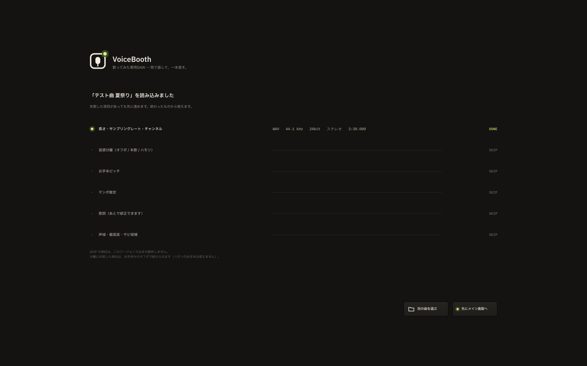
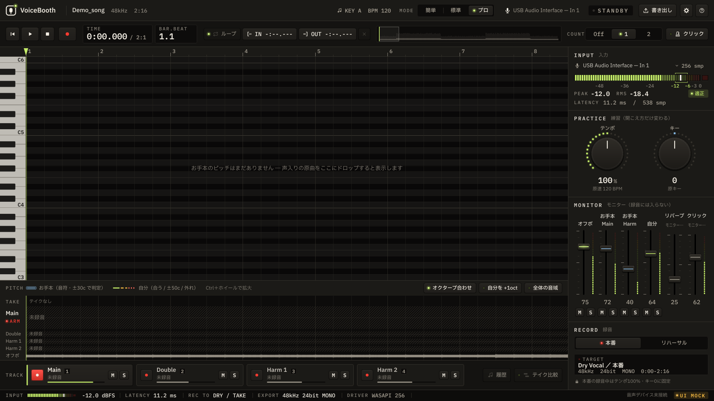
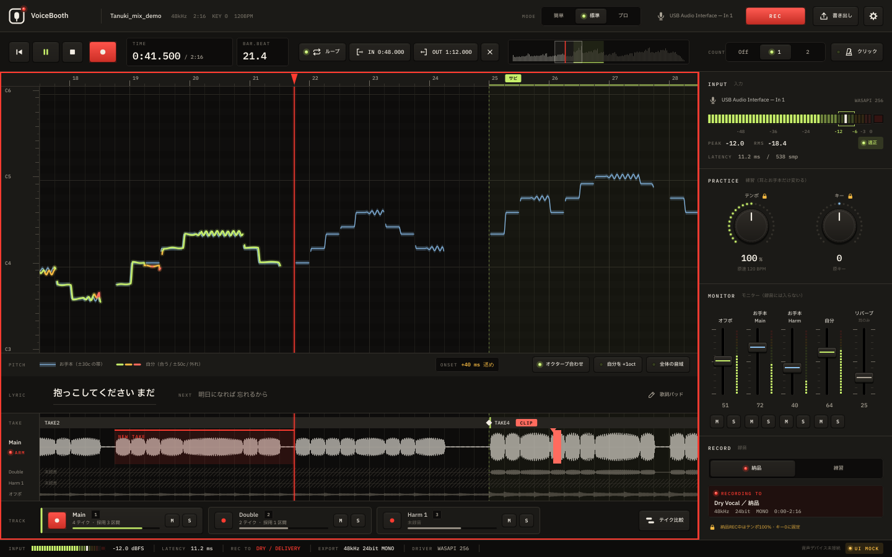
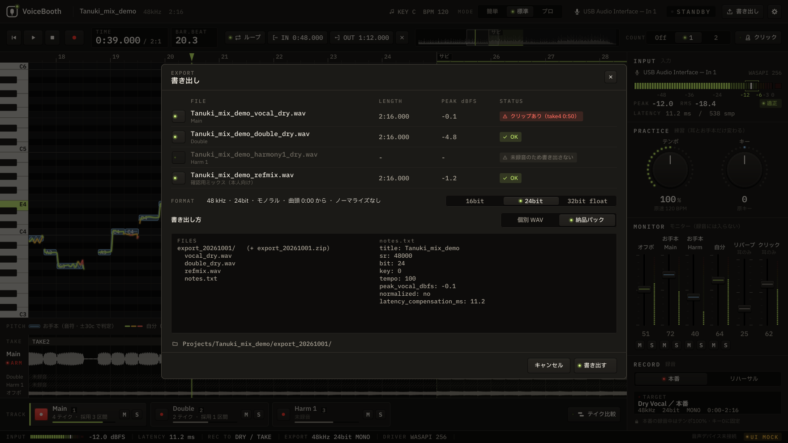
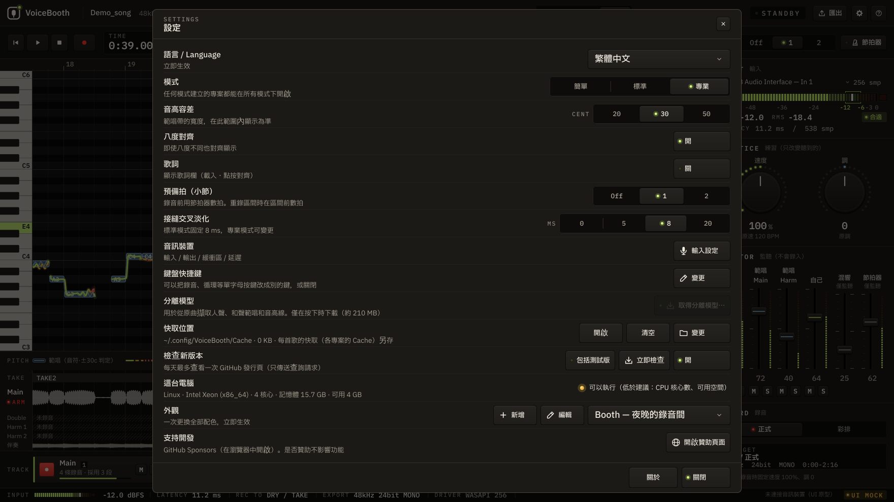
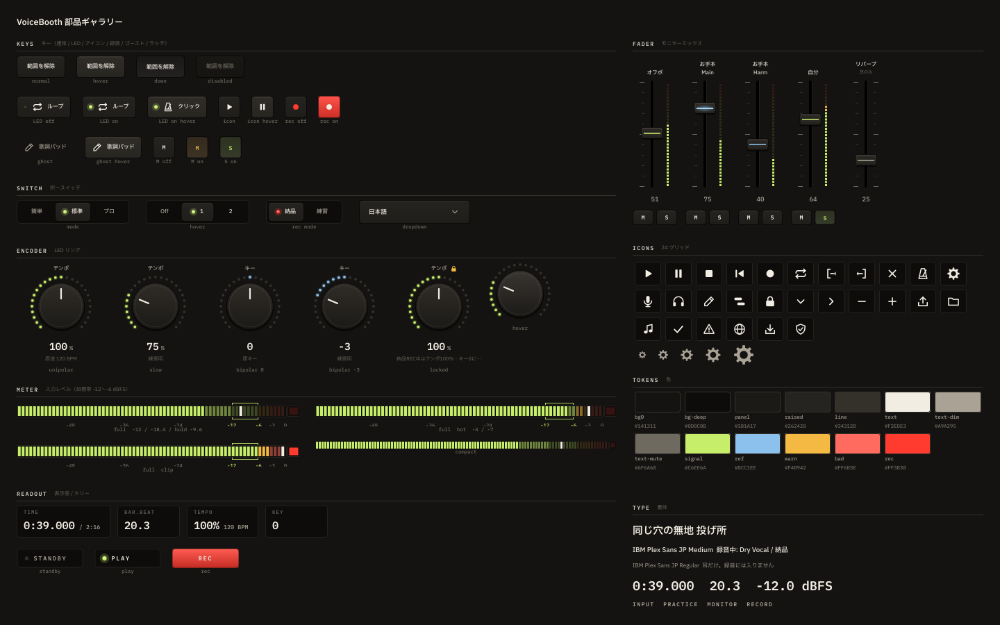

# VoiceBooth 開発ガイド

利用者向けの説明は [README](../README.md)。仕様は [`DESIGN.md`](DESIGN.md) が唯一の正、画面の状態一覧は [`UI_STATES.md`](UI_STATES.md)。

## 現在の状態：Phase B3（デバイス列挙＋入力メーター）— 手動確認待ち

- Phase A（A1–A7）：メイン画面・操作の見た目（再生ヘッド・REC・範囲・ショートカット）・モード出し分け・起動 / 入力セットアップ / 書き出し / 設定
- **B1**：曲ファイル（wav / flac / aiff / ogg / mp3 / m4a。mp3 は同梱の minimp3、m4a は Win・Mac の OS 標準デコーダ。曲の頭の位置は OS で変わらない）を開くと、形式・長さ・SR・ch を読み、実波形を描く。起動画面のクリック / ドロップ、メイン画面へのドロップ、`--open=<path>`
- **日本語 / English / 한국어 / 简体中文 / 繁體中文**。初回起動で言語を選び、以後は記憶（設定から変更可。DESIGN 10.1）
- **スキン**（DESIGN 4.11）：色トークン 16 個の着せ替え。内蔵 10 種＋テンプレートから自作（`.vbskin`、`Skins/` に保存）。設定で選ぶと画面を作り直す。`--skin=<id>`
- **B2**：開いた曲（オフボ）を既定の出力デバイスで再生・シーク・ループ。オフボのフェーダーと M が効く
- **B3**：ドライバ・入出力の機器・SR・バッファを列挙し、入力セットアップで選べる（設定に保存）。入力は 1 ch（モノラル、既定 L）を開いてメーターだけ（ピーク・ホールド・RMS・クリップ）。レイテンシはデバイスの申告値（実測は B6）。Mac はマイクの許可を確かめる。モニター・録音はまだ（B4 / B5）
- `-DVOICEBOOTH_UI_MOCK=ON` でビルドすると音声デバイスを一切開かない（画面確認・スクリーンショット用）

| 曲を読み込んだところ | 開いた曲の画面（実波形） |
|---|---|
|  |  |

| 入力セットアップ（実デバイス、B3） | レベル（実メーター） |
|---|---|
|  |  |

| 録音中 | 書き出し | 設定（繁體中文） |
|---|---|---|
|  |  |  |

見た目は v2 "Booth"（夜の録音ブース：暖色グラファイト＋LED＋タリー）が既定で、スキンで色を着せ替えられる（[一覧](screenshots/skins/all.png)）。機能の参考にした TakyuPractice とは配色・書体・部品・配置を変えている（DESIGN 4 / 4.9）。動きは DESIGN 4.10（キーのばね・LED の余韻・フェーダーとツマミの吸い付き・ダウンロードの LED の列・再生ヘッドの先回りなど。実装は 4.10.2。OS の「動きを減らす」に従う）。

起動オプション（`--lang=en` `--mode=pro` `--screen=export` など）は [`UI_STATES.md`](UI_STATES.md)。

部品ギャラリー（全部品を状態ごとに表示。開発用）: `VoiceBooth --gallery`



## ビルド

必要なもの: CMake 3.22+、C++17 コンパイラ、Git（JUCE 8.0.15 を初回 configure 時に自動取得）

### Windows（Visual Studio 2022）

```powershell
cmake -S . -B build -G "Visual Studio 17 2022" -A x64
cmake --build build --config Release
.\build\VoiceBooth_artefacts\Release\VoiceBooth.exe
```

### macOS（Xcode / Command Line Tools）

```bash
cmake -S . -B build -G Xcode
cmake --build build --config Release
open build/VoiceBooth_artefacts/Release/VoiceBooth.app
```

既定で Apple シリコンと Intel のユニバーサル版になる（DESIGN 11.6）。手元で早く作るだけなら `-DCMAKE_OSX_ARCHITECTURES=arm64`。

### Linux（開発確認用。配布対象外）

```bash
sudo apt-get install -y libx11-dev libxrandr-dev libxinerama-dev libxcursor-dev libxext-dev \
                        libfreetype-dev libfontconfig1-dev ninja-build
cmake -S . -B build -G Ninja -DCMAKE_BUILD_TYPE=Release
cmake --build build
./build/VoiceBooth_artefacts/Release/VoiceBooth
```

JUCE を手元のチェックアウトから使う場合: `-DVOICEBOOTH_JUCE_DIR=/path/to/JUCE`

### テスト

```bash
ctest --test-dir build -C Release --output-on-failure
```

波形の概形（ピーク・RMS、ビン境界・全チャンネル・粗い段と総当たりの一致）、曲の読み込み（WAV / FLAC の長さがサンプル単位で一致、日本語と空白を含むパス、壊れた / 空のファイル、中止、非同期の通知、mp3 / m4a を OS の読み手で開けるか・長さと頭のずれ）、再生の中身（シーク・ループのつなぎ目・音量のなめらかさ）、入力メーター（-12 dBFS の正弦波でピーク -12 / RMS -15、ホールド 1.5 秒と下がる速さ、RMS 300 ms、クリップの保持、SR とブロック長によらないこと）、入力チャンネルの選び方（既定 L）と Bluetooth らしい名前の判定、動きの計算（ばねが止まる・フレームの速さに左右されにくい、0 dB / 既定値の吸い付きでちょうどの値になりそれ以外は丸めない、ツマミの速さで変わる感度、LED の余韻、再生ヘッドが 7 割から先回りしてページ送りしない）、スキン（`.vbskin` の読み書きと 64 KB・64 文字・HEX の制限、base からの補い、コントラスト比・色差・rec の色相、内蔵 10 種がすべて自分の点検を通ること、`Skins/` の保存・削除）を確かめる。CI（Win / Mac、Mac は Intel 側も Rosetta 2 で）でも実行。テスト用音声は `tests/data/make_fixtures.sh` で作る自作の合成音。

### インストーラー（未署名。DESIGN 11.6）

CI はテストが通ると `VoiceBooth-<版>-win-x64-setup.exe` と `VoiceBooth-<版>-mac-universal.dmg` を Actions の成果物に置く。手元で作る時は、Release ビルドの後に：

```powershell
# Windows：Inno Setup 6.5.2 以上（winget install JRSoftware.InnoSetup）
# 配る exe は CI と同じく C++ ランタイムを静的リンクする（VC++ 再頒布パッケージの無い PC でも起動するように）
cmake -S . -B build -G "Visual Studio 17 2022" -A x64 -DCMAKE_MSVC_RUNTIME_LIBRARY=MultiThreaded
cmake --build build --config Release
pwsh packaging/windows/build_installer.ps1      # → build/installer/VoiceBooth-<版>-win-x64-setup.exe
```

```bash
# macOS：追加の道具は要らない（hdiutil / codesign / osascript）
packaging/macos/make_dmg.sh                     # → build/installer/VoiceBooth-<版>-mac-universal.dmg
```

- 版は `build/CMakeCache.txt` の `CMAKE_PROJECT_VERSION`（`CMakeLists.txt` の `project(... VERSION ...)`）。`-Version` / `--version` で上書きできる
- DMG の並び（背景・アイコン位置）は Finder が書く。初回はターミナルに「Finder を操作する許可」を求められる。
  断った・操作できない時は素の DMG を作って警告を出す（`VB_DMG_REQUIRE_LAYOUT=1` で失敗扱い）
- どちらも未署名。開き方は DESIGN 11.6

## 構成

```text
docs/DESIGN.md        仕様（唯一の正）
docs/UI_STATES.md     画面状態一覧
app/Main.cpp          アプリ / ウィンドウ（既定 1440x900、最小 1280x800）/ 起動オプション / 設定保存
app/i18n/             多言語対応 tr("key")（5 言語）
app/ui/UiSession.*    画面の状態と変更通知（音声エンジンにつなぐ）
app/audio/            曲の読み込み（SongLoader / mp3・m4a の読み手）、波形の概形（WaveformOverview）、再生（PlaybackCore / PlaybackEngine）、入力メーター（InputMeter）、デバイスの決まりごと（DeviceRules）、Mac のマイク許可（MicPermission）
app/skin/             スキン（DESIGN 4.11）：内蔵 10 種・.vbskin の読み書き・見やすさの点検・自作の置き場（画面に依存しない）
app/song/             曲の情報（DESIGN 7.5）：歌詞の読み込み（LyricsImport、CP932 表は tools/gen_cp932_table.py で生成）、タップテンポ（Tempo.h）
third_party/minimp3/  mp3 デコーダ（CC0。出典とコミットは README）
tests/                VoiceBoothTests（ctest）
app/ui/screens/       起動画面 / 入力セットアップ / 書き出し / 設定 / 更新・モデルのダウンロード / スキン（テンプレート・エディタ）
app/ui/Theme.*        色トークン（スキンで差し替わる）・書体・描画の基本（キーキャップ / 表示窓 / LED）
app/ui/Motion.h       動きの計算（ばね・吸い付き・感度・余韻・再生ヘッドの先回り。DESIGN 4.10。テストあり）
app/ui/Animator.*     動きの共通の時計（60 Hz のタイマー 1 つ。止まっていれば止まる）・OS の「動きを減らす」（ReducedMotion.cpp / .mm）
app/ui/parts/         部品：KeyButton / SegmentedKeys / Encoder / ConsoleFader / LedMeter / Readout / TallyLamp / Icons / Dropdown / ColourPad
app/ui/Gallery.*      部品ギャラリー
app/ui/*.cpp          画面：TopBar / TransportBar / PitchLane / LyricsLane / WaveLane / TrackTabs / Rack / StatusBar
app/ui/DummySession.* 固定ダミー（DESIGN 20）。結線時に差し替える
app/project/          データモデル（形のみ）+ project.example.json
app/export/           ExportService スタブ
resources/fonts/      IBM Plex Sans JP / IBM Plex Mono（SIL OFL 1.1）
resources/i18n/       翻訳表 ja / en / ko / zh-Hans / zh-Hant
tools/check_i18n.py   翻訳表と直書きの検査（CI でも実行）
brand/                アイコン・ロゴ・README の画像（build_brand.py で生成）
packaging/            インストーラー：windows/VoiceBooth.iss（Inno Setup）・build_installer.ps1、macos/make_dmg.sh（DMG）
```

## 多言語対応

画面の文字は必ず `tr("key")` で引き、`resources/i18n/` の全言語（ja / en / ko / zh-Hans / zh-Hant）にキーを足す。

```bash
python3 tools/check_i18n.py
```

言語を足す時は `app/i18n/I18n.cpp` の `available()` に 1 行、JSON を 1 枚、`CMakeLists.txt` の埋め込みに 1 行（DESIGN 10.1）。
韓国語・中国語は OS の標準フォントで表示する（Linux で確認する場合は `fonts-noto-cjk` を入れる）。

README は 5 言語（`README.md` が日本語、`README.<lang>.md`）。内容を変えたら全言語をそろえる。

## ブランド素材

アプリアイコン・ロゴ・SNS 画像・README の画像・インストーラー画像は [`brand/`](../brand/README.md)（`python3 brand/build_brand.py` で再生成）。

## 方針

- Utawave のソースはコピーしない（DESIGN 0。ライセンスの問題ではなく、独自に作る方針）
- 秘密情報・録音・依頼者の素材・著作権のある曲はリポジトリに入れない（テスト音声は自作の合成音だけ）
