# 画面状態一覧（UI_STATES）

Phase A（A1–A7）と Phase B1（曲を開いて実波形）・B2（オフボ再生）・B3（デバイス列挙＋入力メーター）・B4b（曲の情報を手で入れる）の実装状況。DESIGN 4 / 16 に対応。見た目は v2 "Booth"（DESIGN 4.9）、全画面 日本語 / English / 한국어 / 简体中文 / 繁體中文 / Español / Português (Brasil) / Bahasa Indonesia / Tiếng Việt / Türkçe / Deutsch / Français（DESIGN 10.1）。

## 起動オプション（開発・スクリーンショット用）

| オプション | 内容 |
|---|---|
| `--lang=ja` / `en` / `ko` / `zh-Hans` / `zh-Hant` / `es` / `pt-BR` / `id` / `vi` / `tr` / `de` / `fr` | 表示言語（保存した設定より優先） |
| `--skin=<id>` | スキン（`booth` / `studio-day` / `sweet` / `midnight` / `analog` / `neon` / `gaming` / `sakura` / `contrast` / `colorsafe` / 自作の id）。保存した設定より優先し、保存はしない。無い id は booth |
| `--mode=easy` / `standard` / `pro` | モード |
| `--track=main` / `double` / `harm1` | 選択トラック |
| `--play` | 再生中で開く（再生ヘッドが動く。音は出ない） |
| `--rec` | 録音中の見た目で開く（静止） |
| `--open=<path>` | その曲を開く（起動画面で読み込み → 終わったら「先にメイン画面へ」）。空白・日本語を含むパス可 |
| `--lyrics=<path>` | 歌詞パッドをその .txt / .lrc を読んだ状態で開く（B4b） |
| `--screen=song-info` / `lyrics` | 曲の情報パネル / 歌詞パッドを開いた状態（B4b） |
| `--screen=update` / `update-notice` / `model-download` / `model-downloading` / `model-interrupted` / `model-done` / `model-failed` | アップデートの知らせ（見本のバージョン 0.2.0 と見本の本文。キーは本物のリリースのページを開く。設定には覚えない）・モデルの初回ダウンロード（見本の状態。通信しない）。`model-interrupted` は途中で切れた所から 3 秒後に続きを取り、照合して完了まで進む。`--screen=` を付けた時は起動時の更新の確認をしない（`--no-update-check` でも止まる） |
| `--screen=start` / `setup` / `setup2` / `setup3` / `export` / `settings` / `confirm-rec` | ダイアログ・起動画面を開いた状態 |
| `--screen=compare` | テイク比較のパネルを開いた状態（いまのトラック。IN / OUT があればその範囲。B18c） |
| `--screen=skin-templates` / `skin-editor` / `skin-editor-borrow` | スキン：テンプレートから作る / スキンエディタ（いまのスキン）/ エディタで「意味の色」のテンプレートメニューを開いた状態（DESIGN 4.11） |
| `--first-run` | 初回起動の言語選択から開く（保存済みでも） |
| `--no-first-run` | 初回起動の画面を出さない（スクリーンショット用） |
| `--gallery` | 部品ギャラリー |
| `--reduce-motion` / `--motion` | 動きを減らす / 出す（OS の設定より優先。確認用。DESIGN 4.10） |

## 部品（app/ui/parts）

| 部品 | 用途 | 状態 |
|---|---|---|
| KeyButton | 全ボタン | 通常 / ホバー / 押下 / 無効、LED 付き、アイコンのみ、録音（オン=タリー赤）、ゴースト、ラッチ（M/S）、ショートカット時の一瞬の沈み。動き：ばねで沈む、LED・点灯色は消える時に余韻、REC 中は ● が呼吸。ツールチップにショートカット（キーの形）。キーボードで移った時だけフォーカスの枠（ダイアログのキー） |
| SegmentedKeys | モード / カウントイン / 録音モード / 設定 | 選択=浮いたキー＋LED、ホバー、無効。動き：キーキャップがばねで滑り（少し行き過ぎて戻る）、止まってから LED が点く |
| Encoder / EncoderBlock | テンポ / キー | LED リング（単極 / 双極）、ロック表示。操作：速さで感度が変わる（Shift で細かく）、既定値（テンポ 100% / キー 0）で止まる・補足が一瞬光る、ダブルクリックで既定値。指標・輪・数値はばねで追う |
| ConsoleFader / ChannelStrip | モニターミックス | 縦フェーダー＋目盛り＋横メーター、M/S。操作：掴んだ所から相対、0 dB（75）で止まる、Shift で微調整、ダブルクリックで 0 dB（つまみはばねで戻る）。0 dB ちょうどの時はつまみの線が光る。値は丸めない |
| LedMeter | 入力レベル | ピーク / RMS / ホールド / クリップ / 目標帯 -12〜-6。クリックでクリップ表示を消す（B3）。見た目：消える粒に短い余韻、クリップ LED は点いた時に一度光る |
| Readout / TallyLamp | TIME / BAR.BEAT / 状態 | STANDBY / PLAY / REC |
| Icons | 26 種 | 24 グリッド設計 |
| Dropdown | 表示言語・スキン（設定 / 初回起動）、テンプレート（スキンエディタ） | キー＋値＋シェブロン、ポップアップ（選択中は LED）。言語名はその言語のフォント |
| ColourPad | スキンエディタの色選び | 彩度×明るさの面＋色相の帯、印は白黒の二重（どの色の上でも見える） |

## メイン画面の操作（A4 / A7）

| 操作 | 見た目の反応 |
|---|---|
| Space / ▶ | 再生 ⇄ 一時停止。タリー PLAY、再生ヘッドが進む（テンポに比例、ループ範囲で戻る。右から 7 割を越えたら画面がなめらかに先回りしてスクロール。DESIGN 4.10.1 PH） |
| R / ● | 録音。タリー REC・ロゴのタリー赤・キャンバスの赤枠・再生ヘッド赤・波形に NEW TAKE・録音先表示が赤・テンポ/キーにロック |
| R（納品・テンポ≠100% かキー≠0） | 確認：原速・原キーで納品録音 / 練習録音にする / キャンセル |
| 納品 REC 中にテンポ・キーを回す | 確認：練習録音に切り替えるか（いいえなら値は戻る） |
| Esc（録音中） | 確認：このテイクを破棄するか。「破棄する」で録音を止め、録っていたファイルを消す（採用もテイクの一覧にも入れない）。知らせ「録音を破棄しました」。「録音を続ける」ならそのまま録る |
| Esc（ダイアログ表示中） | 閉じる（確認ダイアログではキャンセル） |
| L | ループ切替（範囲がある時） |
| `[` / `]` | 範囲の開始 / 終了を再生ヘッドに |
| 1–4 | トラック選択（モードで見えないトラックは無視） |
| ピッチ・波形レーンをクリック / ドラッグ | 移動 / 範囲選択 |
| ルーラー・概形シークをクリック / ドラッグ | 移動 |
| トラックカード / 波形の細い行 | 選択。● でアーム（同時に 1 本） |
| ハモリ選択 | お手本の帯がハモリ（ダミー +4 半音）に、Main を薄い白で残す |
| オクターブ合わせ / +1oct / 全体の音域 | 表示の切り替え（全体の音域は C2–C7） |
| T | タップテンポ（4 回目から BPM が決まる。トーストに回数 / BPM。B4b） |
| M | 今の位置に区間の頭（小節線に吸い付く。Alt / Option で吸い付かない。B4b） |
| Enter | 歌詞の「タップで合わせる」を始める → 合わせている間は次の行の歌い出し（B4b） |
| Backspace / Esc（タップで合わせる中） | 1 行戻す / 終わる |
| ↑ / ↓ | 歌詞の今の行を手で送る（時刻の無い歌詞・合わせている途中） |
| Delete（Backspace） | 選んだ区間を消す。Esc で選択を外す |
| 波形レーンの「テイク」の行をクリック | その区間のテイクを選び直す（テイク比較。B18c） |

## モード（A5、DESIGN 2）

| | 簡単 | 標準 | プロ |
|---|---|---|---|
| トラック | Main のみ | Main / Double / Harm1 | ＋ Harm2 |
| 波形レーン | 最小（Main とオフボ、採用区間バーなし） | 標準 | Harm2 の行が増える |
| 入りタイミング | × | ONSET チップ（いまのトラックのいちばん新しいテイクとお手本の入りのずれ。B18） | ONSET ＋ PITCH（帯の中の割合）＋ VIB（解析） |
| 現在音のセント | × | × | ○ |
| テイク比較 | × | ○（入り・音程） | ○（＋ビブラート・合った入りの数・ずれの平均） |
| モニターの Harm | × | ○ | ○ |
| 録音先 | 納品（通し。IN/OUT があってもパンチインにせず今の位置から通しで録る。範囲は練習のループだけ） | 納品 | 納品 |
| 書き出し | 通常 WAV のみ | 個別 WAV / 納品パック | ＋ take_map.txt |
| バッファ | 「自動」 | 数値表示 | 編集キー |
| クロスフェード設定 | 8 ms 固定 | 8 ms 固定 | 0 / 5 / 8 / 20 |

## ダイアログ・起動画面（A6）

| 画面 | 入口 | 内容 |
|---|---|---|
| 初回起動 | 設定ファイルが無い（または `--first-run`） | 各言語のあいさつ / 表示言語のプルダウン（OS の言語を初期値、選ぶと即時切替）/ 続ける → 起動画面へ。言語と「初回済み」を保存し、以後は出さない |
| 起動 | ロゴをクリック / 曲を開かずに起動した時（2 回目から） | 曲を読み込む（クリックでファイル選択、ドロップでも可 → 解析画面へ）/ 最近のプロジェクト（無ければ「まだありません」の下に「プロジェクトを開く」）/ 初回だけ「まず歌う / 録って渡す / 細かくやる」（選ぶとモードが変わり保存。曲がまだ無ければ閉じずにそのまま曲を選ぶ）。本物のアプリで曲を開く前は Esc で閉じない（見本の曲・ダミーの線を見せない） |
| 起動画面の 2 枠（B9） | 曲を開いていない時 | 上：「オフボ（カラオケ）を読み込む」（時間の基準。書き出しはオフボの頭から）。下：「お手本（声入りの原曲）・任意」。ドロップした位置の枠に入る（ドラッグ中はその枠がライムで光る）。お手本は覚えておき「お手本：〇〇.wav」と出して、オフボを読み込んだ後に重ねる（B9）。お手本だけの時は枠の右下に「原曲だけで始める」（分離してオフボを作る。B16d、下の「ボーカル分離」）。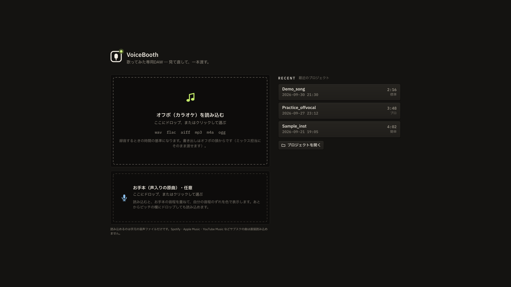 |
| 解析（B1） | 起動画面で曲を選ぶ / ドロップ / メイン画面へドロップ / `--open=` | 1 行目「長さ・SR・チャンネル」だけ本物：読み込みの進み具合（%）→ 完了で「WAV 44.1 kHz 24bit ステレオ 2:30.000」、失敗で理由（見つからない / 読めない形式か壊れている / 音が無い / 読み込みエラー / 曲のファイルではない）。ほかの 5 項目は SKIP（このバージョンでは解析しない）。読み込み中は「キャンセル」、完了後は「先にメイン画面へ」「別の曲を選ぶ」 |
| 入力セットアップ | 入力デバイスのキー | 1 デバイス（入出力一覧、Bluetooth 遅延警告、ドライバ、バッファ、マイク許可）/ 2 レベル（目標帯、判定と目安）/ 3 レイテンシ（測定、結果、補正量）。B3 から実デバイス（下の「デバイスと入力メーター」） |
| 書き出し | トップバーの「書き出し」 | ファイル名・長さ・ピーク・状態（OK / クリップ / 未録音で除外）、形式、個別 WAV / 納品パック、中身と notes.txt の確認、保存先。書き出すとトースト（モックのため書かない） |
| 設定 | 歯車 | 表示言語（プルダウン、即時切替・保存）/ モード / ピッチ許容 / オクターブ合わせ / カウントイン / クロスフェード / オーディオデバイス / キャッシュの場所（開く・空にする・変更。下の「キャッシュの場所」）/ 新しいバージョンの確認（自動 入 / 切・ベータ版も・今すぐ確かめる。下の「アップデート」）/ このパソコン（OS・CPU・コア・メモリ・空き容量と動作環境の判定。DESIGN 11.6.1）/ スキン（下の「スキン」）/ 開発を支援する（GitHub Sponsors をブラウザで開く） |
| 確認 | 録音・破棄・切り替え時 | 上記「メイン画面の操作」 |

## Phase A で決めた解釈

- お手本は許容帯（幅 = ±ピッチ許容、既定 30 cent）。帯を外れて ±50 cent まではアンバー、超えたらコーラル赤
- 信頼度 0.5 未満の点、および 15 ms 以上の欠落は線を切る（嘘でつながない）
- 自分の線は再生ヘッドまで（歌ったところだけ）
- テンポ / キーの数値は右ラックに集約
- モニターリバーブはモニターミックスの 1 チャンネル（「耳のみ」、M/S なし）
- 録音中の赤はキャンバスの縁・タリー・再生ヘッド・録音中の区間だけ（画面全体は赤くしない）
- 起動時は停止状態（0:39）。`--play` で動く
- ウィンドウ最小 1280x800
- 再生・録音の時計は見た目だけ（音声デバイスは開かない）

## Phase A で未実装（承認後に判断）

- ~~歌詞パッド（貼り付け編集）の画面~~ → B4b で実装（下の「曲の情報（B4b）」）
- ~~テイク比較のスライドパネル~~ → B18c で実装（下の「テイク比較」）
- 範囲の端をつまんで動かす操作

## 曲を開いた後（B1）

| 場所 | 表示 |
|---|---|
| トップバー | 曲名（ファイル名）・SR（44.1 kHz は小数）・長さ。KEY / BPM は分かるまで「-」（B4b で手入力、B9b で推定） |
| 輸送バーの全体表示 | 曲全体の実波形。薄い棒がピーク、濃い棒が RMS（曲の起伏・サビの位置が分かる）。クリックでその位置へ |
| 波形レーン「オフボ」行 | 表示範囲の実波形（ピーク＋RMS、細い行なので dB 表示）。Main / Double / Harm はテイクが無いので斜線（未録音） |
| ルーラー / 目盛り | テンポが分からない間は秒（1 秒刻み、5 秒ごとに m:ss）。B4b でテンポを入れると小節 |
| BAR.BEAT | テンポが分かるまで「-.-」 |
| ピッチレーン | 「お手本のピッチはまだ解析していません」。入りタイミング等の数値は出さない |
| 歌詞 | 「歌詞なし ― 歌詞パッドで読み込み・貼り付けできます」 |
| テンポのエンコーダー | 「原速（テンポ未設定）」。BPM が決まると「原速 128 BPM」 |
| 入力・メーター | B3 で本物（下の「デバイスと入力メーター」） |
| 書き出し | まだダミー（B15） |

## オフボの再生（B2）

曲を開いていて出力デバイスがあるとき、再生・シーク・ループは鳴っている音そのもの（再生ヘッドは音の位置から取る）。曲を開いていない（デモ表示）・出力デバイスが無いときは、従来どおり見た目の時計で動く。

| 操作 | 結果 |
|---|---|
| 再生キー / Space | オフボを再生・一時停止。曲の終わりで止まる（終わりで押すと頭から） |
| 停止キー | 止める（位置はそのまま） |
| 頭へキー | 頭へ（ループ中は範囲の頭へ） |
| 全体表示・レーンをクリック | その位置へ（再生中でも途切れずに飛ぶ） |
| レーンをドラッグ / `[` `]` | 範囲。ループ（`L`）が点いていれば範囲の終わりで頭へ戻る（すき間・重なりなし） |
| モニターの「オフボ」フェーダー | 音量（75 = 0 dB、100 = +6 dB、0 = 無音。急に変えず 20 ms でなめらかに） |
| 「オフボ」の M | ミュート |

| ステータスバー（右端） | 意味 |
|---|---|
| OUTPUT デバイス名 / kHz / バッファ | 開いている出力デバイス。曲を開くと SR を曲に合わせる |
| SR 変換して再生中 | デバイスが曲の SR に切り替えられないとき（試聴用に変換。DESIGN 13） |
| 出力デバイスを開けません：理由 | デバイスが無い・使われている等。画面はそのまま使える |
| UI MOCK | `-DVOICEBOOTH_UI_MOCK=ON` のビルド（音声デバイスを一切開かない） |

まだ無いもの：テンポ / キー（B11）、クリック・カウントイン、ほかのフェーダー（お手本・自分・リバーブ）、モニター・録音（B4〜）。

## デバイスと入力メーター（B3）

起動すると前回のデバイス（アプリ設定の `audioDevice`。戻せなければ既定）を開く。入力は 1 ch だけ（モノラル、既定 L）を開いてメーターに通す。入力の音は出力に流さない（モニターは B4）、録らない（B5）。

| 場所 | 表示 |
|---|---|
| ラックの INPUT | 機器名 — チャンネル（2 ch の機器は L / R）、ドライバとバッファ、LED メーター（ピーク・RMS・ホールド・クリップ）、PEAK / RMS の数値、適正 / 調整、LATENCY「… ms / … smp（申告値）」 |
| ステータスバー | 小さいメーター（クリックでクリップを消す）、ピーク dBFS、LATENCY「… ms（申告値）」、DRIVER |
| トップバーの入力デバイス | 機器名 — チャンネル。入力が無ければ「入力なし」（警告色） |
| 入力セットアップ 1 デバイス | 入力 / 出力の一覧（クリックで切り替え、多ければホイールで送る。名前が Bluetooth らしければ「遅延が大きい」）、DRIVER（2 種以上ならプルダウン）、CHANNEL（L / R など。1 ch の機器はモノラル）、SAMPLE RATE（いま / 対応）、BUFFER（プロはプルダウン、ほかは自動）、LATENCY（デバイスの申告値。実測ではないと明記）、MIC ACCESS（入力の状態）、切り替えに失敗した理由 |
| 入力セットアップ 2 レベル | 実メーター。判定はホールド（1.5 秒の最大）で：-3 dBFS 超「大きすぎます」/ -20 dBFS 未満「小さすぎます」/ それ以外 OK |
| 入力セットアップが自動で開く（B13） | 曲を開いた時、入力の機器（ドライバ | 名前）がセットアップを済ませた機器と違う（初回・機器を替えた）。起動画面・ほかのダイアログを閉じてから、止まっている時に開く。一度開いたら、同じ機器ではもう出ない |
| DRIVER に ASIO（Windows、B13） | ASIO を入れたビルド（既定）では ASIO のドライバが選べる。入れていないビルドだけ「ASIO は SDK のあるビルドのみ」 |
| 入力セットアップ 3 レイテンシ | 「REPORTED BY DEVICE」としてデバイスの申告値（入力 + 出力）。測定キーは押せない（実測と録音位置の補正は B6） |

メーター：ピークは下がる時 20 dB/秒、ホールドは 1.5 秒保ってから 20 dB/秒、RMS は直近 300 ms、クリップは -0.1 dBFS 以上が 1 サンプルでもあれば点灯し、クリックするまで残る。表示は 30 Hz。

| ステータスバー（右端の札） | 意味 |
|---|---|
| マイクの許可がありません | Mac で許可されていない。入力セットアップの「次へ」が押せない（DESIGN 13）。システム設定で許可してから開き直す |
| マイクの許可を確認中 | Mac の許可ダイアログに答え待ち |
| 入力デバイスがありません | 入力の機器が無い |
| 入力を開けません | 開けない（使用中・拒否など）、または選んだ機器から音が来ない。理由は入力セットアップに出る |
| 入力が完全に無音 | 開いているのに 0 ちょうどが 2 秒続く（OS のマイクの許可・ミュート・ケーブルの疑い） |
| 入力が止まりました ＋「オーディオデバイスが応答しません…」 | 開いていたデバイスが止まった（抜けた・サウンドサーバーが落ちた）。入力セットアップを開くと開き直す |

デバイスが外れた・止まった時は、再生を止めて「オーディオデバイスが外れました…」と知らせる（DESIGN 13「デバイス抜け：停止して再選択」）。

まだダミーのもの：レイテンシの実測と録音位置の補正（B6）、書き出し画面の latency_compensation（B15）。

| 入力セットアップ（実デバイス） | レベル |
|---|---|
| 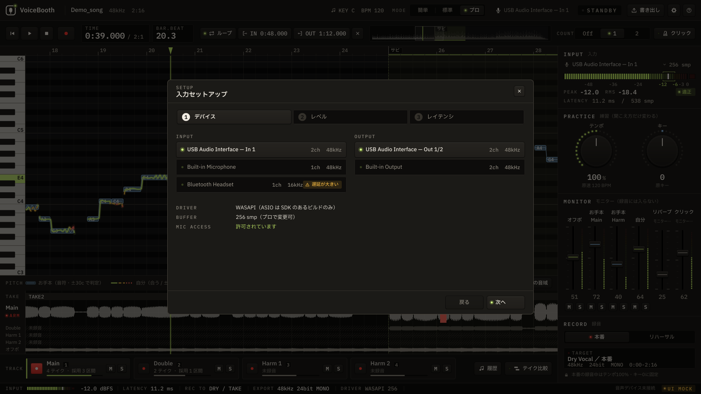 | 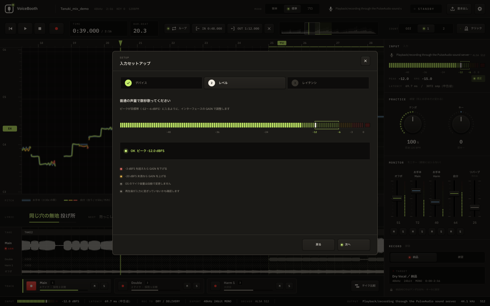 |

## 自分の声のモニター（B4）

入力（1 ch）を出力の L / R に同じ量で返す。曲が止まっていても入力があれば鳴る。録音はまだしない（B5）。

| 場所 | 動き |
|---|---|
| モニターの「自分」フェーダー | 返す量（75 = 0 dB、オフボと同じ目盛り）。横のメーターは耳に返っている量（入力のピーク＋フェーダー、-48〜0 dBFS） |
| 「自分」の M | 返さない。インターフェースのダイレクトモニターで聞く時はこちら |
| モニターの「リバーブ」フェーダー | 耳だけに掛けるリバーブ（小さめの部屋）の量。送りは「自分」のフェーダーの後。録音には入らない（DESIGN 4.7 / 14） |
| モニターの下の知らせ（スピーカー） | 出力の機器名がスピーカーらしい（`looksLikeSpeakers`：speaker / スピーカー / 扬声器 / 揚聲器 / 스피커、ヘッドホンの語があれば除く）時、その機器に替わった最初だけ「自分」を M にして理由を出す（アンバー）。M を外して鳴らしている間は「ハウリングに注意」（コーラル） |
| モニターの下の知らせ（遅れ） | 入力が開いていて「自分」を返している時、デバイスの申告の往復が 40 ms を超えたら「約 N ms 遅れて聞こえます。バッファを小さく／インターフェースで直接」（アンバー）。実測は B6 |

音の決まり：「自分」の分（リバーブ込み）は ±1 に収める（ハウリング・大声で耳を傷めないための最後の砦。オフボには掛けない）。音量・ミュート・リバーブ量は 20〜50 ms でなめらかに変わる。

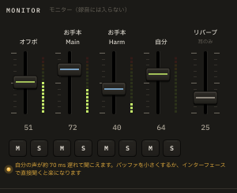

確認（Linux、PulseAudio の仮想デバイス 2 つ：入力用・出力用。入力に 441 Hz -12 dBFS を流して出力を録る）：
- 「自分」0 dB・リバーブ 0：出力 L / R とも -12.00 dBFS、止めた後は何も残らない
- 既定（「自分」64 = -2.8 dB、リバーブ 25）：-14.8 dBFS 前後、止めた後に左右で違う残響（50 ms 後 -34 dBFS → 1 秒後 -75 dBFS）
- 「自分」の M：出力は無音、遅れの知らせも消える

## 通し録音と書き出し（B5）

曲を開いていて入力がある時、REC（R）で再生と同時に、アームしたトラック（● が点いたトラック）へ録る。

| 操作・場所 | 動き |
|---|---|
| REC / R | 録音を始める（止まっていれば今の位置から再生）。録音中はループしない。もう一度 REC / 停止 / Space で止める |
| 録れない時 | 何もせず理由を知らせる：曲を開いていない / 入力（マイク）が使えない / アームしたトラックが無い / 機器を曲と同じ SR で開けない |
| 録り終わり | 「Main の take1 を録りました（0:00.000 - 0:04.021）」。割れがあれば「割れ（クリップ）があります」。練習録音は「納品には入りません」 |
| 曲の終わり・デバイスが止まった | そこまでをテイクとして閉じる（録った声は捨てない） |
| 波形レーン | 録ったテイクの実波形（採用区間ごと）。-0.1 dBFS 以上はクリップの色 |
| 書き出しダイアログ | 録ったトラックだけ選べる。ピークは採用区間のテイクの最大値、クリップしたテイク名を出す。確認用ミックスは「納品パックと一緒に対応予定」（B15）。保存先は作業フォルダの export_YYYYMMDD/ |
| 書き出す | 選んだトラックを `{曲}_vocal_dry.wav` などで書く（裏のスレッド）。終わったら「N 個のファイルを書き出しました：保存先」 |

テイクの置き場（.vbooth の保存 B14 までの仮）：書類フォルダ/VoiceBooth/Projects/{曲名}/Audio/Takes/main_take1.wav（練習は Practice/）。同じ名前があれば番号を進める。

| 録り終わり | 書き出し |
|---|---|
| 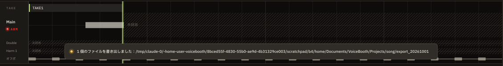 | 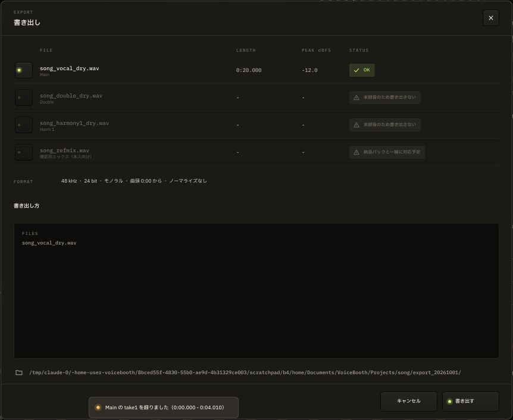 |

確認（Linux、PulseAudio の仮想デバイス）：20 秒の自作の伴奏を開き、入力に -12 dBFS のトーンを流して R → 4 秒 → Space。テイク 4.02 秒（24bit モノラル 48 kHz）、書き出しは 960000 サンプル（曲と同じ）で、録った所だけ音・ほかは無音。

## 録音形式（SR・ビット数。2026-10-01）

入力セットアップ 1 デバイスの「REC FORMAT」行。標準・プロで選べる。簡単は「自動（曲に合わせる・24bit）」。選んだ形式はアプリ設定に保存。

| 場所 | 動き |
|---|---|
| SR のプルダウン | 「曲に合わせる（48 kHz）」と、この機器で録れる値（44.1 / 48 / 88.2 / 96 / 176.4 / 192 / 352.8 / 384 kHz のうち機器が対応するもの） |
| 24bit / 32bit float | 次のテイクと書き出しから。テイクのある曲でも変えられる（書き出しで 24bit / float に変換） |
| 機器が曲の SR で開けない（「曲に合わせる」の時） | 伴奏を機器の SR にそろえて「この機器は 44.1 kHz で開けないため、48 kHz で録ります（オケを 48 kHz に変換。元のファイルはそのまま、書き出しも 48 kHz）」。REC で止めない。テイクのある曲では変えない（従来どおり理由を出す） |
| 曲と違う SR を選んだ | 「伴奏を 96 kHz にそろえています…」→「伴奏を 96 kHz にそろえました。96 kHz・32bit float で録ります」。その間は録音できない（理由を出す）。機器もその SR に切り替える |
| テイクのある曲で SR を変えた | 「この曲はテイクがあるので 48 kHz のまま録ります。96 kHz は次に開く曲から」 |
| 表示 | トップバーの SR・RECORD の形式（96kHz 32bit float MONO）・ステータスバーの EXPORT・書き出しダイアログの形式 |
| 書き出しダイアログの 16bit / 24bit / 32bit float | その書き出しだけの形式（既定は録音形式の 24bit / float）。16bit は形式の欄に「（TPDF ディザー。無音の所は無音のまま）」 |

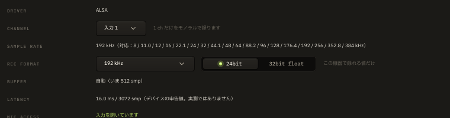

確認（Linux、PulseAudio の仮想デバイス、48 kHz の自作の伴奏）：
- 96 kHz・32bit float：テイクは float（WAV の形式 3）96 kHz、書き出しは 1920000 サンプル（20 秒ちょうど）の float
- 192 kHz・24bit：書き出しは 3840000 サンプル（20 秒ちょうど）
- 伴奏の変換（テスト）：48 → 96 / 192 / 384 kHz、44.1 ⇔ 48 / 88.2 kHz で 1 kHz の正弦波が理論値と 0.001 未満で一致（時刻のずれなし）。
  96 → 48 kHz では 30 kHz の音を -40 dB 以下に消す（折り返さない）
- 機器が曲の SR で開けない（ローカルで機器の SR 切り替えを止めて再現）：44.1 kHz の曲を 48 kHz の機器で開くと、伴奏が 48 kHz にそろい、上のバー・書き出し・出力が 48 kHz、R で 24bit 48 kHz のテイクが録れた
- 16bit 書き出し：48 kHz の曲に -12 dBFS のトーンを録り、16bit で書き出し → 960000 サンプル・ピーク -12.00 dBFS・テイクの後ろは全部ちょうど 0。
  テスト：誤差 2 LSB 以内・平均の偏り 0.05 LSB 未満（JUCE の int 変換は切り捨てで 0.5 LSB 偏るので、整数は自分で丸めて渡す）・2 回書いて同じファイル

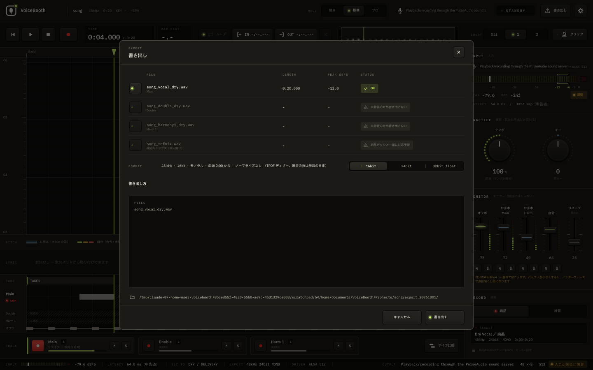

## 往復の遅れ（レイテンシ。B6）

入力セットアップの Step 3。録音位置の補正に使う値を測る・手で入れる。

| 場所 | 動き |
|---|---|
| 「測定する」 | 再生・録音を止めて、測定音（-12 dBFS のチャープ 5 回、約 4 秒）を出力に出す。その間ボタンは「測定中…」、右に「測定音を鳴らしています…」（青） |
| 測れた | 「5 回中 5 回そろいました（ばらつき 0.10 ms）。次のテイクからこの値で補正します」（ライム）。値の箱は ROUND TRIP・ms・「N smp だけ前に補正」 |
| 測れない | アンバーで理由：届かない / 小さい・うるさい / そろわない（反響・Bluetooth）/ 機器が止まった。入力が割れていれば「マイクのゲインを下げてください」を足す |
| MANUAL（手入力） | ms を入れて Enter か「この値を使う」。実測より優先。「手入力をやめる」で実測（無ければ申告値）に戻る |
| 測る前 | 値の箱は REPORTED BY DEVICE（入力 + 出力の申告値）。この値で補正する |
| ラック・ステータスバー・Step 1 の LATENCY | 補正に使っている値。申告値は「（申告値）」、手入力は「（手入力）」、実測は値だけ |
| 録音 | テイクの頭を補正量だけ前に置く（録り終わりの知らせの範囲は曲の中だけ）。曲の終わりの後も補正量の分だけ録り足してから閉じる |

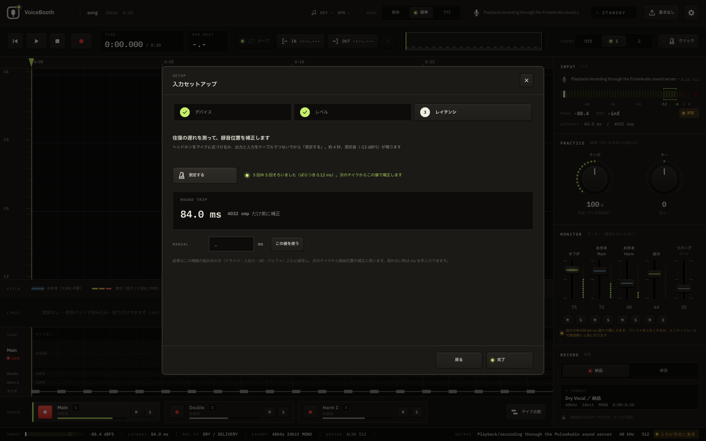

確認（Linux、PulseAudio の仮想デバイス。出力 → 入力を module-loopback でつないだ）：
- 測定：5 回中 5 回そろう（ばらつき 0.10〜0.12 ms）。ただしこのループバックは遅れ自体が時間とともに伸びる（84 → 160 ms、録音中は毎秒約 2 サンプル）
- 録音の直前に 7604 smp、直後に 7676 smp と測り、その間に 20 秒の曲を通しで録った（入力 = 出力そのもの）。生のテイクは曲から 7625〜7649 smp 遅れ、
  書き出し（補正 7604）は 21〜45 smp。補正はちょうど測った値の分で、残りはループバックの伸び。書き出しは 960000 サンプル（曲と同じ）、テイクのファイルは 960000 + 7604
- テスト：44.1 / 48 / 96 / 192 kHz で 0〜450 ms の遅れがサンプル単位で一致、逆相・強い反響・割れ・雑音だけ・揺れ、バッファ 256 の機器の模型で 3 ブロック + 37 サンプル

## 遡及録音（B7。DESIGN 6.3）

再生中、REC を押せば録れる状態（曲・入力・アーム・SR）なら、アームしたトラックの入力を裏で録っている（画面には出さない）。

| 操作 | 動き |
|---|---|
| 再生中に REC / R | 裏で録っていた分をそのままテイクにする（録音は途切れない）。押す直前 0.3 秒に声があれば、フレーズの頭（250 ms 以上の無音の直後）の 50 ms 手前から採用。声が無ければ押した所から |
| 止まっている所から REC | これまでどおり（その位置から再生と同時に録る） |
| REC を押さずに止める・ループで戻る | 裏で録った分は消す（戻った時は次の周からまた録る） |
| 録り終わりの知らせ | 範囲は採用した所から（例：4.0 秒で押して「0:03.721 - 0:08.053」） |

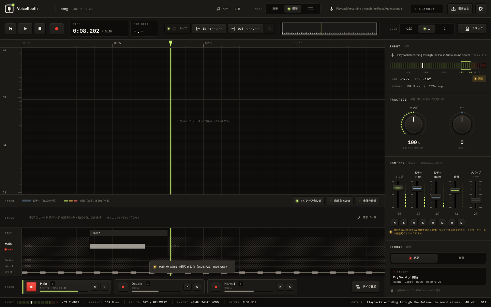

確認（Linux、PulseAudio の仮想デバイス）：再生と同時に「2 秒の無音 → 330 Hz を 3 秒」を入力に流し、声が入って約 0.23 秒後（曲の 4.0 秒付近）に R、8 秒で止めた。
採用は 3.721 秒から（声の出だし 3.776 秒の 55 ms 手前）、書き出しは 960000 サンプルで声の所だけ音。テイクのファイルは再生を始めた所からの 8.19 秒。
REC を押さずに再生して止めると `.retro-*.wav` は消える。

## 自分の声のピッチ（B8。DESIGN 7.3）

曲が鳴っている間、入力の音程をピッチレーンに描く（録音していなくても）。

| 場所 | 表示 |
|---|---|
| 自分の線 | 10 ms ごとの点を再生ヘッドまでつなぐ。信頼度 0.5 未満・15 ms 以上の切れ目では切る（嘘でつながない）。お手本が無い間（B9 の前）は白 |
| 今の音の点・鍵盤 | いちばん新しい点（遅れ + 検出の 0.04 秒 + 0.05 秒まで）を再生ヘッドに。左の鍵盤にその音名（例 G4） |
| ピアノロール | 左に鍵盤、背景は半音ごとの段（黒鍵の段は暗い）。お手本の音符の棒は段に揃い、棒に音名。いま歌っている音の鍵が緑、再生ヘッドのお手本の鍵が青で光る |
| 横のズーム | Ctrl / Cmd ＋ホイール・ピンチで拡大縮小（マウスの位置を中心、2 秒〜曲全体）、ホイールだけで横に送る。波形レーンも同じ。開いた時は頭から 15 秒。凡例の右に「Ctrl＋ホイールで拡大」（入り切る時だけ） |
| 歌い直し | 同じ所をもう一度歌うと、その分だけ新しい線に置き換わる |
| 入り・ビブラートの札 | 見本の値なので、実際の声では出さない（解析は B18） |

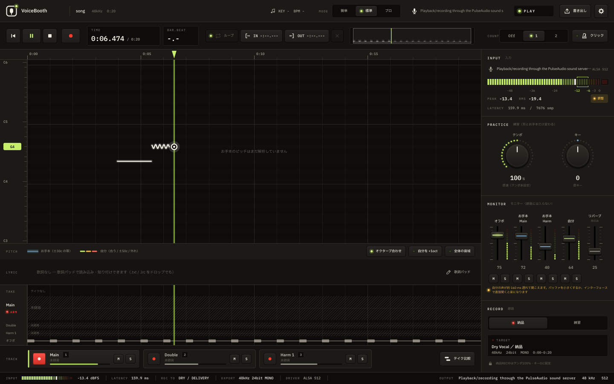

確認（Linux、PulseAudio の仮想デバイス）：再生と同時に「2 秒の無音 → E4（330 Hz）1.5 秒 → G4（392 Hz、±40 セント 5.5 Hz の揺れ）」を入力に流した。
E4 は 64.02（+2 セント）の平らな線、G4 は揺れがそのまま描かれ、切り替わりに外れた点は無い（667 点のうち、信頼度 0.5 以上で E4〜G4 の外は 0）。

## お手本の音程（B9。DESIGN 7.1.1）

オフボ（カラオケ）を開いた後に、声入りの原曲を入れると、お手本の線を重ねる。

| 操作・場所 | 動き |
|---|---|
| ピッチレーン（お手本なし） | 「お手本のピッチはまだありません ― 声入りの原曲をここにドロップすると重ねます」 |
| 原曲をピッチレーンにドロップ（`--guide=` も） | 「お手本を解析しています：〇〇.wav」→ 裏で時間合わせと声の取り出し。その間ピッチレーンは「お手本を解析しています…」 |
| 重なった | 「お手本の音程を重ねました（原曲とオフボのずれ 1.25 秒）」。青い帯（±許容セント）と線 |
| 自分の線の色 | 同じ位置のお手本とのずれ：帯の中（既定 ±30 セント）ライム / ±50 セントまでアンバー / それ以上コーラル。お手本の無い所は白。プロはセント値 |
| オクターブ合わせ | 点いていればオクターブ違い（男女・裏声）は同じ音として比べる。切り替えるとすぐ色を付け直す |
| 引けない組 | 別のミックス・音質違い：分離を勧める（下の「ボーカル分離」）。キー違い：「オフボは原曲と +2 半音違うキーのようです…分離した声の線をカラオケのキーにずらして重ねます」と分離を勧め、できた線はその分ずらす。知らせ「カラオケは原曲 +2 のキーなので、線もその分ずらしています」。お手本の声は原曲のキーのままなので鳴らさない（モニターのお手本は無効）。分離モデルが無ければ理由だけ。合わない「原曲とオフボの時間が合いませんでした」は線を出さない |
| オフボを開いていない | 「先にオフボ（カラオケ）を開いてから、お手本（声入りの原曲）を入れてください」 |

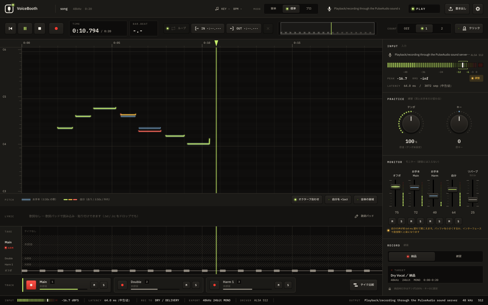

確認（Linux、PulseAudio の仮想デバイス。素材は自作）：自作の伴奏をオフボにし、その伴奏 ×0.97 ＋ 自作の旋律 7 音を 1.25 秒後ろにずらした原曲を `--guide=` で入れた。
お手本の線は 7 音ともオフボの時間の正しい位置（2.0 秒の E4 から）に出た。再生しながら「3 音は合わせる・4 音目 +40 セント・5 音目 −80 セント・残りは合わせる」歌を入力に流すと、
ライム・ライム・ライム・アンバー・コーラル・ライム・ライムになった。

## テンポ・キーの自動推定（B9b。DESIGN 7.5.1）

曲を開くと裏でテンポ・1 小節目・キーを推定し、「推定」として入れる（手で入れた・触った確定の値は上書きしない。曲の情報パネルで直せる）。
推定は一定テンポ・4/4 とみなす。学習モデルは使わない。

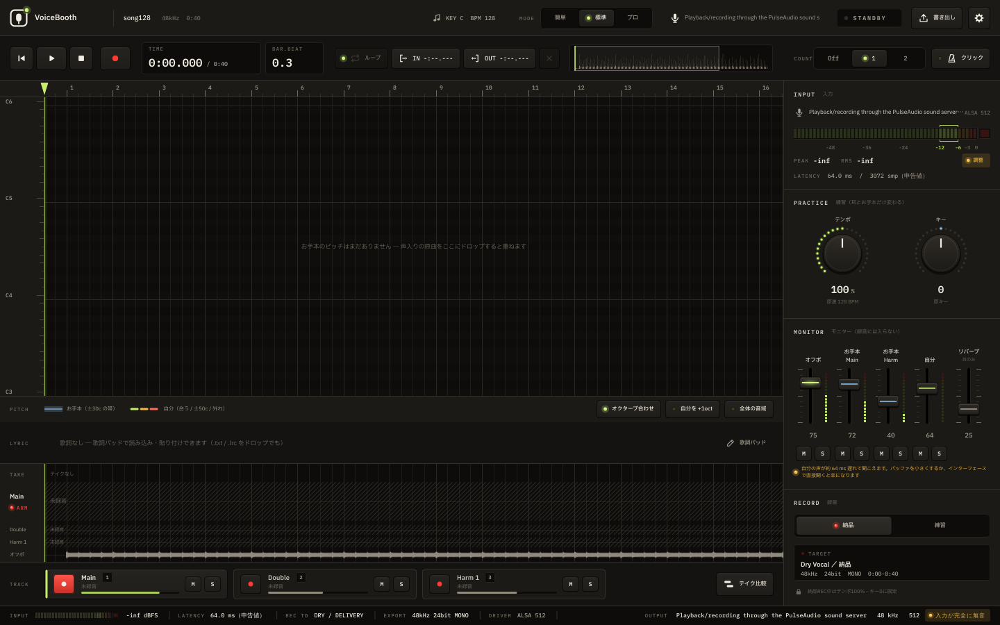

確認（Linux。自作の 128 BPM・C Am F G の曲、頭に 0.9 秒の無音）：トップバー「KEY C　BPM 128」、目盛りの 1 小節目が最初のキックと和音の所、曲の頭は弱起（BAR.BEAT 0.3）。

## 区間の録り直し（パンチイン。B10。DESIGN 6.4）

| 操作 | 動き |
|---|---|
| 範囲（`[` `]` か IN / OUT）を作って REC / R | 範囲の前の助走から鳴らして録る。COUNT が 1 / 2 でテンポが分かれば、範囲の頭の小節の 1 拍目からその小節数（助走の間はクリックで数える。下の「クリック・カウントイン」）。Off・テンポが分からなければ 2 秒（数えない）。範囲の終わりの 0.5 秒後で自動で止まる |
| 範囲の前を再生中に REC | 途切れずにそのまま録る（裏録り。B7） |
| 録り終わり | 採用は範囲の中だけ。「Main の take1 で 0:05.013 - 0:08.021 を録り直しました（Ctrl+Z で元に戻す）」。Mac は ⌘Z |
| Ctrl / ⌘+Z | 直前のテイクを採用から外して前に戻す（テイクとファイルは残す）。「直前のテイクを採用から外しました（ファイルは残っています）」 |

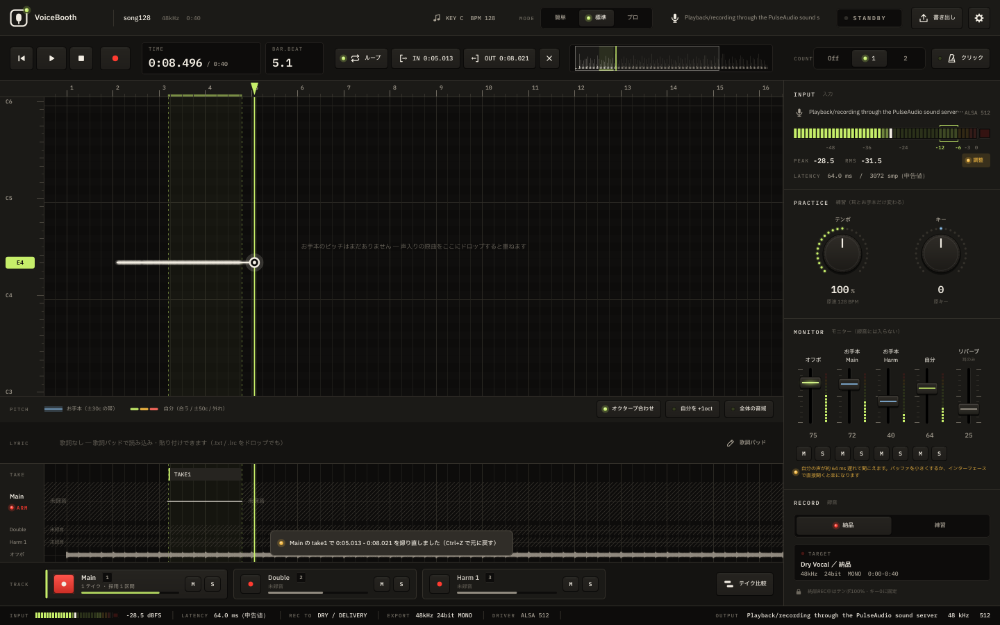

確認（Linux、PulseAudio の仮想デバイス、自作の 128 BPM の曲）：再生中に 5 秒で `[`、8 秒で `]`（IN 0:05.013 / OUT 0:08.021）。入力に音を流して R →
3.0 秒（2 秒前）から鳴って 8.496 秒で止まり、テイクのファイルは 5.5 秒、書き出しの音は 5.0133〜8.0213 秒（範囲ちょうど）。Ctrl+Z で採用が外れた。

## 本番 / リハーサルと録り間違いの救済（2026-10-02）

| 状態 / 操作 | 動き |
|---|---|
| RECORD の切り替え | 「本番」/「リハーサル」（以前の「納品」/「練習」）。ステータスバーの REC TO は DRY / TAKE・REHEARSAL |
| リハーサルで、原速・原キーで録った | 「リハーサルのテイク take1（Main、0:04.030 - 0:07.987）を録りました。納品には入りません」＋ キー「本番に入れる」（12 秒） |
| 「本番に入れる」 | 「take1 を本番に入れました（Main、0:04.030 - 0:07.987）。Ctrl+Z で戻せます」。ファイルは Audio/Takes/ へ、採用区間に入る |
| リハーサルで、テンポ・キーを変えて録った | キーは出ない（本番に入れられない） |
| 波形レーンを右クリック | いまのトラックのリハーサルのテイクの一覧。原速・原キーの物は「…を本番に入れる（範囲）」、変えて録った物は理由付きで選べない |

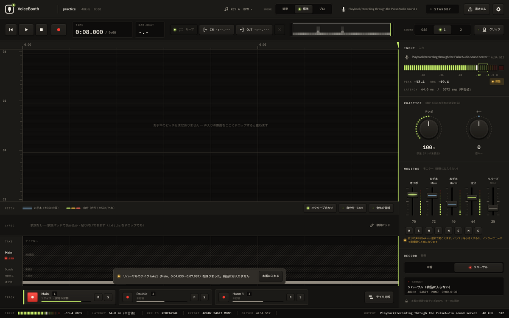

確認（Linux、PulseAudio の仮想デバイス）：リハーサルで原速・原キーで録る → キーを押す → `Practice/main_take1.wav` が `Audio/Takes/main_take1.wav` に移り、
.vbooth の take1 が本番（delivery）、採用区間 193443〜383395（0:04.030〜0:07.987）。85 % で録った take2 は右クリックで「テンポ 85%・キー 0 で録ったので本番には入れられません」。

## ベータで隠しているもの（v0.1.0。2026-10-02）

本物のアプリでは、まだ音や結果に効かないキーを出さない（押しても何も起きないキーを配らない）。見本（UI_MOCK）は今までどおり全部出す。

| もの | 本物のアプリ | 入れる時 |
|---|---|---|
| モニターの「お手本 Harm」 | **効く（2026-10-02）**。お手本を分離した時、リードボーカルのモデル（karaoke）でリードとハモリを分け、ハモリ（声 − リード）を鳴らす（量・M・S、メーター）。ハモリが無い間（分けている途中・モデルが無い）は薄くして触れず、ツールチップに理由。原曲 − カラオケで取ったお手本も、続けて原曲にリードのモデルだけを回して分ける（状態の帯は「分離中」、Cache/lead/ にキャッシュ） | — |
| モニターの「お手本 Main」・オフボ / お手本 / 自分の S | **効く（2026-10-02）**。取り出したお手本の声を鳴らす（下の「お手本の声を聴く」）。お手本が無い間は薄くして触れない | — |
| ハモリのトラックを選んだ時のお手本 | ハモリのお手本があれば、その線（音符の棒）を出し、メインの線を薄く重ねる。凡例は「ハモリのお手本」、判定・テイクの数値もハモリと比べる。無ければメインのお手本をそのまま出す（見本の +4 半音のずらしは本物では出さない） | — |
| 設定の「継ぎ目のクロスフェード」 | 効く（プロ）。書き出し・納品パック・トラックの再生に使い、設定に保存する | — |
| 入力のバッファのキー（プロ） | デバイスの設定を開く（バッファはそこにある） | — |

起動画面の曲を入れる枠の下に「手元の音声ファイルだけ・サブスクの曲は直接入れられない」を出す（`start.localOnly`）。

## テイク比較（B18c。DESIGN 2 / 3）

いまのトラックの、範囲に音のある本番のテイク（と原速・原キーのリハーサル）を並べて聴き比べ、選んだテイクをその範囲に使う。標準以上（簡単には無い）。
試聴は採用区間そのものを差し替えて鳴らす（トラックの再生 B12 が書き出しと同じ計算で作り直す。継ぎ目のクロスフェードも本番と同じ）。

| 操作 / 状態 | 動き |
|---|---|
| トラック列の「テイク比較」 | IN / OUT があればその範囲（ループで聴く）、無ければ曲全体でパネルを右に出す（背景は暗くしない）。比べている間はキーの LED が点く |
| 波形レーンの「テイク」の行（採用区間のバー）をクリック | その区間（区間の間なら、その空き）でパネルを出す。範囲はループ（IN / OUT を一時的にその区間に）。指のカーソルとツールチップ。ドラッグは今までどおり範囲選択 |
| 開いた時の表示 | 範囲の頭がレーンの左半分に無ければ、表示をずらして見えるようにする（パネルは右に重なる。拡大率はそのまま） |
| 押せない時 | 比べられるテイクが無い（このトラックに本番のテイクも原速のリハーサルも無い）・録音中・曲を開く前はキーが薄くなり、ツールチップに理由。簡単モードはキーもバーのクリックも無い |
| 並び | 先頭に「いまの採用（元のまま）」、その下に範囲に音のある本番のテイクと、原速・原キーで録ったリハーサルのテイク（「リハーサル」の印）を新しい順（録った時刻、同じなら番号の大きい順）。練習のテンポ・キーで録ったリハーサルは入れない（曲の時間に並ばない）。リハーサルを「このテイクを使う」と、救済と同じく本番のテイクに移して（`Practice/` → `Audio/Takes/`・番号を振り直す）その範囲に使う。移せなければ知らせて元のまま（2026-10-02） |
| 行の印 | 録った時刻、「採用中」（範囲を全部そのテイクで使っている）/「一部採用中」、「範囲の 60%」（テイクが範囲の一部しか録っていない。その外は今の採用のまま）、CLIP |
| 数値 | 範囲の中だけでお手本と比べる。標準：ONSET（±15 ms は「ぴったり」、色はピッチレーンの札と同じ）・PITCH（帯の中の割合）。プロ：＋VIB と「入り 9/10 か所・ずれ平均 22 セント」。お手本が無ければ「-」と「お手本を入れると入りと音程も比べられます」 |
| 行を選ぶ（クリック / ↑ ↓） | 採用区間のその範囲だけがそのテイクに替わり、波形レーンのバーに「試聴中 TAKE3」。鳴っていればそのまま次のテイクの音へ（A/B）。「いまの採用」で元の音 |
| ピッチレーン | 試聴中のテイクの音程の線（暖かい白。録った時に裏で取った線、原速・原キーのテイクだけ）を、比べている範囲だけお手本の帯に重ねる（線を重ねる）。比べている間はいま歌った線を出さない |
| 「試聴」/ Space | 範囲（ループ）なら範囲の頭から、曲全体なら選んだテイクの頭から（今の位置がそのテイクの中ならそこから）鳴らす / 止める |
| 「このテイクを使う」 | 確定。「Main の 0:05.000 - 0:10.000 を take1 にしました（Ctrl+Z で元に戻す）」。もともと使っていたテイクなら「変更なし」。テイクを選ぶまでは押せない |
| キャンセル / Esc / × | 元の採用区間へそっくり戻す（何度選び直しても） |
| 閉じた後 | 試聴で鳴らしていたら止める（開く前から鳴っていたらそのまま）。一時的に変えた IN / OUT・ループを元に戻す |
| Ctrl / ⌘+Z | 選び直す前の採用区間に戻す（録音の取り消しと同じ 1 段）。「テイクの選び直しを元に戻しました」 |
| 保存 | 試聴中に自動保存・終了しても、`.vbooth` には確定している採用区間を書く（選んでいない差し替えは書かない） |

`--screen=compare --mode=pro` で開き、TAKE3 を選んだ状態（見本は Main の IN / OUT 0:48〜1:12、見本の数値。範囲の頭が見えるように表示をずらす）。

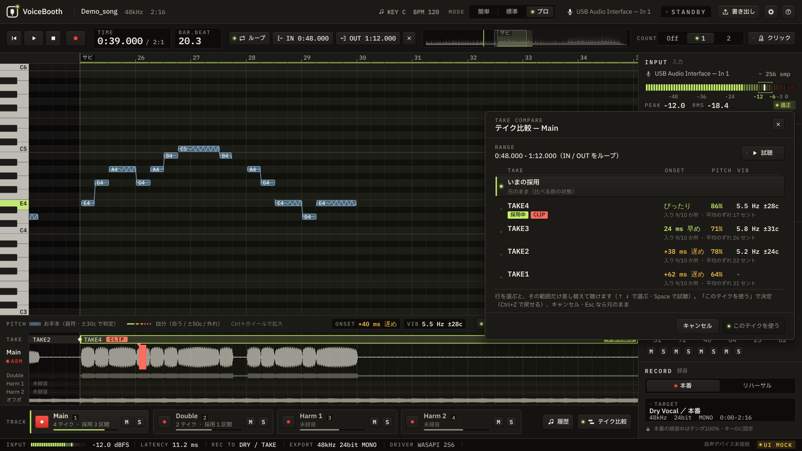

確認（Linux、PulseAudio の仮想デバイス、20 秒の伴奏と Main のテイク 3 本＝take1 0〜20 秒 220 Hz・take2 5〜10 秒 330 Hz・take3 4〜12 秒 440 Hz、採用は take1 / take2 / take1）：
バーの TAKE2 をクリック → 0:05〜0:10 をループ。TAKE3 を選んで試聴すると出力は 440 Hz、↓ で TAKE2 にすると鳴ったまま 330 Hz、TAKE1 で 220 Hz。
「このテイクを使う」で `.vbooth` の採用は take1 の 1 区間（0〜20 秒）、IN / OUT・ループは元（無し）に戻り、再生は止まった。Ctrl+Z で take1 / take2 / take1 に戻った。
曲全体で TAKE3 を選んだまま 2.8 秒待つと、自動保存された `.vbooth` は元の採用のまま。Esc で採用区間が元に戻り、試聴の再生も止まった。

## お手本の声を聴く（2026-10-02）

- 原曲−カラオケ（B9）・分離（B16）で取り出した声を、エンジンの 5 本目の枠（`PlaybackCore::guideSlot`）で鳴らす。録ったトラックと同じ経路なので、練習のテンポ・キーも掛かる。オフボの SR と録音の SR が違えば裏でそろえる
- 音量はモニターの「お手本」フェーダー（`mainGain`）、M でミュート。S（ソロ）はオフボ・お手本のどちらか 1 つだけを鳴らし、録ったトラックも止める。もう一方の S を押すと入れ替わる
- 自分の S：自分の声だけを聴く（オフボ・お手本・録ったトラックを止める。`selfSolo`）。モニターの S は同時に 1 つ（オフボ・お手本・自分のどれかを押すと、ほかの S は消える）。
  自分の声（入力 → ヘッドホン）はオフボ・お手本の S では消さない（お手本だけを流して重ねて歌う時に自分が聞こえなくならない）。自分の量・M はそのまま。曲を開き直すと S は消える
- お手本が無い間は帯を薄くして触れない（ツールチップで理由）
- ハモリのお手本（2026-10-02）：お手本を分離した時、リードボーカルのモデル（BS-RoFormer karaoke）で元の音からリードだけを取り、
  「お手本 Main」はリード、「お手本 Harm」は声 − リード（6 本目の枠 `PlaybackCore::harmGuideSlot`）を鳴らす。量は `harmonyGain`、M・S・メーターも Main と同じ。
  S はモニターの S と同時に 1 つ（オフボ・お手本・ハモリ・自分）。ハモリのトラックを選ぶと、ピッチの線・判定・テイクの数値はハモリのお手本と比べる。
  ハモリがほとんど無い曲（ハモリの声のある点がメインの 3% 未満）は線を出さない（音は聴ける）。原曲 − カラオケで取ったお手本は、続けて原曲からリードだけを取り（リードのモデルを分離プロセスの --model に）、リードをオフボの時間に写して分ける。モデルが無い時は分けない（1 本のまま）

## クリック・カウントイン・モニターのメーター（2026-10-02。DESIGN 4.2 / 7.2）

ベータで隠していた輸送バーの「クリック」・COUNT と設定の「カウントイン」は、本物のアプリでも出して効くようにした。
音はどれも耳（出力）だけで、録音（入力の素の声）・書き出し（テイクから作る）には入らない。

| 操作 / 状態 | 動き |
|---|---|
| 輸送バーの「クリック」 | 曲のテンポ（BPM・拍子・1 小節目）で拍を鳴らす。拍の位置は目盛り・BAR.BEAT と同じ（`song::beatSample` と同じ丸め）。1 拍目は高く大きい音（1.6 kHz・頭 -6 dBFS）、ほかは 1.1 kHz・-10 dBFS、約 40 ms。6/8 は付点四分（1 小節 2 拍） |
| 練習のテンポ・キーを変えている | クリックは伸ばした伴奏の拍に合う（拍の間だけが伸び縮み）。音の高さはキーで変わらない（出力の側で、聞こえている曲の位置から作る） |
| テンポが分からない曲で「クリック」 | 入らない。知らせ「テンポが分からないので、クリックを鳴らせません。上の曲の情報で BPM を入れるか…」。ツールチップも同じ理由 |
| モニターの「クリック」フェーダー | クリックとカウントインの音量（0 dB = 0.75。既定 0.62）。横のメーターは実際に鳴った量。入り切りは輸送バーのキーなので M / S は無い |
| COUNT Off / 1 / 2（設定の「カウントイン（小節）」と同じ値） | 止まった所から REC した時に数える小節。鳴っている途中の REC（裏録り B7 を含む）では数えない |
| 通しの REC（COUNT 1 / 2） | 曲は止めたまま、クリックだけで数える。数え始めは今の位置の小節の 1 拍目から COUNT 小節前（今の位置が小節線ちょうどならちょうど COUNT 小節。小節線の 1/4 拍手前より後ろは次の小節とみなす）。数え終わった所から曲と録音が始まる（数えている間の声は録らない）。曲の頭からでも同じ（曲の頭より前を数える）。BAR.BEAT は数えている拍（20 小節目の頭からなら 19.1〜19.4。1 小節目より前は 0、-1 …） |
| 範囲の録り直し（COUNT 1 / 2） | 範囲の頭の小節の 1 拍目から COUNT 小節前の所から曲を鳴らし、範囲の頭まで拍を鳴らして数える（クリックが Off でも）。曲の頭より前にはみ出す分は、曲なしで数えてから曲の頭を鳴らす |
| 範囲の録り直し（COUNT Off） | 2 秒の助走（数えない。クリック On なら拍は鳴る） |
| テンポが分からないまま COUNT 1 / 2 で REC | 数えずに録り始める。知らせ「テンポが分からないので、カウントインなしで録り始めました…」（曲ごとに 1 度）。COUNT のツールチップも理由 |
| 練習のテンポで数える | 数える拍の間も練習のテンポで伸び縮みする（そのまま伴奏の拍につながる） |
| 数えている途中で停止 / REC を外す | 何も録れていないのでテイクは作らない（空のファイルは消す） |
| モニターのオフボ・お手本のメーター | エンジンがフェーダーの後（ミュート・ソロ込み）で測ったピーク。上がる時はすぐ、下がる時は 20 dB/秒（入力メーターと同じ）、-48〜0 dBFS を LED に並べる（自分の帯と同じ目盛り）。練習のテンポ・キーの間は Rubber Band に入れる側で測る（聞こえるより伸ばす遅れの分だけ早い） |
| 設定に保存 | COUNT（`countInBars`）・クリックの入り切り（`clickOn`）・クリックの音量（`clickLevel`）。クリックの入り切りは、テンポの分かる曲で鳴る |
| 見本（UI_MOCK） | 音は無い。メーターは見本の値（オフボ -18 dB・お手本 -23 dB・クリック -20 dB） |

実装：拍を数えて鳴らすのは `audio::Metronome`（出力 1 サンプルごとに「このサンプルで聞こえる曲の位置」をもらい、拍に届いたサンプルで音を立てる。
位置が戻った・飛んだら次の拍を探し直す。Off の間も拍は数える）。`audio::PlaybackCore::play (countIn, countClicksUntil)` が数える分（曲のサンプル）を
受け取り、その間は曲の位置を止めてクリックだけを出す。数え終わったブロックは曲を lead サンプル目から鳴らし（`Rendered::lead`）、
録音（`TakeRecorder`）・ピッチ（`PitchTracker`）には入力をそこから渡す。数え始めの位置は `song::countInStart`。
メーターは `audio::LevelFollower`（atomic 1 つ。ロック・確保なし）。テストは `tests/ClickTests.cpp`。

## 声域とおすすめのキー（2026-10-02。DESIGN 18.1）

- 練習モジュールの下の段：「声域を測る」（測った後は「声域 C3–G4」）と「おすすめのキー ±n」。おすすめは声域とお手本の両方がある時だけ出し、押すとそのキーにする（収まれば ✓ / ›、収まらなければ ⚠ とツールチップではみ出し）
- 声域ダイアログ：「測る」→ 3 秒の間、楽に出せるいちばん低い声（高い声）を伸ばす → 声のある点の中央値を半音に丸める。0.3 秒分より少なければ「声が取れません」。−/+ で半音ずつ直せる。測っている間は曲を止め、マイクの音程は曲の外の位置で取る（`PitchTracker::setFreeRun`。曲の線に入れない）。声は保存しない。声域は設定に保存
- お手本の広がり：80 ms 以上同じ音を伸ばしている点だけ、中央値 ±15 半音の中の 5% / 95%（分離の残り・オクターブ違いで言い過ぎない）
- キーの選び方（`analysis::suggestKey`）：はみ出しの合計 → 上下の偏り（収まらない時は上下に振り分ける）→ 元の高さ → 元のキーに近い → 下げる方。1 オクターブ下（上）で歌う方が合えばそれも出し、押すとオクターブ合わせを入れる

歌詞の機能はあまり使わないので、**既定では出さない**。設定の「歌詞：オン / オフ」（既定オフ。保存する）で歌詞レーンを出す。
オフの間は歌詞レーン・Enter のタップ合わせを出さない（起動画面の解析の「歌詞」の行は B17 の自動合わせの取りやめで無くした）。歌詞のファイル（.txt / .lrc）をウィンドウに落とした時・歌詞パッドで「使う」を押した時は自動でオンにする。
読み込んだ歌詞・時刻はプロジェクトに残る（消さない）。

## 歌詞の自動合わせ（B17。取りやめ）

**取りやめ**（2026-10-02 持ち主の決定：遅く、役に立たなかった。Whisper のモデルはダウンロードしない）。歌詞レーンの［自動で合わせる］・歌詞の認識モデルのダウンロード・ステータスバーの「歌詞を合わせています」は無い。歌詞の時刻は .lrc の時刻か、タップで合わせる（B4b）で入れる。

## ボーカル分離（B16。DESIGN 11.3）

| 状態 / 操作 | 動き |
|---|---|
| お手本の原曲を入れて、引き算で声が取れない（別のミックス・EQ 違い）＋ 分離のモデルがある | 「声を分離して取り出しますか？」（このパソコンで約 N 分の見込み）→「分離する」/「あとで」 |
| 同じ ＋ モデルが無い | 「…モデルが入っていないため、お手本の線は出せません」＋［分離モデルを入れる…］（12 秒。押した時だけ一覧を読む。配布の準備前＝アプリに公開鍵が無い時はキーを出さない） |
| 分離モデルを入れる…（押した） | 「分離モデルの一覧を確かめています…」→ 署名が合えば確認の画面（名前・サイズ・ライセンスは一覧から）。読めない・署名が合わない時は「分離モデルの一覧を読めませんでした：…」 |
| ダウンロード中に画面を閉じた | 裏で続く。ステータスバーに「分離モデル 39%」、再生・録音中は「分離モデル 9%・再生中は一時停止」 |
| 裏で終わった | 「分離モデルを使えるようになりました」＋［分離する］（待っていた分離がある時）。失敗は「分離モデルを入れられませんでした」＋［詳しく…］ |
| 途中でアプリを終了した | 次に押すと続きから（照合済みの所から。206 で取り直す） |
| 原曲だけで始める（起動画面、B16d） | お手本の枠だけ入れると枠の右下に［原曲だけで始める］。押すと解析の画面で「音源分離」の行が進み（%・残り約 N 分、形式の行は WAIT）、［キャンセル］で最初の画面へ。終わるとオフボ「{曲名} (off vocal).wav」を読み込み、原曲をお手本に重ねる |
| 〃 モデルが無い | 入れられる時：起動画面を閉じてダウンロードの確認へ。「解析を続ける」で起動画面に戻って分離を始める（画面を閉じて裏で終わった時は知らせに［原曲だけで始める］）。「あとで」なら起動画面にお手本を入れたまま戻る。入れられない時：分離の行が FAIL で「…原曲だけでは始められません。オフボを読み込んでください」 |
| 分離中 | ステータスバーに「分離中 45%・残り約 3 分」。裏で進み、再生・録音はそのまま |
| 終わった | 分離した声からお手本の線。「分離した声からお手本の線を作りました（ずれ 1.50 秒）」。結果は Cache/separation/ に残り、同じ原曲なら分離し直さない |
| 別の曲を開いた | 分離は止まる |

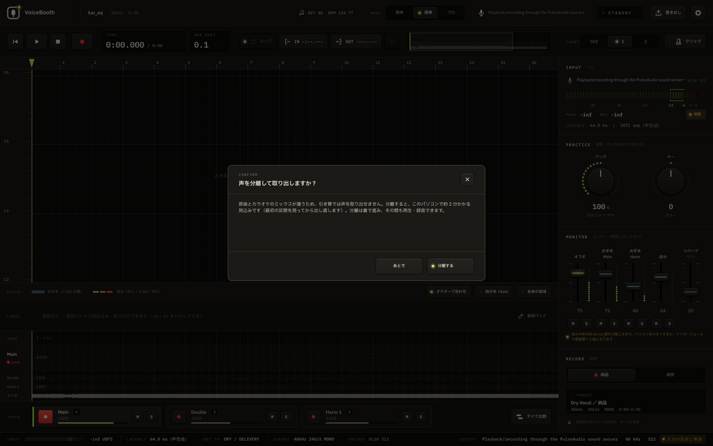

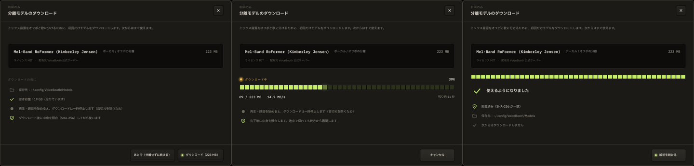

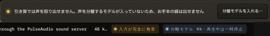

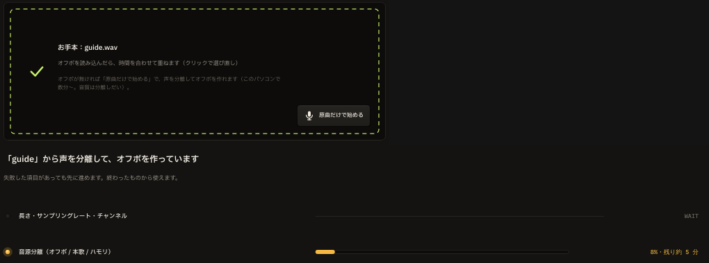

確認（Linux、手元の実曲の 40 秒を EQ を変えたカラオケ、同じ曲 + 自作の旋律を原曲として）：確認 → 分離 → `Cache/separation/…/vocals.wav`・`backing.wav` ができ、お手本の線が出た。
（この素材は実曲の歌と自作の旋律が混ざっているので、線は両方を拾う）

## 納品パック（B15。DESIGN 9）

| 操作 / 状態 | 動き |
|---|---|
| 書き出し →「納品パック」（標準・プロ） | 中身のプレビュー：`export_20261002/   (+ export_20261002.zip)`、選んだトラックの `vocal_dry.wav` など、`refmix.wav`、`notes.txt`（プロは `take_map.txt`）。notes.txt の中身も右に |
| 「個別 WAV」 | 今までどおり `{曲}_vocal_dry.wav` を `export_YYYYMMDD/` へ。確認用ミックスは「納品パックにだけ入ります」 |
| 書き出す（パック） | 「納品パックを書き出しました（3 ファイルと zip）：…/export_20261002.zip」。同じ日の 2 回目は `export_20261002_2` |
| 簡単モード | 個別 WAV だけ（DESIGN 2） |

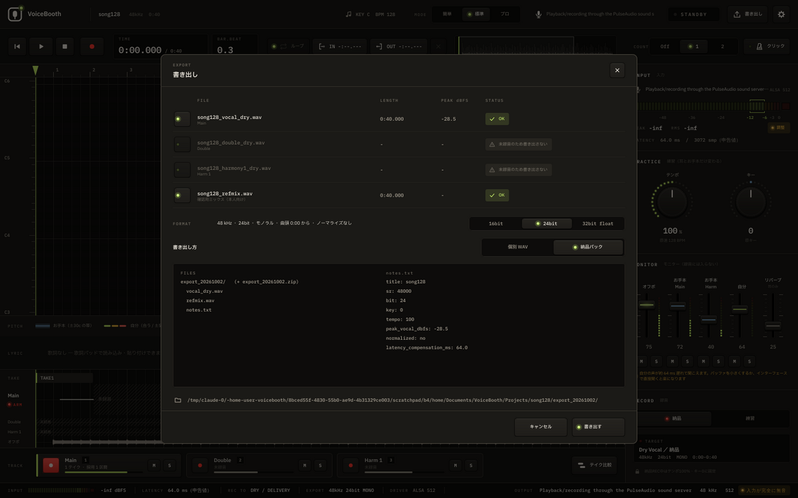

確認（Linux、自作の 128 BPM の曲の Main テイク）：`export_20261002/` に vocal_dry.wav（モノラル・曲の長さ 1,920,000 サンプル）・refmix.wav（ステレオ）・notes.txt、
`export_20261002.zip` の中身はフォルダと同じ（unzip -t で問題なし、vocal_dry.wav はバイト単位で一致）。

## 録ったトラックの再生（B12。DESIGN 4.6 / 7.3）

| 操作 / 状態 | 動き |
|---|---|
| 再生 | 採用したテイク（Main / Double / Harm）を伴奏と一緒に鳴らす。音は書き出しと同じ（継ぎ目のクロスフェードも） |
| トラックカードの線をドラッグ | そのトラックのモニター量。0 dB（線の 3/4）で吸い付く。動かしている間は右上に「-3.2 dB」。ダブルクリックで 0 dB |
| M / S | M で鳴らさない。S があれば S のトラックだけ鳴らす（伴奏はオフボの M で） |
| REC 中 | 録っているトラックは鳴らさない（自分の声だけ）。ほかのトラックは鳴る（ハモリを録る時に Main を聞きながら） |
| テイク・採用区間が変わった | そのトラックだけ裏で作り直して差し替える |
| 練習のテンポ・キー | トラックも伴奏と同じ速さ・キーで鳴る |

確認（Linux、PulseAudio の仮想デバイス、自作の 128 BPM の曲の Main に 330 Hz のテイク）：オフボを M にして頭から鳴らすと、テイクの所だけ 330 Hz が出て、Main を M にすると無音。
Main を録っている間は Main の音は出ない（出力 0）。

## 練習用のテンポ・キー（B11。DESIGN 7.2）

| 操作 / 状態 | 動き |
|---|---|
| PRACTICE のテンポ（50〜150 %） | 伴奏の速さだけ変わる（音程は変わらない）。テンポが分かっていれば「いま 108.80 BPM」、分からなければ「練習用」。ダブルクリック / 100 で吸い付いて原速 |
| PRACTICE のキー（±6） | 伴奏のキーだけ変わる（速さは変わらない）。お手本の線もその分ずれ、自分の線はずらした線と比べて色が付く |
| 原速・原キーに戻す | 今までどおりの素通し（サンプル単位） |
| 変えたまま REC（納品） | 「納品録音は原速・原キーで録ります」→「原速・原キーで納品録音」/「練習録音にする」/ キャンセル |
| 練習録音 | その速さ・キーで `Practice/` に録る。「練習テイク take1（Main、0:00.000 - 0:04.886）を録りました。納品には入りません」（範囲は曲の時間） |
| 録音中につまみを回す | 変わらない。「録音中はテンポとキーを変えられません。止めてから変えてください」。納品録音中は「練習録音に切り替えますか？」→ 切り替えると今の納品テイクを閉じて練習へ |

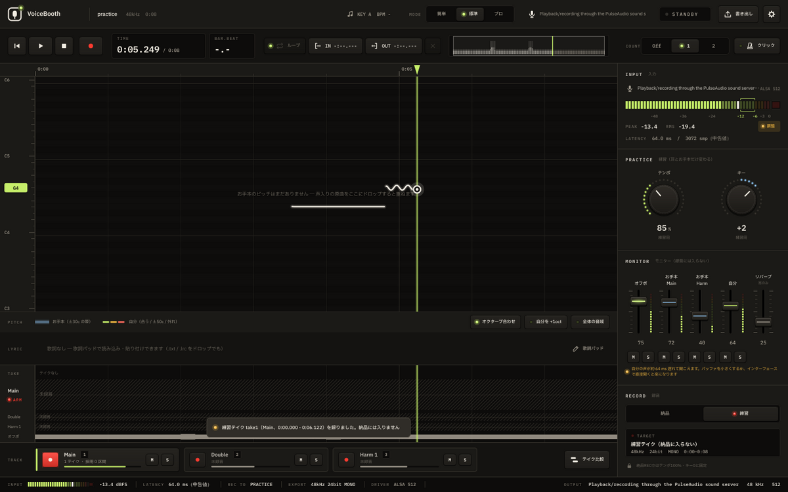

確認（Linux、PulseAudio の仮想デバイス、自作の 440 Hz と 3 kHz の頭がある曲）：85 %・+2 で鳴らした出力を録ると、曲で 2.0 秒離れた頭が 2.355 秒（計算 2.353 秒）離れ、440 Hz は 493.9 Hz（計算 493.9 Hz）。
練習録音のテイクは `tempo_percent: 85`、範囲は曲の時間に直って出た。変えたまま納品 REC → 確認 →「原速・原キーで納品録音」でつまみが 100 % / 0 に戻って納品テイクになった。

## プロジェクトの保存と再開（B14。DESIGN 8）

| 状態 / 操作 | 動き |
|---|---|
| 曲を開く | `書類/VoiceBooth/Projects/{曲名}/{曲名}.vbooth` を作り、曲を `Audio/` にコピー。同じ曲のプロジェクトがあれば続きから開き「前回の続きから開きました（テイク 1 本）」 |
| 別の曲で同じ名前 | `{曲名} (2)` の別フォルダ（前の作業は上書きしない） |
| 変更のあと | 1.5 秒で自動保存（録音中は待つ）。保存できなければ「プロジェクトを保存できませんでした」 |
| 起動画面の RECENT | 最近の 8 件（曲名・保存日時・長さ・モード）。クリックで開く。無い時は「まだありません。曲を開くと、ここに並びます」 |
| プロジェクトを開く | `.vbooth` を選ぶ。曲が見つからない・新しいバージョン・別の形式は理由を出して開かない |
| `.vbooth` をダブルクリック | 開く。起動中なら今のウィンドウで |
| 前回とテイクの SR が変わった | 開いた時に「前回は 48 kHz で録っていましたが、いまは 44.1 kHz です…」（そのままでは書き出せない） |

| 起動画面（最近のプロジェクト） | 開き直したところ（テイク・KEY・BPM が戻る） |
|---|---|
| 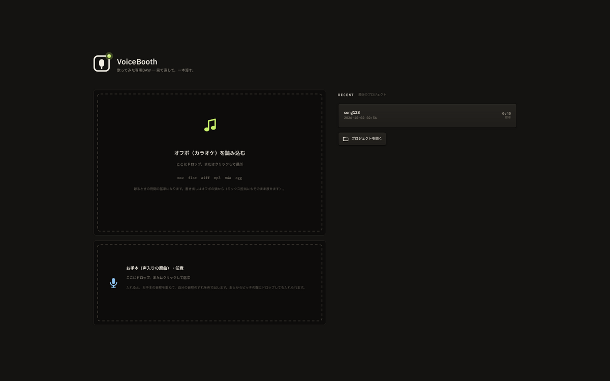 | 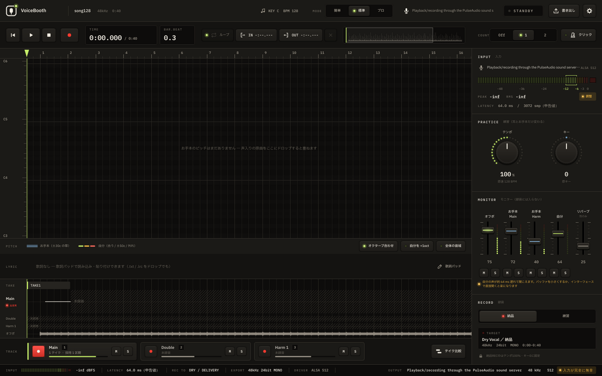 |

確認（Linux、PulseAudio の仮想デバイス、自作の 128 BPM の曲）：曲を開いて録ると `Projects/song128/` に `.vbooth`・`Audio/song128.wav`・`Audio/Takes/main_take1.wav`・`Backups/` ができ、
`.vbooth` にテイクと採用区間・テンポ 128・キー C（推定）が入った。`--open=…/song128.vbooth` で開き直すと TAKE1（1 テイク・採用 1 区間）・KEY C・BPM 128 が戻り、起動画面の RECENT に出た。

## 曲の情報（B4b。DESIGN 7.5）

解析なしで、テンポ・拍子・1 小節目・キー・区間・歌詞を手で入れる。手で入れた・触った値は「確定」（LED がライム）、解析の値（B9b。いまはデモ画面のダミー）は「推定」（LED が青、札は薄い）。確定は解析をやり直しても上書きしない。値はプロジェクト（`tempo` / `key_original` / `sections` / `lyrics`、DESIGN 8）に入る（保存は B14）。音声の処理には触れない。3 つのモードで同じ（DESIGN 2：テンポ / キー・歌詞は全モード）。

| 場所 | 表示・操作 |
|---|---|
| トップバー「KEY / BPM」 | `KEY Am  BPM 128`（分からなければ「-」）。押すと曲の情報パネル |
| 曲の情報パネル（画面の右。背景は暗くしない） | TEMPO：BPM の数値（30〜300、小数 2 桁、Enter で決定・Esc で戻す）/ ÷2 / ×2 / タップ（`T` も。回数と BPM を下に）/ 拍子 4/4・3/4・6/8 / 「テンポを消す」（秒の目盛りに戻る）/ 1 小節目（位置）と「再生位置を 1 小節目に」・-1 拍・+1 拍。KEY：わからない / C〜B ＋ メジャー・マイナー。SECTIONS：一覧（LED＝確定 / 推定、小節.拍、時刻、名前のキー＝一覧から選ぶ、ループ、消す。左を押すとその頭へ）と「再生位置に追加」（`M`）。見出しの右に 確定 / 推定 / 未設定。開いたままでも `Space` 再生、`T` タップ、`M` 区間 |
| ルーラー・グリッド | テンポが決まると小節番号（1 小節目の位置から。狭ければ拍線を省き番号を間引く）。区間の頭に縦線（ピッチ・波形を通す）と札（確定は明るい札、推定は薄い札、選んだ札はライム） |
| ルーラーの札 | クリック：その頭へ（選ぶ）/ ドラッグ：動かす（小節線に吸い付く、Alt / Option で吸い付かない。触ったら確定）/ ダブルクリック：名前（一覧 / 名前を入力…）/ 右クリック：名前・この区間の頭へ・この区間をループ（範囲を区間に合わせてループを点ける）・区間を消す |
| ルーラーの札の無い所を右クリック | 「ここ（小節.拍）」「ここから区間 ›」（一覧 / 名前を入力…）「ここを 1 小節目の頭に」 |
| 区間の名前 | イントロ / Aメロ / Bメロ / サビ / 間奏 / Cメロ / 落ちサビ / 大サビ / アウトロ ＋ 自由入力（24 文字まで）。同じ名前が 2 つ以上なら番号（サビ 1、サビ 2）、名前なし（`M` で打っただけ）は「区間 1, 2…」 |
| 全体表示（輸送バー） | 区間の帯（交互にわずかに明るく）と名前。頭の近く（5px）では頭に吸い付く（Alt / Option で吸い付かない） |
| BAR.BEAT | 「小節.拍」（1 小節目より前は 0.x、-1.x） |
| 練習のテンポ | 「原速 128 BPM」/「いま 96 BPM」（小数があれば 2 桁） |

歌詞（DESIGN 7.5.3）：

| 場所 | 表示・操作 |
|---|---|
| 歌詞パッド（歌詞レーンの「歌詞パッド」/ .txt・.lrc をウィンドウにドロップ / `--lyrics=`） | 「ファイルを開く…」（.txt / .lrc）、ファイル名、文字コード（自動判定。UTF-8 / Shift_JIS、BOM 付きなら UTF-16。選び直すと読み直す）、本文（貼り付け・直し。時刻のある行は `[mm:ss.xxx]`、見出しは【】の行で出すので直しても時刻が残る）、まとめ（行数 / 時刻あり・なし / 見出しの数 / サビの候補の数）、「見出しとサビの候補を区間にする」（既定オン）、使う / キャンセル / 歌詞を消す。読むだけでどこにも送らない |
| 歌詞レーン（時刻あり） | 従来どおり：今の行を大きく、歌った分をライムで塗る、NEXT に次の行。行の終わりは次の行の頭（塊の終わりは最長 6 秒で、間奏の間は光らせない） |
| 歌詞レーン（時刻なし） | 今の行（`↑` `↓` で送る）と NEXT。右に「↑ ↓ で行を送る」 |
| 「タップで合わせる」（LED） | 押す / `Enter` で始める（位置より後の最初の行から）。左に TAP と「7 / 12」、次に叩く行を大きく、右に Enter 歌い出し / Backspace 1 行戻す / Esc 終わる。再生しながら `Enter` でその行の歌い出しを今の位置に（前後の順番を崩す行は時刻を外す）。戻ってシークするとその位置から合わせ直す。最後の行で終わり「全部の行の時刻を合わせました」 |
| 見出し → 区間 | 時刻が付いた見出しの行（【Aメロ】【サビ】…）から区間（確定。頭は一番近い小節線に）。自分の行の無い見出し（【間奏】の直後に【サビ】）は作らない。見出しの無い同じ歌詞の塊のくり返しはサビ（推定）。同じ位置に区間があれば作らない |

| 曲の情報パネル（テンポ・キー・区間の一覧） | 区間の札のメニュー |
|---|---|
| 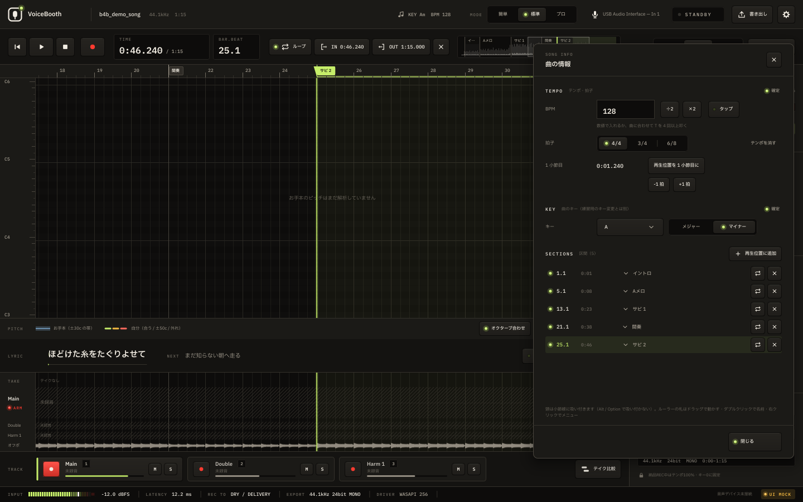 | 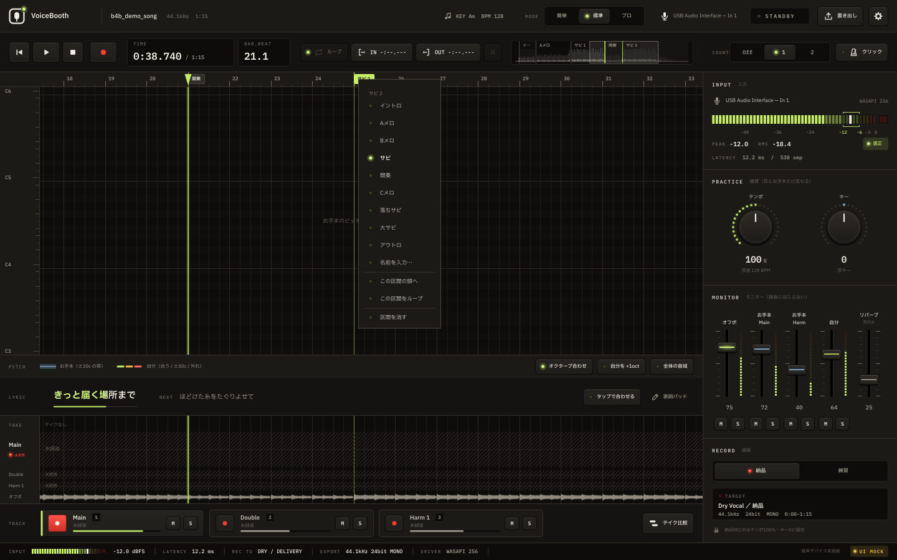 |

| 歌詞パッド（Shift_JIS の txt を自動判定） | タップで合わせる（7 / 12） | 合わせた歌詞をサビ 2 のループで再生 |
|---|---|---|
| 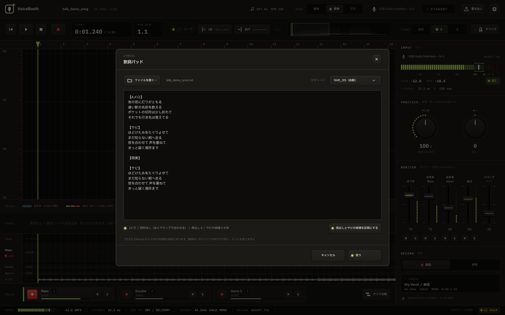 | 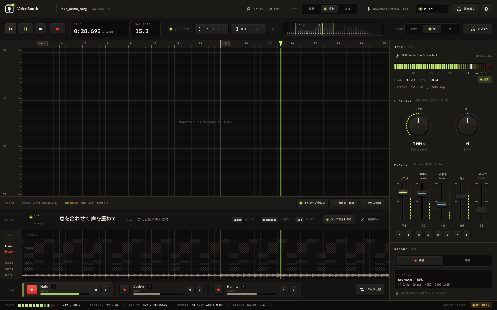 | 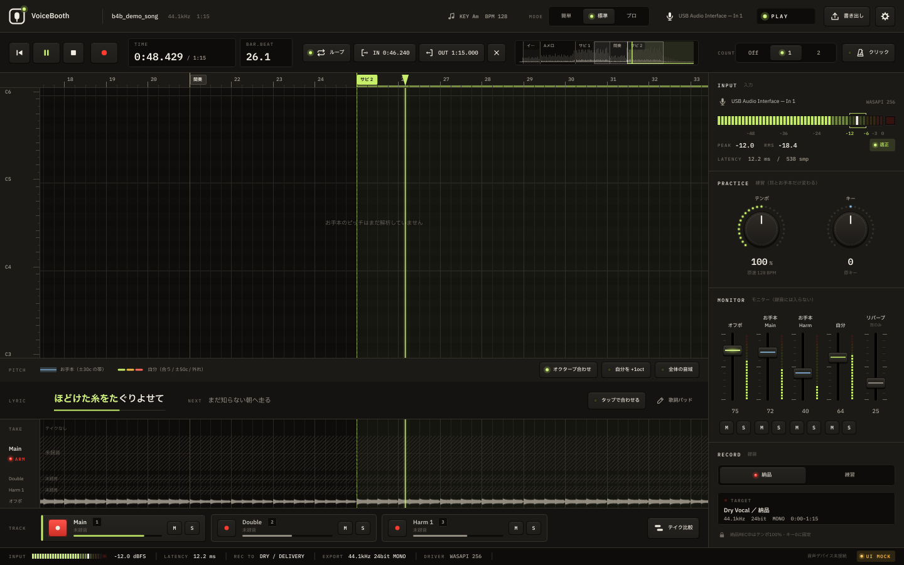 |

スクリーンショットの素材は自作（合成音の曲・架空の歌詞）。`-DVOICEBOOTH_UI_MOCK=ON` のビルドで `--no-first-run --lang=ja --open=<合成音>` から操作した。

まだ無いもの：テンポ・拍・キー・区間の自動推定（B9b）、カウントイン・クリック（BPM を使う。録音の前）、区間を選んで録り直し（B10）、時刻を合わせた歌詞の .lrc 書き出し（P2）、行の頭のドラッグでの微調整、保存（B14）。

## アップデートとモデルのダウンロード（DESIGN 11.7）

本体の更新の確認は本物（2026-10-02。下）。モデルのダウンロードは B16c で本物になった（上の「ボーカル分離」）。`--screen=model-*` の速度などは見本。

### 新しいバージョンの確認（GitHub のリリース）

- 見る所：`https://api.github.com/repos/kajisho5/voicebooth/releases?per_page=10`（認証なし、裏のスレッド、つなぐまで 8 秒）。送るのはこの GET だけ（User-Agent は `VoiceBooth` だけ。版・OS・使い方は送らない）
- いつ：起動時（設定の「自動」が入の時。既定は入）に、前回確かめられてから 24 時間たっていれば。録音・再生中は確かめない。設定の「今すぐ確かめる」でいつでも（止まっている時）
- 選び方（`update::pickRelease`、テストあり）：下書きは見ない。プレリリース（GitHub の印かタグの「-」）は、いまのバージョンがベータ（`0.1.0-beta.1` など）か「ベータ版も」を入れた時だけ。
  並び順は信じず SemVer で比べていちばん新しい物。いまのバージョンより新しく、「このバージョンを飛ばす」で飛ばしたバージョンでなければ知らせる
- いまのバージョン：CMake の `project(VoiceBooth VERSION …)` ＋ CI がタグから付ける印（`VOICEBOOTH_VERSION_SUFFIX`。`v0.1.0-beta.1` → `0.1.0-beta.1`）。手元のビルドは `0.1.0`
- 見つけたバージョンは設定（`updateFound`）に覚え、24 時間たっていない次の起動でも知らせを出す。入れ替えた（いまのバージョンがそれ以上）・飛ばした・ベータを切った後のベータは出さない
- つながらない・GitHub の上限（403 / 429）・壊れた応答：起動時は黙っている（次の起動でまた確かめる）。「今すぐ確かめる」の時だけ知らせ（「最新のバージョンです（0.1.0）」「インターネットにつながっていないようです」「GitHub の問い合わせの上限」など）。新しいバージョンなら「見る」キー付き

| 画面 | 内容 |
|---|---|
| ステータスバーの知らせ | 右端に「新しいバージョン 0.2.0」。右から滑り込み、LED が 2 回点滅して点灯のまま、ホバーで少し浮く。押すと詳細。録音・再生の邪魔をしない（ダイアログを勝手に出さない） |
| 新しいバージョンがあります | いまのバージョン → 新しいバージョン・ベータの印・公開日・インストーラーの大きさ / 主な変更（リリースの本文を平文にして入るだけ。入りきらなければ下をぼかして「続きはリリースのページで」。本文が「日本語 → --- → 英語」の 2 段なら、日本語以外の画面は英語の段）/ 更新について（ブラウザで開くだけで自動では入れ替えない・署名していないので初回は OS の確認・入れる前に終了、プロジェクトと設定は残る）/「このバージョンを飛ばす」「あとで」「リリースのページ」「ブラウザでダウンロード」 |
| 分離モデルのダウンロード（確認） | 用途・モデル名・サイズ・ライセンス・配布元 / 保存先・空き容量・再生や録音で一時停止・照合してから使う /「あとで（分離せずに続ける）」「ダウンロード」 |
| 〃（ダウンロード中） | LED の列（先頭の粒が明滅）・タリー（琥珀＝取得中 / 青＝照合中）・%・MB・速度・残り時間 / 一時停止・キャンセル / 途中で切れても続きから |
| 〃（途中で切れた） | 届いた粒は少し暗く点いたまま、切れた所の粒が琥珀で明滅。「N 秒後に続きから再開（k / 3 回目）」、届いた分は保存済み /「今すぐ再開」「キャンセル」 |
| 〃（完了） | LED の列が全部点き、一度光る。使えるようになった・照合済み・次からはダウンロードしない /「解析を続ける」 |
| 〃（失敗） | LED の列が赤、ダイアログが小さく揺れる。照合に失敗（壊れたファイルは使わずに削除）/ 持参のオフボで続けられる /「もう一度ダウンロード」「あとで」 |

- ビルドは署名していないので、アプリは自分では入れ替えない。主のキーは、この OS のインストーラー（`*-win-x64-setup.exe` / `*-mac-universal.dmg`）をブラウザで開く。無ければ（Linux など）「リリースのページを開く」。開いた後も知らせは残る（入れ替えるまで）
- 「このバージョンを飛ばす」はバージョンを覚え（`updateSkipped`）、もっと新しいバージョンが出るまで知らせない。「今すぐ確かめる」で見つけた時は飛ばしたバージョンでも見せる。「あとで」は閉じるだけ
- 開く URL は `https://github.com/` だけ（応答・設定ファイルにほかのアドレスが入っていても開かない）

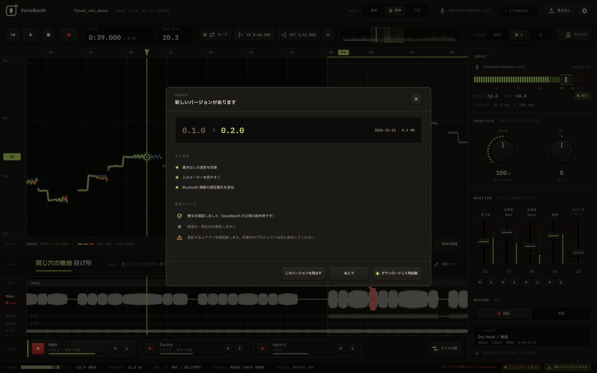

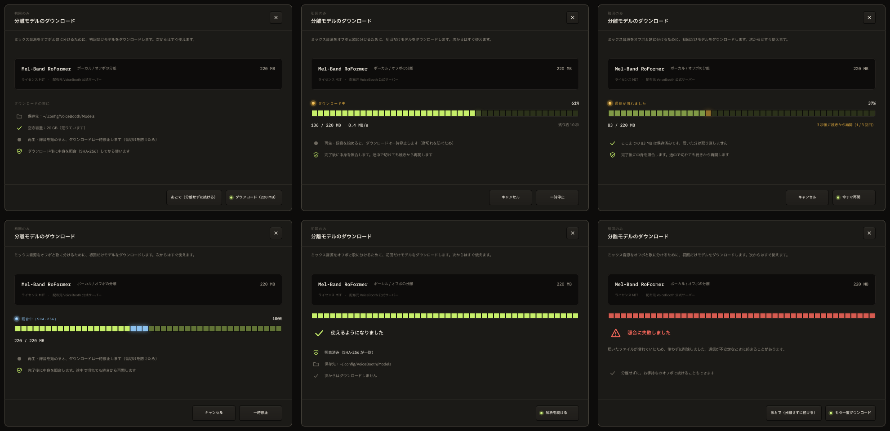

## キャッシュの場所（設定。DESIGN 8）

- アプリ共通のキャッシュ：既定は `アプリのデータ/VoiceBooth/Cache`（Win は `%APPDATA%`、Mac は `~/Library/Application Support`、Linux は `~/.config`）。いま置く物は「原曲だけで始める」で作ったオフボ（`offvocal/`）だけ
- 設定の行：場所と大きさ（`~/…/Cache · 2.2 MB · 曲ごとのキャッシュ（各プロジェクトの Cache）は別`）/「開く」（Finder / エクスプローラーでフォルダを開く。無ければ作る）/「空にする」/「変更」（フォルダを選ぶ）
- 「変更」：選んだフォルダをそのまま使い、設定（`cacheFolder`）に保存。次に作る物から新しい場所に置く。今ある分は動かさず、「今までの分（2.2 MB）は元の場所（…）に残っています」と知らせる。書けないフォルダは選べない（知らせて変えない）
- 「空にする」：大きさを見せて確かめる（ConfirmDialog）。消すのはアプリが作るサブフォルダ（`offvocal/`）だけ。選んだフォルダのほかのファイル、曲ごとのキャッシュ（`<プロジェクト>/Cache/` の分離・歌詞用の声）、プロジェクトの曲・テイクは消さない。分離の途中は消さない。終わったら設定に戻る
- 分離の途中（オフボを作っている）は「変更」「空にする」を押せない

## スキン（DESIGN 4.11）

色トークン 16 個だけを着せ替える（書体・寸法・配置・動きは同じ）。内蔵 10 種＋自作（アプリ設定と同じフォルダの `Skins/` に `.vbskin`）。選んだスキンはアプリ設定の `skin`（無い・消えた時は booth）。

| 画面 | 内容 |
|---|---|
| 設定の「スキン」 | プルダウン（内蔵は「Booth — 夜のブース」のように英語名＋副題、自作は「名前 — 作者」/「自作」）。選ぶとその場で画面を作り直して設定を開き直す・保存。「新しく作る」でテンプレートから作る、「編集」でいまのスキンをエディタで開く。録音中はどれも押せない |
| テンプレートから作る | 内蔵 10 種と自作スキンを縮図（そのスキンの色で描いた小さなメイン画面）で並べる。いまのスキンに LED と「使用中」。選ぶとその 16 色を出発点にエディタを開く。キャンセルで設定に戻る |
| スキンエディタ | 画面の右に出る（背景は暗くしない。後ろの画面がそのまま見本）。名前・作者（64 文字まで）、テンプレート（選び直すと 16 色を写す）、保存先または「テンプレートの 16 色から始めます」。16 色をグループ（背景 / 線 / 文字 / 意味の色）で並べ、色見本を押すと右の色の面と HEX で変えられる（その場で画面に反映） |
| グループの「テンプレート ▾」 | 「テンプレート（○○）に戻す」（同じ色なら押せない）と「ほかのテンプレートから借りる」：内蔵・自作の一覧（そのグループの色の並びを添える。いまと同じ色の行に LED）。選ぶとそのグループの色だけ写る |
| 見やすさの点検 | 問題なければ「見づらいところは見つかりませんでした」。あればアンバーで「『文字』と『地』のコントラスト比 3.2（4.5 以上がおすすめ）」など（多ければ「ほか N 件」）。保存は止めない |
| キー | 保存（自作に加えて選び、画面を作り直して設定に戻る）/ キャンセル（開く前の色に戻して設定に戻る。閉じる・Esc も色は戻す）/ 書き出し…・読み込み…（.vbskin、ファイル選択は非同期。結果や読めない理由を下に出す）/ 削除（自作を編集している時だけ。2 回押しで消える。使っていたスキンなら booth に戻る） |

読み込みで断るもの：64 KB を超える、JSON でない、`format` が `voicebooth-skin` でない、`version` が 1 より新しい。書いていない色・読めない値（`#RRGGBB` 以外）は base（内蔵スキン）の色、知らないキーは無視。

| 内蔵スキン 10 種 | 自作の例（Midnight に Sweet の意味の色） |
|---|---|
|  |  |

| テンプレートから作る | スキンエディタ（意味の色を借りる） |
|---|---|
|  |  |

1 枚ずつ：`docs/screenshots/skins/<id>.png`（1440x900、日本語、`-DVOICEBOOTH_UI_MOCK=ON` のビルドで `--no-first-run --lang=ja --skin=<id>`）
